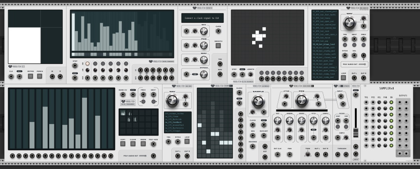

# voxglitch

Modules for VCV Rack.  My apologies if I fall behind on the documentation.

## Module Documentation

* [Autobreak](docs/autobreak.md)
* [Autobreak Studio](docs/autobreak-studio.md)
* [Digital Sequencer](docs/digital-sequencer.md)
* [Ghosts](docs/ghosts.md)
* [Grain Engine MK2](docs/grain-engine-mk2.md)
* [Grain Engine MK2 Expander](docs/grain-engine-mk2-expander.md)
* [Groovebox](docs/groovebox.md)
* [Hazumi](docs/hazumi.md)
* [Repeater](docs/repeater.md)
* [Wavebank](docs/wavebank.md)
* [XY Controller](docs/xy-controller.md)

## Themes



As of version 2.20.0, Voxglitch modules now support themes!  I've created two themes that cover the basics: The "default" theme and the "light" theme.

When you start using any Voxglitch modules that support themes, a new file called **"Voxglitch.json"** will be created in your Rack User folder.  The location of this file will change depending on your operating system. On windows, this is Documents/Rack2/ and looks like this:

 

 You can edit this file with a text editor to switch between “default” and “light” theme:
````
{
  "theme":"light"
}
````
````
{
  "theme":"default"
}
````

Just remember that you must use the modules once _before_ the Voxglitch.json file is created.  Creating new themes is beyond the scope of this documentation.  Please ask me directly if this interests you!

## The Hall of Heros

Thank you to my supporters on [Patreon](https://www.patreon.com/voxglitch):

* fred lcc
* Secret Cinema

Thank you to the following VCV Rack community members for your continued support

* Don Cross (cosinekitt)
* Andras (FiroLFO)
* Squinky Labs
* Stephan (rsmus7)
* Peter Vox (Yeager)
* Yier Sansi (Andre_M)
* Jeroen Verheij (secretcinema)
* Steve (Steve)
* Chaircrusher (chaircrusher)

.. and likely more that I've lost track of!

