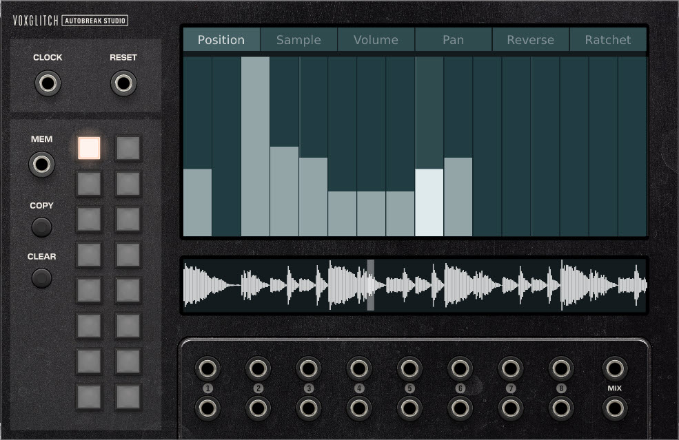
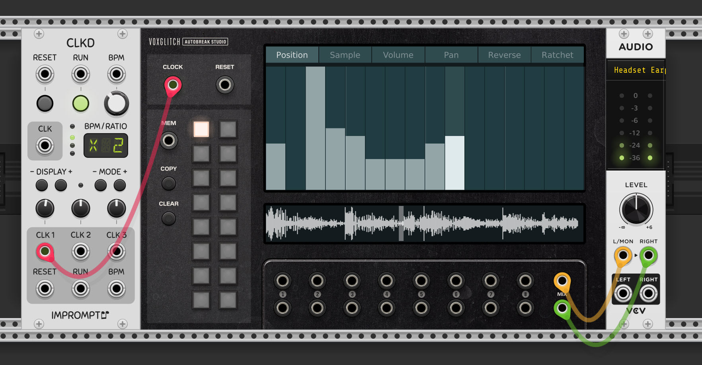
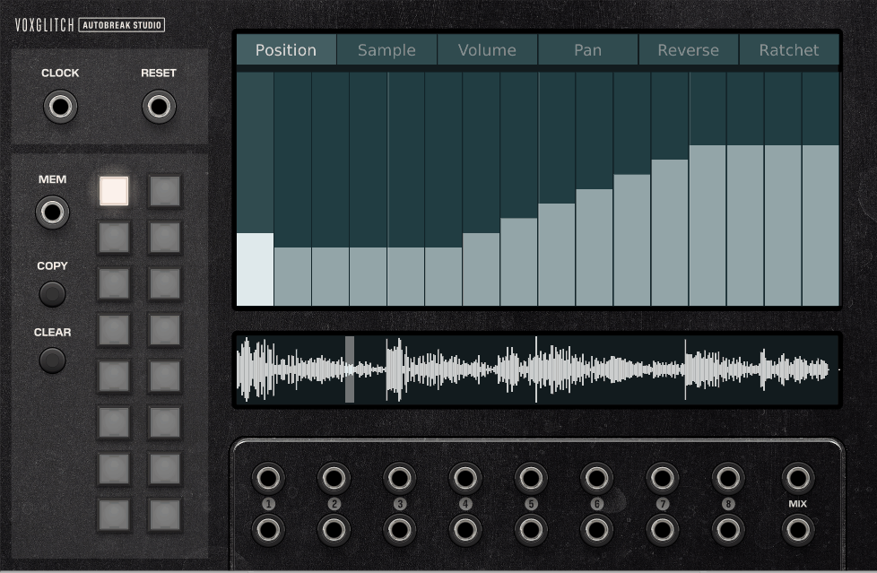

## Autobreak Studio

Auotbreak Studio turns ordinary drum loops into a break beats.  Load up to 8 drum loops in .wav format, then attach a Clock input running at 16th notes.  That should be enough to hear some output. Please note that loops must be 8 beats long. Need some beats to get started with?  Try [these](https://drive.google.com/file/d/1RwRBpmQjPBpzA53oSWfI4N4Nz-stTU7X/view?usp=sharing)!

### Inputs

* CLOCK - The module will slave the internal BPM to this clock input.  Feed it 16th notes for best results.  This input is **required**.

* RESET - Reset sample and sequencers playback

* MEM - When connected, selects one of the 16 memory locations and overrides manual selection of the memory buttons.  

### Outputs

* OUTS - Each of the 8 samples has dedicated stereo outputs labeled 1 through 8.  There's also a MIX output.

### Minimal Usage

(please note that this video is a little old and uses a slightly different front-panel layout)

1. Right click on the module to load a .wav sample in the first sample slot.  This should be an 8 bar drum loop, like [this](https://drive.google.com/file/d/1Du3VHSh8jfvxAkt_NjziNreyEWgyrHrr/view?usp=sharing).
2. Attach a clock input to CLOCK IN running at 16th notes.  Use 8th notes or 32nd notes if the sample is playing too quickly or too slowly.
3. Draw on the position sequencer to create new breakpoints.

### Adjusting the Breakbeat

There are three tabs in the main viewport: Position, Sample, Volume, Pan, Reverse, and Ratchet.  All of the sequencers have some commonalities worth noting:

* You can set the pattern length of any sequencer by holding down the **control key**
while dragging left or right on the sequence.
* You can shift the pattern left or right by holding the **shift key** while dragging
left or right on the sequence.

### Introducing the sequencers!

#### Position

This sequencer controls the position of the sample playback.  There are 17 break-beat
positions that can be selected.  

**Important:** The "0" position does NOT modify the sample
playback position.  It's used to allow the sequence to play continually.  In addition, ratcheting does not affect playback when a "0" position is the active value in the sequencer.  

Positions 1 through 16 will reposition the play head to whichever position is selected.  Samples are essentially split into 16 sections, and position 1-16 selects which position 
to play. 

#### Sample

Autobreak Studio allows you to switch between 8 samples using the Sample sequencer.  A value of "0" will select the first loaded sample, "1" will select the second loaded sample, and so on.

#### Volume

The volume sequencer allows you to set the output volume at different steps.

#### Pan

The Pan sequencer allows you to set panning at different steps.  At the moment, there's no way to "reset" the pan sequencer to the center, but I hope to add that feature in the future.

#### Reverse

The Reverse sequencer is an on/off sequencer which reverses sample playback. 

#### Ratchet

"Ratcheting is a Berlin School sequencing technique where an individual note in a sequence has its envelopes retriggered multiple times, usually at a musical subdivision of the sequence’s tempo – such as playing 1/32 notes in the middle of an 1/8 note sequence – to create a roll" - https://learningmodular.com/patching-a-ratcheting-sequence/

The ratcheting sequencer is used to retrigger the sample playback.  Ratcheting values greater than 0 will ratchet, with the ratcheting speed increasing with the value.

### Memory Slots

Autobreak Studio contains 16 memory slots that can be used to save and recall all sequencer information.  When a memory slot is selected, changes are automatically saved to that memory slot.  

The active memory slot can be selected by either pressing a memory button, or by using a CV input is connected to the MEM input.  The CV input range is expected to be 0 to 10 volts.  When a cable is connected to the MEM CV input, the memory buttons are disabled since the CV input has precedence.

#### Copying Memory Slots

To copy a memory slot, follow these steps:

1. Select the memory slot that you wish to copy.  We'll call this the "source" memory slot.
2. Press the COPY button to enter _copy mode_.  The source memory slot will remain lit.
3. Select a destination memory slot.  The contents of the "source" memory slot will be immediately copied into the selected destination memory slot.
4. You may repeat step #3 to copy the "source" memory into multiple destinations
5. Once you are done, press the COPY button again to exit _copy mode_  

#### Clearing Memory Slots

To clear a memory slot, follow these steps:

1. Select the memory slot that you wish to clear.
2. Press the CLEAR button.

### Loading Samples

There are two ways of loading samples into Autobreak Studio:
* Right-click on the module and select from one of the 8 sample slots, or...
* Right-click on the module and select "Load first 8 WAV files from a folder

Only .wav files are supported.  All sample rates should work just fine.  :-)

### Video Tutorial

(pending)

