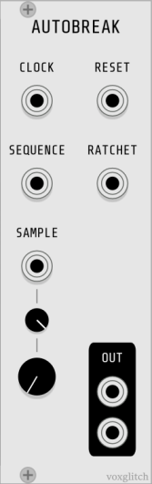

## Autobreak

Auotbreak turns an ordinary drum loop into a break beat.  Load up to five 8-bar drum loops in .wav format using the right-click context menu, then attach a Clock input running at 16th notes.  That should be enough to hear some output.  Attach a sequencer's output to the Pattern input to modulate the breakbeat offset for maximum fun.

### Inputs

* CLOCK - The module will slave the internal BPM to this clock input.  Feed it 16th notes for best results.  This input is **required**.

* RESET - Reset sample playback

* RATCHET - Retriggers the playback of the breakbeat at the current location indicated by the Sequence input.

* SEQUENCE - Controls the position of the breakbeat sample playback.  

* SAMPLE - Selects from one of 5 loaded .wav files

  

### Outputs

* OUT - Left/Right stereo outputTri

### Minimal Usage

(please note that this video is a little old and uses a slightly different front-panel layout)

1. Right click on the module to load a .wav sample in the first sample slot.  This should be a, 8 bar drum loop.
2. Attach a clock input to CLOCK IN running at 16th notes.  Use 8th notes or 32nd notes if the sample is playing too quickly or too slowly.
3. Attach an external sequencer (such as the Autodafe SEQ16) to the SEQUENCE input and use the sequencer to adjust the breakbeat pattern.

### Video Tutorial

https://youtu.be/yWape_7qzJU

### Options

Trigger Mode & Gate Mode