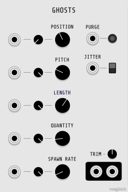
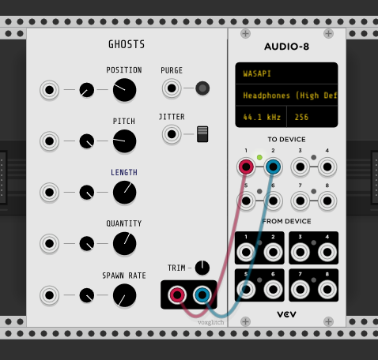

## Ghosts

Ghosts is a granular synthesis based sample player.  Load a sample using the right-click context menu and have fun!  In my imagination, this module simulates an old graveyard.  The graveyard spawns "ghosts" and each ghost produces sound.  The sounds that ghosts produce are derived from small slices of your loaded .wav file.  

### Inputs

* POSITION - In short: An offset into the loaded .wav file.  When a new ghost is spawned, it starts playing back a slice of the loaded .wav file starting at the sample location specified by this input.
* PITCH - The pitch of the ghosts.
* LENGTH - The length of the sample slice played by newly spawned ghosts.
* QUANTITY - The maximum number of ghosts allowed at one time.  Once there are too many ghosts, the oldest ghosts are returned to their graves.
* SPAWN RATE - How quickly new ghosts rise from their graves.  Spawn rate is counter intuitive: Lower values spawn ghosts more quickly.  This is because SPAWN RATE acts like a kitchen timer.

### More Inputs

* PURGE - This is a trigger input that purges all ghosts from the graveyard.
* JITTER - Adds a bit of noise to POSITION.  Helpful in keeping all the ghosts from coalescing to one playback position.
* TRIM - Adjusts output volume.

### Outputs

* [The two outputs highlighted in black] - Left/Right stereo output

### Minimal Usage

1. Right click on the module to load a .wav sample. I suggest that the sample be around 3 to 6 seconds long.
2. Tweak the Length, Quantity, Spawn Rate, and Position knobs.
