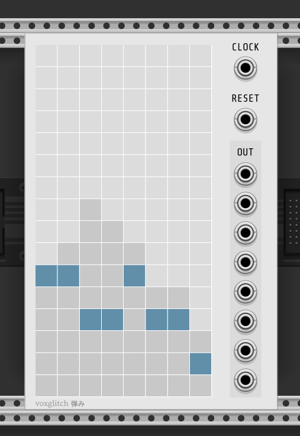
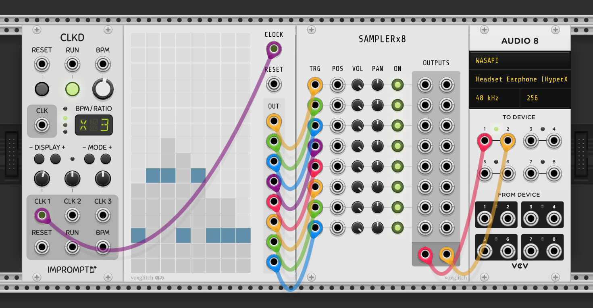

## Hazumi

Hazumi is a very minimalistic bouncing ball sequencer with 8 columns and 8 corresponding trigger outputs.

### Inputs

* CLK - A clock is required to control the speed of the bouncing balls.
* RESET - Resets playback to the beginning.

### Outputs

* OUT - There are 8 outputs, one for each column.  The top output is column #1 and the bottom output is column #8.
* Example Usage

