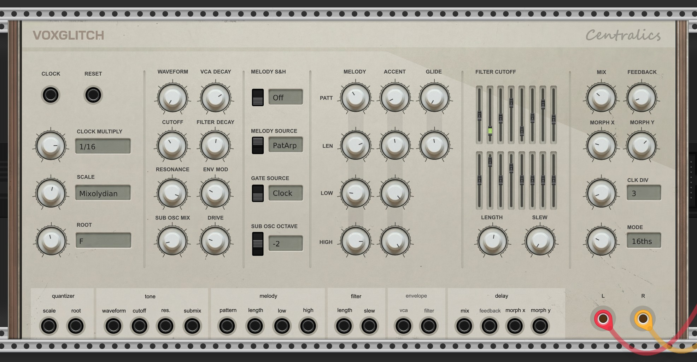
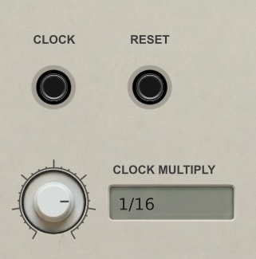
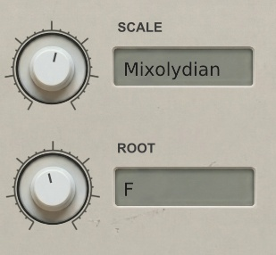
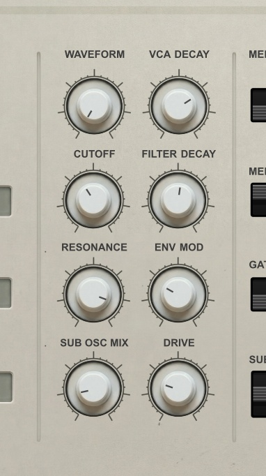
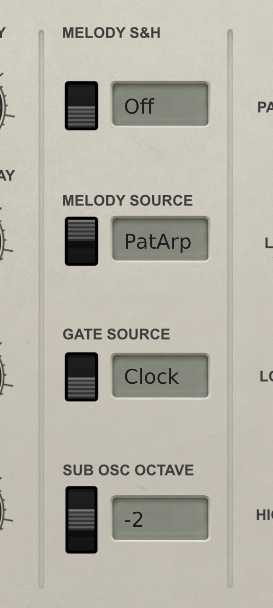
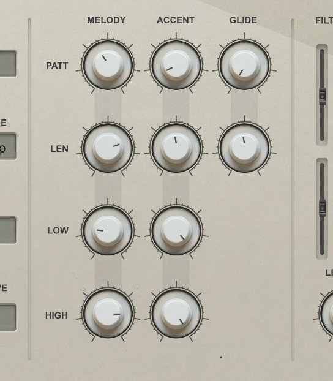
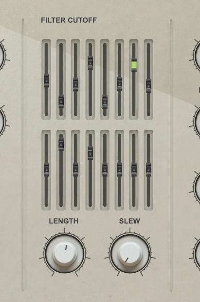
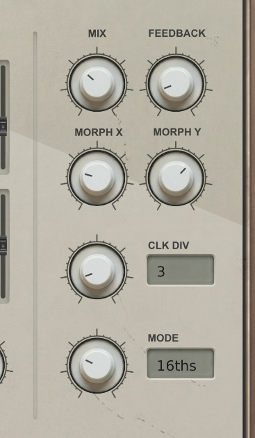
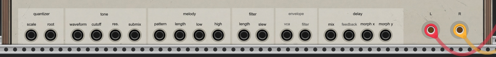

# Centralics - User Manual

Centralics is a self-contained acid bass synthesizer with a built-in clock-synced triple delay. It combines a TB-303 style monosynth, pattern generators for melody/accent/glide, a 16-step filter cutoff sequencer, a quantizer, and a tempo-synced delay effect into a single module.

## Quick Start

1. Connect the **L** and **R** outputs to your audio interface (or the VCV Rack Audio module)
2. You should immediately hear sound -- no clock or other modules required

Centralics has its own internal clock that runs by default. To sync it with other modules, patch an external clock into the **CLOCK** input.

## Clock and Reset

**CLOCK** and **RESET** are the only inputs at the top of the module.

- **CLOCK**: Patch an external clock here to sync Centralics with the rest of your patch. When no cable is connected, the internal clock runs automatically.
- **RESET**: Resets all sequencers and pattern generators to step 1.
- **CLOCK MULTIPLY**: Divides the incoming clock. Values range from 1/1 (fastest) to 1/32 (slowest). This controls the base tempo that drives all sequencers and the delay sync.

## Scale and Root

The built-in quantizer constrains all melody output to a musical scale.

- **SCALE**: Selects the scale type (Major, Minor, Dorian, Mixolydian, etc.)
- **ROOT**: Sets the root note of the scale (C through B)

## Sound Shaping

These controls shape the 303 synthesizer voice. The left column controls the oscillator and filter frequency. The right column controls envelopes and effects.

### Oscillator

- **WAVEFORM**: Selects from 16 waveforms. The classic 303 sound uses sawtooth (position 0) or square.
- **SUB OSC MIX**: Blends in a sub-oscillator one or more octaves below the main oscillator. Fattens the bass.

### Filter

- **CUTOFF**: Sets the base cutoff frequency of the 4-pole resonant ladder filter (50-1024 Hz).
- **RESONANCE**: Controls filter resonance. Higher values create the characteristic acid "squelch."

### Envelopes

- **VCA DECAY**: Controls how long each note rings. Uses logarithmic mapping for fine control over short decay times. Ranges from a tight 10ms to a sustained 10 seconds.
- **FILTER DECAY**: Controls how quickly the filter envelope closes after each note trigger.
- **ENV MOD**: Controls the depth of the filter envelope sweep. At 0, the filter stays at the cutoff frequency. Higher values create a wider sweep, producing the classic 303 "wow" effect. Range goes up to 10 for exaggerated sweeps.

### Distortion

- **DRIVE**: Post-VCA distortion using soft saturation. At 0% the signal is clean. Turning it up progressively saturates the signal, adding harmonics and grit. The distortion preserves the resonant filter sweep character rather than destroying it. Uses antialiased processing (ADAA) to avoid digital artifacts.

## Melody Options

Four switches control how melodies and gates are generated.

- **MELODY S&H** (Off/On): When On, the melody pattern generator holds each value until the next trigger (sample-and-hold behavior) rather than outputting continuous voltages.
- **MELODY SOURCE** (PatGen/PatArp): Selects between two different melody generation algorithms. PatGen produces pattern-based sequences. PatArp produces arpeggio-like patterns.
- **GATE SOURCE** (Clock/PatGen): Determines what triggers notes. "Clock" triggers on every clock pulse. "PatGen" uses the melody pattern generator's gate output, creating rhythmic gaps.
- **SUB OSC OCTAVE** (-1/-2/-3): Sets how far below the main oscillator the sub oscillator plays.

## Pattern Generators

Three pattern generators run in parallel, each controlling a different aspect of the performance. They are arranged in three columns: **Melody**, **Accent**, and **Glide**.

Each column has up to four knobs:

- **PATT** (Pattern): Selects from a range of algorithmic patterns. Each pattern number produces a different rhythmic and melodic sequence.
- **LEN** (Length): Sets how many steps the pattern runs before looping.
- **LOW**: Sets the minimum output voltage. For Melody, this sets the lowest note. For Accent, this sets the base accent level.
- **HIGH**: Sets the maximum output voltage. For Melody, this sets the highest note. For Accent, this sets the peak accent level.

### Melody Column

Controls the pitch sequence sent to the 303 synth. The output is quantized to the selected scale and root.

### Accent Column

Controls per-step accent intensity. When the accent voltage exceeds the internal threshold, notes get a louder VCA boost and a shorter, punchier filter decay. Adjusting LOW and HIGH changes how many notes are accented and how strong the accent effect is.

### Glide Column

Controls portamento (pitch sliding between notes). When the glide pattern outputs a high value, the 303 slides smoothly between the current and next pitch. Only the PATT and LEN knobs are used -- LOW and HIGH have no effect on glide since it's a gate (on/off) output.

## Filter Cutoff Sequencer

The 16 vertical sliders form a step sequencer that modulates the filter cutoff. Each slider sets a cutoff modulation value for its corresponding step. The active step is indicated by an LED above the slider.

This sequencer is what gives Centralics much of its melodic filter movement. The slider values are passed through the slew limiter before reaching the filter, so transitions between steps can be smoothed.

- **LENGTH**: Sets how many of the 16 steps are active before the sequence loops (1-16).
- **SLEW**: Controls how smoothly the filter cutoff transitions between steps. At 0, cutoff changes are instant. Higher values create smooth, gliding filter sweeps between steps.

## Delay Effects

Centralics includes a clock-synced triple delay. Three delay lines run simultaneously at different rhythmic divisions, and the output is a blend of all three.

- **MIX**: Dry/wet balance. At 0% you hear only the dry synth. At 100%, only the delayed signal.
- **FEEDBACK**: Controls how much of the delayed output feeds back into the delay input. Range 0-95%. Higher values create longer echo trails.
- **MORPH X**: Crossfades between delay line A and delay line B. At 0, only A is heard. At 1, only B.
- **MORPH Y**: Crossfades delay line C into the mix. At 0, you hear the A/B blend. At 1, only C.
- **CLK DIV**: Divides the clock before it reaches the delay. Higher values create longer delay times. Range 1-16.
- **MODE**: Selects from 8 delay time presets, each with different rhythmic relationships between the three delay lines:

| Mode | Name | Delay A | Delay B | Delay C |
|------|------|---------|---------|---------|
| 0 | Classic | 1/8 | Dotted 1/8 | 1/4 triplet |
| 1 | Quarters | 1/4 | Dotted 1/4 | 1/2 triplet |
| 2 | Sixteenths | 1/16 | Dotted 1/16 | 1/8 triplet |
| 3 | Triplets | 1/8 trip | 1/4 trip | 1/2 trip |
| 4 | Polyrhythm | 1/8 | 1/8 trip | 1/16 |
| 5 | Dub | Dotted 1/8 | Dotted 1/4 | 1/2 |
| 6 | Tight | 1/16 | 1/8 | Dotted 1/8 |
| 7 | Wide | 1/8 | 1/4 | 1/2 |

## CV Inputs and Outputs

The bottom strip contains all CV inputs, grouped by function, plus the stereo audio outputs.

### CV Input Groups

All CV inputs accept standard VCV Rack voltage ranges and are additive with the corresponding knob value.

| Group | Inputs | Controls |
|-------|--------|----------|
| **quantizer** | scale, root | Scale type and root note |
| **tone** | waveform, cutoff, res., submix | Oscillator waveform, filter cutoff, resonance, sub oscillator level |
| **melody** | pattern, length, low, high | Melody pattern generator parameters |
| **filter** | length, slew | Filter sequencer length and slew amount |
| **envelope** | vca, filter | VCA decay time and filter decay amount |
| **delay** | mix, feedback, morph x, morph y | Delay wet/dry, feedback, and morph position |

### Audio Outputs

- **L** (Left): Left channel audio output
- **R** (Right): Right channel audio output

## Tips and Techniques

### Getting the Classic Acid Sound

- Set **Waveform** to sawtooth (0) or square
- Turn **Resonance** up past 50%
- Increase **Env Mod** to 3-5 for a pronounced filter sweep
- Set **Filter Decay** to a moderate value
- Use short **VCA Decay** settings
- Enable some accent patterns to get dynamic variation

### Using Drive for Aggression

- The **Drive** knob works best when the filter resonance is active -- the distortion compresses the resonant peaks while thickening the body of the sound
- Start with Drive around 30-40% for warmth, push past 70% for heavy saturation
- Drive interacts well with short VCA decay and high Env Mod settings

### Delay as a Performance Tool

- Use **Morph X** and **Morph Y** to smoothly sweep between delay characters during a performance
- The **Dub** mode (5) with moderate feedback creates classic dub echo trails
- Patch an LFO into the **morph x** or **morph y** CV input for evolving delay textures
- **CLK DIV** at higher values (8-16) creates long, spacious delays

### Pattern Exploration

- The **PATT** knobs are the fastest way to completely change the character of a sequence. Slowly sweep through patterns to find ones you like.
- Changing **Melody Length** and **Accent Length** to different values creates polymetric patterns where the accent pattern cycles independently of the melody.
- Try extreme **LOW** and **HIGH** values on the melody generator for wide-ranging bass lines, or narrow the range for subtle variations around a single note.
