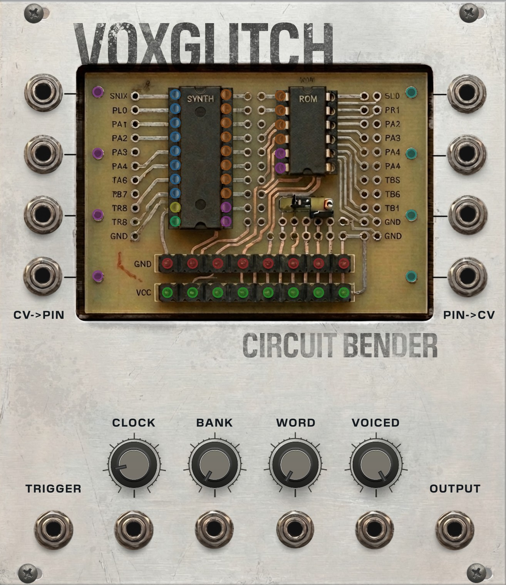
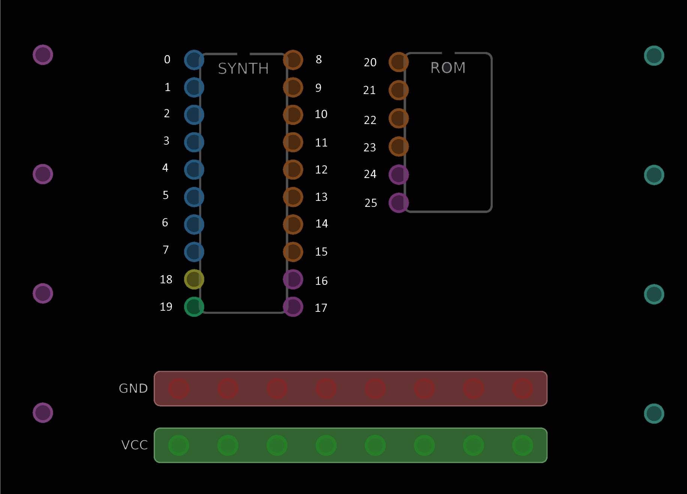

# Circuit Bender - Speech Synthesis with Virtual Circuit Bending

## Overview

Circuit Bender is a speech synthesis module inspired by the classic Speak & Spell toy from the 1980s. At its heart are virtual recreations of two Texas Instruments chips: the TMS5220 speech synthesizer and the TMS6100 voice ROM. These two chips work together to produce speech, and Circuit Bender lets you "bend" the connections between them in ways that would be difficult or impossible with real hardware.

If you've ever seen someone crack open a Speak & Spell and solder wires between random points on the circuit board to get weird, glitchy, robotic sounds, that's exactly what this module lets you do, except you don't need a soldering iron and you can't break anything.

The module comes loaded with several vocabulary banks containing words and phrases. You trigger the module to speak a word, and then you use the interactive chip display to make virtual cable connections between pins on the two chips. These connections corrupt, redirect, and mangle the signals flowing between the chips, producing everything from subtle pitch wobbles to complete sonic chaos.

## Quick Start

To get audio out of Circuit Bender, you only need two connections: a trigger source going into the trigger input, and the audio output going to your mixer or audio interface.

With a clock or trigger signal patched in, the module will begin speaking words from the currently selected vocabulary bank. Use the Word knob to pick different words, and the Bank knob to switch between vocabulary sets.

Once you're hearing speech, the fun begins. Look at the chip display in the center of the module. You'll see two virtual integrated circuits labeled SYNTH and ROM, along with GND and VCC power rails at the bottom. Each chip has colored dots along its edges representing the pins. Click on any pin and drag to another pin to create a virtual cable between them. The sound will change immediately.

Right-click on any pin to remove all cables connected to it.

## The Chip Display

The center of the module shows a miniature circuit board with two chips and two power rails. This is where all the circuit bending happens. Here's a reference diagram showing the pin numbers:

### The SYNTH Chip (TMS5220)

The SYNTH chip is the speech synthesizer. It takes encoded speech data and converts it into audio. It has pins running down both sides.

On the left side, from top to bottom:

- Pins 0 through 7 (blue) are the **data bus**, labeled D0 through D7. These carry the raw speech data that the synthesizer decodes into sound. Each pin represents one bit of the 8-bit data bus.
- Pin 18 (yellow) is the **OSC** pin, which is the master oscillator clock. This clock controls the speed of the entire speech synthesis process. Anything connected to this pin affects the pitch and speed of the output.
- Pin 19 (green) is the **SPKR** pin, which is the audio output of the synthesizer. This is a special pin because it can be used as a source to feed audio back into other pins, creating feedback loops.

On the right side, from top to bottom:

- Pins 8 through 15 (orange) are the **address bus**, labeled A0 through A7. These pins tell the ROM chip which piece of speech data to send next. The synthesizer puts an address on these pins, and the ROM responds with data.
- Pin 16 (magenta) is **M0**, a command line. Together with M1, it tells the ROM chip what operation to perform (read data, advance address, etc.).
- Pin 17 (magenta) is **M1**, the second command line.

### The ROM Chip (TMS6100)

The ROM chip stores the actual speech data as encoded parameters. It's a simpler chip with fewer pins, all on its left side.

- Pins 20 through 23 (orange) are the ROM's **address inputs**, labeled ADD1 through ADD4. These receive address signals from the SYNTH chip telling the ROM where to read from. Note that the ROM only has 4 address pins compared to the SYNTH's 8, so normally only the lower address bits are connected.
- Pin 24 (magenta) is the ROM's **M0** command input.
- Pin 25 (magenta) is the ROM's **M1** command input.

### The Power Rails

Below the chips are two horizontal bars:

- **GND** (red) is the ground rail, which forces any connected pin to a LOW state (digital 0).
- **VCC** (green) is the power rail, which forces any connected pin to a HIGH state (digital 1).

Each rail has 8 connection points spread across it. These exist so you can force multiple pins high or low at the same time without running out of connection spots.

### External CV Inputs (purple dots on the left)

The four purple dots on the left side of the display correspond to the four External CV input jacks on the module's panel (EXT CV 1 through 4). When you patch a voltage into one of these jacks, the corresponding purple dot becomes a source pin that you can cable to any chip pin in the display.

The external CV works as a simple on/off signal. Voltages above 2.5V are treated as HIGH, and voltages below 2.5V are treated as LOW. This means you can use an LFO, clock, sequencer, or any other CV source to rhythmically toggle pins on the chips.

### CV Outputs (teal dots on the right)

The four teal dots on the right side of the display correspond to the four CV output jacks on the module's panel (CV OUT 1 through 4). These work in reverse: you drag a cable from any chip pin to one of these teal dots, and the signal on that pin is sent out through the corresponding output jack.

For digital pins (address, data, command lines), the output is 0V when the pin is LOW and 10V when the pin is HIGH. For the SPKR pin, the output is the actual audio signal scaled to standard VCV Rack levels.

This is useful for watching what the internal signals are doing, or for routing those signals to other modules in your patch.

## Understanding the Pin Types

Each pin type has a distinct color, and the type determines what happens when you make connections.

**Address pins** (orange) carry the addresses that tell the ROM where to read data from. There are 8 on the SYNTH chip (A0-A7) and 4 on the ROM chip (ADD1-ADD4). Bending these pins corrupts the addresses, causing the synthesizer to read from wrong locations in the ROM. This produces garbled speech, repetitive loops, and glitchy stuttering effects.

**Data pins** (blue) carry the encoded speech parameters on the SYNTH chip's internal bus (D0-D7). Bending data pins directly corrupts the speech parameters that control things like pitch, energy, and formant frequencies. This tends to produce more extreme mangling than address bending.

**Command pins** (magenta) are M0 and M1 on both chips. These two-bit signals control what operation the ROM performs. Bending these can cause the ROM to misinterpret commands, leading to the synthesizer getting confused about where it is in the speech data.

**OSC** (yellow) is the master clock pin. Connecting other pins to OSC modulates the clock speed based on the connected signal's state. When the driving signal is HIGH, the clock speeds up. When LOW, it slows down. This creates pitch-bending and warbling effects that track whatever signal is driving it.

**SPKR** (green) is the audio output pin. Unlike other pins, SPKR is a source-only pin. You can drag cables from SPKR to other pins, but not to SPKR. When connected to other pins, the audio output's polarity (positive or negative) determines whether the target pin is driven HIGH or LOW. This creates chaotic feedback loops where the sound itself controls the circuit.

## What Happens When You Connect Pins

The module automatically figures out what kind of bend to apply based on which two pins you connect. Here's a guide to the most common connection types.

### Forcing a Pin HIGH or LOW

Connect any chip pin to the GND rail to force it permanently LOW. Connect it to VCC to force it permanently HIGH. This is the simplest kind of bend. For example, forcing an address bit HIGH means that bit will always be 1, regardless of what the synthesizer is trying to do. This locks the ROM into reading from a restricted set of addresses.

### Shorting Two Pins on the Same Bus

If you connect two address pins on the same chip together (say A2 to A5), those pins become shorted. They'll always have the same value, effectively reducing the number of unique addresses the chip can produce. Similarly, shorting two data pins together corrupts pairs of speech parameters in a linked way.

### Shorting Address to Data

Connecting an address pin to a data pin on the SYNTH chip creates a cross-bus short. The address value influences the data value and vice versa. This creates a kind of feedback where what the chip is trying to read affects how the data is decoded.

### Cross-Chip Connections (SYNTH to ROM)

Connecting a SYNTH address or data pin to a ROM address pin creates a cross-chip mapping. The ROM address bit gets its value from the SYNTH pin instead of the normal routing. This can completely rearrange which ROM data the synthesizer reads, producing unpredictable speech fragmentation.

### Command Line Bending

Connecting M0 to M1 (either on the same chip or across chips) shorts the command lines together. You can also connect address or data pins to M0 or M1, which causes the command signals to change based on the data flowing through the bus. This is one of the more destructive bends.

### Clock Modulation

Connecting an address or data pin to the OSC pin causes the clock speed to fluctuate based on that pin's value. Since address and data pins change rapidly during speech, this produces dynamic pitch modulation that tracks the content of the speech.

### Audio Feedback

Connecting the SPKR pin to any other pin routes the audio output back into the circuit. The output's polarity drives the target pin HIGH or LOW. This creates feedback loops where the audio signal actively disrupts the circuitry producing it. Connecting SPKR to an address pin produces stuttering feedback. Connecting it to OSC produces audio-rate frequency modulation.

### External CV Routing

Connecting a purple EXT dot to any pin lets your external CV source drive that pin. Pair this with an LFO for rhythmic modulation, a sequencer for pattern-based glitching, or a random voltage source for chaos.

### CV Output Tapping

Connecting any pin to a teal OUT dot sends that pin's signal to the corresponding CV output jack. Use this to observe internal signals or to feed them into other modules.

## The Knobs and Jacks

### Word

Selects which word to speak from the current vocabulary bank. Each bank has a different number of words. The Word CV input allows voltage control of word selection, where 0-10V maps across the full range of available words.

### Bank

Selects the vocabulary bank. Circuit Bender includes six banks:

- Bank 0: US Large (a comprehensive American English vocabulary)
- Bank 1: TI-99 (words from the TI-99 home computer speech synthesizer)
- Bank 2: Acorn (words from the BBC Micro speech system)
- Bank 3: Eastern (an alternative speech synthesis vocabulary)
- Bank 4: Hello Test (a small test vocabulary)
- Bank 5: Breakbeats (percussive and rhythmic speech fragments)

The Bank CV input allows voltage control of bank selection.

### Clock Scale

Controls the overall speed of the speech synthesis clock, ranging from 0.001x to 1.0x. The default value of 0.16 produces normal-sounding speech. Lower values slow the speech down dramatically, revealing the individual parameter frames. Higher values speed things up. This is different from bending the OSC pin because Clock Scale affects the base clock speed uniformly, while OSC bending creates dynamic speed variations.

The Clock Scale CV input responds exponentially, so you can use it for musical pitch-like control of the speech rate.

### Voiced

Controls the mix between voiced (normal) and unvoiced (whispered/noisy) speech. At 1.0, speech sounds normal. At 0.0, all speech becomes a breathy whisper, as if the vocal cord oscillation has been replaced entirely with noise. Values in between produce a partially voiced, partially whispered quality.

### Trigger Input

A standard trigger input. Each trigger causes the module to speak the currently selected word. Pair this with a clock module for rhythmic speech, or use manual triggers for one-shot playback.

### Audio Output

The main audio output carrying the synthesized (and bent) speech signal, scaled to standard VCV Rack audio levels (roughly plus or minus 5V). A soft limiter prevents extreme bends from producing dangerously loud output.

### External CV Inputs (EXT CV 1-4)

Four CV input jacks that correspond to the four purple dots in the chip display. These let you bring external voltages into the bending system. Anything above 2.5V is treated as HIGH, anything below is LOW.

### CV Outputs (CV OUT 1-4)

Four CV output jacks that correspond to the four teal dots in the chip display. Use these to tap internal chip signals and send them elsewhere in your patch.

## Context Menu Options

Right-click the module to access additional settings:

### Display Mode

Controls how the chip display area is rendered. There are three options: Simple (clean black background with chip outlines), Realistic (shows the background image with no overlay), and Realistic Dark (shows the background image with a darkened overlay). The display mode is purely visual and does not affect the sound.

## Tips for Exploration

Start simple. Make one connection at a time and listen to what changes. Some connections produce subtle effects, while others completely transform the sound. If things get too chaotic, right-click on pins to remove cables, or remove the module and add a fresh one.

Address bus bends (connecting orange pins) tend to produce musical, looping glitches because they cause the synthesizer to read from wrong but consistent ROM locations. Data bus bends (blue pins) produce harsher, more unpredictable results because they directly corrupt the speech parameters. Command line bends (magenta pins) can cause the system to lock up or produce silence, so use them carefully.

The SPKR feedback connections are where things get really wild. Start with a single connection from SPKR to one address pin and see how the audio feeds back into itself. Then try adding more feedback paths for increasing chaos.

External CV inputs are powerful tools for making the bending responsive to other parts of your patch. Try routing a slow LFO into an external input and connecting the corresponding purple dot to an address pin. The speech will glitch in time with the LFO.

Different vocabulary banks and words respond differently to the same bends. A word with lots of voiced consonants will sound very different from a percussive word when the same pins are bent. The Breakbeats bank in particular can produce interesting rhythmic results when combined with address bending.

There's no wrong way to use Circuit Bender. Experiment freely and let the happy accidents guide you.
