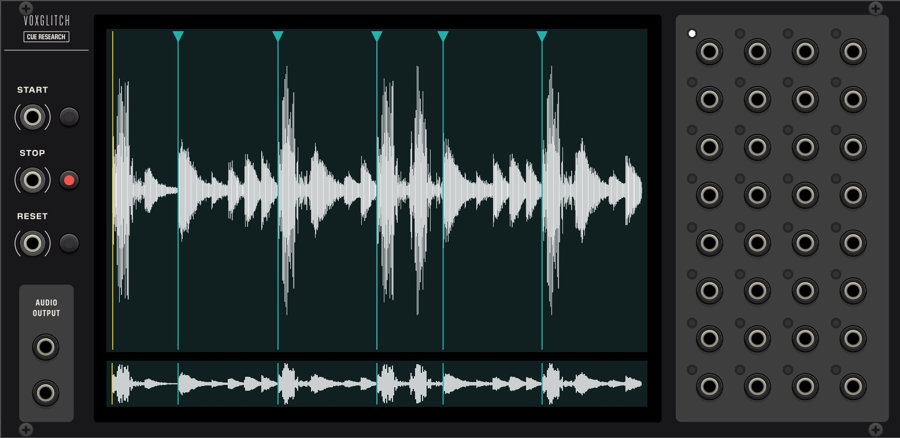

## Cue Research

Cue Research is a sample playback module designed for triggering events at specific points in your audio. Load any WAV file and place markers throughout your sample, each one assigned to trigger one of 32 dedicated trigger outputs. The dual waveform display provides both detailed and overview perspectives, allowing for precise marker placement through intuitive zooming, panning, and audio-preview scrubbing. Whether you're syncing specific hits in a drum loop, creating complex rhythmic patterns from a sample, or choreographing precise moment-based events, Cue Research gives you sample-accurate control over your triggers.

### Quick Start

1. Load a Sample
   - Right-click on the module and select "Load Sample" from the context menu

2. Basic Controls
   - Press the START button or send a trigger to the START input to begin playback
   - Press STOP to halt playback
   - Use RESET to return to the beginning of the sample
   - Watch the playhead (vertical yellow line) move across the waveform displays

3. Adding Your First Marker
   - Make sure one of the 32 marker buttons is selected (it will be lit)
   - Double-click on the upper waveform display where you want to place a marker
   - A marker will appear as a vertical line with a triangle at the top
   - Active output markers appear in blue, while others appear in grey

4. Testing the Output
   - When playback reaches your marker, the corresponding output will send a trigger
   - The default trigger length is 1ms (adjustable in the context menu)
   - Connect the marker output to another module to test the trigger

### Inputs

- START - Gate/trigger input to begin sample playback
- STOP - Gate/trigger input to stop playback
- RESET - Gate/trigger input to reset playhead to the beginning

### Marker Selection Buttons
The module features 32 illuminated buttons, each corresponding to its matching output jack. When a button is selected (lit), any new markers you create will be associated with that output. Only one button can be selected at a time.

### Outputs

- LEFT/RIGHT Audio Output - Stereo sample playback output (±5V)
- Marker Outputs (1-32) - Each output sends a 10V trigger when playback reaches any marker assigned to that output. Trigger length is adjustable in the context menu from 1ms to 200ms.

### Main Features

#### Waveform Displays

The module features two waveform views that work together to provide precise control over your sample:

##### Upper Display (Detailed View)
- Primary workspace for precise marker placement and editing
- Zoom and pan for detailed sample navigation:
  - Mouse wheel to zoom in/out
  - Click and drag horizontally to pan
  - Click and drag vertically to zoom (can be disabled in context menu)
- Click and drag the playhead (yellow line) for audio-previewed scrubbing
- Double-click to add or remove markers

##### Lower Display (Overview)
- Shows the complete sample waveform regardless of upper display's zoom level
- Click anywhere to instantly move the playhead to that position
- Provides visual context while working with zoomed sections in the upper display
- Shows all markers for easy navigation

#### Working with Markers

##### Adding and Removing Markers
- Double-click on either waveform display to add a marker at that position
- Double-click an existing marker to remove it
- Right-click a marker to access its context menu with additional options
- Add as many markers as needed - there's no limit to the number of markers you can create

##### Marker Properties
- Each marker is associated with one of the 32 outputs
- Markers associated with the currently selected output appear in blue
- All other markers appear in grey
- Multiple markers can be assigned to the same output
- Multiple markers can exist at the same position, each triggering different outputs

##### Moving Markers
- Click and drag any marker to adjust its position
- Marker movement can be locked via the context menu to prevent accidental changes

##### Context Menu Options
- Trigger Length: Choose from 8 preset lengths (1ms to 200ms)
- Lock Markers: Prevent marker editing and movement
- Lock Mouse Interaction: Disable mouse interaction -- to avoid conflicts with Rack's default mouse handling 
- Clear Markers on Sample Load: Automatically remove markers when loading a new sample
- Loop Sample Playback: Enable continuous sample playback