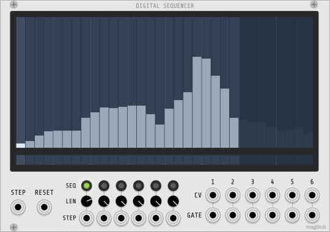

## Digital Sequencer

Digital Sequencer is a variable length CV/Gate sequencer - times six!  It has both a master step input and individual step inputs for each of the six sequencers.  Additionally, it supports a variety of output ranges and snap input settings per sequencer.  It's especially useful if you need a lot of modulation in your patch.

### Inputs

* The main display - Draw on the display to modify either the CV values or gates underneath.
* STEP - There are a few ways to step Digital Sequencer.  Stepping means that you want to play the next note in the sequence.  If you wish all tracks to playback at the same speed, supplying a single clock intput to the STEP input (on the left) will work.  I would recommend this for beginners.  A great clock source would be CLOCKD from Impromptu.
* RESET - Resets all sequencers.
* LEN - Individual length control of the sequences, ranging from 1 to 32 steps.
* SEQ - Buttons with LEDs for selecting the sequence to edit.
* STEP (the 6 input at the bottom of each sequencer) - You can control the step of each sequence independently by feedling it a STEP input.  This will override the global STEP input.

### Outputs

* CV/Gate - CV and Gate outputs for each of the six sequencers.

### Selecting which sequence to edit

There are 6 sequences in Digital Sequencer.  To select which sequence to edit, click on one of the 6 green LED buttons.  You may also use the number keys 1-6 while hovering your mouse over the module to select the active sequencer.

### Setting the sequence length

Each sequence has variable length controlled by the corresponding LEN knob, which ranges from 1 to 32.  Another way to set the sequence length is to hold the CTRL key while dragging the mouse left and right in the voltage sequencer display.

### The Mouse Interface

Changing the sequence is as easy as drawing on the sequencers.  You can click and drag to adjust values in the sequencer. 

#### Shifting the Sequence

It's possible to shift the currently selected sequence to the left or right by holding down the SHIFT key and dragging the sequence to the left or right.  This is handy if your sequence sounds great, but isn't aligned with the rest of your patch.

### Freeze Mode

#### The F key

I'm really excited about this feature.  Imagine that you're trying to fine-tune a sequence.  Perhaps step #5 isn't exactly where you need it.  Previously, your best recourse was the change step #5, then wait until the sequencer reached step 5 so you could hear how your change affected the patch.  Freeze mode lets you focus on the step that you need to tweak and hear the difference immediately.

If you hover over the sequencer and press the `f` key, sequence playback will stop and your mouse will control which sequencer column is selected.  As you adjust the value, it will be output at the CV output for the selected sequencer.

#### The G key

OK *but*...when in freeze mode, what if your patch is expecting a corresponding gate output?  For example, if you use an ADSR that feeds a VCA, you really need to gate the ADSR in order to hear the value. 

To send a gate signal for the active sequencer while in freeze mode, press the `g` key.  This will send a gate output at the selected column.

### Quick Keys

#### Randomizing

* r: When hovering over either the CV sequencer or gate sequencer, randomizes the pattern.
* r + shift: Same as above, but randomizes both.

#### Sequence Selection

* Press number 1 through 6 to quickly select the active sequencer

#### Copy-Paste

* Use control-c / control-v to copy and paste sequencer values between sequence slots.  (If you have a Mac, I think it's command-c and command-v.)

### Context menu

Right click on the module to access the context menu.  

#### Snapping

You can set snapping for each sequencer.  Snapping could be helpful if you want to quantize the CV output of a sequence.

#### Output Range

You can set the output range individually for the six sequencers.

#### Sample and Hold

This setting causes the sequencer's value to be updated on the output *only* if there's a corresponding ON value provided by the gate sequencer underneath it.