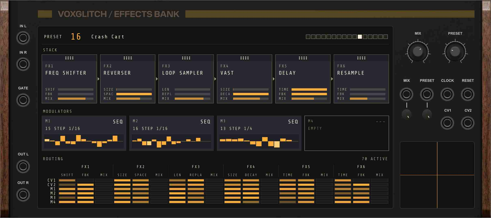
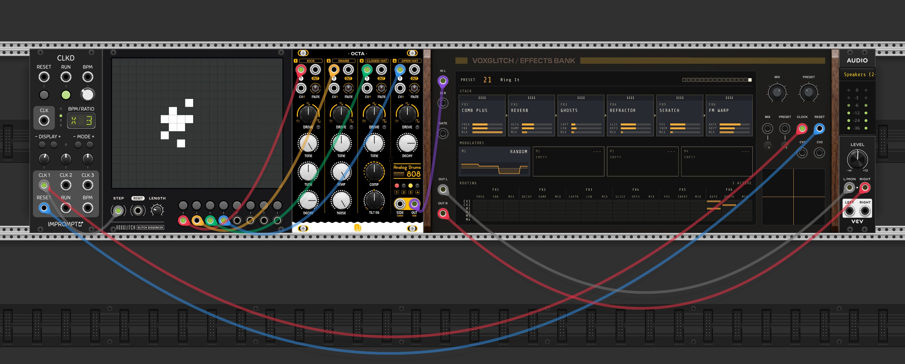
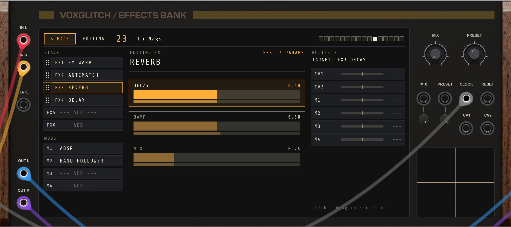

# Effects Bank - User Manual

## Overview

Effects Bank is a multi-effect preset module for VCV Rack. It bundles dozens of curated effect "presets" into a single module, where each preset is a stack of up to 6 effects, up to 4 modulators (LFOs, envelopes, sequencers, followers), and a routing matrix that connects modulators and incoming CV to effect parameters.

You pick a preset with a knob (or CV), wire audio through, and play. If you want to dig deeper, the screen on the front of the module is a full editor: you can rearrange the effect stack, swap effects in and out, edit modulators, and rewire the routing matrix without leaving the patch.

Effects Bank also has a built-in X/Y performance pad that doubles as a CV1/CV2 controller, a clock input for tempo-synced effects, and a per-effect MIX on every effect in the stack.

## Quick Start

1. Add Effects Bank to your VCV Rack patch
2. Connect an audio source to the **L** input (and optionally the **R** input for stereo)
3. Connect the **L** and **R** outputs to your audio interface (or anywhere downstream)
4. Turn the **MIX** knob up
5. Use the **PRESET** knob to dial through presets

The module ships with a large bank of factory presets covering filters, distortions, delays, reverbs, granular textures, pitch effects, beat-shufflers, and spectral processors. Each preset has its own internal routing already set up, so you should hear something interesting on every preset position.

If you want a single test patch to explore the module:

- Patch a kick or beat source into **L**
- Patch a slow LFO or ramp into the **MIX CV** input so the mix sweeps automatically
- Patch a clock into the **CLOCK** input so tempo-synced effects (delays, gates, stutters) lock to your tempo
- Drag inside the X/Y pad to performance-control the two effect CV inputs in real time

# Chapter 1: Panel Tour

The panel is organized into three vertical bands:

- **Left**: audio input and output, plus the gate input
- **Center**: the dynamic screen (preset display, effect stack, modulators, routing matrix, X/Y pad)
- **Right**: the **MIX** and **PRESET** knobs, the CV inputs, and the clock and reset inputs

## Audio I/O

- **L / R inputs**: Stereo audio input. If you only patch the **L** input, the right channel is fed from the same signal (mono in, stereo out).
- **L / R outputs**: Stereo audio output. The MIX knob (and per-effect MIX inside each effect) determines how much of the processed signal you hear here.

## Gate

The **GATE** input controls whether the preset is "running" or not.

- **Unpatched**: The preset is always on. Audio is processed continuously.
- **Patched**: The preset behaves like a gate-while-held effect. A rising edge fires any envelopes (ADSR, follower attack, etc.) and a falling edge releases them and fades the wet signal out.

This is the same pattern as a synthesizer voice. It's useful when you want the effect to only be active during certain notes or beats, rather than smearing across silence.

## Mix

The **MIX** knob is the master mix control between the unprocessed input and the processed output.

By default, this is a **crossfade**: at 0% the output is your input untouched, at 100% it's pure processed signal, and anywhere in between is a mix.

You can also switch the knob to **parallel mode** through the right-click context menu. In parallel mode the dry signal stays at full volume and the wet signal is added on top, which works like a "wet send" routing. Output level can exceed input level in this mode, which is intentional.

The **MIX CV** input adds to the knob value (0 to 10V maps to the full sweep), with an attenuverter underneath for scaling and inversion.

## Preset

The **PRESET** knob selects which preset is active. The current preset name and number show up on the screen.

The **PRESET CV** input adds to the knob position (0 to 10V scans across the full preset bank), with an attenuverter underneath. Switching presets is smooth: the module crossfades between voices internally, so there are no clicks or pops when sweeping the knob or modulating with CV.

## Effect CV1 and CV2

The **CV1** and **CV2** inputs are bipolar control signals (any voltage from -5V to +5V works) that effects and routes can listen to. Different presets use these in different ways: one might wire CV1 to filter cutoff and CV2 to feedback, while another might wire CV1 to delay time and CV2 to wet level.

Scaling and inversion happen at the route level (each route has a bipolar depth control), so there are no attenuverters needed for these inputs on the panel.

The X/Y pad on the screen is also a CV1/CV2 source. See Chapter 5 for details.

## Clock and Reset

- **CLOCK**: Patch a clock here to drive tempo-synced effects (delays, gates, stutters, granular effects with beat-aligned grain spawning, etc.). Effects Bank derives BPM from the gap between rising clock edges.
- **RESET**: A trigger here re-aligns clock-synced phases (useful when you want every preset's beat-locked effects to start fresh on bar 1).

A 16-step LED strip on the screen shows the current clock step. It advances on each rising edge of the clock and wraps back to step 1 every 16 beats. A reset pulse returns it to "waiting" (no LED lit) until the next clock edge.

If you don't patch a clock, sync effects fall back to 120 BPM internally.

# Chapter 2: Working with Presets

## Selecting Presets

The active preset is determined by the sum of the **PRESET** knob and any voltage at the **PRESET CV** input (scaled by the attenuverter). The screen shows the current preset number (1-based) and name in the top status strip.

Switching presets is smooth. Internally the module crossfades between two voices, so a knob sweep or a modulated CV sweep doesn't produce clicks. Effects that hold internal buffers (delays, granular clouds, beat freezes) get a clean start when their voice activates.

## Mix Modes

Two master mix modes are available, switched through the right-click context menu under **Mix mode**:

| Mode | Behavior |
|------|----------|
| Crossfade (default) | Dry fades down as wet fades up. At 100% you hear pure wet. |
| Parallel | Dry stays at full volume. Wet is added on top as the knob goes up. |

Parallel is useful when you're treating the module as a parallel effects send (where you want dry and wet to coexist), or when you want to layer a textural effect on top of a clean signal without losing the original.

## Saving, Loading, Renaming Presets

Right-click the module to access per-preset file actions. These all operate on the **currently selected** preset (whichever one the PRESET knob is on right now):

- **Rename preset...**: Change the display name for this preset slot.
- **Save preset to file...**: Export the current preset (stack, modulators, routes, base parameter values) to a JSON file you can keep, share, or back up.
- **Load preset from file...**: Replace the current preset slot's contents with a preset loaded from JSON.
- **Clear preset**: Empty the current preset's effect stack, modulators, and routes (the slot's name and description stay intact).
- **Reset preset to factory**: Restore the current preset slot to the factory contents that shipped with the module.

All preset edits (including rename, file loads, and structural edits made through the screen editor) are saved with your VCV Rack patch automatically. Resetting a single preset to factory is non-destructive to the other ~60 presets in the bank.

# Chapter 3: The X/Y Performance Pad

The X/Y pad on the right side of the screen is a touch controller for **CV1** and **CV2**. Drag inside the pad to send continuous control values into the routing system.

- Horizontal position drives CV1 (left = -1, right = +1)
- Vertical position drives CV2 (bottom = -1, top = +1)

A crosshair shows the current position, and a fading trail of orange rectangles draws while you're dragging.

The crosshair always reflects whatever is currently driving CV1 / CV2, so even when you're not touching the pad it works as a live monitor for the external CV inputs.

## Pad Modes

Right-click inside the pad for two performance options:

- **Latch position on release**: When enabled, releasing the mouse leaves the pad position where you let go, instead of snapping back to whatever the external CV inputs are doing. Useful for "set it and forget it" performance gestures.
- **Sum with CV1 / CV2 (instead of replace)**: When enabled, the pad value is added to the external CV input rather than replacing it. The result is clamped to the +/-1 range. Useful when you want to nudge an automated CV with manual touch input.

The pad's position and these mode settings are saved with your patch.

# Chapter 4: The Screen - Viewer Mode

The screen has two modes: **Viewer** (the default overview) and **Editor** (focused editing of one effect or modulator). This chapter covers the Viewer; Chapter 5 covers the Editor.

## Status Strip

The strip across the top of the screen shows:

- **PRESET XX**: The current preset number (1-based) and its name.
- **Clock step LEDs**: A row of 16 small boxes on the right side of the strip. The currently active step lights up; all are dark when no clock has arrived yet.

## Effect Stack

Below the status strip, the **effect stack** is a horizontal row of up to 6 tiles. Each tile shows:

- The effect's name (e.g., REVERB, SYNC DELAY, GRANULAR CLOUD)
- Visual parameter bars showing the live (post-modulation) value of each parameter
- A grip strip along the top edge for drag-to-reorder

Click the body of any tile to drill into the **Editor** focused on that effect.

## Modulators

The **modulator strip** is a row of up to 4 cards, one per modulator slot (M1 through M4). Each card shows:

- The modulator type (LFO, ADSR, Sequence, Random, Bouncing Ball, etc.)
- A short configuration summary (e.g., a sine LFO synced to 1/8 notes)
- A mini-visualization (the LFO waveform with a playhead, the ADSR envelope shape, the sequencer step grid, etc.)

Click a card to drill into the **Editor** focused on that modulator.

## Routing Matrix

The routing matrix shows which modulator and CV sources are wired into which effect parameters and at what depth. Sources are CV1, CV2, and the four modulator slots (M1-M4). Targets are individual parameters of effects in the stack. Each route has a bipolar depth (-1 to +1) so a single source can be inverted, attenuated, or split across multiple targets.

# Chapter 5: The Screen - Editor Mode

Click any effect tile or modulator card on the Viewer screen to enter the **Editor**. The Editor has three columns:

- **Left rail**: Lists the full effect stack (FX1 through FX6) and the four modulator slots (M1 through M4). Click rows here to switch which target you're editing.
- **Center**: Detail view for the selected target. Shows the parameters of the selected effect, or the configuration of the selected modulator.
- **Right column** (only when an effect is selected): The route editor for the parameter you're currently focused on.

Press the **BACK** button at the top of the screen, or hit **Esc**, to return to the Viewer.

## Adding, Changing, and Removing Effects

Right-click an effect row in the left rail to open the context menu. From here you can:

- **Add effect**: Open the picker and add a new effect to an empty slot
- **Change effect**: Open the picker and swap the effect in this slot for a different type
- **Remove effect**: Remove this effect from the stack
- **Move Up / Move Down**: Reorder the effect within the stack

Clicking an empty stack row opens the **picker overlay** directly. The picker is a full-screen browser organized by category (Filter, Drive, Delay, Reverb, Pitch, Looper, Slice/Gate, Reverse, Spectral, Texture, Utility), with a search field at the top. Type to filter, click an effect to add it, or press Esc to dismiss.

You can also reorder the stack visually: click and hold the **grip strip** along the top edge of any effect tile (in the Viewer) or the left edge of any rail row (in the Editor), then drag horizontally or vertically to reorder. The stack reflows to make room for the dropped effect.

Press **Delete** while hovering over the screen with an effect or modulator selected in the Editor to remove it.

## Editing Effect Parameters

When an effect is selected, the center column shows its parameter sliders. Each effect has two named parameters (with effect-specific labels like CUTOFF, DRIVE, FBK, DIV, etc.) plus a **MIX** parameter at the bottom.

- **Click and drag** a slider to adjust its value
- **Click** anywhere on the slider track to jump to that value
- **Double-click** to reset the parameter to its default

Sliders are normalized 0 to 1, but each effect maps the slider position to its own natural range internally. Some effects use exponential mapping for time and frequency parameters so you get fine resolution at the low end. Some effects snap to musically meaningful values (clock divisions, scale degrees, bit depths).

### Per-Effect MIX

Every effect in the stack has its own **MIX** slider on the bottom of its parameter list. This is the per-effect MIX blend, separate from the master MIX knob.

- 0% MIX = the effect is bypassed (dry passes through to the next effect in the stack)
- 100% MIX = the effect is fully wet

The per-effect MIX is route-targetable like any other parameter, so you can modulate the MIX of an individual effect with an LFO, an envelope, or external CV.

## Editing Modulators

When a modulator is selected in the left rail, the center column shows its editor. The editor varies by modulator type:

- **LFO**: A live waveform display with a playhead, plus controls for shape (sine, triangle, saw, square, sample-and-hold), free vs. clock-synced mode, rate (in free mode), division (in synced mode), and phase
- **ADSR**: An envelope shape preview plus four knobs for attack, decay, sustain, release
- **Sequence**: A bipolar step grid (click columns to set step values from -1 to +1), plus +/- buttons to add or remove steps and a clock division selector
- **Followers** (Env Follower, Sync Env Follower, Sync Env Echo, Band Follower, Pitch Follower): Numeric fields for attack, release, gain, and any type-specific options (band frequency and Q for the band follower; lo/hi range for the pitch follower; clock division for the synced variants)
- **Random**: A division (clock-synced sample-and-hold rate) and a smoothing amount
- **Bouncing Ball / Reverse Bouncing Ball**: A division and a bounce amount

Most fields use the same interaction pattern as effect parameters: click to jump, click and drag to fine-tune, double-click to reset. The LFO shape, sync, and division controls are buttons that you click to cycle.

## Setting Up Routes

When an effect is selected, the right column shows the **route editor** for the currently focused parameter on that effect. To pick which parameter you're routing to, click on the parameter name in the center column.

The route editor lists every modulation source available in the preset:

- CV1 and CV2 (the panel's effect CV inputs, also driven by the X/Y pad)
- M1 through M4 (whichever modulator slots have something in them)

Each source row has a **bipolar depth slider** (centered at 0, ranging from -1 to +1), the depth value as text, and a click target for the source label.

- **Click and drag** the depth slider to set the modulation amount
- **Double-click** the slider to reset depth to 0 (which removes the route in practice)
- **Right-click** an existing route for a context menu to remove it

A positive depth adds the source to the parameter's base value; a negative depth subtracts it. Multiple sources can target the same parameter, and a single source can target many parameters.

## Routes and the Master Routing Matrix

The Viewer's **routing matrix** shows every active route across the whole preset at a glance. The Editor's right column is a focused view of just the routes that target the selected parameter. Both are reading from the same preset data: an edit you make in the Editor immediately appears on the Viewer's matrix.

# Chapter 6: Effect Reference

This chapter lists every effect type Effects Bank ships with, organized by category. Effects are added to the stack through the picker overlay (Chapter 5) or as part of a factory preset.

| Effect | Category | Parameters | Description |
|--------|----------|------------|-------------|
| **Lowpass** | Filter | Cutoff, Reso | 2-pole resonant lowpass filter. |
| **Highpass** | Filter | Cutoff, Reso | 2-pole resonant highpass filter. |
| **Bandpass** | Filter | Freq, Q | State-variable bandpass filter; high Q homes in on a single frequency. |
| **Acid Filter** | Filter | Cut, Res | TB-303 style 4-pole ladder filter with the classic squelch. |
| **Comb Plus** | Filter | Freq, Fbk | Comb filter for resonant peaky tones and phase-style effects. |
| **Modal** | Filter | Struct, Damp | 16 parallel modal resonators (Rings-style); STRUCTURE morphs each mode's frequency ratio between tuned, bell, plate, and metallic. |
| **Terrain** | Filter | X, Y | Doepfer A-128 style 15-band filterbank with per-band delay; X/Y picks an anchor on a 2D delay-terrain map. |
| **Distortion** | Drive | Drive, Shape | Drive plus morphable sigmoid shaper from soft to hard clipping. |
| **Wavefolder** | Drive | Fold, Sym | West-coast wavefolder with symmetry control. |
| **Tube** | Drive | Drive, Bias | Tube saturation with bias for asymmetric harmonics. |
| **Tape** | Drive | Drive, Warmth | Magnetic tape saturation and warmth coloration. |
| **Fuzz** | Drive | Drive, Tone | Fuzz tone with tone control; aggressive clipping. |
| **Rectify** | Drive | Drive, Bias | Half- and full-wave rectification with bias shift. |
| **Ring Mod** | Drive | Freq, Shape | Ring modulator with sine-to-square carrier morph. |
| **Reverb** | Reverb | Decay, Damp | Dattorro plate reverb. |
| **Vast** | Reverb | Size, Decay | Continuously-variable feedback delay network reverb inspired by Make Noise Erbe-Verb. SIZE scales from short rooms to vast spaces. |
| **Vast Diffuse** | Reverb | Size, Diffuse | Vast variant with four input allpass filters; DIFFUSE controls smear without affecting tail length. |
| **Spring Reverb** | Reverb | Decay, Tone | Spring reverb with bouncy character. |
| **Vowel** | Reverb | Vowel, Res | Vowel filter bank with resonance control. |
| **Resonator** | Reverb | Pitch, Decay | Pitched resonator excited by input transients. |
| **Freq Shifter** | Reverb | Shift, Fbk | Inharmonic frequency shifter with feedback. |
| **Vol Pan** | Utility | Vol, Pan | Volume and stereo panning. |
| **Compressor** | Utility | Amount, Release | Self-keyed peak compressor with linked stereo gain reduction. |
| **CLK Duck** | Utility | Depth, Release | Clock-triggered sidechain ducking. Each rising clock edge briefly drops the level then decays back. |
| **Bloom** | Utility | Amount, Low | 3-band OTT-style multiband compressor with both upward and downward compression. The LOW knob is dedicated low-band boost. |
| **Bit Crush** | Texture | Bits, Rate | Bit-depth and sample-rate reduction. |
| **Sync Gate** | Slice / Gate | Div, Size | Clock-synced amplitude gate for rhythmic pumping. |
| **Sync Stutter** | Slice / Gate | Div, Len | Clock-synced sample-and-hold; repeats short slices on the beat. |
| **Delay** | Delay | Time, Fbk | Free-running stereo delay (1 ms to 1 second). |
| **Sync Delay** | Delay | Div, Fbk | Tempo-synced delay. |
| **Sync Ping Pong** | Delay | Div, Fbk | Tempo-synced stereo ping-pong delay. |
| **Sync Dual Delay** | Delay | Div-L, Div-R | Two independent tempo-synced delays split left and right for polyrhythm. |
| **Morph Delay** | Delay | Morph, Fbk | Morphs between low-pass and high-pass filtered delay states. |
| **Pitch Echo** | Delay | Time, Pitch | Delay line with pitch shifting on feedback. |
| **Resample** | Delay | Time, Fbk | Beat-synced feedback loop; captures input and re-injects it on a beat division. |
| **Long Delay** | Delay | Time, Fbk | Stereo delay with longer time range (100 ms to 4 s). |
| **Loop Sampler** | Looper | Len, Speed | Captures a tempo-synced segment of input and loops it; recaptures periodically. |
| **Tonalizer** | Pitch | Root, Chord | Quantizes pitch to a root and chord across 32 scales. |
| **Refractor** | Pitch | Slice, Offs | Slices the input into segments that play back at offset times. |
| **Pitch Shift** | Pitch | Pitch, Grain | Granular pitch shifter; pitch independent of tempo. |
| **Sync Pitch Shift** | Pitch | Pitch, Div | Clock-synced granular pitch shift; grains align to beats. |
| **Reverser** | Reverse | Size, Space | Granular reverse playback; grain size and overlap shape texture density. |
| **Sync Reverser** | Reverse | Div, Len | Clock-synced granular reverse with sub-beat divisions. |
| **Beat Reverse** | Reverse | Beats | Reverses the most recent N beats of incoming audio. |
| **Beat Grab** | Looper | Look, Fbk | Replaces current audio with audio from N beats ago. |
| **Beat Freeze** | Looper | Look, Len | Captures a tempo-synced window from N beats ago and loops it indefinitely. |
| **Beat Slice** | Looper | Pool, Div | Each sub-beat plays a random slice from past N bars. |
| **Spectral Gate** | Spectral | Thresh, Tilt | FFT magnitude threshold gate (gating or anti-gating). |
| **Spectral Freeze** | Spectral | Cap, Shim | Captures a spectrum and sustains it as a tonal wash. |
| **Spectral Smear** | Spectral | Width, Tilt | Magnitude blur and phase scatter across FFT bins. |
| **Spectral Bloom** | Spectral | Amount, Tilt | Per-bin upward+downward compression. Quiet partials lift, loud ones flatten. |
| **Spectral Posterize** | Spectral | Levels, Drive | Quantizes per-bin magnitudes to a few levels for a pixelated spectrum. Phase preserved. |
| **Spectral Shadow** | Spectral | Color, Smear | Spectral color shift with magnitude blur for dark, evolving tones. |
| **FM Warp** | Texture | Rate, Depth | Audio-rate delay modulation creates FM sidebands and metallic warble. |
| **Robot** | Texture | Harm, Tilt | Phase-zero processing with harmonic comb for a robotic, pitched effect. |
| **Granular Cloud** | Texture | Dens, Scat | Tight granular cloud; spawn density and scatter shape the timbre. |
| **Ghosts** | Texture | Captr, Len | Stack of looping captured slices; new ghosts spawn periodically as old ones fade. |
| **Scratch** | Texture | Pos, Inertia | Turntable model with position control and velocity-dependent drag noise. |
| **Antimatch** | Texture | Slice, Invert | Spectral anti-correlation chunk engine; finds and inverts counter-rhythmic content for stutter / rhythmic-mismatch textures. |

## Notes

- **Sync effects** (anything with "Sync" in the name) need a clock at the **CLOCK** input to lock to your tempo. Without one they default to 120 BPM.
- **Beat effects** (Beat Grab, Beat Freeze, Beat Slice) read from a shared input tape that records the module's audio input continuously, so they can grab past audio immediately when activated rather than waiting for an internal buffer to fill.
- **Spectral effects** use FFT analysis with a short cold-start delay (around 21 ms) while the analysis ring buffer fills.
- **Granular effects** maintain their own internal buffers separate from the shared input tape.

# Chapter 7: Modulator Reference

Effects Bank includes 12 modulator types, available through the picker when adding a modulator to a preset.

| Modulator | Configuration Fields | Description |
|-----------|---------------------|-------------|
| **LFO** | Rate, Phase, Waveform, Sync mode, Division | Low-frequency oscillator. Shapes include sine, triangle, saw, square, and sample-and-hold. Synced mode locks the rate to clock divisions. |
| **ADSR** | Attack, Decay, Sustain, Release | Envelope generator. Triggered by the gate input; retriggers restart the attack phase from the current value. |
| **ADSR Clock** | Attack, Decay, Sustain, Release | Clock-triggered ADSR. Each rising clock edge restarts attack; SUSTAIN acts as the decay floor before auto-release (no held sustain stage). |
| **Sequence** | Division, Steps array, Glide | Step sequencer that emits values from a user-editable array. Glide interpolates between steps. Advances at the chosen clock-synced division. |
| **Env Follower** | Attack, Release, Gain | Extracts the broadband amplitude envelope from the chain input. |
| **Sync Env Follower** | Attack, Release, Gain, Division | Envelope follower with a tempo-locked delay; outputs the envelope shape from N beats ago. |
| **Sync Env Echo** | Attack, Release, Gain, Division, Feedback | Delayed envelope with feedback. A single transient becomes a decaying train of envelope spikes. |
| **Band Follower** | Freq, Q, Attack, Release, Gain | Envelope follower restricted to a chosen frequency band (kicks, hi-hats, vocal range, etc.). |
| **Pitch Follower** | Lo, Hi, Attack, Release | Detects the input fundamental frequency and maps it log-linearly to 0 to 1 across a configurable range. |
| **Random** | Division, Smooth | Clock-synced random source. Division sets the update rate; smoothing controls the slew between values. |
| **Bouncing Ball** | Division, Bounce | Accelerating pulse train inspired by the AFX-style bouncing ball trigger. Bounces start dense and converge to silence. |
| **Reverse Bouncing Ball** | Division, Bounce | Time-reversed bouncing ball; bounces start fast and space out over the cycle. Good for takeoff gestures. |

# Chapter 8: Sharing Presets

Each preset can be exported to a JSON file you can share, version-control, or back up:

- Right-click the module and choose **Save preset to file...** to export the currently selected preset.
- Right-click and choose **Load preset from file...** to load a preset file into the currently selected slot.

The JSON format mirrors the in-memory shape one-to-one: it stores the effect stack with base parameter values, the modulators with their configuration, and the routes. Files are portable across patches and across Voxglitch installations.

Loaded presets replace the slot's contents wholesale. If you want to keep a slot's original contents, save it to a file first before loading something else into it.

# Chapter 9: Tips

- **Master MIX vs. per-effect MIX**: The master MIX knob blends the entire processed output against the dry input. The per-effect MIX (parameter 7 on every effect) blends each individual effect's wet output against the audio flowing into its slot. Both are useful: the master knob is the right place for performance-time mix sweeps, the per-effect MIX is the right place for sculpting how much of a particular effect colors the chain.
- **Routing CV1 / CV2 to per-effect MIX**: Wiring an X/Y pad axis (or an external CV) to an individual effect's MIX is a quick way to dial in / dial out one effect at a time during a performance.
- **Clock the module even if you don't use a sync effect**: Many of the modulators (Sequence, Sync Env Follower, Random, Bouncing Ball) sync to the clock input. Patching a clock makes their behavior musically locked even when no clock-synced effect is in the stack.
- **Reset alignment**: A trigger at the **RESET** input re-aligns clock-synced effect and modulator phases. Useful when you want bar-aligned beats every time the song restarts.
- **Editor without leaving the patch**: All structural edits (adding effects, swapping types, editing parameters, adding routes) happen on the screen while the module continues to play. There is no edit / play mode switch.
