# Groovebox Advanced - User Manual

## Overview

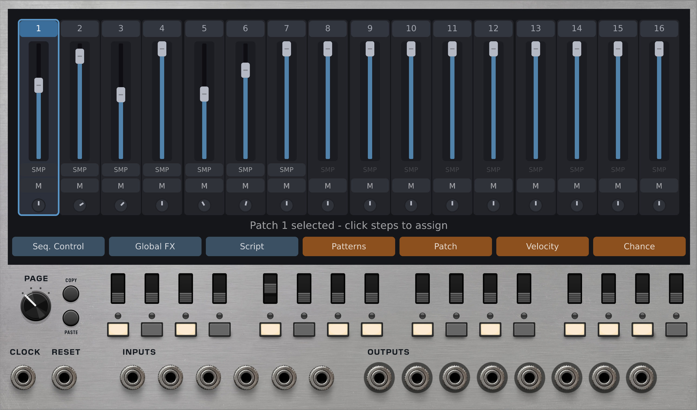

Groovebox Advanced is a self-contained beat-making environment for VCV Rack. It combines a 64-step sequencer, up to 16 tracks of modular synthesis or sample playback, a mixer, an effects chain, and a scripting system into a single module.

Each track contains its own modular patch. You build sounds by connecting internal modules (oscillators, filters, samplers, effects) together on a per-track canvas. The sequencer triggers tracks on assigned steps, and everything is mixed down to 8 audio outputs.

## Quick Start

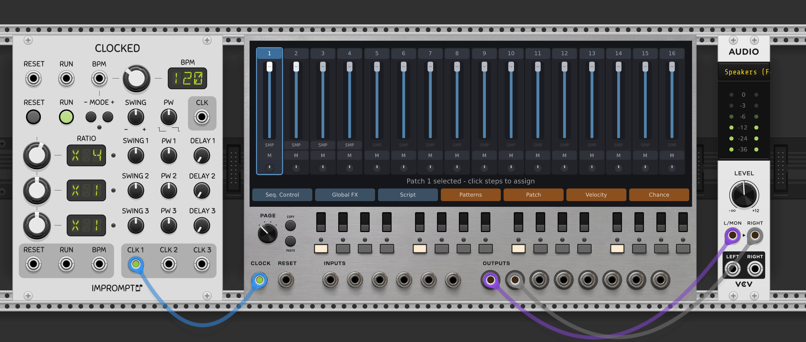

1. Add Groovebox Advanced to your VCV Rack patch
2. Connect a clock source to the **CLOCK** input
3. Connect **Output 1** and **Output 2** to your audio interface

You should hear a basic drum beat immediately. Groovebox Advanced ships with a default beat (kick, snare, hi-hat, clap) that plays as soon as a clock is connected.

## Video Tutorial

Most of this documentation is also covered in this video tutoral:

https://youtu.be/YoOhoPZzr5o


# Chapter 1: Basic Operation

## Tracks View Overview

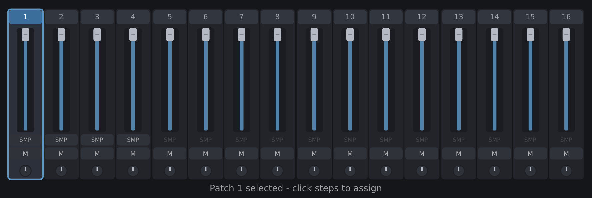

The Tracks view is the default view. It looks like a mixer console with one vertical channel strip per track (up to 16 tracks).

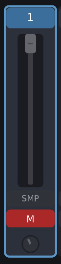

Each channel strip shows:
- Track number at the top
- A sample browser button (for loading samples into TrigSample modules)
- Volume fader
- Pan knob
- Mute button

Click on a track's header area to select it. The selected track is highlighted, and its step assignments appear on the 16 step buttons below the display.

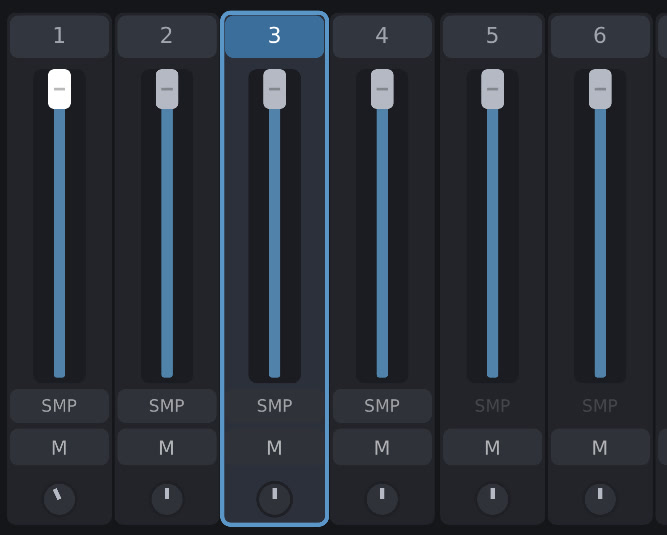

Double-click a track header to open that track's patch for editing (see Chapter 2).

### Sample Selection

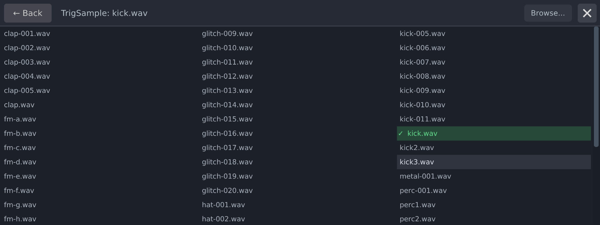

Each track's channel strip has a small sample browser button. Click it to open a file browser where you can load a .wav file into the track's TrigSample module.

This is a convenience shortcut. It works the same as opening the track's patch, selecting the TrigSample module, and changing the sample file from the parameter panel.  

You can also drag-and-drop an audio file from your computer on to a track to automatically load it (assuming that you have a sample playing module in the track).  The drag-and-drop operation only allows for one sample to be dropped on one track at a time.  You cannot drop multiple samples on to the module.

### Included Samples Library

Groovebox Advanced ships with a library of drum samples ready to use. The default beat (kick, snare, hi-hat, clap) uses samples from this library, and it includes additional variations and sounds:

- Kicks, snares, hi-hats, and claps (multiple variations of each)
- FM synthesis hits
- Glitch and percussion sounds
- Metal and pluck textures

To find the samples folder on your system, right-click the module and select **Copy Samples Folder Path**. This copies the full path to the clipboard so you can paste it into your file browser or any sample loading dialog.

### Volume, Pan, and Mute

- **Volume**: Drag the fader up and down to set the track's level from 0 (silent) to 1 (unity). Volume changes are smoothly interpolated to avoid clicks.
- **Pan**: Drag the pan knob to set the stereo position. Center sends equal signal to outputs 1 and 2. Turning left sends more signal to output 1. Turning right sends more to output 2.
- **Mute**: Click the mute button to mute or unmute the track. Muted tracks fade to silence smoothly rather than cutting abruptly.

## Sequencing

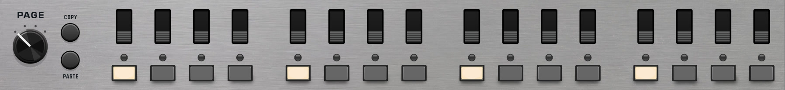

### Trigger Buttons

Below the display, you'll see 16 step buttons. If you've used a drum machine before, this will feel familiar. Select a track, then click the step buttons to choose which steps that track plays on. A lit button means the track will trigger on that step.

Each track has its own independent step pattern. So you might set up the kick on steps 1, 5, 9, and 13, the hi-hat on every step, and the snare on 5 and 13. During playback, the sequencer advances through the steps and triggers whichever tracks are active on each one.

### Ratcheting Switches

Above the step buttons, you've got sixteen, three position switches. These control ratcheting for each step.

- Down position is normal playback, one trigger per step. 

- Center is two triggers per step, evenly spaced within the step's time window. 

- In the up position, you get four triggers per step. The key thing is that ratcheting subdivides the clock period, so the extra triggers fit within the same amount of time as one normal trigger. It doesn't slow anything down.


### Page Selector

The sequencer has 64 steps, displayed 16 at a time across 4 pages (pages 0 through 3). Use the **Page** knob on the panel to switch between pages.

- Page 0: Steps 1-16
- Page 1: Steps 17-32
- Page 2: Steps 33-48
- Page 3: Steps 49-64

The **Copy Page** and **Paste Page** buttons let you copy one page's step assignments to another:

1. Navigate to the page you want to copy
2. Press **Copy Page**
3. Navigate to the destination page
4. Press **Paste Page**

This copies all step assignments, ratchet values, and chance values for that page.

## Track Menus

Below the mixer strips, a row of tiles gives access to additional views for the selected track.

### Patterns

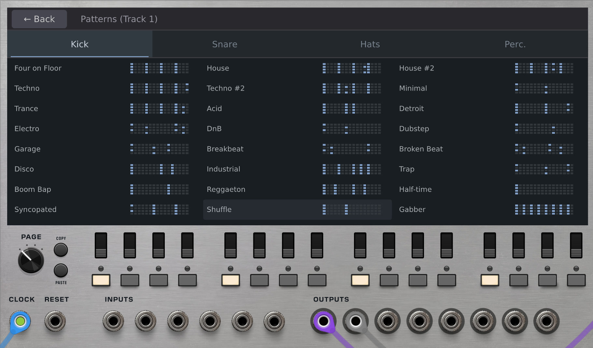

Click the **Patterns** tile to open the drum pattern library.

The pattern library contains pre-made 64-step patterns organized into categories (Kicks, Snares, Hi-Hats, and Percussion). Each category appears as a tab along the top of the view. Patterns are displayed in a 3-column grid, and each cell shows a small preview of the step pattern.

#### Applying patterns to tracks

1. Select a track in the Tracks view first
2. Open the Patterns view
3. Click a pattern to assign it to the selected track

The pattern replaces the track's current step assignments across all 64 steps.

#### Customizing the pattern library

The patterns are loaded from a JSON file at `res/modules/groovebox_advanced/drum_patterns.json`. You can edit this file to add your own patterns or modify existing ones. Each pattern is an array of 64 boolean values (1 = trigger, 0 = rest).

### Patch

Click the **Patch** tile to view which steps the selected track is assigned to. This is the same information shown by the step buttons, but presented visually in the display area.

### Velocity

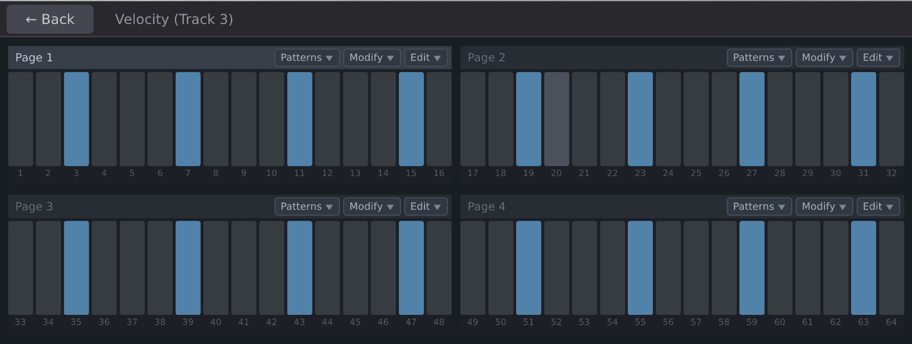

Click the **Velocity** tile to open the velocity editor.

- The display shows a 2x2 grid, one quadrant per page (pages 0 through 3)
- Each quadrant has 16 vertical bars representing velocity for each step
- Click and drag bars to set velocity (taller = louder)
- Each track has its own independent velocity values, so you can shape the dynamics of each sound separately

Each quadrant has a small toolbar:

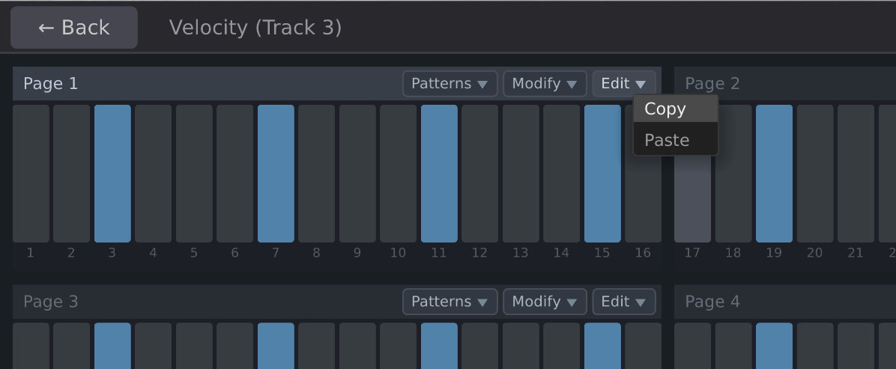

- **Edit**: Enable click-to-paint mode for that quadrant

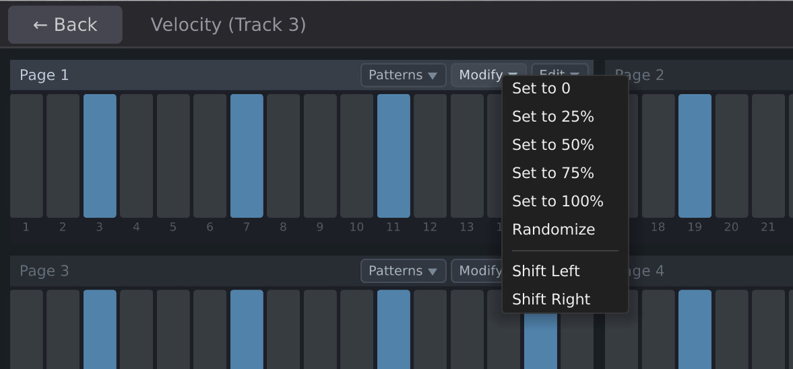

- **Modify**: Apply batch operations

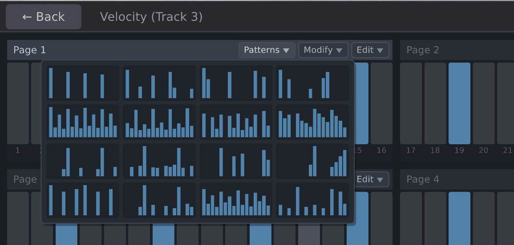

- **Patterns**: Choose from preset velocity patterns (Four on Floor, Boom Bap, Trap 808, Disco, and others)

### Chance

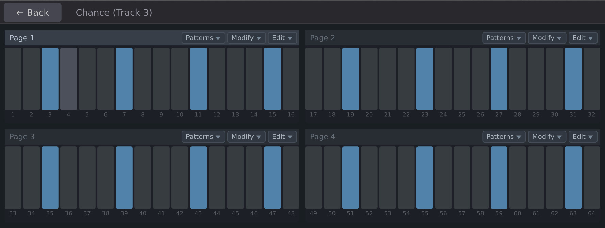

Click the **Chance** tile to open the chance editor.

- Same 2x2 layout as velocity
- Each bar represents the probability that the step will trigger (1.0 = always, 0.5 = half the time, 0.0 = never)
- Click and drag to paint probability values

Preset patterns include Alternating, Syncopated Gates, Phrase Drift, and Swing patterns. These provide a quick way to add controlled randomness to a beat.

## Clock and Reset

**CLOCK** and **RESET** are at the bottom left of the module.

- **CLOCK**: Patch an external clock here to drive the sequencer. Every rising edge advances the sequencer by one step.
- **RESET**: Resets the sequencer to step 1 on a rising edge.

Groovebox Advanced does not have an internal clock. You need to connect an external clock source.

## Inputs

- **CV 1** through **CV 6**: Six general-purpose CV inputs. These are available inside every track's patch via the **Input** module. Use them to bring external modulation, pitch, or control signals into your patches.

## Outputs

- **Output 1** through **Output 8**: Eight audio outputs. The Output module inside each track's patch determines which outputs receive audio. By default, tracks are routed to outputs 1 and 2 (stereo pair).


# Chapter 2: Patches

Each track in Groovebox Advanced contains its own modular patch. Patches are where you build sounds by connecting internal modules together. This is similar to building a VCV Rack patch, but everything lives inside the Groovebox.

## Patch Editor Interface

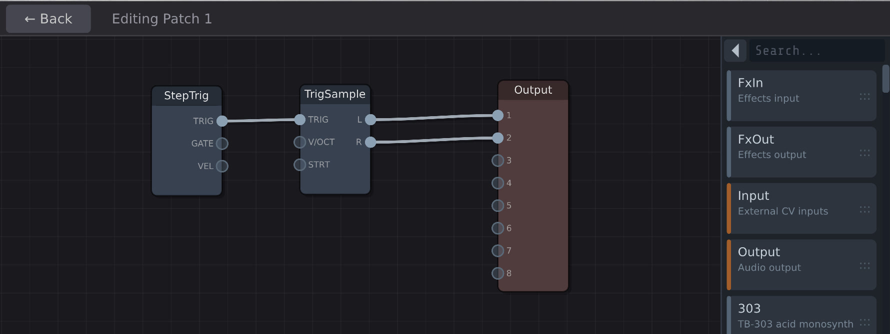

Double-click a track header in the Tracks view to open that track's patch for editing.

The Edit view has two areas:
- **Left side**: The patch canvas, where modules and cables live
- **Right side**: The module browser (for adding new modules) or the parameter panel (for tweaking a selected module)

### Panning and Zooming

- **Click and drag** on an empty area of the canvas to pan around
- **Control + Scroll wheel** to zoom in and out

### Browsing Modules

The module browser appears on the right side of the Edit view. It has two display modes:

- **Sidebar mode** (default): A vertical list showing module name, description, and a drag handle. Drag a module from the list onto the canvas to add it.
- **Expanded mode**: Click the toggle arrow at the top-left of the browser to expand it into a full-pane view organized by category. Click a module name to add it to the canvas and collapse back to the sidebar.

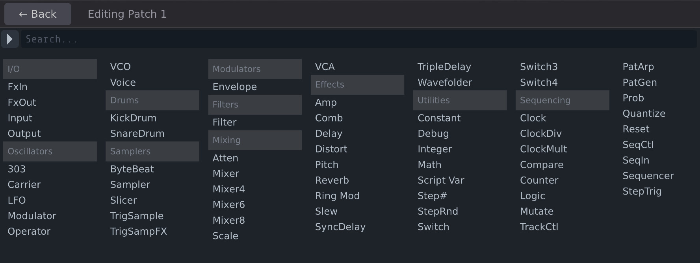

You can type in the search box at the top of the browser to filter modules by name or description.

### Adding and Removing Modules

- **Adding**: Drag from the sidebar browser onto the canvas, or click in the expanded browser view
- **Removing**: Select a module on the canvas and press **Delete** or **Backspace**
- The Output module cannot be deleted (every patch needs one)

### Connecting Modules

- Click and drag from an output port (right side of a module) to an input port (left side of another module) to create a cable
- To disconnect a cable, click on the destination port and drag the cable away
- Cables are color-coded by signal type

### Modules and Parameter Editing

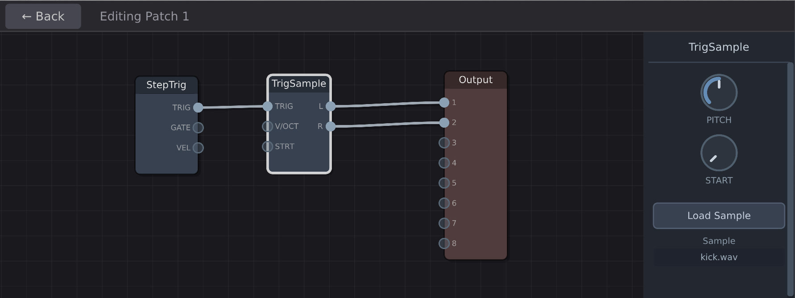

- Click a module on the canvas to select it
- When a module is selected, its parameters appear in the panel on the right side (replacing the module browser)
- Parameters include things like frequency, resonance, waveform selection, attack/decay times, and so on, depending on the module

### Returning to the Tracks View

Press the **Back** button at the top of the display to return to the Tracks view. You can also double-click on an empty area of the canvas.

## Example Patches

### Basic Sample Playback

The default track template:
- **StepTrig** connected to **TrigSample** connected to **Output**

StepTrig fires a trigger pulse when the sequencer reaches any step assigned to this track. TrigSample plays a sample when it receives a trigger. Output sends the audio to the module's outputs.

### Synthesized Kick Drum

- **StepTrig** connected to **KickDrum** connected to **Output**

Replace the TrigSample with a KickDrum module for a synthesized kick. Adjust the KickDrum's pitch, decay, and click parameters to shape the sound.

### Filtered Synth Hit

- **StepTrig** connected to both **Envelope** and **VCO**
- **VCO** output connected to **Filter** input
- **Envelope** output connected to **Filter** cutoff modulation input and **VCA** control input
- **Filter** output connected to **VCA** audio input
- **VCA** output connected to **Output**

This gives you a classic subtractive synth voice. The envelope controls both the filter sweep and the amplitude. Adjust VCO waveform, filter cutoff, and resonance to shape the timbre.

### FM Synthesis

- **StepTrig** connected to **Envelope**
- **Modulator** output connected to **Carrier** modulation input
- **Envelope** output connected to **Carrier** level or **VCA** control input
- **Carrier** output connected to **Output**

Adjust the Modulator's frequency ratio and depth to create metallic, bell-like, or percussive tones.


# Chapter 3: Global Controls

In addition to the per-track patches, Groovebox Advanced has two global patches and a scripting system. These operate at a higher level than individual tracks.

## Sequencer Control

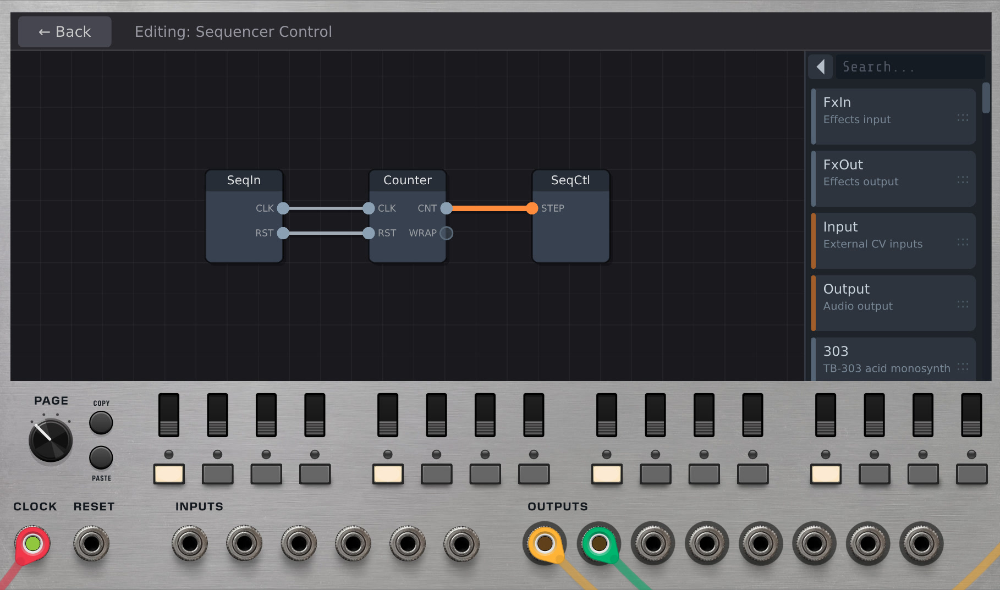

Click the **Seq. Control** button at the top of the display to open the Sequencer Control patch.

This patch runs before everything else each audio cycle. It can control:

- **Step position**: Wire a Counter through SeqCtl to override the sequencer's step position with CV
- **Pattern mutation**: Add a Mutate module to algorithmically alter step patterns during playback
### Default template

The Sequencer Control patch comes pre-loaded with a chain of three modules:

- **SeqIn**: Passes the external clock and reset signals into the patch
- **Counter**: Counts clock pulses and outputs the current count as a voltage
- **SeqCtl**: Receives the count and uses it to set the sequencer's step position

This chain means the Sequencer Control patch drives the step position from the moment you first visit it. The Counter is automatically synchronized to the sequencer's current position, so there is no interruption to playback.

### A common task might be to change the sequencer's lenght.  Here's a short visual tutorial:

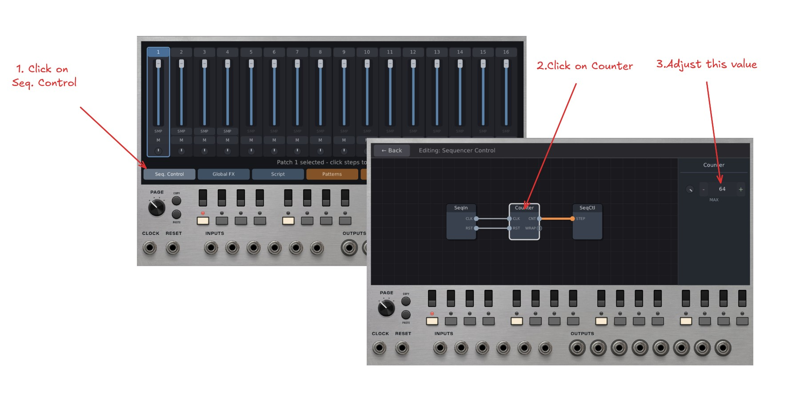

You can remove SeqCtl if you do not want CV-driven step control, or add additional modules like Mutate alongside the existing chain.

## Global Effects

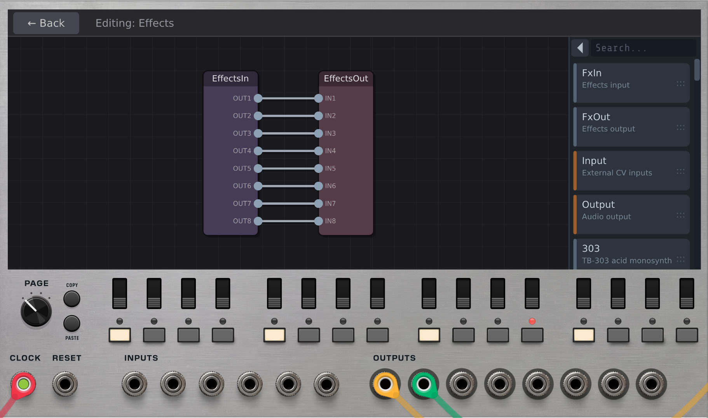

Click the **FX** button at the top of the display to open the Effects patch.

This patch receives the mixed audio from all tracks and processes it before the final output. The default template provides:

- **EffectsIn**: Receives the 8-channel mix from all tracks
- **EffectsOut**: Sends processed audio to the module's outputs

Add any effect modules (Reverb, Delay, Distort, and so on) between EffectsIn and EffectsOut to process the final mix.

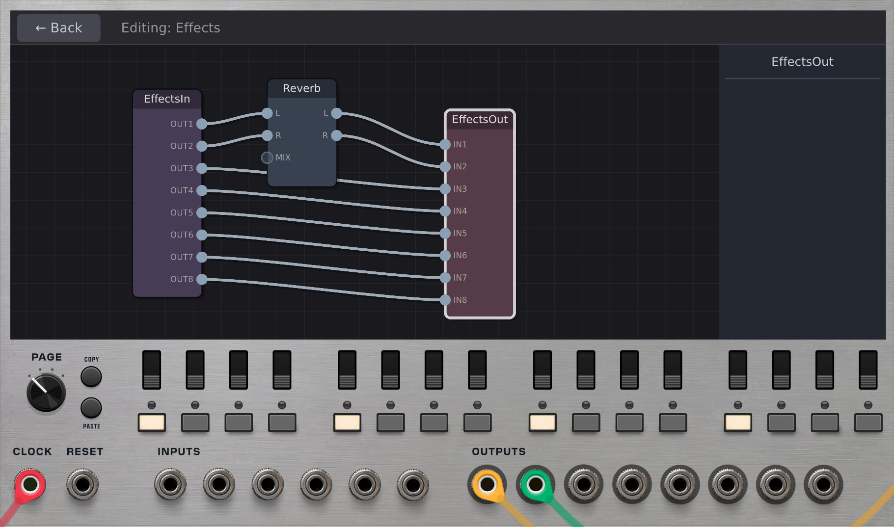

If the Effects patch is empty or has no EffectsIn/EffectsOut connected, audio passes through unprocessed.

### Per-track vs. global effects

- **Per-track effects**: Add effect modules inside an individual track's patch. The effect only processes that track's audio.
- **Global effects**: Add effect modules in the Effects patch. The effect processes the combined output of all tracks.

## Scripting

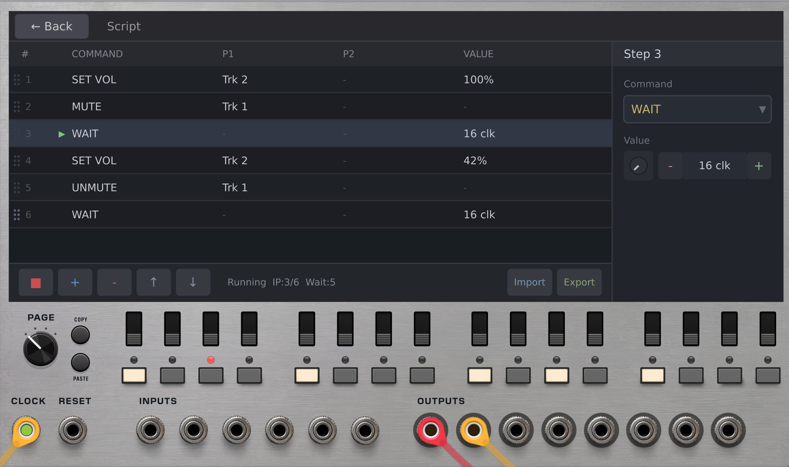

Click the **Script** tile in the Tracks view to open the script editor. Scripts let you automate changes over time, synchronized to the clock.

### How scripts work

A script is a list of instructions that execute sequentially, one at a time. When the script reaches a WAIT instruction, it pauses for the specified number of clock beats before continuing. When it reaches the end, it loops back to the beginning.

### Available instructions

- **WAIT** (beats): Pause for N clock beats before continuing
- **MUTE** (track): Mute a track
- **UNMUTE** (track): Unmute a track
- **SET VOL** (track, value): Set a track's volume (0.0 to 1.0)
- **SET PAN** (track, value): Set a track's pan position (0.0 to 1.0, where 0.5 is center)
- **SET STEP** (track, step, value): Set whether a track is assigned to a step (1 = on, 0 = off)
- **LOAD SCENE** (slot): Load a saved scene snapshot
- **SET VAR** (slot, value): Set a script variable (readable by ScriptVar modules inside patches)

### Using the editor

The script editor has two panes:
- **Left pane**: List of instructions in order. Click to select.
- **Right pane**: Detail panel for editing the selected instruction's parameters.

**Reordering instructions:** Drag and drop rows to reorder them. Each row has grip dots on its left edge -- click and drag to move the row. As you drag, the surrounding rows part to show the insertion point, and a ghost of the row follows your cursor. Release to drop the row into its new position. You can also use the Up/Down toolbar buttons as an alternative.

**Toolbar buttons (left side):**
- Play/Stop: Start or stop script execution
- Add: Insert a new instruction after the current one
- Delete: Remove the selected instruction
- Up/Down: Move the selected instruction up or down

**Toolbar buttons (right side):**
- Export: Save the script to a JSON file
- Import: Load a script from a JSON file

### Script variables and ScriptVar modules

The SET VAR instruction writes a float value to one of 16 variable slots (0 through 15). Inside any track's patch, you can add a ScriptVar module and set it to read a specific slot. The module outputs the current value of that variable as a voltage.

This lets your script communicate with track patches. For example, you could use SET VAR to change a filter cutoff value over time, with a ScriptVar module inside the track reading that value and feeding it to a filter.

### Example script

A script that builds a beat over time:

```
MUTE    track 1
MUTE    track 2
MUTE    track 3
WAIT    16
UNMUTE  track 0       (kick starts playing)
WAIT    16
UNMUTE  track 1       (snare joins)
WAIT    16
UNMUTE  track 2       (hi-hat joins)
WAIT    32
SET VOL track 0, 0.5  (drop kick volume)
WAIT    16
SET VOL track 0, 1.0  (bring kick back up)
```

This script mutes tracks 1-3, waits 16 beats, then brings in the kick. After another 16 beats the snare joins, then the hi-hat. After a longer 32-beat section, the kick volume drops briefly before coming back up. The script then loops.


# Chapter 4: Scene Snapshots

Snapshots capture performance state so you can recall it later.

A scene snapshot saves the state of all tracks at once:
- All track settings (volume, pan, mute)
- All step assignments across all tracks
- All per-step velocity, ratchet, and chance values
- Sequence length and playback mode

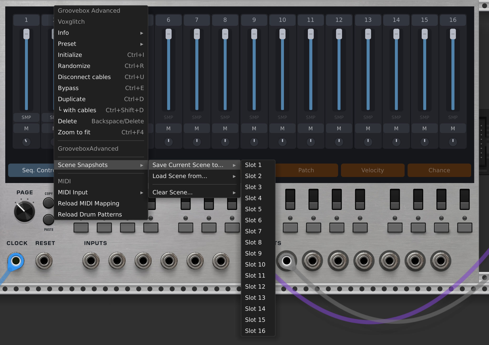

Access scene snapshots through the right-click context menu:
- **Save Current Scene to...**: Save to one of 16 slots
- **Load Scene from...**: Recall a saved scene
- **Clear Scene...**: Delete a saved scene

## Using snapshots for performance

- Set up different variations of your beat in different scene slots
- Switch between them manually with a single click via the context menu
- Use the LOAD SCENE script instruction to switch between scenes automatically as part of an arrangement


# Chapter 5: MIDI Support

Groovebox Advanced accepts MIDI input for controlling the mixer.

## Selecting Devices

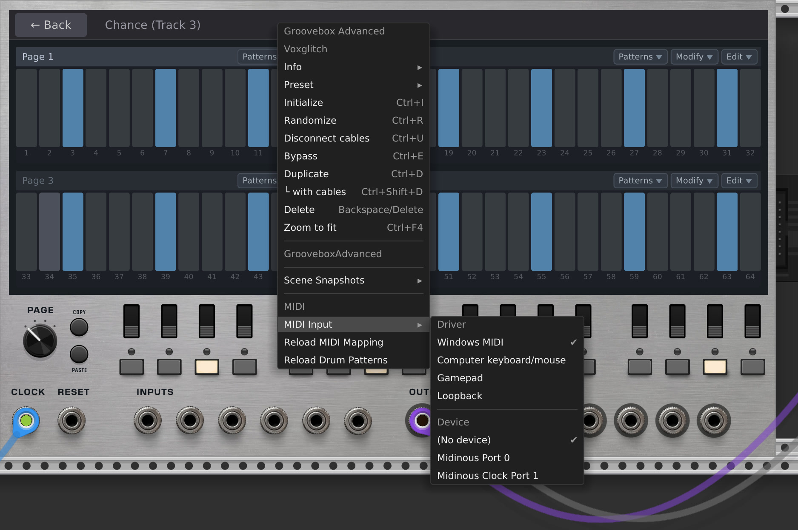

Right-click the module and select your MIDI driver and device from the **MIDI Input** submenu. You will see a list of available MIDI devices connected to your system.

## Default MIDI Mapping

The default mapping is configured for the Novation Launch Control XL (Factory Template 1) and maps to 8 tracks:

| Function | MIDI Messages | Tracks |
|----------|--------------|--------|
| Volume | CC 77 through CC 84 | Tracks 1 through 8 |
| Pan | CC 49 through CC 56 | Tracks 1 through 8 |
| Mute toggle | Notes 41-44, 57-60 | Tracks 1 through 8 |

- Volume CCs: Value 0 = silent, value 127 = unity
- Pan CCs: Value 0 = full left, value 64 = center, value 127 = full right
- Mute notes: Each note-on toggles the track's mute state

Scene snapshot loading is also supported via MIDI notes but is not mapped by default. See the Customizing MIDI Routing section below to set it up.

## Customizing MIDI Routing

The mapping is defined in `res/modules/groovebox_advanced/midi_mapping.json`. You can edit this file to change the CC and note assignments to match your MIDI controller.

The file format is:
- **trackVolumeCCs**: Maps CC numbers (as strings) to track indices (0-based)
- **trackPanCCs**: Maps CC numbers to track indices
- **trackMuteNotes**: Maps MIDI note numbers to track indices
- **sceneSnapshotNotes**: Maps MIDI note numbers to scene snapshot slot indices (0-based, up to 16 slots)

After editing the file, right-click the module and select **Reload MIDI Mapping** to apply changes without restarting VCV Rack.


# Chapter 6: Module Reference

This chapter lists all internal modules available in the patch editor, organized by category. Click a module name for detailed documentation including ports, parameters, and DSP behavior.

## I/O

| Module | Description |
|--------|-------------|
| [**Input**](#gainput) | Brings external CV from the module's 6 CV inputs into the patch. Each output corresponds to one of the CV 1-6 jacks on the panel. |
| [**Output**](#gaoutput) | Sends audio from the patch to the module's audio outputs. Every patch needs one. You can select which output pair to use. |
| [**FxIn**](#gaeffectsin) | Receives the mixed audio from all tracks. Used only in the Effects global patch. |
| [**FxOut**](#gaeffectsout) | Sends processed audio back to the outputs. Used only in the Effects global patch. |


\newpage

### GAInput

A bridge module that brings external signals from the VCV Rack host into the GrooveboxAdvanced internal patch environment. It maps the six CV input jacks on the main GrooveboxAdvanced panel to six output ports inside a patch, enabling external CV, audio, gates, and polyphonic signals to interact with the internal patch modules.

#### Inputs

None. The GAInput module has no internal input ports. Instead, it receives its signals directly from the six CV input jacks (CV 1 through CV 6) on the main GrooveboxAdvanced host module panel. These are injected by the DSP engine before each processing cycle.

#### Outputs

| Port | Label | Type | Description |
|------|-------|------|-------------|
| 0 | 1 | Control (CV) | Outputs the signal from host CV Input 1. Polyphonic, carrying up to 16 channels. The internal normalized value is scaled by 5.0, restoring the original VCV Rack voltage range. |
| 1 | 2 | Control (CV) | Outputs the signal from host CV Input 2. Polyphonic, carrying up to 16 channels. |
| 2 | 3 | Control (CV) | Outputs the signal from host CV Input 3. Polyphonic, carrying up to 16 channels. |
| 3 | 4 | Control (CV) | Outputs the signal from host CV Input 4. Polyphonic, carrying up to 16 channels. |
| 4 | 5 | Control (CV) | Outputs the signal from host CV Input 5. Polyphonic, carrying up to 16 channels. |
| 5 | 6 | Control (CV) | Outputs the signal from host CV Input 6. Polyphonic, carrying up to 16 channels. |

#### Parameters

None. The GAInput module has no user-configurable parameters. It acts as a pure pass-through from host to patch.

#### Details

##### Signal Flow

The GAInput module forms the first stage of external signal ingestion for each patch. The complete signal path is:

1. **Host Input Reading**: The main GrooveboxAdvanced module reads polyphonic voltages from its six CV input jacks (CV 1 through CV 6). Each jack supports up to 16 polyphonic channels.

2. **Normalization**: The host divides each channel's voltage by 5.0, converting from VCV Rack's standard +/-5V bipolar range to an internal normalized +/-1.0 range. This normalization is performed in GrooveboxAdvanced.hpp before the values are passed into the patch engine.

3. **Distribution**: The GAProcessor finds all GAInput DSP modules in the patch and copies the six normalized PolySignal values into each module's `externalInputs[]` array. If a patch contains multiple GAInput modules, they all receive the same input data.

4. **Output Scaling**: During `process()`, the GAInputDSP module iterates over all six output ports. For each port, it copies the channel count and per-channel values from the corresponding `externalInputs` entry, multiplying each channel value by 5.0 to restore the original VCV Rack voltage scale. This means a +5V signal patched into the host jack will appear as +5V at the GAInput output port inside the patch.

##### Polyphonic Behavior

All six output ports are poly-capable. The channel count on each output matches the channel count of the corresponding host CV input jack. If a mono cable is patched into host CV Input 1, output port 1 will carry 1 channel. If a 4-channel polyphonic cable is patched in, the output will carry 4 channels. When a host input jack has no cable connected, the output defaults to a single channel at 0V.

##### Stateless Design

The module has no internal state beyond the `externalInputs[]` array, which is overwritten every sample by the processor. The `reset()` method clears all external input signals to zero. There are no parameters to sync between the UI and DSP layers -- `syncToDSP` and `syncFromDSP` are both no-ops because the input data is injected directly by GAProcessor rather than coming from UI controls.

#### Tips

- Use GAInput to bring external LFOs, envelopes, sequencers, or any other CV source from VCV Rack into your GrooveboxAdvanced patches. This lets you modulate internal parameters like filter cutoff, oscillator pitch, or mixer levels from outside the groovebox.
- Patch a polyphonic V/Oct signal into one of the host CV inputs and connect the corresponding GAInput output to a VCO or Voice module's pitch input to play the internal synthesizer polyphonically from an external keyboard or sequencer.
- Use one input for a gate/trigger signal and another for pitch CV to drive internal envelope and oscillator modules, effectively turning a GrooveboxAdvanced patch into a playable voice controlled from the VCV Rack patch environment.
- Since every GAInput module in a patch receives the same six signals, you can place multiple GAInput modules at different locations in your patch canvas for convenient wiring without signal loss or duplication concerns.
- Pair with a GAAtten or GAScale module after the GAInput output to adjust the incoming signal's range to match what the destination module expects.
- The six inputs are general-purpose. You can mix uses freely: for example, use inputs 1-2 for pitch and gate, input 3 for an external clock, and inputs 4-6 for modulation CV sources.


\newpage

### GAOutput

The final audio output destination for a GrooveboxAdvanced patch. GAOutput accepts up to eight audio signals on numbered input ports and applies a master level control before passing the results to the host processor. It has no output ports of its own -- the processor reads its internal output values directly to produce the audio that leaves the GrooveboxAdvanced module. Every patch that produces audio needs at least one GAOutput module.

#### Inputs

| Port | Label | Type | Description |
|------|-------|------|-------------|
| 0 | 1 | Audio | Audio input for channel 1. The signal is multiplied by the LEVEL knob and then stored as the channel 1 output for the host processor to read. |
| 1 | 2 | Audio | Audio input for channel 2. Processed identically to channel 1. |
| 2 | 3 | Audio | Audio input for channel 3. Processed identically to channel 1. |
| 3 | 4 | Audio | Audio input for channel 4. Processed identically to channel 1. |
| 4 | 5 | Audio | Audio input for channel 5. Processed identically to channel 1. |
| 5 | 6 | Audio | Audio input for channel 6. Processed identically to channel 1. |
| 6 | 7 | Audio | Audio input for channel 7. Processed identically to channel 1. |
| 7 | 8 | Audio | Audio input for channel 8. Processed identically to channel 1. |

#### Outputs

None. GAOutput is the terminal node in a patch's signal chain. The host processor reads its internal output values directly rather than through explicit output ports.

#### Parameters

| Parameter | Type | Range | Default | Description |
|-----------|------|-------|---------|-------------|
| LEVEL | Knob | 0.0 - 1.0 | 1.0 | Master output level applied to all eight channels. At 0.0 all channels are silent; at 1.0 signals pass through at unity gain. This single control scales every input channel uniformly before the processor reads the final values. |

#### Details

##### Signal Flow

1. **Input Reading**: On each sample, the module reads all eight input ports. Unconnected ports return 0V.

2. **Level Scaling**: Each input value is multiplied by the LEVEL parameter. Because the knob range is 0.0 to 1.0, this control can only attenuate -- it cannot boost a signal beyond its original amplitude. The same LEVEL value is applied to all eight channels uniformly.

3. **NaN/Inf Sanitization**: After the multiplication, each output value is checked for NaN and infinity. Any invalid floating-point value is replaced with 0.0, preventing corrupted signals from propagating to the host processor and causing downstream artifacts.

4. **Output Storage**: The processed values are stored in the module's internal output bank. The host processor reads these stored values via the `getOutputs()` method on GAProcessor after all modules in the patch have been processed.

##### How the Processor Reads Output

The GAProcessor maintains a typed cache of all GAOutputDSP instances in the patch. When computing the final audio output, it iterates over every GAOutput module and sums their stored values channel by channel. This means multiple GAOutput modules in a single patch will have their values added together, allowing modular routing strategies where different signal paths terminate at separate output modules.

If a patch contains no GAOutput modules (and no GAEffectsOut modules), the processor falls back to summing Carrier module outputs on channel 0 as a legacy compatibility behavior.

##### Soft Clipping and Limiting (Currently Disabled)

The DSP class contains commented-out code for two stages of output protection:

- **Soft clipping**: A fast tanh approximation that would normalize the signal to a unit range, apply tanh saturation, and scale back to +/-5V. This would provide smooth, musically useful saturation rather than hard digital clipping.
- **Hard clamping**: A simple voltage clamp to the +/-5V VCV Rack audio standard.

Both are currently disabled for signal analysis purposes. As a result, the output values are passed through without any amplitude limiting, and summing multiple hot signals can produce voltages exceeding +/-5V.

##### Stateless Operation

GAOutput performs no sample-to-sample state tracking. Each output sample is computed purely from the current input samples and the current LEVEL knob value. The `reset()` method is intentionally empty because there is no internal state to clear.

#### Tips

- Place a GAOutput module at the end of every patch that should produce audio. Without one, the patch will either be silent or fall back to the legacy Carrier-summing behavior, which only outputs on channel 0.
- Use the eight numbered inputs to map different signal sources to different physical output channels on the GrooveboxAdvanced module. For example, connect a kick drum to input 1 and a snare to input 2 to get independent outputs that can be mixed and processed separately outside the groovebox.
- When building a stereo patch, use inputs 1 and 2 as left and right channels. Route the left mix to input 1 and the right mix to input 2, then use the corresponding outputs on the GrooveboxAdvanced host module.
- The LEVEL knob acts as a master fader for the entire patch. Reduce it to lower the overall volume without adjusting individual mixer or VCA levels upstream. This is useful for balancing the volume of one sequencer step against another.
- If a patch uses multiple GAOutput modules, their per-channel values are summed by the processor. This can be used intentionally -- for instance, one GAOutput handles dry signals while another handles effect returns -- but be aware that the summed amplitude can exceed +/-5V with no built-in limiting.
- Because output protection is currently disabled, loud patches may clip downstream modules or the audio output. Use a GAMixer or GAVCA upstream to manage levels, or insert a GAAmp module with saturation before the GAOutput to provide soft clipping within the patch.
- Unconnected inputs return 0V and contribute nothing to the output. There is no need to cable every input -- use only the channels you need.


\newpage

### GAEffectsIn

An audio source module that provides the entry point for audio into the global Effects patch. It receives the mixed audio output from all active step patches (up to 8 channels) and makes it available as output ports within the Effects patch for further processing, routing, or mixing before final output.

#### Inputs

*None.*

#### Outputs

| Port | Label | Type | Description |
|------|-------|------|-------------|
| 0 | OUT1 | Audio | Mixed audio channel 1 from all active step patches, scaled to +/-5V. |
| 1 | OUT2 | Audio | Mixed audio channel 2 from all active step patches, scaled to +/-5V. |
| 2 | OUT3 | Audio | Mixed audio channel 3 from all active step patches, scaled to +/-5V. |
| 3 | OUT4 | Audio | Mixed audio channel 4 from all active step patches, scaled to +/-5V. |
| 4 | OUT5 | Audio | Mixed audio channel 5 from all active step patches, scaled to +/-5V. |
| 5 | OUT6 | Audio | Mixed audio channel 6 from all active step patches, scaled to +/-5V. |
| 6 | OUT7 | Audio | Mixed audio channel 7 from all active step patches, scaled to +/-5V. |
| 7 | OUT8 | Audio | Mixed audio channel 8 from all active step patches, scaled to +/-5V. |

#### Parameters

*None.*

#### Details

##### Signal Flow

1. **Source**: The GrooveboxAdvanced main process loop sums the audio outputs from all active step patches (or patch library slots) into an 8-channel mix. Each step patch can produce up to 8 channels of audio via its own GAOutput module.

2. **Normalization**: Before being passed to the GAEffectsIn module, the mixed audio (which is at +/-5V scale from the step patches) is normalized to a +/-1 range by dividing by 5.0.

3. **Injection**: The normalized audio is written into the GAEffectsInDSP module's internal `mixedAudio[8]` array by the voice processor before the Effects patch is processed.

4. **Scaling**: During `process()`, each channel is scaled back up to the +/-5V internal patch signal range by multiplying by 5.0. This restores the audio to the standard signal level used by all other modules within the patch.

5. **Output**: The scaled audio is set on the 8 output ports, making it available for connection to other modules within the Effects patch via internal cables.

##### Role in the Effects Patch

The GAEffectsIn module is exclusively used within the global Effects patch. It acts as the bridge between the per-step sound generation pipeline and the global post-processing stage. The typical signal chain is:

- Step patches generate audio via their own modules and route it to GAOutput modules.
- All step outputs are summed together.
- The summed audio enters the Effects patch through GAEffectsIn.
- Within the Effects patch, the audio can be processed by any modules (filters, delays, distortion, mixing, etc.).
- The processed audio exits the Effects patch through a GAEffectsOut module.
- The final output is soft-limited via `tanh` and sent to the GrooveboxAdvanced hardware output ports.

If the Effects patch contains no modules, the mixed step audio bypasses this stage entirely and goes directly to the hardware outputs.

##### Multi-Channel Architecture

The 8 output channels correspond to the 8 hardware output ports of the GrooveboxAdvanced module. Each step patch can route its audio to any combination of these 8 channels via its own GAOutput module. The GAEffectsIn module preserves this channel separation, allowing the Effects patch to process channels independently or mix them together as needed.

##### No Parameters or Sync

The GAEffectsIn module has no user-adjustable parameters. Its `syncToDSP` and `syncFromDSP` methods are no-ops because the audio data is injected directly by the voice processor rather than being synced from UI state.

#### Tips

- The GAEffectsIn module is the starting point for building a global effects chain. Connect its outputs to effect modules (such as GADelay, GAFilter, GADistortion, or GAComb) and then route the processed signal into a GAEffectsOut module to complete the chain.
- Use the 8 separate output channels to apply different effects to different groups of instruments. For example, route drums (channels 1-2) through a compressor while routing synth pads (channels 3-4) through a reverb or delay.
- For a simple pass-through configuration, connect each GAEffectsIn output directly to the corresponding GAEffectsOut input. This preserves the unprocessed step audio at the final outputs.
- To create a master effects bus, use a GAMixer to combine selected GAEffectsIn channels, process the mix through shared effects, and then route the result to the desired GAEffectsOut channels.
- Remember that audio arriving at this module is already the sum of all active step patches. If individual steps are playing simultaneously, their signals are mixed before reaching GAEffectsIn. Use per-step output channel routing to keep sounds separated if you need independent effects processing.
- If the Effects patch is left empty (no modules), the mixed step audio passes directly to the hardware outputs without any processing. Add a GAEffectsIn and GAEffectsOut pair as a minimum to enable the effects processing path.


\newpage

### GAEffectsOut

The final destination module for the Effects global patch. GAEffectsOut collects processed audio from the effects chain and delivers it back to the GrooveboxAdvanced voice system, which then routes it to the hardware output jacks. It is the counterpart to GAEffectsIn: where GAEffectsIn injects the mixed step audio into the effects patch, GAEffectsOut captures the result after any effects processing modules in between.

#### Inputs

| Port | Label | Type | Description |
|------|-------|------|-------------|
| 0 | IN1 | Audio | Processed audio channel 1. Receives audio at the internal +/-5V scale and normalizes it to +/-1 for the voice output stage. |
| 1 | IN2 | Audio | Processed audio channel 2. Same behavior as IN1. |
| 2 | IN3 | Audio | Processed audio channel 3. Same behavior as IN1. |
| 3 | IN4 | Audio | Processed audio channel 4. Same behavior as IN1. |
| 4 | IN5 | Audio | Processed audio channel 5. Same behavior as IN1. |
| 5 | IN6 | Audio | Processed audio channel 6. Same behavior as IN1. |
| 6 | IN7 | Audio | Processed audio channel 7. Same behavior as IN1. |
| 7 | IN8 | Audio | Processed audio channel 8. Same behavior as IN1. |

#### Outputs

*None.*

#### Parameters

*None.*

#### Details

##### Signal Flow

GAEffectsOut sits at the end of the Effects global patch signal chain. The full signal path is:

1. **Step patches produce audio**: Each active step's patch generates audio through its own modules (carriers, modulators, filters, etc.), summed through GAOutput modules into 8 channels.
2. **Mixed audio enters the Effects patch**: The GrooveboxAdvanced main processor normalizes the mixed step audio from +/-5V to +/-1 and feeds it into GAEffectsIn modules, which scale it back to +/-5V for internal patch processing.
3. **Effects processing**: Between GAEffectsIn and GAEffectsOut, the user can place any combination of effects modules (delay, comb filter, filters, etc.) to process the audio.
4. **GAEffectsOut collects the result**: Each input port reads its signal at the internal +/-5V scale and divides by 5.0 to normalize back to +/-1.
5. **Voice output stage**: The GAProcessor's `getOutputs()` method reads the `processedAudio` array from each GAEffectsOut module, scales it back to +/-5V, and sums it into the final output bus. The result then passes through a `tanh` soft limiter before reaching the hardware output jacks.

##### DSP Processing

The `process()` method is minimal:

```
processedAudio[i] = getInput(EFFECTSOUT_INx) / 5.0f
```

Each of the 8 input ports is read and divided by 5.0 to convert from the internal +/-5V audio scale to a normalized +/-1 range. This normalized audio is stored in the `processedAudio` array, which the voice processor reads after the effects patch has been fully processed.

##### Output Summation

If multiple GAEffectsOut modules exist in the same Effects patch, their `processedAudio` arrays are summed together by the GAProcessor. This allows splitting the effects chain into parallel paths that recombine at the output.

##### Relationship to GAOutput

GAEffectsOut serves a similar role to GAOutput but specifically for the Effects global patch. GAOutput is used in step patches (library patches) to route audio out of individual steps. GAEffectsOut is used in the Effects global patch to route audio out of the effects chain. Both contribute to the final output bus via the GAProcessor's `getOutputs()` method.

##### No Parameters or Outputs

GAEffectsOut has no user-configurable parameters and no output ports. It is strictly an audio sink -- the terminal node of the Effects patch. The `syncToDSP()` method is a no-op since there is nothing to synchronize.

#### Tips

- Place a single GAEffectsOut at the end of your effects chain and cable the processed audio from your last effects module into its IN ports. At minimum, connect IN1 and IN2 for stereo output.
- For parallel effects processing, use multiple signal paths from GAEffectsIn to a single GAEffectsOut. For example, split the dry signal and a delayed signal into separate processing chains, then connect both to the same GAEffectsOut inputs via a mixer.
- If you need parallel effects that should be summed independently, you can use multiple GAEffectsOut modules. Their outputs are summed automatically by the voice processor.
- The channels map directly to GrooveboxAdvanced's 8 hardware output jacks. IN1 corresponds to OUTPUT 1, IN2 to OUTPUT 2, and so on. Use this to maintain multi-channel routing through the effects stage.
- If the Effects global patch is empty (no modules at all), the effects stage is bypassed entirely and the mixed step audio goes directly to the hardware outputs. You only need GAEffectsIn and GAEffectsOut when you want to process the mixed audio before it reaches the outputs.
- Keep in mind that the final output passes through a tanh soft limiter after the effects stage. If your effects chain adds significant gain, the limiter will provide smooth saturation rather than harsh clipping.

## Oscillators

| Module | Description |
|--------|-------------|
| [**VCO**](#gavco) | General-purpose voltage-controlled oscillator with multiple waveforms and 1V/oct pitch tracking. |
| [**LFO**](#galfo) | Low-frequency oscillator for modulation. Outputs a slow-moving signal for controlling other parameters. |
| [**303**](#ga303) | TB-303 style monosynth with built-in acid filter, accent, and glide behavior. |
| [**Carrier**](#gacarrier) | FM synthesis carrier oscillator. Outputs audio-rate signal. |
| [**Modulator**](#gamodulator) | FM synthesis modulator oscillator. Connect its output to a Carrier's modulation input. |
| [**Operator**](#gaoperator) | Combined FM operator with detune and feedback controls. |
| [**Voice**](#gavoice) | Pre-built synth voice combining VCO, ADSR envelope, VCA, and filter in one module. |


\newpage

### GAVco

A voltage-controlled oscillator (VCO) that generates audio-rate waveforms tuned via the 1V/octave standard. It provides four classic waveform shapes, an FM modulation input for timbral variation, and a level control for output amplitude. The V/OCT input tracks pitch using an exponential frequency conversion, making it straightforward to play melodic content from sequencers or other CV sources within the GrooveboxAdvanced environment.

#### Inputs

| Port | Label | Type | Description |
|------|-------|------|-------------|
| 0 | V/O | Control (CV) | Volt-per-octave pitch input. Expects a standard 1V/oct signal clamped internally to the range -10V to +10V. At 0V the oscillator runs at its base frequency of 261.63 Hz (middle C / C4). Each +1V doubles the frequency (one octave up) and each -1V halves it (one octave down). The conversion uses a fast Taylor-series approximation of 2^v for efficiency. |
| 1 | FM | Control (CV) | Frequency modulation input. Accepts a signal clamped internally to the range -10V to +10V. The incoming value is applied as a linear FM index using the formula `frequency * (1 + fmInput)`, where `fmInput` is the raw voltage. At 0V the pitch is unaffected. Positive values increase the instantaneous frequency; negative values decrease it. At -1V the modulated frequency reaches zero, and values below -1V would invert the phase direction, though the final frequency is hard-clamped to the range 0.01 Hz to 20,000 Hz. |

#### Outputs

| Port | Label | Type | Description |
|------|-------|------|-------------|
| 2 | OUT | Audio | The oscillator's audio output, scaled to VCV Rack's audio standard of +/-5V at full level. The actual peak voltage is `5.0 * level`, where level is set by the LEVEL knob. |

#### Parameters

| Parameter | Type | Range | Default | Description |
|-----------|------|-------|---------|-------------|
| WAVE | Dropdown | Sin, Saw, Sqr, Tri | Sin | Selects the oscillator waveform shape. Sin produces a sine wave via a 1024-entry lookup table with linear interpolation. Saw produces an upward ramp from -1 to +1 (computed as `2 * phase - 1`). Sqr produces a square wave that outputs +1 for the first half of the cycle and -1 for the second half, with no anti-aliasing. Tri produces a triangle wave using a three-segment piecewise linear function that rises from 0 to +1 in the first quarter, falls from +1 to -1 over the middle half, and rises from -1 to 0 in the final quarter. |
| LEVEL | Knob | 0.0 - 1.0 | 1.0 | Output amplitude multiplier. Scales the generated waveform before the final 5V output scaling is applied. At 0.0 the output is silent. At 1.0 (default) the output swings the full +/-5V range. Intermediate values attenuate proportionally, so 0.5 produces a +/-2.5V signal. |

#### Details

##### Signal Flow

1. **Pitch Input**: The V/OCT input voltage is read and clamped to the range -10V to +10V. The base frequency of 261.63 Hz (C4) is multiplied by `2^(vOct)` using VCV Rack's `dsp::exp2_taylor5` fast approximation. This converts the standard 1V/octave signal into an absolute frequency in hertz.

2. **FM Modulation**: The FM input voltage is read and clamped to -10V to +10V. It is applied as through-zero linear FM using the formula `frequency * (1.0 + fmInput)`. This means the modulation depth is proportional to the carrier frequency -- at higher pitches, the same FM voltage produces wider deviations in hertz, maintaining a consistent timbral relationship across the keyboard. The resulting frequency is hard-clamped to the range 0.01 Hz to 20,000 Hz to prevent runaway values or negative frequencies.

3. **Phase Accumulation**: The internal phase accumulator advances by `modulatedFreq * sampleTime` each sample, where sampleTime is the reciprocal of the engine sample rate. The phase is wrapped to the [0, 1) range using a fast floor-based modulo function that includes a guard against NaN and infinity values that could arise from extreme FM modulation.

4. **Waveform Generation**: The current phase value (0 to 1, representing one full cycle) is converted to a raw output sample in the range -1 to +1 based on the selected waveform:
   - **Sine**: Uses a 1024-entry precomputed sine lookup table with linear interpolation between adjacent entries. The table covers one full cycle, and index wrapping uses a bitmask for speed.
   - **Saw**: Computed as `2.0 * phase - 1.0`, producing a rising ramp that starts at -1 when phase is 0 and reaches +1 just before phase wraps. This is a naive (non-band-limited) sawtooth.
   - **Square**: A hard comparison -- outputs +1.0 when phase is below 0.5 and -1.0 when phase is at or above 0.5. This is a naive square wave with no anti-aliasing, so some aliasing artifacts may be audible at higher frequencies.
   - **Triangle**: A three-piece linear function. Phase 0 to 0.25 ramps from 0 to +1. Phase 0.25 to 0.75 ramps from +1 down to -1. Phase 0.75 to 1.0 ramps from -1 back up to 0.

5. **Level and Output Scaling**: The raw waveform sample (-1 to +1) is multiplied by the LEVEL parameter, then multiplied by 5.0 to produce the final output in VCV Rack's standard audio voltage range. At full level, peak-to-peak swing is 10V (+/-5V).

##### CV Modulation Behavior

The V/OCT input uses standard exponential (1V/octave) pitch tracking. Equal voltage increments produce equal musical intervals. For example, a C major scale played from a sequencer outputting 0V, 0.167V, 0.333V, 0.417V, 0.583V, 0.75V, 0.917V, 1.0V will produce the expected pitch intervals.

The FM input uses linear frequency modulation. Unlike exponential FM, linear FM preserves harmonic relationships regardless of the modulation depth, making it well-suited for FM synthesis timbres. Because the modulation formula is `freq * (1 + fmInput)`, an FM signal of +1V doubles the instantaneous frequency and -1V brings it to zero. Signals beyond -1V can create through-zero FM effects, though the frequency clamp at 0.01 Hz prevents true negative frequencies.

##### Performance Notes

The module uses several optimizations for real-time DSP efficiency. The sine waveform is generated from a precomputed 1024-entry lookup table rather than calling `std::sin` on every sample. Phase wrapping uses a `floor()`-based technique that benchmarks at roughly 3-6x faster than `std::fmod`. The V/OCT conversion uses a 5th-order Taylor series approximation of `2^x` rather than the standard library `pow` function.

#### Tips

- Connect a sequencer's CV output to the V/O input to play melodic patterns. The 1V/oct tracking means standard pitch CVs from any GrooveboxAdvanced sequencer module (Sequencer, Sequencer16, PatArp) will produce correctly tuned notes.
- For FM synthesis timbres, patch another VCO's output into the FM input. Start with a sine wave on both oscillators and gradually increase the modulator's level to add harmonic complexity. Simple integer frequency ratios between carrier and modulator (2:1, 3:2, etc.) produce harmonic timbres, while non-integer ratios create inharmonic, bell-like tones.
- Use the LEVEL knob to mix the VCO down before sending it to a mixer or output. This is especially useful when layering multiple oscillators -- keep individual levels moderate to avoid clipping at the mixer stage.
- Patch an LFO into the FM input at low depth for vibrato. Because the FM input applies linear modulation, the vibrato depth in hertz will scale with pitch, which can sound more natural than fixed-depth vibrato at some settings.
- For thicker sounds, use two VCO modules with slightly different V/OCT offsets (detune) and mix their outputs. Even a fraction of a volt offset on one VCO's pitch creates a chorusing effect from the beating frequencies.
- The square and saw waveforms are naive (non-band-limited), so they will produce some aliasing at higher frequencies. For cleaner timbres in the upper register, prefer the sine waveform or follow the VCO with a low-pass filter to tame aliasing artifacts.
- Route an envelope into the FM input for percussive FM "pluck" sounds. A short, decaying envelope creates a burst of harmonic content at the note onset that quickly settles to the pure carrier tone, mimicking the attack transient of plucked or struck instruments.


\newpage

### GALFO

A low-frequency oscillator (LFO) that generates periodic control voltages for modulating other modules. It offers five waveform shapes, switchable frequency range, and bipolar or unipolar output modes. The RATE input allows external CV to exponentially scale the oscillation frequency, and the RST input resets the phase on demand for tight synchronization with rhythmic events.

#### Inputs

| Port | Label | Type | Description |
|------|-------|------|-------------|
| 0 | RATE | Control (CV) | Rate modulation CV input. Expects a signal in the standard +/-5V range. The incoming voltage is normalized to +/-1 internally and then applied as an exponential frequency multiplier: +5V multiplies the base rate by 32x, -5V divides it by 32x, and 0V leaves the rate unchanged. This gives approximately 10 octaves of CV-controlled frequency range. |
| 1 | RST | Trigger | Phase reset trigger input. A rising edge crossing the 0.5V threshold resets the LFO phase to zero, causing the waveform to restart from the beginning of its cycle. Subsequent samples below 0.5V re-arm the trigger detector. |

#### Outputs

| Port | Label | Type | Description |
|------|-------|------|-------------|
| 2 | OUT | Control (CV) | The LFO waveform output. In bipolar mode the signal swings from -5V to +5V (VCV Rack bipolar standard). In unipolar mode the signal ranges from 0V to 10V (VCV Rack unipolar standard). |

#### Parameters

| Parameter | Type | Range | Default | Description |
|-----------|------|-------|---------|-------------|
| RATE | Knob (exponential) | 0.0001 - 8.0 Hz | 0.5 Hz | Base oscillation frequency in hertz. The knob uses an exponential taper, giving fine control at low frequencies and broad sweeps at the high end. In Low range mode the effective base rate spans 0.0001 Hz to 8.0 Hz. In High range mode this base value is multiplied by 20, spanning 0.002 Hz to 160 Hz before any CV modulation is applied. |
| WAVE | Dropdown | Sin, Saw, Sqr, Tri, S&H | Sin | Selects the output waveform shape. Sin produces a smooth sine wave via a 1024-point lookup table with linear interpolation. Saw produces a downward ramp from +1 to -1. Sqr produces a square wave that outputs +1 for the first half of the cycle and -1 for the second half. Tri produces a triangle wave that ramps linearly up and then down. S&H (Sample and Hold) latches a new random value each time the phase wraps around, holding that value constant until the next cycle completes. |
| RANGE | Switch | Low / High | Low | Frequency range selector. In Low mode the LFO operates at the base RATE knob frequency (0.0001 - 8.0 Hz before CV), suitable for typical modulation duties. In High mode the base rate is multiplied by 20x, pushing the frequency range up to audio-rate territory (clamped to a maximum of 2000 Hz after CV modulation). The overall clamped ranges are: Low mode 0.0001 - 50 Hz, High mode 0.02 - 2000 Hz. |
| OUTPUT | Switch | Uni / Bi | Bi | Output polarity mode. In Bi (bipolar) mode the waveform is scaled to +/-5V, centered around 0V. In Uni (unipolar) mode the waveform is offset and scaled to 0-10V, with the bottom of the waveform at 0V and the peak at 10V. |

#### Details

##### Signal Flow

1. **Input Processing**: On each sample, the process method reads the RATE CV input and the RST trigger input. The RATE CV is divided by 5.0 to normalize a +/-5V signal into a +/-1 internal range, then clamped to that range.

2. **Reset Detection**: The RST input is checked for a rising edge by comparing the current sample against a 0.5V threshold while tracking the previous sample's value. When a rising edge is detected, the internal phase accumulator is set to zero, restarting the waveform from the beginning of its cycle.

3. **Rate Calculation**: The base rate from the RATE knob is optionally multiplied by 20 if the RANGE switch is set to High. The normalized rate CV is then converted to an exponential multiplier using the formula `2^(rateCV * 5)`, which yields a range of 1/32x to 32x. This multiplier is applied to the base rate. The final modulated rate is clamped to prevent extreme values: 0.0001 - 50 Hz in Low mode, 0.02 - 2000 Hz in High mode.

4. **Phase Accumulation**: The phase accumulator advances by `modulatedRate * sampleTime` each sample, where sampleTime is the reciprocal of the engine sample rate. The phase is wrapped to the 0-1 range using a fast floor-based modulo operation that also guards against NaN and infinity values from extreme modulation.

5. **Waveform Generation**: The current phase value (0 to 1, representing one full cycle) is converted to an output sample based on the selected waveform:
   - **Sine**: Uses a 1024-entry lookup table with linear interpolation between adjacent entries. This avoids calling `std::sin` on every sample while maintaining good accuracy.
   - **Saw**: Computed as `1.0 - phase * 2.0`, producing a downward ramp from +1 at phase 0 to -1 at phase 1.
   - **Square**: Outputs +1.0 when the phase is in the first half of the cycle (0 to 0.5) and -1.0 in the second half (0.5 to 1.0). This is a hard-edged waveform with no anti-aliasing.
   - **Triangle**: A piecewise linear waveform that rises from 0 to +1 during the first quarter, falls from +1 to -1 during the middle half, and rises from -1 to 0 during the last quarter.
   - **Sample and Hold**: Detects phase wraparound (where the current phase is less than the previous phase) and generates a new random value between -1 and +1 at each wrap. The value is held constant between wraps.

6. **Output Scaling**: The internally generated waveform ranges from -1 to +1. If the OUTPUT switch is set to Bi (bipolar), the output is multiplied by 5.0 to produce a +/-5V signal. If set to Uni (unipolar), the waveform is first shifted to the 0-1 range via `(output + 1) * 0.5`, then multiplied by 10.0 to produce a 0-10V signal.

##### CV Modulation Behavior

The rate CV applies exponential (V/Oct-style) scaling rather than linear scaling. This means that equal voltage changes produce equal pitch-ratio changes. For example, a +1V change at the RATE input always doubles the oscillation frequency regardless of the current base rate. The 5-octave-per-volt sensitivity means the full +/-5V input range covers roughly 10 octaves of frequency modulation. Because the CV is clamped to +/-1 (after normalization), signals exceeding +/-5V do not produce additional modulation.

#### Tips

- For standard vibrato, select the Sine waveform, set RANGE to Low, OUTPUT to Bi, and patch the OUT into a voice module's frequency modulation input. A rate around 4-6 Hz with subtle attenuation produces a natural vibrato effect.
- Use the Saw waveform in unipolar mode to create rising ramp envelopes that repeat at the LFO rate. This is useful for driving filter sweeps that reset periodically, producing rhythmic "wah" effects.
- Patch a clock or gate signal into the RST input to synchronize the LFO phase with your sequencer. This ensures the modulation waveform always starts from the same point relative to each beat, keeping rhythmic modulation patterns tight and predictable.
- The S&H waveform generates a new random voltage each cycle, creating stepped random modulation. Patch this into a filter cutoff or pitch input for generative, evolving textures. Increase the RATE for rapid random changes or decrease it for slow, drifting randomness.
- Switch to High range mode to push the LFO into audio-rate territory. Patching an audio-rate LFO into a voice module's frequency input produces FM synthesis effects. The Sine waveform in this mode creates the cleanest FM timbres, while Square and Saw produce harsher, more complex spectra.
- Use the RATE CV input to create an LFO whose speed is controlled by another LFO or an envelope. For example, patching an envelope into RATE produces modulation that speeds up during the attack phase and slows during release, useful for dramatic sweeps and risers.
- When using unipolar mode (0-10V) for amplitude modulation through a VCA, the signal covers the full positive range without needing an offset. When using bipolar mode (+/-5V) for pitch modulation, the oscillation is centered around zero, which keeps the average pitch unaffected.


\newpage

### GA303

A TB-303-style acid monosynth module that emulates the classic Roland bassline synthesizer. It provides a sawtooth/square oscillator through a resonant 4-pole ladder filter with envelope modulation, accent, and slide -- the core ingredients of the acid sound.

#### Inputs

| Port | Label | Type | Description |
|------|-------|------|-------------|
| 0 | TRIG | Trigger | Gate/trigger input. A rising edge above 1V triggers a new note. On non-slide notes, this resets the filter and VCA envelopes. Gate release is detected when the signal drops below 0.5V. |
| 1 | V/OCT | Control (CV) | 1 volt-per-octave pitch input. 0V corresponds to C4 (261.63 Hz). The pitch value is read at trigger time and applied immediately (or used as a slide target if slide is active). |
| 2 | CUT | Control (CV) | Filter cutoff CV modulation. A +/-5V signal shifts the cutoff frequency by +/-2 octaves relative to the knob setting. |
| 3 | ACC | Trigger | Accent trigger input. When this input is above 1V at the moment a trigger is received, the note is flagged as accented. Accented notes get a shorter filter decay, a boosted cutoff sweep, and a louder VCA level (+6dB). |
| 4 | SLIDE | Trigger | Slide enable gate. When this input is above 1V on the sample before a trigger arrives (latched behavior), the new note will glide from the previous pitch using a 60ms exponential portamento. Slide notes do not retrigger the envelopes, preserving the legato feel. |

#### Outputs

| Port | Label | Type | Description |
|------|-------|------|-------------|
| 5 | OUT | Audio | Mono audio output. The signal is clamped to +/-5V. |

#### Parameters

| Parameter | Type | Range | Default | Description |
|-----------|------|-------|---------|-------------|
| CUT | Knob | 50.0 - 2500.0 Hz | 400.0 | Base filter cutoff frequency in Hertz. This sets the resting frequency of the 4-pole lowpass ladder filter before envelope, accent, and CV modulations are applied. Uses a logarithmic taper. |
| RES | Knob | 0.0 - 1.0 | 0.5 | Filter resonance. Controls the feedback amount in the ladder filter. At 0.0 there is no resonance; at 1.0 the filter is at maximum feedback (4x internal gain). The feedback path includes soft-clipping saturation to prevent blowup. |
| DEC | Knob | 0.0 - 1.0 | 0.3 | Filter envelope decay time. Maps linearly from 200ms (at 0.0) to 2000ms (at 1.0). This controls how quickly the filter envelope closes after a trigger. Accented notes override this to a fixed fast 200ms decay. |
| ENV | Knob | 0.0 - 1.0 | 0.5 | Envelope modulation depth. Controls how much the filter envelope sweeps the cutoff frequency. The envelope is bipolar with a negative bias of approximately 0.31, so the cutoff dips slightly below the base frequency as the envelope decays -- a characteristic of the original TB-303. |
| ACC | Knob | 0.0 - 1.0 | 0.7 | Accent amount. Sets the intensity of the accent effect. Higher values increase both the additional cutoff sweep and the VCA boost applied to accented notes. |
| WAVE | Switch | SAW / SQR | SAW | Oscillator waveform select. SAW produces a sawtooth wave; SQR produces a square wave. Both use PolyBLEP anti-aliasing to reduce digital artifacts at high frequencies. |

#### Details

##### Signal Flow

The signal path follows the classic TB-303 architecture:

1. **Oscillator**: A PolyBLEP-antialiased oscillator generates either a sawtooth or square waveform. The oscillator frequency is derived from the V/OCT input using standard 1V/octave scaling (0V = C4 at 261.63 Hz). The frequency is clamped between 20 Hz and 45% of the sample rate.

2. **Filter**: A 4-pole (24dB/oct) ladder lowpass filter processes the oscillator output. The filter uses cascaded one-pole stages with a feedback path that includes a high-pass filter at roughly 100 Hz. This HPF on the feedback is a key element of the 303 sound -- it prevents low-frequency buildup and gives the resonance its characteristic "squelchy" quality. The input signal passes through a rational tanh soft-clipper for saturation, which keeps the filter stable at high resonance and adds harmonic warmth.

3. **Filter Cutoff Modulation**: The final cutoff frequency is determined by combining multiple sources multiplicatively (in octave/exponential space):
   - The base CUT knob value
   - The filter envelope scaled by the ENV knob (with a negative bias at approximately 0.31)
   - The accent sweep (accent capacitor value times 2)
   - The CUT CV input (where +/-5V equals +/-2 octaves)

   The result is clamped between 50 Hz and one-quarter of the sample rate to maintain filter stability.

4. **VCA**: The output amplitude is controlled by a VCA envelope multiplied by a smoothed accent gain. Accented notes receive a 1.5x gain boost (approximately +6dB). The accent gain is smoothed with a 2ms one-pole lowpass filter modeled after the TB-303's RC network to prevent clicks during accent transitions. The VCA envelope has a fixed 3-second decay time.

##### Envelope Behavior

- **Filter Envelope**: Triggered to 1.0 on non-slide note triggers. Decays exponentially at a rate set by the DEC knob (200ms to 2s). Accented notes always use the minimum 200ms decay, which creates the sharp "zap" characteristic of accented 303 lines.
- **VCA Envelope**: Triggered to 1.0 simultaneously with the filter envelope. Always decays with a fixed 3-second time constant, providing a long tail.
- **Accent Capacitor**: Simulates the analog capacitor charging behavior of the original circuit. Charges quickly (~6ms) when an accented note's VCA envelope is active, then decays slowly (~60ms). This capacitor value adds extra cutoff sweep to the filter.

##### Slide Behavior

Slide (portamento) is latched: the slide gate value is sampled one sample before the trigger arrives. When slide is active, the pitch glides to the new target using a 60ms exponential approach. Critically, slide notes do NOT retrigger the filter or VCA envelopes, which creates the smooth legato transitions heard in classic acid basslines.

#### Tips

- For a classic acid bassline, connect a pattern sequencer to the TRIG, V/OCT, ACC, and SLIDE inputs. Use short patterns with occasional accents and slides for movement.
- Increase RES above 0.7 and sweep CUT slowly to hear the filter self-oscillate and "scream" -- the soft-clipping keeps it from blowing up.
- Accented notes automatically shorten the filter decay and boost the volume, so a mix of accented and non-accented steps creates dynamic variation even with a simple repeating pattern.
- The ENV knob with high values creates dramatic filter sweeps. Because the envelope has a negative bias, you will hear the cutoff dip below the base frequency as notes decay, which adds the characteristic "gurgle" of the 303.
- Modulate the CUT input with an LFO or envelope from another module for evolving filter textures beyond what the internal envelope provides.
- Use slide on consecutive notes to create legato phrases. Since slide notes skip envelope retriggering, they blend smoothly into the previous note's decay.
- The square wave mode produces a hollower, more nasal tone compared to sawtooth. Try switching between them during a performance for timbral contrast.


\newpage

### GACarrier

A carrier oscillator module that generates audio-rate waveforms. In FM synthesis terminology, the carrier is the oscillator whose output you actually hear, as opposed to modulators which shape the carrier's timbre. GACarrier supports four standard waveform shapes and accepts both frequency CV and FM modulation inputs.

#### Inputs

| Port | Label | Type | Description |
|------|-------|------|-------------|
| 0 | FM | Audio | Frequency modulation input. Scales the oscillator frequency by (1 + FM), so a value of 1.0 doubles the frequency and -0.5 halves it. Clamped to +/-10V before processing. |
| 1 | FREQ | Control (CV) | Exponential frequency CV input following the 1 volt/octave standard. A CV of +1.0 doubles the base frequency; -1.0 halves it. Clamped to +/-10V. |

#### Outputs

| Port | Label | Type | Description |
|------|-------|------|-------------|
| 2 | OUT | Audio | Audio output scaled to VCV Rack standard levels (+/-5V). The raw oscillator waveform (range -1 to +1) is multiplied by the LEVEL parameter and then scaled by 5.0. |

#### Parameters

| Parameter | Type | Range | Default | Description |
|-----------|------|-------|---------|-------------|
| FREQ | Knob | 8.0 - 20000.0 Hz | 440.0 | Base oscillator frequency in Hertz. This value is further modified by the FREQ CV and FM inputs before waveform generation. |
| WAVE | Dropdown | Sin / Saw / Sqr / Tri | Sin | Selects the oscillator waveform shape. Sine uses a 1024-entry lookup table with linear interpolation. Saw is a naive ramp from -1 to +1. Square outputs +1 for the first half of the cycle and -1 for the second half. Triangle is a piecewise linear waveform that ramps between -1 and +1. |
| LEVEL | Knob | 0.0 - 1.0 | 1.0 | Output amplitude scaling applied before the final 5V normalization. At 0.0 the output is silent; at 1.0 the output reaches the full +/-5V range. |

#### Details

##### Signal Flow

The DSP processing chain operates in this order:

1. **Base frequency**: The FREQ knob value (8--20000 Hz) is used as the starting frequency.
2. **Exponential frequency CV**: The FREQ input applies exponential (1V/oct) scaling using `exp2_taylor5`. A +1V signal doubles the frequency; +2V quadruples it, and so on. The CV is clamped to +/-10V to prevent overflow.
3. **FM modulation**: The FM input applies linear frequency modulation by multiplying the current frequency by `(1 + fmInput)`. The FM signal is clamped to +/-10V before application. This means an FM input of 0 has no effect, positive values increase frequency, and negative values decrease it.
4. **Frequency clamping**: After both CV and FM are applied, the final frequency is clamped to the range 0.01--20000 Hz to prevent runaway oscillation or negative frequencies.
5. **Phase accumulation**: The phase advances by `frequency * sampleTime` each sample and wraps to the [0, 1) range using a fast floor-based modulo operation. A `NaN`/`Inf` safety check is included.
6. **Waveform generation**: The phase is converted to an output sample according to the selected waveform shape.
7. **Output scaling**: The waveform sample is multiplied by the LEVEL parameter, then scaled by 5.0 to produce VCV Rack standard audio levels (+/-5V at full level).

##### Waveform Details

- **Sine**: Uses a 1024-point lookup table with linear interpolation for fast, CPU-efficient sine generation. This is not band-limited, but the lookup table provides clean output for most audio frequencies.
- **Saw**: A simple `2 * phase - 1` ramp. Not band-limited, so aliasing will be audible at higher frequencies.
- **Square**: Hard threshold at the 50% duty cycle point. Not band-limited.
- **Triangle**: Piecewise linear with four segments per cycle. Not band-limited, but the triangle shape has naturally weak harmonics so aliasing is less pronounced.

##### Phase Reset

The oscillator phase resets to 0.0 when `reset()` is called, which occurs at the start of each new sequencer step.

#### Tips

- Use GACarrier as the primary sound source in an FM patch by connecting a GAModulator or GAOperator to the FM input. Deeper FM input values produce more complex, harmonically rich timbres.
- Connect an GAEnvelope to the LEVEL parameter (via a VCA) to shape the amplitude of the carrier over time for standard subtractive-style patches.
- The FREQ CV input follows 1V/oct, so you can drive it from a sequencer or quantizer for pitched melodies. Combine this with a GAModulator on the FM input for evolving FM bass or lead sounds.
- For detuned unison effects, use two GACarrier modules with slightly different FREQ values and mix them together using a GAMixer.
- The saw and square waveforms are naive (non-band-limited), which can produce aliasing artifacts at high frequencies. This can be a desirable lo-fi character or you can follow the carrier with a GAFilter in low-pass mode to tame the highs.
- Setting the FM input to audio-rate signals from another oscillator creates classic FM synthesis timbres. Start with simple integer frequency ratios (2:1, 3:2) between the modulator and carrier for harmonic results.


\newpage

### GAModulator

A modulator oscillator module designed for FM (frequency modulation) synthesis. Unlike a carrier, the modulator's output is not typically listened to directly -- instead it is patched into the FM input of a carrier, operator, or another modulator to shape the timbre of the audible signal. GAModulator supports four waveform shapes and provides both FM cascading and exponential frequency CV inputs, making it suitable for building multi-operator FM synthesis chains.

#### Inputs

| Port | Label | Type | Description |
|------|-------|------|-------------|
| 0 | FM | Control (CV) | Cascaded FM modulation input. Scales the oscillator frequency by (1 + FM), so a value of 1.0 doubles the frequency and -0.5 halves it. Clamped to +/-10V before processing. Allows chaining multiple modulators together for complex FM topologies. |
| 1 | FREQ | Control (CV) | Exponential frequency CV input following the 1 volt/octave standard. A CV of +1.0 doubles the base frequency; -1.0 halves it. Clamped to +/-10V. Uses `exp2_taylor5` for exponential conversion. |

#### Outputs

| Port | Label | Type | Description |
|------|-------|------|-------------|
| 2 | OUT | Control (CV) | Modulation output scaled to VCV Rack standard levels (+/-5V). The raw oscillator waveform (range -1 to +1) is multiplied by the DEPTH parameter and then scaled by 5.0. Intended to drive the FM input of a carrier, operator, or another modulator. |

#### Parameters

| Parameter | Type | Range | Default | Description |
|-----------|------|-------|---------|-------------|
| RATIO | Knob | 0.25 - 32.0 | 2.0 | Frequency ratio relative to the internal base frequency (440 Hz). The oscillator runs at `baseFrequency * RATIO`, so a RATIO of 2.0 produces 880 Hz. Integer ratios (1, 2, 3, ...) yield harmonically related timbres when modulating a carrier at the same base frequency; non-integer ratios produce inharmonic, bell-like or metallic textures. |
| WAVE | Dropdown | Sin / Saw / Sqr / Tri | Sin | Selects the modulator waveform shape. Sine is the classic FM modulation waveform and produces the most predictable harmonic sidebands. Saw, square, and triangle introduce additional harmonic content into the modulation signal, creating denser, more complex spectra on the carrier. |
| DEPTH | Knob | 0.0 - 4.0 | 1.0 | Modulation depth (output level). Multiplies the raw waveform before the final 5V scaling. At 0.0 the output is silent, producing no modulation. Values above 1.0 overdrive the modulation for aggressive FM timbres. The maximum output voltage is +/-20V (at DEPTH = 4.0). |

#### Details

##### Signal Flow

The DSP processing chain operates in this order:

1. **Base frequency with ratio**: The oscillator frequency starts at `baseFrequency * RATIO`, where `baseFrequency` is an internal reference of 440 Hz. A RATIO of 2.0 yields 880 Hz.
2. **Exponential frequency CV**: The FREQ input applies exponential (1V/oct) scaling using `exp2_taylor5`. A +1V signal doubles the frequency; +2V quadruples it. The CV is clamped to +/-10V to prevent overflow in the exponential function.
3. **Cascaded FM modulation**: The FM input applies linear frequency modulation by multiplying the current frequency by `(1 + fmInput)`. The FM signal is clamped to +/-10V before application. An FM input of 0 has no effect, positive values increase frequency, and negative values decrease it.
4. **Frequency clamping**: After both CV and FM are applied, the final frequency is clamped to the range 0.01--20000 Hz to prevent runaway oscillation or negative frequencies.
5. **Phase accumulation**: The phase advances by `frequency * sampleTime` each sample and wraps to the [0, 1) range using a fast floor-based modulo operation. A `NaN`/`Inf` safety check is included in the wrapping.
6. **Waveform generation**: The phase is converted to an output sample according to the selected waveform.
7. **Output scaling**: The waveform sample is multiplied by the DEPTH parameter, then scaled by 5.0 to produce the final modulation output.

##### Waveform Details

- **Sine**: Uses a 1024-point lookup table with linear interpolation for fast, CPU-efficient sine generation. This is the classic FM modulation waveform and produces clean, predictable sideband patterns on the carrier.
- **Saw**: A simple `2 * phase - 1` ramp. Not band-limited. Produces asymmetric modulation that adds a wider spread of harmonics to the carrier.
- **Square**: Hard threshold at the 50% duty cycle point, outputting +1 or -1. Produces abrupt frequency jumps on the carrier, which creates harsh, buzzy timbres.
- **Triangle**: Piecewise linear with four segments per cycle. Produces a softer modulation effect than saw or square, with fewer high-order sidebands than sine.

##### Phase Reset

The oscillator phase resets to 0.0 when `reset()` is called, which occurs at the start of each new sequencer step. This ensures consistent timbral attacks across steps.

##### FM vs. Carrier Distinction

GAModulator is categorized as an oscillator (GA_CAT_OSCILLATORS), but its ports are typed as `GA_PORT_MODULATION` rather than `GA_PORT_AUDIO`, reflecting its intended role as a modulation source. Its output should be patched into the FM input of other oscillator modules rather than directly to an output module.

#### Tips

- For classic FM synthesis, connect a GAModulator's OUT to the FM input of a GACarrier. Use integer RATIO values (1, 2, 3, 4) relative to the carrier frequency for harmonic timbres. A modulator-to-carrier ratio of 1:1 produces a "buzzy" timbre; 2:1 produces octave-related harmonics; 3:1 and higher create increasingly bright metallic tones.
- Chain multiple GAModulators together by connecting one modulator's OUT to another's FM input, then into a carrier. This creates cascaded FM (a stack of modulators), which produces extremely rich and complex spectra. Start with low DEPTH values on the inner modulators to keep the sound manageable.
- Increase DEPTH beyond 1.0 for aggressive, distorted FM tones. DEPTH acts as the modulation index -- higher values create more sidebands and a wider spectrum. Automate DEPTH with a GAEnvelope via a VCA for timbres that evolve over time (bright attack that mellows into a sine-like sustain).
- Non-integer RATIO values (e.g., 1.414, 2.76) produce inharmonic spectra suitable for bells, gongs, and metallic percussion. Combine with a GAEnvelope on the carrier for realistic percussive FM patches.
- Use the FREQ CV input to track pitch alongside the carrier when building FM patches that need to play melodies. Sending the same V/oct signal to both the carrier's FREQ CV and the modulator's FREQ CV keeps the modulation ratio consistent across the keyboard.
- Try the saw or square waveforms for the modulator to break out of traditional sine-based FM. These waveforms inject additional harmonic content into the modulation signal itself, creating dense, noisy textures that work well for industrial or experimental sound design.


\newpage

### GAOperator

A full-featured FM/PM operator module modeled after the Yamaha DX7 architecture. GAOperator combines an oscillator with configurable frequency ratio, detune, feedback, modulation index, and key-scaling into a single module. It supports both true phase modulation (the method actually used by the DX7, despite its "FM" branding) and classic frequency modulation. With six waveform shapes, DX7-style exponential feedback scaling, and anti-aliasing key-scaling, GAOperator is the primary building block for multi-operator FM synthesis patches.

#### Inputs

| Port | Label | Type | Description |
|------|-------|------|-------------|
| 0 | FM | Audio | Modulation input for FM or PM synthesis. In PM mode (default), this signal directly offsets the oscillator's phase lookup, scaled by the modulation index. In FM mode, this signal modulates the phase increment, affecting the instantaneous frequency. The combined modulation signal (FM input plus feedback) is clamped to +/-10V before processing. |
| 1 | FREQ | Control (CV) | Exponential frequency CV input following the 1V/oct standard. Applied after the base frequency calculation (ratio or fixed). A +1V signal doubles the frequency; +2V quadruples it. Clamped to +/-10V before the exponential conversion. |
| 2 | SYNC | Trigger | Hard sync input. On a rising edge (crossing above 0.1V), the oscillator phase resets to the PHASE offset value. Use this for phase-locked sync effects or to retrigger the oscillator at precise moments. |
| 3 | LVL | Control (CV) | Level CV input using VCV Rack 0-10V unipolar standard. When connected, the input voltage is divided by 5V and multiplied with the LEVEL knob value: 0V = mute, 5V = unity (no change), 10V = 2x boost. Negative values are clamped to zero. When disconnected, only the LEVEL knob value is used. |

#### Outputs

| Port | Label | Type | Description |
|------|-------|------|-------------|
| 4 | OUT | Audio | Audio output scaled to VCV Rack standard levels (+/-5V). The oscillator waveform (range -1 to +1) is multiplied by the effective level, then scaled by 5.0. |

#### Parameters

| Parameter | Type | Range | Default | Description |
|-----------|------|-------|---------|-------------|
| RATIO | Knob | 0.25 - 32.0 | 1.0 | Frequency ratio multiplier. The base frequency (from the patch note) is multiplied by this ratio. Common FM ratios: 1.0 (unison), 2.0 (octave up), 0.5 (octave down), 3.0 (octave + fifth). Non-integer ratios produce inharmonic, bell-like or metallic timbres. Ignored when FREQ mode is set to Fixed. |
| WAVE | Dropdown | Sin / Saw / Sqr / Tri / Abs / Hlf | Sin | Selects the oscillator waveform shape. Sin uses a 1024-entry lookup table with linear interpolation. Saw is a naive linear ramp. Sqr is a 50% duty cycle hard square. Tri is a piecewise linear triangle. Abs is full-wave rectified sine (abs(sin) scaled to bipolar -1 to +1). Hlf is half-wave rectified sine (positive sine lobes only, negative half is zero). |
| LEVEL | Knob | 0.0 - 1.0 | 1.0 | Output amplitude scaling applied before the final 5V normalization. Further modulated by the LVL CV input when connected. |
| MOD IX | Knob | 0.0 - 10.0 | 1.0 | Modulation index controlling the depth of FM/PM modulation from the FM input and self-feedback. Internally converted from radians to cycles (divided by 2*pi) before scaling the modulation signal. An index of 1.0 corresponds to 1 radian of peak phase deviation in PM mode. Higher values produce more sidebands and a brighter, more complex timbre. Subject to key-scaling reduction when KEYSCL is active. |
| DETUNE | Knob | -100.0 - 100.0 cents | 0.0 | Fine-tuning offset in cents (hundredths of a semitone). Applied as a multiplicative frequency adjustment using the formula 2^(cents/1200). Full range spans one semitone in either direction. |
| FDBK | Knob | 0.0 - 1.0 | 0.0 | Self-feedback amount using DX7-style exponential scaling. The operator's own output from the previous two samples is averaged (anti-hunting filter from the Tomisawa patent US4249447A), then scaled by 2^(7*feedback - 7). This exponential curve means the feedback doubles with each ~0.143 increase in knob position. At 0.0, feedback is effectively off; at 1.0, the scaling factor reaches 1.0 (maximum). Self-feedback on a sine operator produces increasingly saw-like timbres, eventually reaching noise at high settings. |
| PHASE | Knob | 0.0 - 1.0 | 0.0 | Initial phase offset as a fraction of one full cycle. The oscillator resets to this phase value on sync trigger and on step reset. 0.5 inverts the starting polarity of the waveform. |
| KEYSCL | Knob | 0.0 - 1.0 | 0.0 | Key-scaling amount that automatically reduces the effective modulation index at higher frequencies to prevent aliasing. At 0.0, no scaling is applied and the full MOD IX value is used at all pitches. At 1.0, the modulation index is clamped to keep FM sidebands below the Nyquist frequency (with a 20% safety margin). Intermediate values blend between the user-set index and the safe limit. |
| MODE | Switch | FM / PM | PM | Selects the modulation mode. PM (phase modulation) adds the modulation signal directly to the phase lookup, which is the method used by the DX7 and produces stable pitch regardless of modulation depth. FM (frequency modulation) adds the modulation signal to the phase increment, which slightly drifts the pitch under deep modulation. PM is recommended for most use cases. |
| FREQ | Switch | Ratio / Fixed | Ratio | Selects the frequency mode. In Ratio mode, the operator frequency is the patch base frequency multiplied by the RATIO knob. In Fixed mode, the operator uses an absolute frequency in Hz regardless of the played note, useful for fixed-pitch components like bells, noise textures, or percussion elements. |

#### Details

##### Signal Flow

The DSP processing chain operates in this order:

1. **Sync detection**: The SYNC input is checked for a rising edge (crossing above 0.1V). If detected, the oscillator phase is reset to the PHASE offset value.

2. **Base frequency calculation**: In Ratio mode, the base frequency (set by the patch's current note) is multiplied by the RATIO knob value. In Fixed mode, the fixed frequency (440 Hz) is used directly.

3. **Detune**: If the DETUNE knob is non-zero, a multiplicative frequency adjustment is applied using 2^(cents/1200). This allows fine pitch adjustments of up to +/-1 semitone.

4. **Frequency CV**: The FREQ CV input applies exponential (1V/oct) scaling using `exp2_taylor5`. The CV is clamped to +/-10V before conversion.

5. **Frequency clamping**: The final frequency is clamped to the range 0.01--20000 Hz to prevent runaway oscillation or sub-audio drift.

6. **Feedback calculation**: The average of the two most recent output samples is computed (DX7-style anti-hunting filter). This averaged value is scaled by the exponential feedback curve: 2^(7 * FDBK - 7). The scaled feedback is summed with the FM input to produce the total modulation signal, which is then clamped to +/-10V.

7. **Key-scaling**: If KEYSCL is greater than zero, the effective modulation index is reduced based on the current frequency relative to the Nyquist limit. The module estimates the maximum safe index that keeps sidebands below Nyquist (with an 80% safety margin) and blends between the user-set index and this safe limit according to the KEYSCL knob position.

8. **Phase accumulation and modulation**: The phase advances by `frequency * sampleTime` each sample and wraps to [0, 1). In PM mode, the modulation signal (FM input + feedback, scaled by index-in-cycles) is added to the phase lookup position. In FM mode, the modulation signal adjusts the phase increment, with clamping to prevent aliasing from excessively large increments.

9. **Waveform generation**: The phase (or modulated phase in PM mode) is converted to an output sample according to the selected waveform shape.

10. **Level and output**: The waveform sample is multiplied by the effective level (LEVEL knob times LVL CV scaling if connected), stored in the feedback history buffer, and then scaled by 5.0 to produce VCV Rack standard audio levels (+/-5V at full level).

##### Waveform Details

- **Sin**: 1024-point lookup table with linear interpolation. Clean and alias-free. The standard choice for FM synthesis.
- **Saw**: Naive `2 * phase - 1` ramp. Not band-limited; aliasing is managed by the GAProcessor's 4x oversampling.
- **Sqr**: Hard threshold at 50% duty cycle. Not band-limited; relies on oversampling for anti-aliasing.
- **Tri**: Piecewise linear with four segments per cycle. Naturally weak upper harmonics minimize aliasing.
- **Abs**: Full-wave rectified sine: `abs(sin(phase)) * 2 - 1`, mapped to bipolar range. Produces a distinctive even-harmonic timbre at double the fundamental frequency.
- **Hlf**: Half-wave rectified sine: outputs the positive sine lobes, zeros out the negative half. Produces asymmetric distortion harmonics with a strong fundamental.

##### Feedback Behavior

The self-feedback implementation follows the Yamaha DX7 design (Tomisawa patent). Two key aspects:

- **Anti-hunting filter**: Instead of feeding back only the previous sample, the average of the previous two samples is used. This prevents the oscillatory instability ("hunting") that occurs with single-sample feedback at high feedback levels.
- **Exponential scaling**: The DX7 used 8 discrete feedback levels (0--7), each doubling the feedback amount. This module maps the continuous 0--1 knob range to the same exponential curve using 2^(7*x - 7). Low knob values produce subtle warmth; values above 0.7 introduce significant harmonic content; values near 1.0 approach noise-like output.

##### Anti-Aliasing

PolyBLEP anti-aliasing is intentionally not used in this module because it is incompatible with phase modulation. In PM/FM synthesis, aliasing arises from sideband generation (carrier +/- N * modulator), not from waveform discontinuities. The GAProcessor handles this through 4x oversampling of the entire FM algorithm.

##### Phase Reset

The oscillator phase resets to the PHASE offset value when `reset()` is called (at the start of each new sequencer step) and on rising edges at the SYNC input.

#### Tips

- For classic DX7-style sounds, keep MODE set to PM and use Sin waveforms. Connect one GAOperator's OUT to another GAOperator's FM input to build 2-operator, 3-operator, or larger FM algorithms.
- Start with low MOD IX values (0.5--2.0) and increase gradually. The modulation index directly controls timbral brightness -- animate it with an envelope connected through a VCA for evolving timbres that brighten on attack and darken on release.
- Use integer RATIO values (1, 2, 3, 4...) for harmonic timbres. Non-integer ratios (1.41, 2.76, 7.13) produce inharmonic, metallic, or bell-like sounds. The ratio 1.4142 (square root of 2) is a classic choice for bell tones.
- Self-feedback (FDBK) on a sine operator progressively transforms the timbre from pure sine through saw-like harmonics to noise. Values around 0.4--0.6 add subtle warmth and presence without overwhelming the sound.
- Use the SYNC input with a clock or trigger source to phase-lock multiple operators together, ensuring consistent attack transients. This is especially useful for percussive FM sounds.
- Enable KEYSCL when using high modulation indices across a wide pitch range. Without key-scaling, high notes can become harsh and aliased because the FM sidebands exceed the Nyquist frequency. Key-scaling automatically tames the upper register.
- For fixed-pitch percussion (hi-hats, bells, metallic effects), set one or more operators to Fixed mode. This keeps their frequency constant regardless of the played note, while the ratio-mode operators track pitch normally.
- The DETUNE parameter is useful for creating subtle chorus-like thickness when two operators share the same ratio but are detuned by 5--15 cents in opposite directions.
- The Abs and Hlf waveforms add even-harmonic content that is difficult to achieve with standard sine FM. Try them as modulators for organ-like or distorted timbres.
- Connect an envelope to the LVL input to create carrier-style amplitude shaping, or use it on a modulator operator to dynamically control FM depth over the note's duration.


\newpage

### GAVoice

A complete synth voice module that combines a VCO (voltage-controlled oscillator), ADSR envelope, state-variable filter, and VCA into a single unit. GAVoice provides a self-contained pitched sound source that responds to gate and V/Oct signals, making it the fastest way to get a playable melodic voice inside a GrooveboxAdvanced patch.

#### Inputs

| Port | Label | Type | Description |
|------|-------|------|-------------|
| VOICE_GATE_IN | GATE | Trigger | Gate signal to trigger and hold the ADSR envelope. Signals above 1V are treated as high. Rising edges start the attack stage; falling edges start the release stage. |
| VOICE_VOCT_IN | V/O | Control (CV) | 1V/octave pitch control. 0V corresponds to C4 (261.63 Hz). The input is clamped to the range -10V to +10V. |
| VOICE_FM_IN | FM | Audio | Audio-rate frequency modulation input. The signal is clamped to +/-5V and scaled so that full-scale input produces roughly +/-50% frequency deviation. |

#### Outputs

| Port | Label | Type | Description |
|------|-------|------|-------------|
| VOICE_OUT | OUT | Audio | Audio output in the standard VCV range of +/-5V. The output is the oscillator signal shaped by the filter and scaled by the ADSR envelope. |

#### Parameters

| Parameter | Type | Range | Default | Description |
|-----------|------|-------|---------|-------------|
| WAVE | Dropdown | Sin, Saw, Sqr, Tri | Sin | Selects the oscillator waveform. Sine uses a 1024-entry lookup table with linear interpolation. Saw is a naive ramp from -1 to +1. Square is a hard-edged +1/-1 waveform with a fixed 50% duty cycle. Triangle is a piecewise linear waveform. |
| ATK | Knob | 0.001 - 2.0 s | 0.01 s | Attack time. How long the envelope takes to rise from zero to full level after a gate-on event. |
| DEC | Knob | 0.001 - 2.0 s | 0.1 s | Decay time. How long the envelope takes to fall from full level down to the sustain level. |
| SUS | Knob | 0.0 - 1.0 | 0.7 | Sustain level. The envelope level held while the gate remains high, after the attack and decay stages complete. |
| REL | Knob | 0.001 - 4.0 s | 0.3 s | Release time. How long the envelope takes to fall from the sustain level to zero after the gate goes low. |
| CUT | Knob | 0.0 - 1.0 | 0.5 | Filter cutoff frequency. Maps logarithmically from approximately 20 Hz (0.0) to 20 kHz (1.0). This is the base cutoff before envelope modulation is applied. |
| RES | Knob | 0.0 - 1.0 | 0.0 | Filter resonance. At 0.0 the filter has no resonant peak. At 1.0 the Q factor is at its narrowest (internally capped at 0.9 feedback to prevent instability), with self-oscillation tamed by a soft-clip (tanh) on the bandpass state. |
| E>F | Knob | 0.0 - 1.0 | 0.3 | Envelope-to-filter modulation depth. Controls how much the ADSR envelope opens the filter cutoff. At 0.0 the filter cutoff is static. At 1.0 the envelope adds up to the full normalized range on top of the base cutoff. The combined value is clamped to 0.01 - 0.99 before frequency conversion. |

#### Details

##### Signal Flow

The signal path inside GAVoice is: **VCO -> Filter -> VCA -> Output**.

1. **VCO**: The oscillator runs at a base frequency of C4 (261.63 Hz). The V/O input applies standard 1V/octave exponential pitch scaling via `baseFrequency * 2^(pitchCV)`. The FM input applies linear frequency modulation scaled to +/-10% of the current frequency per volt. The resulting frequency is clamped to the range 1 Hz - 20 kHz. The phase accumulator wraps in the 0-1 range using a fast floor-based modulo.

2. **ADSR Envelope**: A four-stage linear envelope triggered by the GATE input. The gate threshold is 1V (consistent with VCV Rack conventions). The envelope uses a linear ramp toward each stage's target at a rate of `1 / (stageTime * sampleRate)` per sample. Stage transitions use small epsilon values (0.001) for reliable detection. The envelope drives both the VCA and (optionally) the filter cutoff.

3. **Filter**: A state-variable filter (SVF) that simultaneously computes lowpass, highpass, and bandpass outputs. The module is hardcoded to use the lowpass output (filterMode is fixed at 0 internally). The cutoff frequency is computed as `20 * 1000^(cutoffMod)`, giving a logarithmic mapping from roughly 20 Hz to 20 kHz. The filter coefficient uses the standard `2 * sin(pi * freq / sampleRate)` formula, capped at 1.0 for stability. The bandpass state is soft-clipped with `tanh()` each sample to prevent resonance from blowing up.

4. **VCA**: The filtered signal is multiplied by the envelope level and a fixed gain of 5.0 to produce the standard VCV +/-5V audio output range. The final output is hard-clamped to +/-5V.

##### Envelope-to-Filter Modulation

The E>F parameter adds the current envelope level (0.0 - 1.0) scaled by the E>F amount to the base cutoff value before converting to a frequency. This creates the classic "envelope opens the filter" effect commonly heard in subtractive synthesis. With a short attack and moderate decay, this produces percussive plucked tones. With longer attack times, it creates filter sweeps.

##### Performance

The oscillator uses a 1024-entry sine lookup table with linear interpolation (via `GAFastMath::fastSin`) instead of `std::sin`, and the phase wrapping uses a fast floor-based modulo (`GAFastMath::fastFMod`) instead of `std::fmod`. These optimizations keep CPU usage low even with many voice instances.

#### Tips

- Connect a StepTrig or PatGen module's gate output to the GATE input and a Sequencer or Quantize module to V/O for a basic melodic sequence.
- Use short ATK (0.001-0.005), moderate DEC (0.1-0.3), low SUS (0.0-0.2), and moderate E>F (0.4-0.7) with high CUT for classic acid-style plucked bass sounds.
- Set the waveform to Saw and increase RES to 0.5-0.7 for aggressive leads that cut through a mix.
- For pad-like sounds, use Tri or Sin waveforms with long ATK (0.5-1.0) and long REL (1.0-3.0) with low E>F.
- The FM input accepts audio-rate signals, so patching another oscillator (VCO or Carrier module) into FM creates metallic, bell-like, or harsh timbres depending on the modulator frequency and amplitude.
- Since the filter is always lowpass, use the CUT knob as a tone control: lower values darken the sound, higher values let the full harmonic content through.
- For thicker sounds, use two GAVoice modules with slightly different CUT and RES settings and mix them together with a Mixer module.

## Drums

| Module | Description |
|--------|-------------|
| [**KickDrum**](#gakickdrum) | Synthesized kick drum with pitch, decay, and click controls. |
| [**SnareDrum**](#gasnaredrum) | Synthesized snare drum. |


\newpage

### GAKickDrum

A synthesized kick drum module inspired by the Nord Modular G1 architecture. It generates a complete kick drum voice from a sine oscillator with a pitch envelope sweep, a noise-based click transient, and an exponential amplitude decay. Suitable for a wide range of kick sounds from deep sub-bass thuds to punchy electronic kicks with sharp transient attacks.

#### Inputs

| Port | Label | Type | Description |
|------|-------|------|-------------|
| 0 | TRIG | Trigger | Trigger input for striking the kick drum. A rising edge crossing 1V resets the oscillator phase, fires the amplitude and pitch envelopes, and generates a new click transient. Accepts standard VCV Rack trigger and gate signals. |
| 1 | VEL | Control (CV) | Velocity CV input. A unipolar 0-10V signal that scales the output amplitude. 5V produces unity gain, 10V produces 2x gain, and 0V silences the output. When this port is not connected, the kick plays at full level. |
| 2 | PTCH | Control (CV) | Pitch CV input. A bipolar signal following the 1V/octave standard that transposes the base pitch up or down. The CV is clamped to the -5V to +5V range before application, providing up to 5 octaves of transposition in either direction. |

#### Outputs

| Port | Label | Type | Description |
|------|-------|------|-------------|
| 3 | OUT | Audio | Mono audio output. The combined sine oscillator and click transient signal, shaped by the amplitude envelope and scaled to VCV Rack audio standard levels (approximately +/-5V at full amplitude). |

#### Parameters

| Parameter | Type | Range | Default | Description |
|-----------|------|-------|---------|-------------|
| PITCH | Knob | 20.0 - 200.0 | 60.0 | Base frequency of the kick drum oscillator in Hz. Lower values produce deep, sub-bass kicks. Higher values produce tighter, more tonal kicks. The final frequency is further modified by the PTCH CV input and the pitch envelope. |
| CLICK | Knob | 0.0 - 1.0 | 0.5 | Amplitude of the noise-burst click transient. At 0.0, no click is generated and the attack relies solely on the pitch envelope sweep. At 1.0, a prominent noise click is mixed with the oscillator at the start of each hit, adding a sharp percussive attack. |
| DECAY | Knob | 0.05 - 1.0 | 0.3 | Decay time of the amplitude envelope. Controls how quickly the kick drum fades out after being triggered. Lower values produce short, tight kicks. Higher values produce longer, booming kicks with extended sustain. The pitch envelope decay is derived from this value but decays approximately 10 times faster. |
| PUNCH | Knob | 0.0 - 1.0 | 0.5 | Depth of the pitch envelope sweep. At 0.0, the oscillator stays at the base pitch throughout the hit. At 1.0, the oscillator starts at up to 4 times the base frequency (2 octaves above) and sweeps down to the base pitch as the pitch envelope decays. This downward pitch sweep is the characteristic sound of a synthesized kick drum. |

#### Details

##### Signal Flow

1. **Trigger Detection**: The module monitors the TRIG input for rising edges that cross a 1V threshold. When a trigger is detected, the oscillator phase is reset to zero, both the amplitude and pitch envelopes are set to 1.0, and a random noise sample is generated for the click transient. The click counter is set to a duration of 3 milliseconds.

2. **Amplitude Envelope**: An exponential decay envelope shapes the overall volume of the kick. The decay rate constant is calculated as `7.0 / decay`, where `decay` is the DECAY knob value. This means the envelope reaches approximately 0.1% of its initial value after the time specified by the DECAY parameter. Once the envelope falls below 0.0001, it is zeroed out to avoid denormalized floating-point numbers.

3. **Pitch Envelope**: A second exponential decay envelope controls the pitch sweep. It uses a decay rate of `70.0 / decay`, making it decay 10 times faster than the amplitude envelope. This fast decay creates the characteristic downward pitch sweep at the start of the kick that quickly settles to the base frequency.

4. **Frequency Calculation**: The current oscillator frequency is computed by starting from the base PITCH value, applying the PTCH CV input using 1V/octave scaling (via `exp2_taylor5`), and then adding the pitch envelope contribution. The pitch envelope multiplier is `1 + pitchEnvelope * punch * 3`, so at the moment of trigger with PUNCH at 1.0, the oscillator starts at 4 times the base frequency and sweeps down. The resulting frequency is clamped to the 10-500 Hz range.

5. **Sine Oscillator**: A phase-accumulating sine oscillator generates the drum body. The phase advances by `currentFreq * sampleTime` each sample, and a fast sine approximation produces the output waveform. Because the phase is reset on each trigger, the attack waveform is consistent regardless of when the trigger arrives.

6. **Click Generator**: When triggered, a 3-millisecond noise burst is generated. A new random sample is produced every audio sample (creating white noise), and its amplitude is shaped by a linear fade-out envelope over the 3ms duration. The noise level is scaled by the CLICK parameter. This click mixes additively with the sine oscillator before the amplitude envelope is applied.

7. **Output Mixing**: The sine oscillator output and click transient are summed, then multiplied by the amplitude envelope. If the VEL input is connected, the signal is further scaled by the velocity CV (with 5V = unity). The result is multiplied by 5.0 to produce standard VCV Rack audio levels.

##### Pitch Envelope Behavior

The punch parameter controls the depth of the pitch sweep, not its speed. The speed of the pitch sweep is always tied to the DECAY parameter (but 10x faster). This means:
- Short DECAY + high PUNCH = a fast, aggressive pitch "zap" that quickly settles.
- Long DECAY + high PUNCH = a slower, more audible pitch sweep, producing a more tonal "boing" character.
- Any DECAY + zero PUNCH = no pitch sweep at all; the oscillator stays at the base frequency.

##### Velocity Behavior

The VEL input uses a simple linear scaling model: the output is multiplied by `velocity / 5.0`. This means:
- 0V = silence (velocity zero)
- 5V = unity gain (full volume, same as if VEL were disconnected)
- 10V = 2x gain (louder than default, useful for accents)

Voltages above 10V will produce gains above 2x, which may cause clipping in downstream modules.

##### Output Level

The output signal is scaled to approximately +/-5V at peak amplitude (with no velocity modulation). Because the module does not apply any internal clipping or limiting, very high velocity values or extreme parameter settings could produce output levels exceeding +/-5V. Use a downstream limiter or attenuator if strict level control is required.

#### Tips

- For a classic TR-808-style kick, set PITCH to around 50-60 Hz, DECAY to 0.4-0.6, PUNCH to 0.5-0.7, and CLICK to 0.1-0.2. This produces a deep, boomy kick with a subtle pitch sweep and minimal click.
- For a tight, punchy electronic kick suitable for techno or house, use PITCH around 50 Hz, DECAY at 0.1-0.2, PUNCH at 0.6-0.8, and CLICK at 0.3-0.5. The short decay and strong punch create a snappy, defined hit.
- For a sub-bass kick with no tonal sweep, set PUNCH to 0.0 and PITCH to 30-40 Hz with a moderate DECAY. This produces a pure low-frequency thump useful for layering underneath a more textured kick.
- Use the PTCH CV input with a sequencer or random source to create melodic bass drum patterns where the pitch changes per step. Because the pitch input follows 1V/octave, quantized pitch sequences will produce musically related kick tones.
- Patch a velocity sequencer (such as GAStepNum) into the VEL input to create accented kick patterns. Alternating between lower and higher velocity values adds groove and dynamics to repetitive kick patterns.
- For lo-fi or industrial kick sounds, increase the CLICK parameter to 0.8-1.0. The noise burst becomes a prominent part of the sound, adding a gritty, distorted character to the attack.
- Follow GAKickDrum with a GAFilter set to low-pass mode to remove high-frequency click harmonics and shape the kick's tonal character. This is especially useful when using high CLICK or PUNCH settings that introduce upper harmonics.
- Chain GAKickDrum's output through GADistort at moderate drive settings to add saturation and harmonic density, simulating the effect of overdriving an analog drum machine output.


\newpage

### GASnareDrum

A synthesized snare drum module that generates a complete snare voice from three components: a sine oscillator for the drum body, filtered white noise for the snare wires, and a short noise burst for the attack transient. The balance between these three layers is independently adjustable, making it suitable for sounds ranging from tight, crisp electronic snares to longer, noisier percussive textures.

#### Inputs

| Port | Label | Type | Description |
|------|-------|------|-------------|
| 0 | TRIG | Trigger | Trigger input for striking the snare drum. A rising edge crossing 1V resets the oscillator phase, fires all three envelopes (tone, noise, snap), and starts a new drum hit. Accepts standard VCV Rack trigger and gate signals. |
| 1 | VEL | Control (CV) | Velocity CV input. A unipolar 0-10V signal that scales the output amplitude. 5V produces unity gain, 10V produces 2x gain, and 0V silences the output. When this port is not connected, the snare plays at full level. |
| 2 | TONE | Control (CV) | Tone CV input. A bipolar signal that modulates the base oscillator frequency using exponential (pitch-like) scaling. The CV is clamped to the -5V to +5V range before application. Positive voltages raise the pitch, negative voltages lower it. The sensitivity is reduced (0.5 octaves per volt) relative to the standard 1V/octave convention, giving smoother tonal variation. |

#### Outputs

| Port | Label | Type | Description |
|------|-------|------|-------------|
| 3 | OUT | Audio | Mono audio output. The combined tone oscillator, filtered noise, and snap transient signal, shaped by their respective envelopes and scaled to VCV Rack audio standard levels (approximately +/-5V at full amplitude). |

#### Parameters

| Parameter | Type | Range | Default | Description |
|-----------|------|-------|---------|-------------|
| TONE | Knob | 100.0 - 400.0 | 200.0 | Base frequency of the snare drum body oscillator in Hz. Lower values produce darker, deeper snare hits. Higher values produce brighter, more tonal snares. The effective frequency is further modified by the TONE CV input and an internal pitch-drop envelope that sweeps the oscillator downward from 1.5x the base frequency on each hit. |
| SNAP | Knob | 0.0 - 1.0 | 0.7 | Amplitude of the snap transient. This is a very short, unfiltered noise burst at the beginning of each hit that provides the sharp percussive attack. At 0.0, no snap is generated and the attack depends on the tone and noise envelopes alone. At 1.0, a prominent noise crack appears at the start of each hit. |
| NOISE | Knob | 0.0 - 1.0 | 0.6 | Amount of filtered noise mixed into the output, simulating snare wires. At 0.0, the snare has no wire noise and sounds like a pure tonal drum. At 1.0, the noise component is at full level, producing a bright, sizzling snare character. The noise is passed through a one-pole lowpass filter before mixing. |
| DECAY | Knob | 0.05 - 0.5 | 0.2 | Decay time in seconds controlling how quickly the snare fades out. This value governs all three envelopes (tone, noise, and snap), but each decays at a different rate. The tone envelope decays fastest (rate = 15/decay), the noise envelope decays slower (rate = 8/decay) to simulate the longer ring of snare wires, and the snap envelope has a fixed very fast decay regardless of this setting. |
| BODY | Knob | 0.0 - 1.0 | 0.6 | Amplitude of the sine oscillator body component. At 0.0, the tonal component is removed and the snare becomes a pure noise hit. At 1.0, the full sine oscillator body is mixed in, producing a more pitched, tonal snare sound. |

#### Details

##### Signal Flow

1. **Trigger Detection**: The module monitors the TRIG input for rising edges that cross a 1V threshold. When a trigger is detected, all three envelopes (tone, noise, snap) are reset to 1.0, and the oscillator phase is reset to zero for a consistent attack transient on every hit.

2. **Tone Envelope**: An exponential decay envelope shapes the sine oscillator body. The decay rate constant is `15.0 / decay`, where `decay` is the DECAY knob value. Because this rate is nearly twice that of the noise envelope, the tonal body of the snare fades faster than the wire noise, which is characteristic of real snare drum behavior where the shell resonance dies out before the snare wires stop rattling. Once the envelope falls below 0.0001, it is zeroed out to avoid denormalized floating-point numbers.

3. **Noise Envelope**: A second exponential decay envelope shapes the filtered noise component. It uses a decay rate of `8.0 / decay`, making it decay approximately 1.9 times slower than the tone envelope. This longer tail simulates the extended rattle of snare wires after the initial strike. Once below 0.0001, it is zeroed out.

4. **Snap Envelope**: A third exponential decay envelope shapes the snap transient. It uses a fixed decay rate of 200.0 (independent of the DECAY knob), producing a very short burst of approximately 5 milliseconds. This creates the initial "crack" or "pop" at the onset of the snare hit. Once below 0.0001, it is zeroed out.

5. **Frequency Calculation and Pitch Drop**: The oscillator frequency starts from the base TONE parameter value. If the TONE CV input has a non-negligible signal (above 0.001V), the CV is clamped to +/-5V and applied exponentially at a sensitivity of 0.5 octaves per volt using `exp2_taylor5(toneCV * 0.5)`. The resulting frequency is clamped to 50-500 Hz. On top of this, a pitch-drop effect is applied: the frequency is multiplied by `1.0 + toneEnvelope * 0.5`, so at the instant of trigger the oscillator starts at 1.5x the base frequency and sweeps down as the tone envelope decays. This downward sweep adds a characteristic percussive quality to the drum body.

6. **Sine Oscillator**: A phase-accumulating oscillator generates the drum body using a 1024-entry sine lookup table with linear interpolation. The phase advances by `currentTone * sampleTime` each sample and wraps to the 0-1 range. The oscillator output is multiplied by the tone envelope and then by the BODY parameter to set its level in the final mix.

7. **Filtered Noise Generator**: White noise is generated using `rand()` and scaled to the -1 to +1 range. This noise is passed through a one-pole lowpass filter with a coefficient of 0.7 (cutoff around 8 kHz at standard sample rates), which removes harsh high-frequency energy and gives the snare wires a more natural, slightly muffled character. The filtered noise is multiplied by the noise envelope and the NOISE parameter, then scaled by 0.8 before mixing.

8. **Snap Generator**: A separate white noise source generates the snap transient. Unlike the filtered noise, the snap noise is not filtered, giving it a full-bandwidth character with more high-frequency content for a sharp, cutting attack. The noise is multiplied by the snap envelope and the SNAP parameter, then scaled by 0.5 before mixing.

9. **Output Mixing**: The three components are summed as: `toneOutput * BODY + noiseOutput * 0.8 + snapOutput * 0.5`. If the VEL input is connected, the summed signal is further scaled by the velocity CV (with 5V = unity, as `velocity / 5.0`). The result is multiplied by 5.0 to produce standard VCV Rack audio levels.

##### Envelope Timing Relationships

The three envelopes create a layered temporal structure in each snare hit:

- **Snap** (fixed rate 200.0): Decays in approximately 5ms regardless of DECAY setting. This is the initial transient crack.
- **Tone** (rate = 15.0 / decay): At DECAY = 0.2, the tone decays with a rate of 75, reaching near-zero in roughly 100ms. At DECAY = 0.5, the rate drops to 30 and the body rings for approximately 250ms.
- **Noise** (rate = 8.0 / decay): At DECAY = 0.2, the noise decays with a rate of 40, persisting for roughly 190ms. At DECAY = 0.5, the rate drops to 16 and the wire noise rings for approximately 470ms.

This hierarchy (snap first, then body, then wires last) mirrors the physical behavior of an acoustic snare drum.

##### Pitch Drop Behavior

The pitch drop is not controlled by a separate parameter. It is always active and always sweeps by a factor of 1.5x at the moment of trigger. Because the pitch drop is tied to the tone envelope, its speed is governed by the DECAY parameter: shorter decays produce a faster, more aggressive pitch sweep, while longer decays produce a slower, more audible downward glide.

##### Velocity Behavior

The VEL input uses a simple linear scaling model: the output is multiplied by `velocity / 5.0`. This means:
- 0V = silence (velocity zero)
- 5V = unity gain (full volume, same as if VEL were disconnected)
- 10V = 2x gain (louder than default, useful for accents)

Voltages below 0V are clamped to 0V, and voltages above 10V are clamped to 10V (maximum 2x gain).

##### Output Level

The output signal is scaled to approximately +/-5V at peak amplitude (with no velocity modulation). Because the module does not apply any internal clipping or limiting, very high velocity values or extreme parameter combinations (high BODY + high NOISE + high SNAP simultaneously) could produce output levels exceeding +/-5V. The main GrooveboxAdvanced output limiter handles saturation at the final stage.

#### Tips

- For a classic electronic snare (TR-808 style), set TONE to 180-220 Hz, DECAY to 0.15-0.25, BODY to 0.5-0.7, NOISE to 0.4-0.6, and SNAP to 0.5-0.7. This produces a punchy snare with a visible tonal body and moderate wire buzz.
- For a tight, short snare suited to fast tempos or drum-and-bass, reduce DECAY to 0.05-0.10, increase SNAP to 0.8-1.0, and lower BODY to 0.2-0.4. The short decay and strong snap create a crisp, defined hit that cuts through dense mixes.
- For a noise-only snare or hi-hat-like sound, set BODY to 0.0 and rely entirely on the NOISE and SNAP components. Shorter DECAY values with high NOISE produce a closed hi-hat character, while longer decays produce an open, airy texture.
- For a deeper, more tonal snare, lower TONE to 100-150 Hz and increase BODY to 0.8-1.0 while reducing NOISE. This produces a tom-like snare with a strong pitched component and minimal wire rattle.
- Use the TONE CV input with an LFO or random source to add subtle pitch variation across hits. Because the sensitivity is 0.5 octaves per volt, even moderate CV signals produce musical pitch changes without losing the snare character.
- Patch a velocity sequencer or step-based CV source into the VEL input to create accented snare patterns. Alternating between ghost notes (2-3V) and full hits (5V) adds groove and dynamic realism to programmed drum patterns.
- Follow GASnareDrum with a GAFilter in high-pass mode to thin out the body and emphasize the snare wire sizzle, or in low-pass mode to darken the snare for a more muffled, distant character.
- Layer GASnareDrum with GAKickDrum triggered simultaneously for a combined "kick-snare" layered hit, useful for breakbeat or industrial patterns. Adjust the relative velocity of each to set the balance.
- Route the output through GADistort at low-to-moderate drive settings to add saturation and grit, simulating the effect of an overdriven analog drum bus.
- For longer, more ambient snare tails, set DECAY to 0.4-0.5 and feed the output into GAReverb. The extended noise envelope provides natural material for the reverb to work with.

## Samplers

| Module | Description |
|--------|-------------|
| [**TrigSample**](#gatrigsample) | Plays a sample when triggered. This is the default module in new tracks. |
| [**TrigSampFX**](#gatrigsamplefx) | Triggered sample player with built-in IDM-style effects processing. |
| [**Sampler**](#gasampler) | Continuous sample playback with pitch and position scrubbing control. |
| [**Slicer**](#gaslicer) | Chops a sample into slices and plays them by index. Useful for breakbeat work. |
| [**Resample**](#garesample) | Stereo audio recorder that writes to a shared buffer for use by Replay modules. |
| [**Replay**](#gareplay) | Plays back audio recorded by a Resample module with pitch and start position control. |
| [**ByteBeat**](#gabytebeat) | Generates audio from bytebeat formulas. |


\newpage

### GATrigSample

A triggered sample player that plays a loaded audio file from a configurable start position each time it receives a trigger. Supports V/OCT pitch control for chromatic playback and CV-controllable start position for sample slicing. Loads WAV, MP3, OGG, and FLAC files with automatic sample rate conversion, making it well suited for drum hits, one-shot sound effects, vocal chops, and pitched sample playback.

#### Inputs

| Port | Label | Type | Description |
|------|-------|------|-------------|
| 0 | TRIG | Trigger | Trigger input for starting sample playback. A rising edge (crossing above 1.0V) restarts playback from the current start position, cutting off any in-progress playback. |
| 1 | V/OCT | Control (CV) | Pitch control following the 1V/octave standard. Added to the PITCH knob value before conversion to a playback speed multiplier via 2^V. 0V plays at original pitch, +1V doubles speed (one octave up), -1V halves speed (one octave down). |
| 2 | STRT | Control (CV) | Start position CV input. 0-10V maps to 0.0-1.0 (beginning to end of sample), added to the START knob value. The combined value is clamped to 0.0-1.0. |

#### Outputs

| Port | Label | Type | Description |
|------|-------|------|-------------|
| 3 | L | Audio | Left channel audio output, scaled and clamped to +/-5V. |
| 4 | R | Audio | Right channel audio output, scaled and clamped to +/-5V. For mono samples, this outputs the same signal as the L output. |

#### Parameters

| Parameter | Type | Range | Default | Description |
|-----------|------|-------|---------|-------------|
| PITCH | Knob | -2.0 to +2.0 | 0.0 | Pitch offset in V/OCT units. At 0.0, the sample plays at its original pitch (adjusted for sample rate differences). +1.0 doubles the speed (one octave up), -1.0 halves it (one octave down). Added to the V/OCT input before computing the playback speed multiplier. |
| START | Knob | 0.0 to 1.0 | 0.0 | Base start position as a fraction of the sample length. 0.0 is the beginning, 1.0 is the end. Added to the STRT CV input (divided by 10) to determine where playback begins on each trigger. |
| Sample | Text (read-only) | -- | -- | Displays the filename of the currently loaded sample. |
| Load Sample | Button | -- | -- | Opens a file browser to select an audio file (WAV, MP3, OGG, FLAC). The sample is loaded into memory and available for playback immediately. |

#### Details

##### Signal Flow

When a trigger is received, the module calculates a start position from the START knob and STRT CV input, then begins playing the loaded sample from that point forward. Audio is read from the sample buffer using linear interpolation between adjacent samples for smooth playback at non-integer positions. The interpolated output is scaled by 5.0 and hard-clamped to +/-5V before being sent to the L and R outputs.

##### Trigger Detection

The module detects rising edges on the TRIG input by monitoring when the voltage crosses above 1.0V. Each rising edge restarts playback from the calculated start position, even if the previous playback has not yet finished. Playback continues until the end of the sample is reached, at which point the module goes silent and outputs 0V on both channels.

##### Start Position

On each trigger, the start position is computed as:

```
startFraction = clamp(START_knob + (STRT_CV / 10.0), 0.0, 1.0)
startSample = startFraction * sampleLength
```

The STRT CV input uses a 0-10V range, where 10V corresponds to the end of the sample. This is added to the START knob value (already in the 0.0-1.0 range), and the sum is clamped. This means the knob sets a base position and the CV can shift it forward, or both can be used together to span the full sample.

##### Pitch and Playback Speed

The playback speed is determined by three factors:

1. **Sample rate conversion**: A base speed ratio of `fileSampleRate / hostSampleRate` ensures the sample plays at its correct pitch regardless of the host sample rate.
2. **V/OCT input**: The voltage from the V/OCT port.
3. **PITCH knob**: An offset added to the V/OCT input.

These combine as:

```
playbackSpeed = baseSpeed * 2^(V/OCT + PITCH)
```

The combined V/OCT value is clamped to +/-10V before the exponential conversion, giving a theoretical pitch range of 20 octaves. The exponential conversion uses a fast polynomial approximation of 2^x (Taylor series based) for efficient per-sample computation. With the PITCH knob range of +/-2 and no CV, the sample can be pitched 2 octaves up or down from its original pitch.

##### Sample Loading

Samples are loaded into memory as separate left and right float buffers. Mono files are duplicated to both channels. The file's sample rate is recorded and used to compute the base playback speed for correct pitch at the host's sample rate. Supported formats are WAV, MP3, OGG, and FLAC. When a new sample path is set, loading occurs during the next sync cycle from the UI module to the DSP module; the DSP module tracks the currently loaded path and only reloads when the path changes.

##### Linear Interpolation

The module reads samples using linear interpolation to produce smooth output at fractional playback positions. Given a position between two integer sample indices, the output is a weighted blend of the two surrounding samples. This avoids the aliasing and stepping artifacts that would result from nearest-neighbor lookup, which is especially important when the playback speed differs from 1.0 due to pitch shifting or sample rate conversion.

##### One-Shot Behavior

This is a one-shot player: playback starts on trigger and runs to the end of the sample, then stops. There is no looping. Retriggering before the sample finishes will immediately restart playback from the new start position, cutting off any remaining audio from the previous trigger.

#### Tips

- Use the START knob and STRT CV to slice through a drum break or long sample, triggering different segments on each hit for beat-juggling effects.
- Connect a sequencer's V/OCT output to the V/OCT input to play chromatic melodies with a tonal sample such as a single-note instrument recording.
- Set the PITCH knob to -1.0 or -2.0 to slow down a percussive hit for pitched-down, heavy percussion textures.
- For layered drum kits, use multiple GATrigSample modules triggered by different pattern generators, each loaded with a different sample (kick, snare, hi-hat, etc.).
- Modulate the STRT input with an LFO while retriggering rapidly with a fast clock to create granular-style texture scanning through a longer sample.
- Feed a random voltage source into the STRT CV to pick random starting positions on each trigger, producing unpredictable sample slice variations from a single audio file.
- Load a noise or texture sample and use high START values to isolate the tail, creating short transient bursts useful for hi-hat or shaker sounds.
- Combine the PITCH knob with V/OCT CV from a quantizer module to ensure pitch-shifted playback stays in a musical scale.


\newpage

### GATrigSampleFX

A triggered sample player with six per-sample audio effects designed for sound design and rhythmic mangling. On receiving a trigger, the module plays back a loaded audio file while applying a selectable effect (Micro-Loop, Comb Resonance, Echo, Decimate, Stutter, Reverse, Buildup, or Falldown) to the body and tail of the sound. The initial transient/attack portion of the sample is preserved clean, with the chosen effect engaging only after a configurable transient window. Supports WAV, MP3, OGG, and FLAC files with automatic sample rate conversion.

#### Inputs

| Port | Label | Type | Description |
|------|-------|------|-------------|
| 0 | TRIG | Trigger | Trigger input for starting sample playback. A rising edge (crossing above 1.0V) restarts playback from the beginning of the sample, resets the transient window, and reinitializes the selected effect. |
| 1 | V/OCT | Control (CV) | Pitch control following the 1V/octave standard. Converted to a playback speed multiplier via 2^V and multiplied with the base playback speed. Clamped to +/-10V before conversion. |
| 2 | AMT | Control (CV) | Effect amount CV modulation. A 0-10V signal is divided by 10 and added to the AMOUNT knob value, with the result clamped to 0.0-1.0. Modulated at audio rate for dynamic effect control. |
| 3 | TRANS | Control (CV) | Transient duration CV modulation. A 0-10V signal is divided by 10 and added to the TRANSIENT knob value, with the result clamped to 0.0-1.0. Modulated at audio rate. |

#### Outputs

| Port | Label | Type | Description |
|------|-------|------|-------------|
| 4 | L | Audio | Left channel audio output, scaled and clamped to +/-5V. |
| 5 | R | Audio | Right channel audio output, scaled and clamped to +/-5V. For mono samples, this outputs the same signal as the L output. |

#### Parameters

| Parameter | Type | Range | Default | Description |
|-----------|------|-------|---------|-------------|
| Sample | Text (read-only) | -- | -- | Displays the filename of the currently loaded sample. |
| Load Sample | Button | -- | -- | Opens a file browser to select an audio file (WAV, MP3, OGG, FLAC). The sample is loaded into memory and available for playback immediately. |
| FX | Dropdown | None, MLoop, Comb, Echo, Decimate, Stutter, Reverse, Buildup, Falldown | None | Selects which effect is applied to the body/tail of the sample after the transient window. |
| AMOUNT | Knob | 0.0 to 1.0 | 0.5 | Controls the intensity or character of the selected effect. The exact behavior depends on the chosen effect type (see Details). Added to the AMT CV input before clamping. |
| MIX | Knob | 0.0 to 1.0 | 1.0 | Wet/dry mix. At 0.0, only the dry (unprocessed) signal is output. At 1.0, only the wet (effected) signal is output. Intermediate values crossfade between the two as: output = dry * (1 - mix) + wet * mix. |
| TRANSIENT | Knob | 0.0 to 1.0 | 0.3 | Controls the duration of the clean transient window at the start of each triggered playback. Maps linearly to 0-50ms. During this window, the wet signal equals the dry signal, preserving the attack of the sample regardless of the chosen effect. Also used by Buildup and Falldown to control initial/starting slice size. |

#### Details

##### Signal Flow

When a trigger is received, the module begins forward playback of the loaded sample. Two parallel signals are generated each sample:

1. **Dry signal**: The sample played back normally at the computed playback speed with linear interpolation.
2. **Wet signal**: During the transient window, this equals the dry signal. After the transient window expires, the selected effect algorithm processes or replaces the signal.

The final output is a crossfade between dry and wet controlled by the MIX parameter, then scaled by 5.0 and hard-clamped to +/-5V.

##### Transient Preservation

On each trigger, the module computes a transient duration in samples from the TRANSIENT knob (plus TRANS CV):

```
transientMs = effectiveTransient * 50.0
transientSamples = transientMs * sampleRate / 1000.0
```

For the first `transientSamples` samples after a trigger, the wet signal is set equal to the dry signal. This means the attack portion of drum hits and percussive sounds passes through cleanly, and the effect only engages on the sustain/tail. At the default TRANSIENT value of 0.3, this preserves approximately 15ms of the attack.

##### Trigger Detection

The module detects rising edges on the TRIG input by monitoring when the voltage crosses above 1.0V. Each rising edge restarts playback from the beginning, recomputes the transient window, and reinitializes all effect state. Retriggering before the sample finishes immediately restarts playback.

##### Pitch and Playback Speed

The playback speed combines sample rate conversion with V/OCT pitch control:

```
playbackSpeed = (fileSampleRate / hostSampleRate) * 2^(V/OCT)
```

The V/OCT input is clamped to +/-10V before exponential conversion, giving a theoretical range of 20 octaves. With no CV connected, the sample plays at its original pitch (adjusted for any difference between the file's sample rate and the host sample rate).

##### Effect Types

###### None
No effect is applied. The wet signal equals the dry signal at all times.

###### MLoop (Micro-Loop)
Creates a buzzing, granular texture by repeatedly looping a small segment of the sample. The AMOUNT parameter controls the loop size on an exponential scale: at 0.0 the loop is approximately 50ms (low buzz), and at 1.0 it shrinks to approximately 0.5ms (high-pitched zap). The loop window slowly scans forward through the sample at 5% of the normal playback speed, creating a time-stretched effect that is roughly 20x slower than normal playback.

###### Comb
A feed-forward comb filter that creates metallic, resonant coloring. The delay time ranges from approximately 0.04ms to 10ms (2 to 480 samples at 48kHz), controlled by AMOUNT. Feedback ranges from 0.7 (at AMOUNT 0.0) to 0.92 (at AMOUNT 1.0). Lower AMOUNT values produce lower-pitched resonances; higher values produce higher-pitched, more metallic tones.

###### Echo
A delay-based echo effect with longer delay times than Comb. The delay ranges from approximately 10ms to 200ms (480 to 9600 samples at 48kHz), controlled by AMOUNT. Feedback ranges from 0.8 to 0.95. At low AMOUNT values this produces a subtle doubling; at high values it creates rhythmic echo repeats that can self-oscillate.

###### Decimate
A sample-rate reduction (bit-crushing style) effect. AMOUNT controls the hold period: at 0.0 the signal updates every sample (no effect), at 1.0 it holds each sample value for 100 samples before updating, creating a heavily aliased, lo-fi sound. The effect operates by freezing the output at the last captured sample value until the hold counter expires.

###### Stutter
A retriggering effect that repeatedly plays a shrinking chunk of audio, creating a rapid-fire stuttering that accelerates and fades out. On trigger, the initial chunk length is set by AMOUNT (5ms to 100ms at 44.1kHz). After each repetition, the chunk shrinks by 28% and the amplitude decays by 15%. Playback stops when the chunk length falls below 8 samples or the amplitude drops below 1%. The stutter begins at the position where the transient window ends.

###### Reverse
Plays the sample backwards from the end. The AMOUNT parameter controls reverse playback speed: at 0.0 the reverse speed is 0.5x normal, at 1.0 it is 3.0x normal. Once the reverse position reaches the beginning of the sample, the output goes silent.

###### Buildup
A progressive reveal effect that starts by looping a tiny slice of the sample, then doubles the slice length after a set number of repetitions, gradually exposing more and more of the sample until the full sample plays through once. The TRANSIENT parameter controls the initial slice size on an exponential curve: at 0.0 the initial slice is approximately 0.05% of the sample (many doublings needed, long buildup), at 1.0 it starts at 50% (just one doubling before full playback). The AMOUNT parameter controls how many times each slice repeats before doubling, from 1 (quick reveal) to 32 (very slow, hypnotic buildup). After the slice length reaches the full sample length, the effect transitions to a single complete playthrough before stopping.

###### Falldown
The inverse of Buildup: starts by looping a larger slice of the sample, then halves the slice length after a set number of repetitions, collapsing the audio into an increasingly tiny, rapid loop until it reaches a minimum size (32 samples) and stops. The TRANSIENT parameter controls the starting slice size on an exponential curve: at 0.0 the starting slice is 50% of the sample (many halvings, long collapse), at 1.0 it starts at approximately 0.05% (already tiny, quick stop). The AMOUNT parameter controls repetitions per slice, from 1 (quick collapse) to 32 (slow, drawn-out decay).

##### One-Shot Behavior

For most effects, playback stops when the dry position reaches the end of the sample. The Buildup and Falldown effects manage their own lifecycle and may continue playing after the dry sample has finished: Buildup continues until its final full playthrough completes, and Falldown continues until the slice size reaches the minimum threshold of 32 samples.

##### Sample Loading

Samples are loaded into memory as separate left and right float buffers. Mono files are duplicated to both channels. The file's sample rate is recorded and used to compute the base playback speed for correct pitch at the host's sample rate. Supported formats are WAV, MP3, OGG, and FLAC.

#### Tips

- Start with the TRANSIENT knob at 0.3-0.5 to preserve the punch of drum hits while mangling the tail. Increase it further for sounds with longer attacks (pads, swells) to keep the onset clean.
- Use the MIX knob at intermediate values (0.3-0.7) to blend the dry sample with the effect, keeping the original character present while adding texture.
- The Comb effect at low AMOUNT values adds subtle metallic coloring to hi-hats and cymbals. At higher values, it creates pitched resonances that can make percussive sounds more tonal.
- MLoop is effective for creating glitchy, granular textures from any source material. Modulate the AMT input with an LFO to sweep the loop size for evolving buzzy tones.
- Stutter works well on drum hits for classic rapid-fire snare rolls and build-up effects. Use higher AMOUNT values for longer initial chunks that create more obvious stuttering.
- Apply Reverse to cymbals and crash samples for classic reversed cymbal swells. Use AMOUNT around 0.5-0.7 for a natural-sounding reverse speed.
- Echo at moderate AMOUNT values (0.3-0.5) adds rhythmic depth to percussion. Be careful at high AMOUNT values where the high feedback can cause the echoes to build up.
- Decimate at subtle settings (AMOUNT 0.1-0.3) adds lo-fi grit to drum hits. At extreme settings it creates heavily aliased, retro-sounding textures.
- Buildup is ideal for creating tension and anticipation: load a vocal stab or drum hit, set AMOUNT high (0.7-1.0) for many repetitions per slice, and let the sound gradually reveal itself.
- Falldown creates a natural decay effect: pair it with a long sample and moderate AMOUNT to create a gradual rhythmic collapse from a full loop into a tiny grain.
- Modulate the AMT CV input with a step sequencer to change effect intensity on every beat, creating evolving patterns from a single sample and effect type.
- Pair with GATrigSample modules playing the same sample dry, and use GATrigSampleFX with MIX at 1.0 for a parallel wet-only signal that can be mixed separately.


\newpage

### GASampler

A triggered sample player with position control and V/OCT pitch tracking. On receiving a trigger, playback starts from a configurable position within the loaded audio file and plays through to the end of the sample. Supports WAV, MP3, OGG, and FLAC files with automatic sample rate conversion, making it suitable for percussive one-shots, vocal chops, and textural sample playback.

#### Inputs

| Port | Label | Type | Description |
|------|-------|------|-------------|
| 0 | TRIG | Trigger | Trigger input for starting sample playback. A rising edge (crossing above 1.0V) restarts playback from the current start position. |
| 1 | V/OCT | Control (CV) | Pitch control following the 1V/octave standard. Added to the PITCH knob value before conversion to a playback speed multiplier via 2^V. |
| 2 | POS | Control (CV) | Start position CV input. 0-10V maps to 0.0-1.0 (beginning to end of sample), added to the POS knob value. The combined value is clamped to 0.0-1.0. |

#### Outputs

| Port | Label | Type | Description |
|------|-------|------|-------------|
| 3 | L | Audio | Left channel audio output, scaled and clamped to +/-5V. |
| 4 | R | Audio | Right channel audio output, scaled and clamped to +/-5V. For mono samples, this outputs the same signal as the L output. |

#### Parameters

| Parameter | Type | Range | Default | Description |
|-----------|------|-------|---------|-------------|
| PITCH | Knob | -2.0 to +2.0 | 0.0 | Pitch offset in V/OCT units. At 0.0, the sample plays at its original pitch (adjusted for sample rate differences). +1.0 doubles the speed (one octave up), -1.0 halves it (one octave down). Added to the V/OCT input before computing the playback speed multiplier. |
| POS | Knob | 0.0 to 1.0 | 0.0 | Base start position as a fraction of the sample length. 0.0 is the beginning, 1.0 is the end. Added to the POS CV input (divided by 10) to determine where playback begins on each trigger. |
| Sample | Text (read-only) | -- | -- | Displays the filename of the currently loaded sample. |
| Load Sample | Button | -- | -- | Opens a file browser to select an audio file (WAV, MP3, OGG, FLAC). The sample is loaded into memory and available for playback immediately. |

#### Details

##### Signal Flow

When a trigger is received, the module calculates a start position from the POS knob and POS CV input, then begins playing the loaded sample from that point forward. Audio is read from the sample buffer using linear interpolation between adjacent samples for smooth playback at non-integer positions. The interpolated output is scaled by 5.0 and hard-clamped to +/-5V before being sent to the L and R outputs.

##### Trigger Detection

The module detects rising edges on the TRIG input by monitoring when the voltage crosses above 1.0V. Each rising edge restarts playback from the calculated start position, even if the previous playback has not yet finished. Playback continues until the end of the sample is reached, at which point the module goes silent and outputs 0V on both channels.

##### Start Position

On each trigger, the start position is computed as:

```
startFraction = clamp(POS_knob + (POS_CV / 10.0), 0.0, 1.0)
startSample = startFraction * sampleLength
```

The POS CV input uses a 0-10V range, where 10V corresponds to the end of the sample. This is added to the POS knob value (already in the 0.0-1.0 range), and the sum is clamped. This means the knob sets a base position and the CV can shift it forward, or both can be used together to span the full sample.

##### Pitch and Playback Speed

The playback speed is determined by three factors:

1. **Sample rate conversion**: A base speed ratio of `fileSampleRate / hostSampleRate` ensures the sample plays at its correct pitch regardless of the host sample rate.
2. **V/OCT input**: The voltage from the V/OCT port.
3. **PITCH knob**: An offset added to the V/OCT input.

These combine as:

```
playbackSpeed = baseSpeed * 2^(V/OCT + PITCH)
```

The combined V/OCT value is clamped to +/-10V before the exponential conversion, giving a theoretical pitch range of 20 octaves. With the PITCH knob range of +/-2 and no CV, the sample can be pitched 2 octaves up or down from its original pitch.

##### Sample Loading

Samples are loaded into memory as separate left and right float buffers. Mono files are duplicated to both channels. The file's sample rate is recorded and used to compute the base playback speed for correct pitch at the host's sample rate. Supported formats are WAV, MP3, OGG, and FLAC.

##### One-Shot Behavior

This is a one-shot player: playback starts on trigger and runs to the end of the sample, then stops. There is no looping. Retriggering before the sample finishes will immediately restart playback from the new start position, cutting off any remaining audio from the previous trigger.

#### Tips

- Use the POS knob and CV to scrub through different starting points in a drum break or long sample, creating variations on each trigger.
- Send a sequencer or pattern generator CV into the POS input to create chopped-up, rearranged playback of a longer sample.
- Connect a V/OCT source from a sequencer to play melodic phrases with a tonal sample (a single-cycle waveform or a short vocal snippet).
- Set the PITCH knob to -1.0 or -2.0 to slow down a drum hit for pitched-down, heavy percussion effects.
- For layered percussion, use multiple GASampler modules triggered by the same clock but loaded with different samples (kick, snare, hi-hat).
- Modulate the POS input with an LFO for granular-style texture scanning through a longer sample, retriggering rapidly with a clock or trigger source.
- Load a noise or texture sample and use high POS values to start near the tail, creating short transient bursts useful for hi-hats or shaker sounds.


\newpage

### GASlicer

A breakbeat slicer that continuously loops a loaded audio sample and jumps to specific slice positions on trigger. The sample is divided into 16 equal slices, and incoming CV selects which slice to jump to when a trigger is received. Supports WAV, MP3, OGG, and FLAC files with automatic sample rate conversion. Inspired by classic breakbeat slicing techniques for rearranging drum loops and rhythmic audio in real time.

#### Inputs

| Port | Label | Type | Description |
|------|-------|------|-------------|
| 0 | TRIG | Trigger | Trigger input for jumping to a slice position. A rising edge (crossing above 1.0V) causes playback to jump to the slice selected by the SLICE CV input. |
| 1 | SLICE | Control (CV) | Slice selection CV input. 0-10V maps to slices 0-15, selecting which of the 16 equal divisions of the sample to jump to on the next trigger. |

#### Outputs

| Port | Label | Type | Description |
|------|-------|------|-------------|
| 2 | L | Audio | Left channel audio output, scaled and clamped to +/-5V. |
| 3 | R | Audio | Right channel audio output, scaled and clamped to +/-5V. For mono samples, this outputs the same signal as the L output. |

#### Parameters

| Parameter | Type | Range | Default | Description |
|-----------|------|-------|---------|-------------|
| Sample | Text (read-only) | -- | -- | Displays the filename of the currently loaded sample. |
| Load Sample | Button | -- | -- | Opens a file browser to select an audio file (WAV, MP3, OGG, FLAC). The sample is loaded into memory and available for playback immediately. |

#### Details

##### Signal Flow

The module loads an audio sample into memory and immediately begins looping through it from start to finish. Audio is read from the sample buffer using linear interpolation between adjacent samples for smooth playback at non-integer positions. The interpolated output passes through a declick crossfade filter, is then scaled by 5.0, and hard-clamped to +/-5V before being sent to the L and R outputs.

##### Continuous Looping Playback

Unlike a one-shot sampler, GASlicer plays continuously. Once a sample is loaded, playback loops from the beginning to the end of the sample and wraps back to the start indefinitely. This means audio is always being output as long as a sample is loaded, regardless of whether triggers are received.

##### Trigger and Slice Selection

When a rising edge is detected on the TRIG input (voltage crossing above 1.0V), the module reads the SLICE CV input and jumps playback to the corresponding slice position. The slice is calculated as:

```
targetSlice = clamp(floor(sliceCV / 10.0 * 16), 0, 15)
playbackPosition = targetSlice * (sampleLength / 16)
```

The SLICE CV input is clamped to 0-10V. A voltage of 0V selects slice 0 (the beginning of the sample), while approximately 9.375V or higher selects slice 15 (the last sixteenth of the sample). After jumping, playback continues forward from the new position through the remainder of the sample, looping back to the beginning when it reaches the end.

##### Declick Filter

To prevent audible clicks when the playback position jumps (either from a trigger or from the loop wrapping around), the module applies a crossfade filter. When a jump occurs, the output crossfades from the last audio value before the jump to the new audio at the jumped-to position. The crossfade ramps up over approximately 2048 samples (about 46ms at 44.1kHz), smoothly transitioning between the old and new audio to eliminate discontinuities.

##### Sample Rate Conversion

The module automatically adjusts playback speed to account for differences between the loaded sample's native sample rate and the host's sample rate. The playback speed is calculated as:

```
playbackSpeed = fileSampleRate / hostSampleRate
```

This ensures the sample plays at its original pitch regardless of the host sample rate. There is no pitch control -- the sample always plays at its native pitch.

##### Sample Loading

Samples are loaded into memory as separate left and right float buffers. Mono files are duplicated to both channels. The file's sample rate is recorded and used to compute the playback speed for correct pitch at the host's sample rate. Supported formats are WAV, MP3, OGG, and FLAC.

#### Tips

- Load a drum break and use a step sequencer to send different SLICE CV values on each beat, rearranging the break into new patterns in classic breakbeat style.
- Pair with a GAClock or external clock sending triggers at the original tempo of the loop to keep sliced playback rhythmically aligned.
- Use a random or sample-and-hold module to generate random SLICE CV values for glitchy, unpredictable rearrangements of a drum loop.
- Since the module always loops, you can use it without any triggers as a simple continuous sample looper -- just load a sample and it plays.
- Send triggers at faster divisions than the original loop tempo to create rapid-fire stutter and roll effects on individual slices.
- Combine multiple GASlicer modules loaded with different breakbeats, triggered by the same clock but with different slice CV sources, for layered polyrhythmic breakbeat textures.
- Use a quantized CV source for the SLICE input to ensure clean jumps to exact slice boundaries, or use unquantized CV for more experimental, off-grid slice positions.
- For best results, use samples that divide cleanly into 16 equal parts (such as 4-bar or 8-bar loops at even tempos), since the slicing is always into 16 equal divisions regardless of the source material.


\newpage

### GAResample

A stereo audio recorder that captures incoming audio to a shared buffer when triggered. It records for a configurable duration (20ms to 2 seconds) and writes to a shared buffer that the companion GAReplay module reads from. Use it to capture loops, one-shots, or snippets of any audio source within a GrooveboxAdvanced patch for later playback and manipulation.

#### Inputs

| Port | Label | Type | Description |
|------|-------|------|-------------|
| 0 | TRIG | Trigger | Rising edge (above 1V) starts or restarts recording from the beginning of the buffer. A trigger received while already recording restarts recording from sample zero. |
| 1 | L | Audio | Left channel audio input. The signal is normalized from +/-5V to +/-1.0 before being written to the shared buffer. |
| 2 | R | Audio | Right channel audio input. The signal is normalized from +/-5V to +/-1.0 before being written to the shared buffer. |

#### Outputs

*None.*

#### Parameters

| Parameter | Type | Range | Default | Description |
|-----------|------|-------|---------|-------------|
| LENGTH | Knob | 0.0 - 1.0 | 0.5 | Controls the recording duration. The knob linearly maps 0.0 to 20ms and 1.0 to 2 seconds. At the default of 0.5, the recording length is approximately 1.01 seconds. The actual sample count is clamped to the maximum shared buffer size. |

#### Details

##### Signal Flow

GAResample is a write-only module with no audio outputs. It receives a stereo audio signal on its L and R inputs and records it into a shared buffer that is also accessible by GAReplay modules in the same patch. The buffer is allocated and managed by the GAProcessor, which passes shared pointers to all GAResample and GAReplay DSP instances.

##### Recording Behavior

On each DSP sample, the module checks the TRIG input for a rising edge (signal crossing above 1V). When a rising edge is detected, recording begins (or restarts) from position zero in the shared buffer. While recording, each sample from the L and R inputs is divided by 5.0 to normalize from the +/-5V audio range to +/-1.0, and written to the corresponding position in the shared stereo buffers. The shared buffer length counter is updated on every sample so that a GAReplay module can see how much audio has been recorded so far.

Recording stops automatically when the write position reaches the target length (set by the LENGTH knob) or the maximum buffer size, whichever is smaller. If a new trigger arrives during recording, the write position resets to zero and recording begins again from the start, overwriting the previous contents.

##### Length Calculation

The LENGTH knob maps linearly from 20 milliseconds (0.0) to 2 seconds (1.0) using the formula:

```
seconds = 0.020 + LENGTH * (2.0 - 0.020)
recordLength = seconds * sampleRate
```

At the standard 44100 Hz sample rate:
- LENGTH = 0.0: ~882 samples (20ms)
- LENGTH = 0.5: ~44,622 samples (~1.01s)
- LENGTH = 1.0: ~88,200 samples (2s)

##### Normalization

Audio is normalized on write (divided by 5.0) so that the shared buffer stores values in the +/-1.0 range. The companion GAReplay module reverses this by multiplying by 5.0 on output. This normalization ensures consistent signal levels regardless of the source.

#### Tips

- Pair GAResample with one or more GAReplay modules to create a record-and-playback loop. GAResample captures the audio; GAReplay plays it back with pitch and start-position control.
- Use a clock or rhythmic trigger to re-record at regular intervals, creating continuously evolving buffer content that the GAReplay module can mangle.
- Feed the output of an effects chain (e.g., from an EffectsOut or Mixer) into the L/R inputs to capture processed audio for further resampling and layering.
- Set LENGTH to short values (near 0.0) to capture percussive transients or micro-loops. Set it near 1.0 for longer phrases or ambient textures.
- Since a trigger during recording restarts from position zero, you can use fast retriggering to capture only the very beginning of a sound by sending a trigger shortly after the initial one.
- Multiple GAReplay modules can read from the same shared buffer simultaneously, each with different pitch and start-position settings, enabling polyphonic or granular-style playback from a single recording.


\newpage

### GAReplay

A stereo sample playback module that reads from the shared resample buffer written by GAResample. When triggered, it plays back the recorded audio with pitch control via a V/OCT input and a pitch offset knob, enabling pitched playback, time-stretching effects, and re-triggered sample phrases. Designed to work as the playback half of the Resample/Replay pair.

#### Inputs

| Port | Label | Type | Description |
|------|-------|------|-------------|
| 0 | TRIG | Trigger | Starts playback on a rising edge (threshold > 1.0V). Each trigger restarts playback from the START position. |
| 1 | V/OCT | Control (CV) | Pitch control following the 1V/octave standard. 0V plays at original speed, +1V doubles speed (one octave up), -1V halves speed (one octave down). Added to the PITCH knob value before conversion. |
| 2 | START | Control (CV) | Sets the playback start position within the buffer. 0V starts at the beginning, 10V starts at the end. The value is read on each trigger rising edge. |

#### Outputs

| Port | Label | Type | Description |
|------|-------|------|-------------|
| 3 | L | Audio | Left channel audio output, scaled to +/-5V and hard-clamped to that range. |
| 4 | R | Audio | Right channel audio output, scaled to +/-5V and hard-clamped to that range. |

#### Parameters

| Parameter | Type | Range | Default | Description |
|-----------|------|-------|---------|-------------|
| PITCH | Knob | -2.0 to +2.0 | 0.0 | Pitch offset in V/OCT units. Added to the V/OCT input before conversion to a playback rate multiplier. At 0.0, playback is at original speed. At +2.0, playback is 4x faster (two octaves up). At -2.0, playback is 4x slower (two octaves down). |

#### Details

##### Signal Flow

GAReplay reads from a shared stereo buffer that is written by the GAResample module. The buffer contains audio normalized to +/-1.0 (GAResample divides its input by 5V during recording). On output, GAReplay multiplies the buffer values by 5.0 to restore the original +/-5V audio range, then hard-clamps the result to +/-5V.

##### Trigger and Start Position

On each rising edge of the TRIG input (crossing above 1.0V), playback begins. The START input is sampled at the moment of the trigger to determine where in the buffer playback starts. The START CV uses a 0-10V unipolar range mapped linearly across the full buffer length: 0V = beginning, 5V = midpoint, 10V = end. Values outside 0-10V are clamped. Once playback is initiated, it proceeds forward through the buffer until the end is reached, at which point playback stops and the outputs go silent. There is no looping -- each trigger produces a single one-shot pass through the buffer from the start position to the end.

##### Pitch Control

The PITCH knob and V/OCT input are summed to produce a combined V/OCT value, which is then clamped to +/-10V. This value is converted to a playback rate multiplier using a fast 2^x approximation (fastExp2). The multiplier determines how many samples of the buffer are advanced per DSP sample:

- Combined V/OCT = 0: multiplier = 1.0 (original speed)
- Combined V/OCT = +1: multiplier = 2.0 (double speed, one octave up)
- Combined V/OCT = -1: multiplier = 0.5 (half speed, one octave down)
- Combined V/OCT = +2: multiplier = 4.0 (four times speed, two octaves up)

Because the playback position advances by a fractional amount per sample, the module uses linear interpolation between adjacent buffer samples to produce smooth, artifact-reduced output at non-integer playback rates.

##### Relationship with GAResample

GAResample records stereo audio into a shared buffer (up to 2 seconds at sample rate). GAReplay reads from that same buffer. The buffer length is dynamically set by GAResample based on its LENGTH parameter and recording state. If GAResample has not yet recorded anything (buffer length is 0 or the buffer pointers are null), GAReplay outputs silence regardless of trigger activity.

#### Tips

- Pair with a GAResample module to create a record-and-replay sampler chain. Record a phrase with GAResample, then re-trigger it rhythmically with GAReplay.
- Use the V/OCT input with a sequencer to play the recorded buffer at different pitches, turning a recorded phrase into a melodic instrument.
- Send negative V/OCT values or set the PITCH knob below zero to slow playback down for time-stretch and granular-style effects.
- Modulate the START input with an LFO or random source to trigger playback from different positions in the buffer, creating slicing and stutter effects.
- Combine the START CV with a sequencer to pick specific slice points in the buffer, similar to a breakbeat slicer workflow.
- Since playback is one-shot (no looping), fast re-triggering at high rates can produce choppy, glitch-style textures. Use a clock divider or pattern generator to control the rhythmic density.
- At extreme positive pitch values (+2 octaves with additional V/OCT), the buffer plays back very quickly, producing short, percussive bursts even from long recordings.
- Multiple GAReplay modules can read from the same shared buffer simultaneously, each with different pitch and start settings, to create layered polyphonic textures from a single recording.


\newpage

### GABytebeat

A bytebeat audio generator that produces lo-fi, algorithmic audio by evaluating bitwise mathematical equations against an incrementing time counter. It provides nine distinct bytebeat equations, each producing a unique character of harsh, digital sound. Three general-purpose parameters (P1, P2, P3) shape each equation's output, while a rate control sets how fast the time counter advances.

#### Inputs

| Port | Label | Type | Description |
|------|-------|------|-------------|
| 0 | EQ | Control (CV) | Selects the active equation. 0-10V maps across the 9 equations, added to the base EQ dropdown value. |
| 1 | P1 | Control (CV) | Modulates parameter 1. 0-10V adds 0-128 to the base P1 knob value (clamped to 0-128). |
| 2 | P2 | Control (CV) | Modulates parameter 2. 0-10V adds 0-128 to the base P2 knob value (clamped to 0-128). |
| 3 | P3 | Control (CV) | Modulates parameter 3. 0-10V adds 0-128 to the base P3 knob value (clamped to 0-128). |
| 4 | RATE | Control (CV) | Modulates the clock division rate. 0-10V adds 0-256 to the base RATE knob value (clamped to 1-256). |

#### Outputs

| Port | Label | Type | Description |
|------|-------|------|-------------|
| 5 | OUT | Audio | Bytebeat audio output scaled to +/-5V. |

#### Parameters

| Parameter | Type | Range | Default | Description |
|-----------|------|-------|---------|-------------|
| EQ | Dropdown | 0-8 (9 options) | 0 (Exploratorium) | Selects which bytebeat equation is evaluated. Options: Exploratorium, Toner, Widerange, LandingGear, Rampcode, Unnamed, Silent, BitWiz, Decoherence. |
| P1 | Knob (integer) | 0 - 255 | 64 | First equation parameter. Used differently by each equation to shape the output. Snaps to integer values. |
| P2 | Knob (integer) | 0 - 255 | 64 | Second equation parameter. Used differently by each equation to shape the output. Snaps to integer values. |
| P3 | Knob (integer) | 0 - 255 | 64 | Third equation parameter. Used differently by each equation to shape the output. Snaps to integer values. |
| RATE | Knob | 0.5 - 8.0 | 2.0 | Controls the clock division rate, determining how many DSP samples pass before the internal time counter `t` increments. Higher values slow the bytebeat down, producing lower-pitched output. |

#### Details

##### Signal Flow

The module maintains an internal 32-bit unsigned time counter (`t`) that drives all bytebeat equations. On each DSP sample, a clock divider determines whether `t` is incremented. The selected equation is then evaluated using `t` and the three parameters (P1, P2, P3), producing an 8-bit unsigned result (0-255). This result is normalized to a 0.0-1.0 float, remapped to a bipolar -1.0 to +1.0 range, and scaled to +/-5V for the audio output.

##### Clock Division (Rate)

The RATE parameter controls a clock divider. The internal counter `clockDivisionCounter` increments every DSP sample and is compared against the clock division value. Only when the counter reaches the division value does `t` advance. This means a clock division of 1 increments `t` every sample (fastest/highest pitch), while a division of 256 increments `t` once every 256 samples (slowest/lowest pitch). The knob range of 0.5-8.0 sets the base value, but CV can push it up to 256.

##### CV Modulation

All CV inputs expect unipolar 0-10V signals. Each CV value is scaled and added to the corresponding base parameter value:

- **EQ CV**: Scaled by 0.9 (so 10V spans all 9 equations) and added to the dropdown selection. The result is clamped to 0-8.
- **P1/P2/P3 CV**: Scaled by 12.8 (so 10V adds 128) and added to the knob value. The result is clamped to 0-128 before being passed to the equation.
- **RATE CV**: Scaled by 25.6 (so 10V adds 256) and added to the knob value. The result is clamped to 1-256.

Note that the knob ranges for P1/P2/P3 go up to 255, but the effective value passed to the equations is clamped to 128 (knob value + CV). This means with no CV, knob values above 128 are effectively capped at 128 in the DSP.

##### Bytebeat Equations

Each equation uses bitwise operations (XOR, AND, OR, shifts) and arithmetic (modulo, division) on the time counter and parameters. The equations produce characteristic patterns:

- **Exploratorium** (0): Modulo and XOR-based with bit-shifted P3.
- **Toner** (1): Cascaded bit shifts with OR and modulo.
- **Widerange** (2): XOR with subtraction and nested modulo.
- **LandingGear** (3): AND/XOR with feedback from the previous output value (`w`).
- **Rampcode** (4): Multiplicative with nested bit shifts and conditional-like divisions.
- **Unnamed** (5): Dense bit manipulation with magic constant `0xb1a7529`.
- **Silent** (6): Additive with OR operations and division.
- **BitWiz** (7): Subtraction-heavy with large constant and cascaded right shifts.
- **Decoherence** (8): Right shift into division and modulo chains.

Division and modulo operations are safe-guarded against division by zero (returning 0 when the divisor is 0).

#### Tips

- Start with the **Exploratorium** equation and sweep P1 and P2 slowly to get a feel for how the parameters reshape the output.
- Send an LFO into the RATE input to create pitch sweeps and time-stretching effects.
- Modulate P1/P2/P3 with slow random or sample-and-hold signals for evolving, generative textures.
- The **LandingGear** equation uses feedback from its own previous output, making it more chaotic and sensitive to parameter changes -- small adjustments can produce dramatic timbral shifts.
- Use the EQ CV input with a sequencer to switch between equations rhythmically, creating beat-synced timbral changes.
- Bytebeat output is inherently harsh and aliased. Pair it with a low-pass filter module to tame the highs, or embrace the grit for industrial and noise patches.
- At very high RATE CV values (pushing the clock division toward 256), the output slows to near-static levels, which can be interesting as a slow modulation source rather than audio.

## Modulators

| Module | Description |
|--------|-------------|
| [**Envelope**](#gaenvelope) | ADSR-style envelope generator. Outputs a control signal that rises and falls when triggered. |


\newpage

### GAEnvelope

An ADSR envelope generator that produces a shaped control voltage in response to gate signals. When a gate goes high, the envelope rises through its attack phase, falls through decay to the sustain level, holds there for the duration of the gate, and then falls to zero through the release phase when the gate goes low. The output is a unipolar 0-10V control signal suitable for driving VCAs, filter cutoffs, or any other modulation destination.

#### Inputs

| Port | Label | Type | Description |
|------|-------|------|-------------|
| 0 | GATE | Gate | Gate input that triggers the envelope. A rising edge (crossing above 0.5V) starts the attack phase. A falling edge (crossing below 0.5V) starts the release phase. The envelope sustains for as long as the gate remains high. |

#### Outputs

| Port | Label | Type | Description |
|------|-------|------|-------------|
| 1 | OUT | Control (CV) | The envelope output, scaled from 0V to 10V (VCV Rack unipolar standard). At the peak of the attack phase the output reaches 10V. During sustain it holds at the sustain level multiplied by 10V. After release completes, the output rests at 0V. |

#### Parameters

| Parameter | Type | Range | Default | Description |
|-----------|------|-------|---------|-------------|
| ATK | Knob | 0.001 - 2.0 | 0.01 | Attack time in seconds. Controls how long the envelope takes to rise from 0V to 10V after a gate-on event. At the minimum value (1 ms) the attack is nearly instantaneous; at the maximum (2 s) it produces a slow fade-in. |
| DEC | Knob | 0.001 - 2.0 | 0.1 | Decay time in seconds. Controls how long the envelope takes to fall from the peak (10V) down to the sustain level after the attack phase completes. At the minimum (1 ms) the transition is abrupt; at the maximum (2 s) it is a gradual descent. |
| SUS | Knob | 0.0 - 1.0 | 0.7 | Sustain level as a fraction of full scale. At 1.0 the envelope holds at 10V after decay (effectively making the decay phase inaudible). At 0.0 the envelope decays all the way to silence and the sustain phase outputs 0V. At the default of 0.7, the sustain holds at 7V. |
| REL | Knob | 0.001 - 4.0 | 0.3 | Release time in seconds. Controls how long the envelope takes to fall from the current level to 0V after a gate-off event. At the minimum (1 ms) the release is a sharp cutoff; at the maximum (4 s) it produces a long, smooth tail. |

#### Details

##### Signal Flow

1. **Gate Edge Detection**: On each sample, the process method reads the GATE input and compares it against a 0.5V threshold. The module tracks the previous gate state internally. Only transitions (low-to-high or high-to-low) trigger state changes in the ADSR engine -- holding the gate high or low does not repeatedly retrigger.

2. **ADSR Engine**: The envelope uses Nigel Redmon's ADSR implementation from EarLevel Engineering. All stages use exponential curves computed via pre-calculated coefficients, giving the envelope a natural, analog-like shape rather than linear ramps. The attack curve is concave (fast initial rise that slows near the peak), while the decay and release curves are convex (fast initial drop that slows toward the target level). These curve shapes are determined by internal target ratios (0.3 for attack, 0.0001 for decay/release) that are fixed and not user-adjustable.

3. **State Machine**: The ADSR operates as a five-state machine:
   - **Idle**: Output is 0.0. Waiting for a gate-on event.
   - **Attack**: Output ramps exponentially toward 1.0. When it reaches 1.0, transitions to Decay.
   - **Decay**: Output falls exponentially toward the sustain level. When it reaches the sustain level, transitions to Sustain.
   - **Sustain**: Output holds at the sustain level indefinitely until a gate-off event.
   - **Release**: Output falls exponentially toward 0.0. When it reaches 0.0, transitions to Idle.

4. **Retrigger Behavior**: If the gate goes high again while the envelope is in the decay, sustain, or release phase, the envelope immediately re-enters the attack phase from its current output level. This means retriggering during release produces a smooth rise from wherever the envelope currently sits, rather than snapping back to zero first.

5. **Output Scaling**: The ADSR engine operates internally in the 0.0 to 1.0 range. The output is multiplied by 10.0 to produce the standard VCV Rack 0-10V unipolar CV range.

##### Parameter Update Behavior

The attack, decay, sustain, and release parameters are synced from the UI module to the DSP module. When parameters change, the ADSR coefficients are recalculated using the `updateADSR()` method. Time parameters (attack, decay, release) are converted from seconds to sample counts, and the exponential coefficients are recomputed accordingly. The sustain level updates the decay target so that changes take effect on the next decay cycle.

#### Tips

- For percussive sounds, use a short attack (0.001-0.01s), short decay (0.05-0.2s), zero sustain (0.0), and moderate release (0.1-0.3s). This creates a punchy transient that works well for controlling a VCA on drum or pluck patches.
- For pad-like swells, set a long attack (0.5-2.0s), moderate decay (0.5s), high sustain (0.8-1.0), and long release (1.0-4.0s). This produces smooth fade-ins and fade-outs suited to ambient textures.
- Patch the envelope output into a filter module's cutoff CV input to create classic subtractive synthesis filter sweeps. A fast attack with moderate decay and low sustain produces the characteristic "wah" effect on each note.
- Use multiple envelope modules with different ADSR settings to independently control amplitude and filter cutoff (or other parameters), giving each aspect of the sound its own contour.
- Because the envelope retriggers from its current level rather than resetting to zero, fast gate sequences produce overlapping envelope shapes that feel smooth and musical rather than choppy.
- The release parameter supports up to 4 seconds, which is twice the maximum attack and decay times. Use long release values with short gates to create sounds that ring out well beyond the gate duration, useful for reverb-like tails or cymbal-style decays.
- Connect the output of a StepTrig or Clock module to the GATE input for rhythmic envelope triggering synchronized to the sequencer.

## Filters

| Module | Description |
|--------|-------------|
| [**Filter**](#gafilter) | Multi-mode resonant filter with low-pass, high-pass, and band-pass outputs. |


\newpage

### GAFilter

A state-variable filter (SVF) module that provides lowpass, highpass, and bandpass filtering with resonance control and CV-modulated cutoff frequency. The filter uses an efficient SVF topology that simultaneously computes all three filter responses from a single structure, allowing mode switching without discontinuities in the internal state.

#### Inputs

| Port | Label | Type | Description |
|------|-------|------|-------------|
| 0 | IN | Audio | Audio input signal to be filtered. Expects standard VCV Rack audio levels (up to +/-5V). The signal is internally scaled to +/-1V for processing, then scaled back to +/-5V at the output. |
| 1 | FREQ | Control (CV) | Cutoff frequency CV modulation. A bipolar +/-10V signal is scaled to a +/-1.0 range and added directly to the CUTOFF knob value. For example, with CUTOFF at 0.5, a +5V CV shifts the effective cutoff to 0.75; a -5V CV shifts it to 0.25. The combined value is clamped to 0.0-1.0 before frequency mapping. |

#### Outputs

| Port | Label | Type | Description |
|------|-------|------|-------------|
| 2 | OUT | Audio | Mono audio output carrying the filtered signal at standard VCV Rack levels (+/-5V). The active filter mode (LP, HP, or BP) determines which response is routed to this output. |

#### Parameters

| Parameter | Type | Range | Default | Description |
|-----------|------|-------|---------|-------------|
| CUTOFF | Knob | 0.0 - 1.0 | 0.5 | Filter cutoff frequency, normalized. The value is mapped through an exponential lookup table to a frequency range of 20 Hz (at 0.0) to approximately 14,326 Hz (at 1.0). The default of 0.5 corresponds to roughly 511 Hz. The exponential mapping provides musically useful resolution across the entire range, with finer control in the low frequencies where pitch perception is more sensitive. |
| RES | Knob | 0.0 - 1.0 | 0.0 | Filter resonance. Controls the sharpness of the filter's response at the cutoff frequency. At 0.0 the filter has a gentle, broad rolloff. As resonance increases toward 1.0, a pronounced peak forms at the cutoff frequency, making the filter sound more aggressive and "vocal." Internally, the resonance is clamped to the range 0.01-0.99 to prevent instability. The resonance parameter controls the SVF damping factor as k = 2 - 2*resonance, meaning higher resonance values reduce damping and increase the peak amplitude. |
| MODE | Dropdown | LP, HP, BP | LP | Selects the filter response type. **LP** (Lowpass): passes frequencies below the cutoff and attenuates frequencies above it, producing a darker, warmer sound. **HP** (Highpass): passes frequencies above the cutoff and attenuates frequencies below it, thinning out low-end content. **BP** (Bandpass): passes a band of frequencies centered around the cutoff and attenuates both above and below, isolating a narrow frequency region. |

#### Details

##### Signal Flow

1. **Input Scaling**: The audio input is divided by 5.0 to normalize from VCV Rack's +/-5V standard to an internal +/-1V working range. The CV input is divided by 10.0 to normalize from +/-10V to +/-1.0.

2. **Coefficient Calculation**: The filter coefficients are recalculated only when the effective cutoff or resonance changes by more than 0.001. This dirty-checking optimization avoids redundant trigonometric computations on every sample when parameters are static.

3. **Cutoff Frequency Mapping**: The combined cutoff value (knob + CV, clamped to 0.0-1.0) is mapped through a 256-entry exponential lookup table with linear interpolation. The table provides a frequency range from 20 Hz to approximately 14,326 Hz, following the curve `20 * 750^(index/255)`. This exponential mapping means that equal knob movements produce equal perceived pitch changes across the range.

4. **Nyquist Protection**: The mapped frequency is clamped to 45% of the current sample rate to prevent the filter from becoming unstable near the Nyquist frequency. At 44.1 kHz, this limits the maximum effective cutoff to approximately 19,845 Hz.

5. **SVF Processing**: The module implements a linear state-variable filter (also known as the Chamberlin or trapezoidal integrator SVF). The core computation uses two integrator state variables (`ic1eq` and `ic2eq`) and produces three simultaneous outputs:
   - `v0`: Highpass output
   - `v1`: Bandpass output
   - `v2`: Lowpass output

   The SVF equations are:
   ```
   v3 = input - ic2eq
   v0 = a1 * v3 - ak * ic1eq
   v1 = a2 * v3 + a1 * ic1eq
   v2 = a3 * v3 + a2 * ic1eq + ic2eq
   ic1eq = 2 * v1 - ic1eq
   ic2eq = 2 * v2 - ic2eq
   ```

   Where the coefficients `a1`, `a2`, `a3`, and `ak` are derived from the cutoff frequency and resonance. The coefficient `g` is computed as `tan(pi * freq * sampleTime)` using a fast polynomial approximation, and `k = 2 - 2 * resonance` controls damping.

6. **Mode Selection**: The MODE dropdown selects which of the three SVF outputs is routed to the output port. Switching modes does not reset the filter state, so transitions between modes are smooth and free of clicks.

7. **Output Scaling**: The selected filter output is multiplied by 5.0 to scale back to VCV Rack's +/-5V audio standard.

8. **Safety**: After each sample, the integrator states are checked for NaN or infinity. If either state becomes non-finite (which can happen with extreme parameter changes or numerical drift), it is reset to 0.0 to prevent sustained noise or silence. Similarly, the `g` coefficient is clamped to the range 0.0-100.0 as a guard against extreme values from the tangent function.

##### Filter Characteristics

The SVF topology provides 12 dB/octave (2-pole) rolloff in lowpass and highpass modes. The bandpass mode provides a 6 dB/octave slope on each side of the center frequency, with a peak gain that increases with resonance.

At zero resonance the filter has a smooth, gentle rolloff with no peak. As resonance approaches maximum, the filter produces a sharp, ringing peak at the cutoff frequency. The filter does not self-oscillate because the resonance is internally clamped to 0.99, keeping the damping factor slightly above zero.

##### CV Modulation Behavior

The FREQ CV input is additive with the CUTOFF knob in the normalized 0.0-1.0 domain. Because the frequency mapping is exponential, this means:
- At low cutoff settings, a given CV voltage produces a smaller absolute frequency change but a similar perceived pitch change.
- At high cutoff settings, the same CV voltage produces a larger absolute frequency change.

A full +/-10V CV sweep covers the entire normalized range of +/-1.0, allowing external sources to sweep the filter across its full frequency range regardless of the knob position.

#### Tips

- For classic subtractive synthesis, connect an oscillator to IN, set MODE to LP, and use an envelope module connected to the FREQ input to create filter sweeps. Set CUTOFF low (0.1-0.3) and RES moderately high (0.5-0.7) for pronounced "wah" effects as the envelope opens and closes the filter.
- Use HP mode to remove low-frequency rumble or DC offset from a signal. A CUTOFF value of around 0.05-0.1 (roughly 30-60 Hz) serves as a gentle high-pass cleanup filter.
- BP mode is effective for isolating a specific frequency band. Pair it with an LFO on the FREQ input to create a wah-wah or auto-filter effect that sweeps a narrow band across the spectrum.
- Increase RES to near-maximum values (0.8-0.95) for aggressive, resonant acid-style filter sounds. The filter will ring strongly at the cutoff frequency without self-oscillating, keeping things under control.
- Chain two GAFilter modules in series for steeper rolloff slopes. Two lowpass filters in series produce a 24 dB/octave (4-pole) response similar to a Moog-style ladder filter.
- Modulate the FREQ input with audio-rate signals from an oscillator for FM filter effects that create complex, inharmonic timbres.
- The coefficient dirty-checking means the filter is CPU-efficient when parameters are static. For patches with many filter instances, avoid unnecessary high-speed modulation of cutoff to keep CPU usage low.
- Use the same audio source split into two GAFilter modules set to LP and HP with matched cutoff frequencies to create a crossover, then process each band independently before mixing them back together.

## Mixing

| Module | Description |
|--------|-------------|
| [**Mixer**](#gamixer) | 3-input audio mixer. |
| [**Mixer4**](#gamixer4) | 4-input audio mixer. |
| [**Mixer6**](#gamixer6) | 6-input audio mixer. |
| [**Mixer8**](#gamixer8) | 8-input audio mixer. |
| [**VCA**](#gavca) | Voltage-controlled amplifier. Scales an audio signal by a control voltage. |
| [**Amp**](#gaamp) | Amplifier with gain, saturation, and clamping options. |
| [**Atten**](#gaatten) | Attenuverter. Scales a signal by a factor from -1 to +1. |
| [**Scale**](#gascale) | Scales a signal and adds an offset. |


\newpage

### GAMixer

A 3-input audio mixer that combines up to three signals with individual level controls and a master output level. It serves as a basic summing utility for combining oscillators, effects returns, or any other audio or CV signals within a patch.

#### Inputs

| Port | Label | Type | Description |
|------|-------|------|-------------|
| 0 | IN 1 | Audio | First signal input. Scaled by the IN 1 level knob before summing. |
| 1 | IN 2 | Audio | Second signal input. Scaled by the IN 2 level knob before summing. |
| 2 | IN 3 | Audio | Third signal input. Scaled by the IN 3 level knob before summing. |

#### Outputs

| Port | Label | Type | Description |
|------|-------|------|-------------|
| 3 | OUT | Audio | The mixed output signal: the sum of all three level-scaled inputs, multiplied by the master level. |

#### Parameters

| Parameter | Type | Range | Default | Description |
|-----------|------|-------|---------|-------------|
| IN 1 | Knob | 0.0 - 1.0 | 1.0 | Level control for input 1. At 1.0 the signal passes at unity; at 0.0 the input is fully muted. |
| IN 2 | Knob | 0.0 - 1.0 | 1.0 | Level control for input 2. At 1.0 the signal passes at unity; at 0.0 the input is fully muted. |
| IN 3 | Knob | 0.0 - 1.0 | 1.0 | Level control for input 3. At 1.0 the signal passes at unity; at 0.0 the input is fully muted. |
| MSTR | Knob | 0.0 - 1.0 | 1.0 | Master output level applied after the three inputs are summed. At 1.0 the summed signal passes at full level; at 0.0 the output is silent. |

#### Details

##### Signal Flow

The GAMixer is a stateless summing module. Each sample is processed independently with no internal memory, filtering, or feedback:

1. **Input Scaling**: Each of the three input signals is divided by 5.0 to convert from VCV Rack's standard +/-5V range to a normalized +/-1.0 internal range, then multiplied by the corresponding per-channel level knob (0.0 to 1.0).

2. **Summing**: The three scaled signals are added together. Because all three channels default to unity and operate on normalized values, the sum can reach up to +/-3.0 in the internal domain when all three inputs carry full-scale signals.

3. **Master Level**: The summed signal is multiplied by the master level knob (MSTR), providing a final gain control over the combined output.

4. **Output Scaling**: The result is multiplied by 5.0 to convert back to VCV Rack's +/-5V audio standard before being written to the OUT port.

##### Gain Structure

With all knobs at their defaults (1.0), the mixer is a simple unity-gain sum: three +/-5V inputs produce a +/-15V output at maximum. This means the mixer can exceed VCV Rack's nominal +/-5V range when multiple hot signals are summed. Use the per-channel levels or master level to tame the output if clipping or distortion is a concern downstream.

The per-channel knobs are unipolar (0.0 to 1.0), so they can only attenuate -- they cannot boost or invert a signal. For signal inversion or bipolar scaling, use a GAAtten module before the mixer input.

#### Tips

- Use the GAMixer to combine multiple oscillators (e.g., a Carrier and a VCO) into a single audio stream before routing to a Filter or Output module.
- Pull the per-channel levels below 1.0 to create a rough mix balance between voices or layers without needing separate VCA modules.
- Use the MSTR knob as a quick fade-out or overall volume trim for a submix without touching individual channel levels.
- For more than three inputs, chain two GAMixer modules: feed the output of the first into one input of the second, leaving two additional inputs free. Alternatively, use a GAMixer4, GAMixer6, or GAMixer8 module for larger submixes.
- Because the mixer is stateless and introduces no latency or coloration, it works equally well for mixing CV signals (e.g., combining multiple LFO outputs into a single complex modulation source) as it does for audio.
- When summing signals causes the output to exceed +/-5V, use the MSTR knob to scale the combined signal back into a safe range, or follow the mixer with a GAAtten or GAAmp module for more precise level management.


\newpage

### GAMixer4

A 4-input audio mixer that sums up to four signals with individual level controls and a master output level. It belongs to the Mixing category and is useful for combining multiple audio or CV sources into a single signal within a GrooveboxAdvanced patch.

#### Inputs

| Port | Label | Type | Description |
|------|-------|------|-------------|
| 0 | IN 1 | Audio | First audio input to be mixed. The signal is scaled from VCV Rack's +/-5V standard to a normalized +/-1V internal range before level scaling is applied. |
| 1 | IN 2 | Audio | Second audio input to be mixed. Processed identically to IN 1. |
| 2 | IN 3 | Audio | Third audio input to be mixed. Processed identically to IN 1. |
| 3 | IN 4 | Audio | Fourth audio input to be mixed. Processed identically to IN 1. |

#### Outputs

| Port | Label | Type | Description |
|------|-------|------|-------------|
| 4 | OUT | Audio | The summed and master-scaled output signal, converted back to VCV Rack's +/-5V range. |

#### Parameters

| Parameter | Type | Range | Default | Description |
|-----------|------|-------|---------|-------------|
| IN 1 | Knob | 0.0 - 1.0 | 1.0 | Level control for input 1. At 1.0 the input passes at full level; at 0.0 the input is fully silenced. |
| IN 2 | Knob | 0.0 - 1.0 | 1.0 | Level control for input 2. Behaves identically to IN 1. |
| IN 3 | Knob | 0.0 - 1.0 | 1.0 | Level control for input 3. Behaves identically to IN 1. |
| IN 4 | Knob | 0.0 - 1.0 | 1.0 | Level control for input 4. Behaves identically to IN 1. |
| MSTR | Knob | 0.0 - 1.0 | 1.0 | Master output level applied after summing all inputs. At 1.0 the summed signal passes at full level; at 0.0 the output is fully silenced. |

#### Details

##### Signal Flow

The mixer is stateless -- it performs a simple sum-and-scale operation each sample with no internal memory, filtering, or feedback.

1. **Input Normalization**: Each input is divided by 5.0 to convert from VCV Rack's standard +/-5V range to a +/-1.0 internal range.

2. **Per-Channel Level**: Each normalized input is multiplied by its corresponding level knob (IN 1 through IN 4). With all levels at their default of 1.0, the normalized inputs pass through unchanged.

3. **Summation**: The four level-scaled signals are summed together. Because each input is normalized to +/-1.0 before summing, four full-amplitude inputs at unity level will produce a sum of up to +/-4.0.

4. **Master Level**: The summed signal is multiplied by the MSTR knob value.

5. **Output Scaling**: The result is multiplied by 5.0 to convert back to VCV Rack's +/-5V range. The final output formula is: `OUT = ((in1/5 * level1) + (in2/5 * level2) + (in3/5 * level3) + (in4/5 * level4)) * masterLevel * 5`.

##### Gain Staging

With all four inputs driven at +/-5V and all levels at 1.0 (including master), the maximum output amplitude is +/-20V (4 channels * 5V). There is no built-in clipping or saturation. If you need to keep the output within +/-5V when mixing multiple hot signals, reduce the individual channel levels or the master level accordingly. For four equal-level sources, setting each channel level to 0.25 (or the master to 0.25) will keep the output within +/-5V.

##### Unconnected Inputs

Inputs that have no cable connected will read 0V, so they contribute nothing to the sum. You do not need to turn down the level knob on unused channels.

#### Tips

- Use the individual level knobs to set a rough balance between sources, then use the MSTR knob to control the overall volume of the submix without disturbing the relative levels.
- For submixing drums, patch a kick drum into IN 1, a snare into IN 2, and hi-hats into IN 3, then route the OUT to the patch's output module. Adjust individual levels for the drum balance and use MSTR as a drum bus fader.
- If you need more than four inputs, chain two GAMixer4 modules: route the OUT of one mixer into an input of another mixer.
- When using the mixer for CV signals rather than audio, remember that all signals pass through the same normalization and scaling. A 0-5V envelope will behave as expected; the level knob acts as a simple attenuator on its contribution to the sum.
- For a quick mute of a single source, turn its level knob to 0.0. For muting the entire mix, turn the MSTR knob to 0.0.
- If you only need two or three inputs, the GAMixer (3-input variant) is more compact. If you need more channels, consider the GAMixer6 or GAMixer8 variants.


\newpage

### GAMixer6

A 6-input audio mixer that sums up to six audio signals into a single output, with individual level controls per channel and a master output level.

#### Inputs

| Port | Label | Type | Description |
|------|-------|------|-------------|
| 0 | IN 1 | Audio | First audio input signal |
| 1 | IN 2 | Audio | Second audio input signal |
| 2 | IN 3 | Audio | Third audio input signal |
| 3 | IN 4 | Audio | Fourth audio input signal |
| 4 | IN 5 | Audio | Fifth audio input signal |
| 5 | IN 6 | Audio | Sixth audio input signal |

#### Outputs

| Port | Label | Type | Description |
|------|-------|------|-------------|
| 6 | OUT | Audio | Summed and level-scaled audio output |

#### Parameters

| Parameter | Type | Range | Default | Description |
|-----------|------|-------|---------|-------------|
| IN 1 | Knob | 0.0 - 1.0 | 1.0 | Level control for input 1 |
| IN 2 | Knob | 0.0 - 1.0 | 1.0 | Level control for input 2 |
| IN 3 | Knob | 0.0 - 1.0 | 1.0 | Level control for input 3 |
| IN 4 | Knob | 0.0 - 1.0 | 1.0 | Level control for input 4 |
| IN 5 | Knob | 0.0 - 1.0 | 1.0 | Level control for input 5 |
| IN 6 | Knob | 0.0 - 1.0 | 1.0 | Level control for input 6 |
| MSTR | Knob | 0.0 - 1.0 | 1.0 | Master output level applied after summing all channels |

#### Details

The GAMixer6 is a stateless summing mixer with six input channels. The signal flow works as follows:

1. Each input signal is received at VCV Rack standard levels (up to +/-5V) and immediately divided by 5.0 to normalize it into the +/-1V internal processing range.
2. Each normalized input is then multiplied by its corresponding per-channel level parameter (IN 1 through IN 6), which scales from 0.0 (silent) to 1.0 (full level).
3. All six scaled signals are summed together into a single value.
4. The summed signal is multiplied by the master level parameter (MSTR).
5. The result is scaled back up by 5.0 to return to VCV Rack standard +/-5V range before being sent to the output.

Because all six channel levels default to 1.0 and the master level defaults to 1.0, a fully connected mixer with all knobs at their defaults will produce an output that is the direct sum of all six inputs (at unity gain per channel). If all six inputs carry full-scale +/-5V signals simultaneously, the summed output can reach up to +/-30V before master scaling, so reducing channel levels or the master level is recommended when mixing many hot signals to avoid clipping downstream.

The mixer has no internal state, filters, or slew limiting. Parameters are synced from the UI to the DSP module each processing cycle via `syncToDSP`, which copies all seven level values (six channels plus master) to the DSP module.

#### Tips

- Use the per-channel knobs to set a rough balance between instruments or voices, then adjust the MSTR knob to control the overall volume going into downstream modules such as effects or the output module.
- When mixing fewer than six sources, unused inputs contribute nothing to the output (they read 0V), so there is no need to turn down unused channel knobs.
- Chain two GAMixer6 modules together (output of one into an input of the other) to mix more than six signals.
- For mixing drums and melodic elements separately, use one GAMixer6 for drums and another for melodic voices, then combine them through a final mixer or directly into the output module. This gives you sub-group level control.
- Since the channel levels are unipolar (0.0 to 1.0), this mixer attenuates but does not invert signals. If you need signal inversion, place an Attenuverter (ATTEN) module before the mixer input.


\newpage

### GAMixer8

An 8-input audio mixer that sums up to eight signals into a single mono output. Each input has an independent level knob, and a master level knob scales the combined sum. The mixer is stateless and operates purely as a weighted summing amplifier with no filtering, feedback, or memory between samples.

#### Inputs

| Port | Label | Type | Description |
|------|-------|------|-------------|
| 0 | IN 1 | Audio | First audio input. The signal is scaled from VCV Rack +/-5V standard to +/-1V internal range, then multiplied by the IN 1 level knob before summing. |
| 1 | IN 2 | Audio | Second audio input. Scaled and attenuated identically to IN 1, using the IN 2 level knob. |
| 2 | IN 3 | Audio | Third audio input. Scaled and attenuated identically to IN 1, using the IN 3 level knob. |
| 3 | IN 4 | Audio | Fourth audio input. Scaled and attenuated identically to IN 1, using the IN 4 level knob. |
| 4 | IN 5 | Audio | Fifth audio input. Scaled and attenuated identically to IN 1, using the IN 5 level knob. |
| 5 | IN 6 | Audio | Sixth audio input. Scaled and attenuated identically to IN 1, using the IN 6 level knob. |
| 6 | IN 7 | Audio | Seventh audio input. Scaled and attenuated identically to IN 1, using the IN 7 level knob. |
| 7 | IN 8 | Audio | Eighth audio input. Scaled and attenuated identically to IN 1, using the IN 8 level knob. |

#### Outputs

| Port | Label | Type | Description |
|------|-------|------|-------------|
| 8 | OUT | Audio | Mono summed output. The weighted sum of all eight inputs is multiplied by the master level, then scaled back to VCV Rack +/-5V standard. |

#### Parameters

| Parameter | Type | Range | Default | Description |
|-----------|------|-------|---------|-------------|
| IN 1 | Knob | 0.0 - 1.0 | 1.0 | Level for input channel 1. At 0.0 the channel is fully muted; at 1.0 the channel passes at unity gain (after the internal +/-5V to +/-1V scaling). |
| IN 2 | Knob | 0.0 - 1.0 | 1.0 | Level for input channel 2. Behaves identically to IN 1. |
| IN 3 | Knob | 0.0 - 1.0 | 1.0 | Level for input channel 3. Behaves identically to IN 1. |
| IN 4 | Knob | 0.0 - 1.0 | 1.0 | Level for input channel 4. Behaves identically to IN 1. |
| IN 5 | Knob | 0.0 - 1.0 | 1.0 | Level for input channel 5. Behaves identically to IN 1. |
| IN 6 | Knob | 0.0 - 1.0 | 1.0 | Level for input channel 6. Behaves identically to IN 1. |
| IN 7 | Knob | 0.0 - 1.0 | 1.0 | Level for input channel 7. Behaves identically to IN 1. |
| IN 8 | Knob | 0.0 - 1.0 | 1.0 | Level for input channel 8. Behaves identically to IN 1. |
| MSTR | Knob | 0.0 - 1.0 | 1.0 | Master output level. Scales the summed signal of all eight channels before it is converted back to +/-5V. At 0.0 the output is silent; at 1.0 the full sum passes through. |

#### Details

##### Signal Flow

1. **Input Scaling**: Each of the eight input signals is divided by 5.0 to convert from VCV Rack's +/-5V audio standard to a +/-1.0 internal representation.

2. **Per-Channel Attenuation**: Each scaled input is multiplied by its corresponding level knob (0.0 to 1.0). Because the knob range is 0.0 to 1.0, each channel can only attenuate -- it cannot boost a signal beyond its original level.

3. **Summation**: All eight attenuated signals are added together. With all eight channels at unity and receiving full-scale +/-5V signals, the internal sum can reach up to +/-8.0.

4. **Master Level**: The sum is multiplied by the master level knob (0.0 to 1.0). This provides a single control point to attenuate the overall mix without adjusting individual channels.

5. **Output Scaling**: The result is multiplied by 5.0 to convert back to VCV Rack's +/-5V range. The output is written directly to the OUT port with no clamping or saturation, so summing many loud signals can produce output voltages exceeding +/-5V.

##### Gain Structure

The effective gain from a single input port to the output port is: `(input / 5) * channelLevel * masterLevel * 5`, which simplifies to `input * channelLevel * masterLevel`. With both the channel and master knobs at 1.0 (their defaults), a single input passes through at unity gain. However, when multiple inputs are active simultaneously, their signals add constructively, and the output amplitude can exceed the input amplitude of any single channel. For example, eight identical +/-5V signals with all knobs at 1.0 will produce a +/-40V output, well above the typical +/-5V range. Use the channel level knobs or the master knob to keep the output within a reasonable range when mixing many active channels.

##### Stateless Operation

The mixer performs no sample-to-sample state tracking. There are no filters, slew limiters, or envelope followers in the signal path. Each output sample is computed purely from the current input samples and the current knob positions. The `reset()` method is intentionally empty because there is no state to clear.

##### Unconnected Inputs

Inputs that are not connected to any cable return 0V from `getInput()`, so they contribute nothing to the sum. There is no need to mute unused channels -- they are effectively silent by default.

#### Tips

- Use GAMixer8 as the final mix bus for a patch. Route all oscillators, drum modules, and effect returns into the eight inputs and connect the OUT to a GAOutput module. Adjust the channel knobs to balance relative levels, and use the MSTR knob as a master fader.
- When mixing fewer than eight sources, leave the unused inputs unconnected. They contribute 0V and have no effect on the output. The unused channel level knobs can be left at their defaults.
- Because the mixer has no built-in saturation or limiting, summing many hot signals can produce output voltages that clip downstream modules. If the mix sounds harsh or distorted, reduce individual channel levels or turn down the MSTR knob. Alternatively, follow GAMixer8 with a GADistort at low drive settings to soft-clip the summed signal.
- To create a submix, use one GAMixer8 to combine a group of related signals (for example, all drum voices), then feed its output into one channel of a second GAMixer8 that handles the final mix. This gives you both per-voice and per-group level control.
- The channel knobs can be used as simple on/off mutes: set a knob to 0.0 to silence a channel and 1.0 to restore it. This is useful for quickly auditioning individual parts in a dense mix.
- Since GAMixer8 applies no coloration, it works equally well for mixing control voltages as it does for audio. Sum multiple LFOs or envelopes together to create complex modulation shapes, keeping in mind that the output may exceed the expected CV range and may need scaling afterward.


\newpage

### GAVCA

A voltage-controlled amplifier (VCA) that scales an input signal's amplitude based on a combination of a base level knob and an optional CV modulation input. It follows the standard VCA paradigm: when no CV is connected, the LEVEL knob acts as a static gain control; when CV is connected, the CV signal multiplies with the base level to produce dynamic amplitude modulation.

#### Inputs

| Port | Label | Type | Description |
|------|-------|------|-------------|
| 0 | IN | Audio | The primary signal input whose amplitude will be controlled. Accepts any signal type (audio, CV, gates, etc.). |
| 1 | CV | Control (CV) | Unipolar CV input (0-10V) that modulates the amplitude. The CV voltage is normalized from 0-10V to 0-1 and then multiplied with the base LEVEL value. Negative CV values are clamped to zero, so the CV cannot invert the signal. |

#### Outputs

| Port | Label | Type | Description |
|------|-------|------|-------------|
| 2 | OUT | Audio | The gain-controlled output signal: `IN * effectiveGain`. |

#### Parameters

| Parameter | Type | Range | Default | Description |
|-----------|------|-------|---------|-------------|
| LEVEL | Knob | 0.0 - 1.0 | 1.0 | Base gain level. At 1.0 the input passes through at unity gain (when no CV is connected) or at the full CV-determined amplitude. At 0.0 the output is silent regardless of CV. Intermediate values scale proportionally. |

#### Details

##### Signal Flow

The processing is stateless and computed each sample:

1. **Input Acquisition**: The audio input signal and CV signal are read from their respective ports.

2. **Gain Calculation (CV Connected)**: When a cable is connected to the CV input, the effective gain is computed as the product of the LEVEL knob and the normalized CV value. The CV voltage is first clamped so that negative values become zero, then divided by 10.0 to map the standard VCV Rack 0-10V unipolar range to a 0-1 gain multiplier. The formula is: `effectiveGain = level * max(0, cv) / 10.0`.

3. **Gain Calculation (CV Not Connected)**: When no cable is connected to the CV input, the LEVEL knob value is used directly as the gain: `effectiveGain = level`. This makes the module behave as a simple static volume control.

4. **Output**: The input signal is multiplied by the effective gain and sent to the output: `output = input * effectiveGain`.

##### CV Modulation Behavior

The CV input uses VCV Rack's standard 0-10V unipolar convention. Key characteristics:

- At LEVEL 1.0 with a 10V CV signal, the output equals the input (unity gain).
- At LEVEL 1.0 with a 5V CV signal, the output is half the input amplitude.
- At LEVEL 0.5 with a 10V CV signal, the output is half the input amplitude.
- Negative CV voltages are clamped to zero, so the VCA cannot invert the signal or produce negative gain. This ensures clean amplitude control without unexpected phase flips.
- The LEVEL knob effectively sets the ceiling for the CV-controlled gain. A LEVEL of 0.5 means the maximum possible gain is 0.5, achieved only when CV reaches 10V.

#### Tips

- Patch an envelope generator's output into the CV input to shape note dynamics. Set LEVEL to 1.0 so the envelope has full control over the amplitude contour.
- Use an LFO patched into the CV input to create a tremolo effect. Ensure the LFO output is unipolar (0-10V); a bipolar LFO will have its negative half clamped to zero, producing a choppy half-wave tremolo rather than a smooth one.
- Use the LEVEL knob as a simple volume control when no CV is connected. This is handy for balancing levels between different signal paths in a patch.
- Chain a GAVCA after a mixer to apply a master volume envelope to the combined signal before routing to the output module.
- For velocity-sensitive patches, use the CV input to receive a velocity CV signal so that louder notes produce higher amplitude and quieter notes are attenuated.
- Combine with a GAAtten module feeding the CV input to rescale or offset a modulation source before it reaches the VCA, giving finer control over the modulation depth.


\newpage

### GAAmp

An amplifier and waveshaping module that boosts or attenuates signals with selectable saturation behavior at high levels. It can function as a clean gain stage, a soft-clipping saturator, a wavefolder, or a signal wrapper -- ranging from transparent level adjustment to aggressive harmonic distortion.

#### Inputs

| Port | Label | Type | Description |
|------|-------|------|-------------|
| 0 | IN | Audio | Audio input signal to be amplified and shaped. |

#### Outputs

| Port | Label | Type | Description |
|------|-------|------|-------------|
| 1 | OUT | Audio | Processed audio output. The voltage range depends on the selected mode: Clean and Soft Clip output up to +/-10V, while Fold and Wrap output up to +/-5V. |

#### Parameters

| Parameter | Type | Range | Default | Description |
|-----------|------|-------|---------|-------------|
| GAIN | Knob | 0.0 - 4.0 | 1.0 | Signal gain multiplier. At 1.0 the signal passes at unity. Values below 1.0 attenuate; values above 1.0 amplify. At maximum (4.0), the signal is quadrupled in amplitude before saturation is applied. |
| MODE | Dropdown | Clean / Soft Clip / Fold / Wrap | Soft Clip | Selects the saturation behavior applied after gain. See the Details section for a description of each mode. |

#### Details

##### Signal Flow

The module applies a simple two-stage process:

1. **Gain Stage**: The input signal is multiplied by the GAIN parameter. At unity (1.0) the signal is unchanged. At 0.0 the output is silent. At 4.0 a 5V input becomes 20V before saturation.

2. **Saturation/Shaping Stage**: The amplified signal is processed according to the selected MODE.

##### Saturation Modes

- **Clean**: Hard clips the amplified signal at +/-10V using `rack::math::clamp`. Below the clipping threshold the signal is perfectly linear. At the threshold it clips abruptly, which can produce harsh harmonics if the signal is driven hard. This mode is useful when you want transparent gain with a safety limiter.

- **Soft Clip**: Applies hyperbolic tangent (tanh) saturation scaled so the output asymptotically approaches +/-10V. The formula is `10 * tanh(amplified * 0.1)`. At low levels this is nearly linear and transparent. As the signal is driven harder, the tanh curve compresses peaks smoothly, adding warm even-harmonic saturation without hard edges. This is the default mode.

- **Fold**: Wavefolding with a +/-5V boundary. When the amplified signal exceeds +5V or drops below -5V, it reflects back from the boundary. For example, a signal that reaches +7V is folded to +3V (reflected around +5V). Successive folds occur if the signal exceeds the boundary multiple times. This creates complex, bright, harmonically rich tones -- especially when driving the GAIN high. The output is always within +/-5V.

- **Wrap**: Wraps the signal around a +/-5V range using modular arithmetic. When the signal exceeds +5V it reappears at -5V and continues upward (and vice versa). This produces discontinuities that generate rich harmonic content with a character distinct from folding. The output is always within +/-5V.

##### Stateless Processing

GAAmp is fully stateless -- it has no internal memory, envelopes, or filters. Each sample is processed independently based only on the current input and parameter values. This means there is no transient behavior, warmup time, or latency.

#### Tips

- At GAIN 1.0 with Soft Clip mode, the module passes most signals transparently. Use it as a gentle safety limiter at the end of a chain to prevent clipping without harsh artifacts.
- Drive the GAIN above 2.0 in Fold mode to create bright, harmonically dense textures from simple waveforms. A sine wave into a wavefolder at high gain produces complex timbres reminiscent of West Coast synthesis.
- Use GAIN at values below 1.0 as a simple attenuator. In this range, all four modes behave identically since the signal never reaches the saturation threshold.
- Wrap mode at high gain values creates chaotic, glitchy tones that are useful for percussion or experimental sound design. Even small gain changes produce dramatic timbral shifts.
- Chain two GAAmp modules: use the first at moderate gain in Soft Clip mode for warmth, then a second in Clean mode at lower gain to trim the output level.
- Automate the GAIN parameter from another module's CV output to create dynamic distortion effects that respond to sequencer patterns or envelopes.
- When choosing between Fold and Wrap for distortion effects, note that Fold produces smoother waveform transitions (the signal reverses direction at boundaries), while Wrap produces hard discontinuities (the signal jumps from one boundary to the other). Fold tends to sound brighter and more musical; Wrap tends to sound harsher and more digital.


\newpage

### GAAtten

An attenuverter utility module that scales, inverts, and offsets signals. It multiplies an input signal by an adjustable bipolar amount (-1 to +1), adds a DC offset, and provides both the normal and phase-inverted results. The amount parameter can be modulated by an external CV signal for voltage-controlled amplitude and polarity.

#### Inputs

| Port | Label | Type | Description |
|------|-------|------|-------------|
| 0 | IN | Audio | The primary signal input to be attenuated, amplified, or inverted. Accepts any signal type (audio, CV, gates, etc.). |
| 1 | CV | Control (CV) | Modulation input for the AMT parameter. A +/-5V signal maps to +/-1.0 and is added to the base AMT knob value. The combined effective amount is clamped to the -1.0 to +1.0 range. |

#### Outputs

| Port | Label | Type | Description |
|------|-------|------|-------------|
| 2 | OUT | Audio | The processed output signal: `(IN * effectiveAmount) + offset`. |
| 3 | INV | Audio | The phase-inverted output: the negative of the OUT signal. When OUT produces +3V, INV produces -3V. |

#### Parameters

| Parameter | Type | Range | Default | Description |
|-----------|------|-------|---------|-------------|
| AMT | Knob | -1.0 - 1.0 | 1.0 | Attenuation/inversion amount. At +1.0 the input passes through at unity gain. At 0.0 the input is fully attenuated (silent). At -1.0 the input passes through at unity gain but phase-inverted. Intermediate values scale proportionally. This value is summed with the scaled CV input. |
| OFS | Knob | -5.0 - 5.0 | 0.0 | DC offset in volts, added to the signal after attenuation. At 0.0 no offset is applied. Positive values shift the output upward; negative values shift it downward. |

#### Details

##### Signal Flow

The processing is straightforward and stateless (no internal memory or filtering):

1. **CV Scaling**: The CV input is divided by 5.0 to convert from VCV Rack's standard +/-5V range to a normalized +/-1.0 range.

2. **Effective Amount Calculation**: The scaled CV value is added to the base AMT knob value. The result is clamped to the -1.0 to +1.0 range, preventing the attenuation factor from exceeding unity gain even with extreme CV modulation.

3. **Attenuation and Offset**: The input signal is multiplied by the effective amount, then the OFS value is added: `output = (input * effectiveAmount) + offset`.

4. **Inverted Output**: The INV output is simply the negation of the OUT signal: `inverted = -output`. Note that the offset is also inverted, so a positive DC offset on OUT becomes a negative DC offset on INV.

##### CV Modulation Behavior

The CV input acts as an additive modulator on the AMT knob. For example:

- With AMT set to 0.5 and a +2.5V CV signal (+0.5 after scaling), the effective amount becomes 1.0 (unity).
- With AMT set to 0.0 and a full +/-5V LFO on CV, the effective amount sweeps from -1.0 to +1.0, creating a ring-modulation-like tremolo effect.
- Because the effective amount is clamped, AMT at 1.0 with a positive CV signal still caps at 1.0 -- no signal boost beyond unity is possible.

#### Tips

- Use as a simple VCA by setting AMT to 0.0 and patching an envelope or LFO into the CV input. The signal will scale from silence to full volume as the CV sweeps from 0V to +5V.
- Patch a constant voltage (such as from a CV source set to 10V) into IN with AMT at 0.5 and OFS at 0.0 to create an adjustable DC voltage source, then use the AMT knob or CV input to dial in the exact voltage you need.
- Use the INV output alongside OUT to create a pair of complementary signals for stereo width, balanced modulation, or differential patching.
- The OFS knob is useful for biasing CV signals. For example, shift a bipolar +/-5V LFO into a unipolar 0-5V range by setting OFS to 2.5 and AMT to 0.5.
- Set AMT to -1.0 to get a simple signal inverter: the OUT port produces the negated input and the INV port passes the original signal unchanged.
- Chain multiple GAAtten modules to build more complex signal math: one for scaling, another for offset, feeding into a mixer or modulation destination.


\newpage

### GAScale

A signal scaling utility module that multiplies an input signal by an adjustable factor (0 to 2) and adds a DC offset. Unlike the GAAtten module which offers bipolar attenuation from -1 to +1, GAScale provides unipolar scaling from 0 to 2, allowing the signal to be amplified up to double its original level. The scale amount can be modulated by an external CV signal for voltage-controlled gain.

#### Inputs

| Port | Label | Type | Description |
|------|-------|------|-------------|
| 0 | IN | Audio | The primary signal input to be scaled. Accepts any signal type (audio, CV, gates, etc.). Operates at VCV Rack standard levels (typically +/-5V for audio). |
| 1 | CV | Control (CV) | Modulation input for the SCALE parameter. A +/-5V signal is scaled by 0.2 to produce a +/-1.0 modulation depth, which is added to the base SCALE knob value. The combined effective scale is clamped to the 0.0 to 2.0 range. |

#### Outputs

| Port | Label | Type | Description |
|------|-------|------|-------------|
| 2 | OUT | Audio | The processed output signal: `(IN * effectiveScale) + offset`. |

#### Parameters

| Parameter | Type | Range | Default | Description |
|-----------|------|-------|---------|-------------|
| SCALE | Knob | 0.0 - 2.0 | 1.0 | Scaling/multiply factor. At 1.0 the input passes through at unity gain. At 0.0 the input is fully attenuated (silent). At 2.0 the input is amplified to double its original level. This value is summed with the scaled CV input and the result is clamped to the 0.0 to 2.0 range. |
| OFFS | Knob | -1.0 - 1.0 | 0.0 | DC offset in volts, added to the signal after scaling. At 0.0 no offset is applied. Positive values shift the output upward; negative values shift it downward. |

#### Details

##### Signal Flow

The processing is stateless with no internal memory or filtering:

1. **CV Scaling**: The CV input is multiplied by 0.2 to convert from VCV Rack's standard +/-5V range to a +/-1.0 modulation depth. This means a full +5V CV signal adds 1.0 to the scale amount.

2. **Effective Scale Calculation**: The scaled CV value is added to the base SCALE knob value. The result is clamped to the 0.0 to 2.0 range, preventing negative scaling or excessive amplification.

3. **Scale and Offset**: The input signal is multiplied by the effective scale, then the OFFS value is added: `output = (input * effectiveScale) + offset`.

##### CV Modulation Behavior

The CV input acts as an additive modulator on the SCALE knob. For example:

- With SCALE set to 1.0 and a +5V CV signal (+1.0 after scaling), the effective scale becomes 2.0 (double gain).
- With SCALE set to 1.0 and a -5V CV signal (-1.0 after scaling), the effective scale becomes 0.0 (silence).
- With SCALE set to 0.5 and a +/-5V LFO on CV, the effective scale sweeps from 0.0 to 1.5, creating a tremolo effect biased toward lower gain.
- Because the effective scale is clamped to the 0.0 to 2.0 range, it cannot go negative. This means GAScale cannot invert the signal phase -- use GAAtten if you need phase inversion.

##### Comparison with GAAtten

GAScale and GAAtten are complementary:

- **GAAtten**: Bipolar amount (-1 to +1), includes phase inversion, provides an inverted output port, and has a wider offset range (-5 to +5V).
- **GAScale**: Unipolar factor (0 to 2), provides signal boost up to 2x, no phase inversion, single output, and a narrower offset range (-1 to +1V).

#### Tips

- Use as a simple gain stage by setting SCALE to a value above 1.0 to boost quiet signals before feeding them into a mixer or output.
- Patch an envelope into the CV input with SCALE at 0.0 to create a VCA. As the envelope rises from 0V to +5V, the effective scale sweeps from 0.0 to 1.0, providing clean amplitude shaping.
- Use the OFFS parameter to add a small DC bias to a signal. This is useful for shifting a bipolar modulation source into a range that works better with a particular destination.
- For a ducking effect, patch an inverted envelope into CV with SCALE at 2.0. When the envelope fires, the effective scale drops, reducing the signal level temporarily.
- Chain GAScale after a GAFilter to compensate for volume loss caused by filtering: set SCALE to 1.5 or 2.0 to bring the filtered signal back up to a usable level.
- Combine with an LFO on the CV input and SCALE at 1.0 to create a tremolo effect that ranges between silence (0.0) and unity gain (2.0), centered around the original signal level.

## Effects

| Module | Description |
|--------|-------------|
| [**Delay**](#gadelay) | Simple delay effect with time and feedback controls. |
| [**TripleDelay**](#gatripledelay) | Three delay lines with independent timing and a 3D morph control. |
| [**SyncDelay**](#gasyncdelay) | Clock-synced delay with musical division settings. |
| [**Reverb**](#gareverb) | Dattorro plate reverb. |
| [**Distort**](#gadistort) | Waveshaping distortion and saturation. |
| [**Comb**](#gacomb) | Comb filter effect. |
| [**Pitch**](#gapitch) | Pitch shifter. |
| [**Ring Mod**](#garingmod) | Ring modulator. Multiplies two signals together. |
| [**Wavefolder**](#gawavefolder) | Wavefolding distortion for west coast synthesis textures. |
| [**Slew**](#gaslew) | Slew rate limiter. Smooths signal transitions. Useful for portamento and glide effects. |


\newpage

### GADelay

A delay effect module that mixes a time-delayed copy of the input signal with the original dry signal. Supports adjustable delay time up to 1 second (or 0.5 seconds in short range mode), feedback for repeating echoes, and a dry/wet mix control. Useful for echo effects, slapback delays, rhythmic repeats, and ambient textures.

#### Inputs

| Port | Label | Type | Description |
|------|-------|------|-------------|
| 0 | IN | Audio | Audio input signal to be delayed and processed. |
| 1 | TIME | Control (CV) | Delay time CV modulation. A bipolar +/-5V signal modulates the delay time by +/-50% relative to the TIME knob setting. For example, at +5V the effective delay time is 1.5x the knob value; at -5V it is 0.5x the knob value. The resulting effective time is clamped between 0.001s and the maximum time set by the RANGE switch (0.5s or 1.0s). |

#### Outputs

| Port | Label | Type | Description |
|------|-------|------|-------------|
| 2 | OUT | Audio | Mono audio output. The signal is a crossfade between the dry input and the delayed signal, controlled by the MIX parameter. Output is clamped to +/-5V. |

#### Parameters

| Parameter | Type | Range | Default | Description |
|-----------|------|-------|---------|-------------|
| TIME | Knob | 0.01 - 1.0 | 0.25 | Delay time as a fraction of the maximum delay length. The actual delay time in seconds depends on the RANGE switch: in Long mode, this maps to 0.01-1.0 seconds; in Short mode, it maps to 0.005-0.5 seconds. |
| FDBK | Knob | 0.0 - 0.99 | 0.3 | Feedback amount. Controls how much of the delayed signal is fed back into the delay buffer along with the incoming audio. Higher values produce more echo repeats with slower decay. At 0.0, only a single echo is produced. Values approaching 0.99 produce very long, slowly decaying echo trails. |
| MIX | Knob | 0.0 - 1.0 | 0.5 | Dry/wet mix. At 0.0 only the dry input is heard; at 1.0 only the delayed (wet) signal is heard. At 0.5 (default) the dry and wet signals are mixed equally. The crossfade is linear: output = input * (1 - MIX) + delayed * MIX. |
| RANGE | Switch | Long / Short | Long | Selects the maximum delay time range. Long mode allows delays up to 1.0 second. Short mode limits the maximum to 0.5 seconds, which effectively doubles the resolution of the TIME knob across a shorter range for finer control over shorter delay times. |

#### Details

##### Signal Flow

1. **Input**: The audio signal is read from the IN port.

2. **Delay Time Calculation**: The effective delay time is computed by combining the TIME knob value with the TIME CV input. The knob value (0.01-1.0) is multiplied by the maximum time (1.0s in Long mode, 0.5s in Short mode) to produce a base delay time in seconds. The CV input is scaled from +/-5V to a +/-1 range, then applied as +/-50% proportional modulation of the base time. The result is clamped between 0.001s and the maximum time, then converted to a sample count based on the current sample rate. The internal buffer supports up to 65536 samples, which accommodates 1 second of delay at sample rates up to 65.5 kHz.

3. **Interpolated Delay Read**: The delayed sample is read from a circular buffer using linear interpolation between two adjacent samples. This interpolation ensures smooth, artifact-free behavior when the delay time is not an exact integer number of samples, and when modulating the delay time via the TIME CV input.

4. **Feedback Path**: The value written into the delay buffer at each sample is `input + delayed * feedback`. This means the delayed signal is attenuated by the feedback amount on each pass through the buffer. With feedback at 0.0, only the original input enters the buffer and a single echo is produced. With feedback at 0.99, each echo retains 99% of the previous echo's amplitude, producing a long trail of slowly decaying repeats.

5. **Dry/Wet Mix**: The output is a linear crossfade between the dry input signal and the wet delayed signal, controlled by the MIX parameter. This is computed as `output = input * (1 - mix) + delayed * mix`.

6. **Output Clamping**: The final output is clamped to the +/-5V range to prevent excessively loud signals from high feedback settings or hot inputs.

##### CV Modulation Behavior

The TIME CV input provides proportional modulation relative to the knob setting. This means:
- At small TIME knob values, the same CV voltage produces a smaller absolute change in delay time.
- At large TIME knob values, the same CV voltage produces a larger absolute change.

This proportional scaling preserves the perceived modulation depth regardless of the base delay time setting. For pitch-based effects (like vibrato or chorus), this means the modulation sounds consistent across different delay time settings.

##### Buffer Behavior

The circular buffer length is dynamically set based on the sample rate and the RANGE switch selection. In Long mode the buffer length is `sampleRate * 1.0` samples; in Short mode it is `sampleRate * 0.5` samples (both capped at 65536). The write position wraps around the buffer length, overwriting the oldest samples. Calling reset clears the entire buffer to silence.

#### Tips

- For a classic slapback echo (rockabilly, dub), set TIME to a low value (0.05-0.15), FDBK to 0.0-0.2, and MIX to around 0.3-0.4. This produces a single tight repeat behind the original sound.
- For ambient, spacious echoes, use a longer TIME (0.4-0.8), moderate FDBK (0.5-0.7), and a MIX around 0.4. The repeats will trail off gradually, filling out the sonic space.
- Modulate the TIME input with a slow LFO to create chorus and vibrato effects. Use short delay times (switch to Short range for finer control) with a gentle triangle or sine LFO. The interpolated read ensures smooth pitch modulation without zipper noise.
- For rhythmic delay effects, set the TIME knob to match a subdivision of your song's tempo. With FDBK around 0.4-0.6, each echo will land on beat divisions, creating a rhythmic bounce.
- Use high feedback values (0.85-0.99) with caution for creative sound design. While the output is clamped to +/-5V and feedback is limited to below 1.0 (preventing true self-oscillation), high feedback creates very long echo trails that can build up in density and volume before eventually decaying.
- Chain GADelay with a GAFilter module in the feedback path (by routing through the filter before re-entering the delay) to create filtered delay effects where each echo repeat becomes progressively darker or brighter.
- In Short range mode, the TIME knob covers half the time range, giving you twice the precision for dialing in short delays. This is useful for doubling effects, tight slapback, and chorus where small time differences matter.
- Set MIX to 1.0 (fully wet) when using GADelay in a parallel effects chain with a GAMixer, so you can control the dry/wet balance at the mixer level instead.


\newpage

### GATripleDelay

A clock-synced triple delay effect with 3D morph crossfading. Three delay lines run simultaneously at musically related clock divisions -- 1/8 note, dotted 1/8 note, and 1/4 note triplet -- and an X/Y morph control smoothly blends between them. The delay times automatically track an incoming clock signal, keeping repeats locked to the tempo. Useful for rhythmic delay textures, "The Edge"-style dotted echoes, polyrhythmic delay patterns, and animated spatial effects.

#### Inputs

| Port | Label | Type | Description |
|------|-------|------|-------------|
| 0 | IN | Audio | Audio input signal to be delayed and processed by all three delay lines. |
| 1 | CLK | Trigger | Clock input for tempo sync. The module measures the time between rising edges (threshold at 1.0V) to determine the clock period, which sets the base time for all three delay lines. Accepts clock periods between 0.1s and 4.0s (15-600 BPM). |
| 2 | X | Control (CV) | CV modulation for the X morph position. A bipolar +/-5V signal is scaled to +/-1.0 and added to the X knob value. Controls the balance between Delay A and Delay B when Y is low. The effective value is clamped to 0.0-1.0. |
| 3 | Y | Control (CV) | CV modulation for the Y morph position. A bipolar +/-5V signal is scaled to +/-1.0 and added to the Y knob value. Controls how much Delay C is mixed in relative to the A/B blend. The effective value is clamped to 0.0-1.0. |
| 4 | FB | Control (CV) | CV modulation for feedback amount. A bipolar +/-5V signal is scaled to +/-0.5 and added to the FDBK knob value (smaller modulation range than X/Y to prevent runaway feedback). The effective value is clamped to 0.0-0.95. |

#### Outputs

| Port | Label | Type | Description |
|------|-------|------|-------------|
| 5 | OUT | Audio | Mono audio output. The signal is a linear crossfade between the dry input and the morphed wet delay signal, controlled by the MIX parameter. Output is hard-clipped to +/-10V. |

#### Parameters

| Parameter | Type | Range | Default | Description |
|-----------|------|-------|---------|-------------|
| X | Knob | 0.0 - 1.0 | 0.5 | Morph X position. Controls the horizontal position in the crossfade triangle. At 0.0, the A/B balance favors Delay A (1/8 note). At 1.0, it favors Delay B (dotted 1/8). Values in between produce a proportional blend. |
| Y | Knob | 0.0 - 1.0 | 0.0 | Morph Y position. Controls the vertical position in the crossfade triangle. At 0.0, the output is a blend of Delay A and Delay B only (controlled by X). At 1.0, the output is entirely Delay C (1/4 triplet), regardless of the X setting. Values in between smoothly bring Delay C into the mix. |
| FDBK | Knob | 0.0 - 0.95 | 0.4 | Global feedback amount applied equally to all three delay lines. Controls how much of the wet output signal is fed back into the delay buffers along with the input. Higher values produce longer echo trails. The maximum of 0.95 prevents self-oscillation. |
| MIX | Knob | 0.0 - 1.0 | 0.5 | Dry/wet mix. At 0.0 only the dry input is heard; at 1.0 only the blended delay signal is heard. The crossfade is linear: output = input * (1 - MIX) + wet * MIX. |

#### Details

##### Signal Flow

1. **Clock Sync**: On each rising edge of the CLK input (crossing 1.0V from below), the module measures the elapsed time since the previous clock edge. If the measured period falls within 0.1s to 4.0s (corresponding to roughly 15-600 BPM), it is accepted as the new clock period. Before the first two clock edges are received, the default period is 0.5s (120 BPM). The clock period sets the base time reference for all three delay lines.

2. **Delay Time Calculation**: Each delay line's time is computed as the clock period multiplied by a fixed division ratio:
   - **Delay A**: 0.5x clock period (1/8 note)
   - **Delay B**: 0.75x clock period (dotted 1/8 note)
   - **Delay C**: 0.667x clock period (1/4 note triplet)

   These times are converted to sample counts and clamped to fit within the maximum buffer size of 262144 samples (approximately 5.4 seconds at 48kHz).

3. **CV Modulation**: The X, Y, and FB CV inputs are combined additively with their respective knob values. X and Y CV inputs are scaled from +/-5V to +/-1.0. The FB CV input uses a smaller scaling factor (+/-5V maps to +/-0.5) to keep feedback under control. All effective values are clamped to their valid ranges after modulation.

4. **Crossfade Weight Calculation**: The effective X and Y values are used to compute three crossfade weights using a barycentric-style mapping:
   - Weight C = Y
   - Weight A = (1 - Y) * (1 - X)
   - Weight B = (1 - Y) * X

   The weights are normalized to sum to 1.0. This creates a triangular morph space where corner (0,0) is pure A, corner (1,0) is pure B, and the midpoint (0.5, 1) is pure C.

5. **Weight Smoothing**: The crossfade weights are smoothed using a one-pole lowpass filter (coefficient 0.001) to prevent zipper noise when the X/Y position changes. This produces gradual, artifact-free crossfade transitions.

6. **Interpolated Delay Read**: All three delay lines are read simultaneously using linear interpolation between adjacent buffer samples. This ensures smooth, click-free output even when delay times are not exact integer sample counts, and during clock period changes.

7. **Wet Signal Mixing**: The three delayed signals are mixed according to the smoothed crossfade weights: `wet = delayedA * weightA + delayedB * weightB + delayedC * weightC`.

8. **Feedback Path**: The feedback signal written into all three delay buffers is `input + wet * feedback`. All three buffers receive identical input so the feedback loop is coherent across all delay lines. This shared feedback creates interplay between the three delay times as repeats from one line feed into all three.

9. **Dry/Wet Mix**: The final output is a linear crossfade between the dry input and the wet delay signal: `output = input * (1 - mix) + wet * mix`.

10. **Output Clamping**: The output is hard-clipped to +/-10V to prevent runaway signal levels from high feedback settings.

##### Buffer Architecture

The module maintains three independent circular delay buffers, each capable of holding up to 262144 samples. A single shared write position advances through all three buffers simultaneously. The active buffer length is dynamically adjusted to be slightly larger than the longest active delay time (with a 1000-sample safety margin), which keeps memory access patterns efficient. When the module is reset, all three buffers are cleared to silence.

##### CV Modulation Behavior

The X and Y CV inputs use direct additive modulation with +/-5V scaled to +/-1.0 of range. This means a +5V signal adds 1.0 to the knob value, and -5V subtracts 1.0. The FB CV input uses a smaller scale (+/-5V maps to +/-0.5) to prevent accidental feedback runaway from hot CV signals. All modulated values are clamped to their valid parameter ranges after the CV offset is applied.

#### Tips

- Send a steady clock from a GAClock or GAClockDiv module into the CLK input to keep the delay times musically locked to your patch tempo. The delay times will automatically adapt when the tempo changes.
- For a classic "The Edge" dotted eighth delay sound, set X to 1.0 and Y to 0.0 to isolate Delay B (dotted 1/8). Use moderate feedback (0.4-0.6) and play sparse, rhythmic patterns.
- Modulate the X and Y inputs with slow LFOs to sweep through the morph space over time. This creates evolving delay textures where the rhythmic character shifts between the three delay time ratios.
- Set Y to 1.0 to isolate the 1/4 triplet delay (Delay C), which produces a swinging, off-grid rhythmic feel that works well with straight-time source material.
- Use X at 0.5 and Y at 0.0 to get an equal blend of the 1/8 note and dotted 1/8 delays. This creates a dense polyrhythmic echo pattern where the two delay times interleave.
- Keep feedback below 0.7 for clean, defined repeats. Push it toward 0.9 for washy, ambient buildup where the echoes smear into a reverb-like texture as the three delay lines feed back into each other.
- Set MIX to 1.0 (fully wet) when using GATripleDelay in a parallel effects chain with a GAMixer, so you can control the dry/wet balance at the mixer level.
- Patch a GASequencer or step-driven CV source into the X and Y inputs to switch between different delay characters per step, creating rhythmically animated delay patterns that change with each beat.
- For subtle stereo-like widening in a mono context, use two GATripleDelay modules with slightly different X/Y settings and pan them in a mixer.


\newpage

### GASyncDelay

A stereo clock-synced delay effect that automatically locks its delay time to musical subdivisions of an incoming clock signal. Rather than setting delay time manually, the module measures the period between incoming clock pulses and derives the delay time as a selectable musical division (from 1/64 note to whole note). This makes it straightforward to create tempo-locked echo effects that stay in sync with the rest of the patch.

#### Inputs

| Port | Label | Type | Description |
|------|-------|------|-------------|
| 0 | L | Audio | Left channel audio input to be delayed and processed. |
| 1 | R | Audio | Right channel audio input to be delayed and processed. |
| 2 | CLK | Trigger | Clock input used to measure tempo. The module detects rising edges (crossing upward through 1.0V) and measures the time between consecutive edges to determine the clock period. Valid periods range from 0.1 seconds to 4.0 seconds (approximately 15-600 BPM). Without a clock signal connected, the delay defaults to a 0.5-second clock period (equivalent to 120 BPM). |

#### Outputs

| Port | Label | Type | Description |
|------|-------|------|-------------|
| 3 | L | Audio | Left channel audio output. The signal is a crossfade between the dry input and the delayed signal, controlled by the MIX parameter. Output is clamped to +/-10V. |
| 4 | R | Audio | Right channel audio output. The signal is a crossfade between the dry input and the delayed signal, controlled by the MIX parameter. Output is clamped to +/-10V. |

#### Parameters

| Parameter | Type | Range | Default | Description |
|-----------|------|-------|---------|-------------|
| FDBK | Knob | 0.0 - 0.95 | 0.4 | Feedback amount. Controls how much of the delayed signal is fed back into the delay buffer along with the incoming audio. Higher values produce more echo repeats with slower decay. At 0.0, only a single echo is produced. The maximum value of 0.95 prevents runaway self-oscillation while still allowing long echo trails. |
| MIX | Knob | 0.0 - 1.0 | 0.5 | Dry/wet mix. At 0.0 only the dry input is heard; at 1.0 only the delayed (wet) signal is heard. At 0.5 (default) the dry and wet signals are mixed equally. The crossfade is linear: output = input * (1 - MIX) + delayed * MIX. |
| DIV | Knob (snapping) | 0 - 12 | 8 (1/4 note) | Musical division selector. The knob snaps to integer values, each corresponding to a musical subdivision of the clock period. The available divisions are: 0 = 1/64 note (0.0625x), 1 = 1/32 note (0.125x), 2 = 1/32 triplet (0.1667x), 3 = 1/16 note (0.25x), 4 = 1/16 triplet (0.333x), 5 = 1/8 note (0.5x), 6 = dotted 1/8 (0.75x), 7 = 1/4 triplet (0.667x), 8 = 1/4 note (1.0x), 9 = dotted 1/4 (1.5x), 10 = 1/2 note (2.0x), 11 = dotted 1/2 (3.0x), 12 = whole note (4.0x). The multiplier is applied to the measured clock period to determine the actual delay time. |

#### Details

##### Signal Flow

1. **Clock Sync**: On each sample, the module accumulates elapsed time. When a rising edge is detected on the CLK input (signal crosses upward through 1.0V), the module measures the elapsed time since the previous rising edge. If this period falls within the valid range of 0.1 to 4.0 seconds (corresponding roughly to 15-600 BPM), it is stored as the current clock period. This provides a continuously updating tempo measurement. Until two clock edges have been received, the module uses a default period of 0.5 seconds (120 BPM).

2. **Delay Time Calculation**: The delay time is computed by multiplying the measured clock period by the selected division ratio from the DIV knob. For example, with a clock period of 0.5 seconds (120 BPM) and DIV set to 8 (1/4 note, ratio 1.0x), the delay time is 0.5 seconds. With DIV set to 5 (1/8 note, ratio 0.5x), the delay time would be 0.25 seconds. The delay time in samples is clamped to a maximum of 262,143 samples (approximately 5.4 seconds at 48 kHz).

3. **Interpolated Delay Read**: Delayed samples are read from stereo circular buffers using linear interpolation between two adjacent samples. This ensures smooth, artifact-free output when the delay time is not an exact integer number of samples and when the clock period changes between pulses.

4. **Feedback Path**: The value written into each delay buffer at each sample is `input + delayed * feedback`. The delayed signal is attenuated by the feedback amount on each pass through the buffer. With feedback at 0.0, only a single echo is produced. With feedback approaching 0.95, each echo retains 95% of the previous echo's amplitude, producing a long, slowly decaying trail of repeats.

5. **Dry/Wet Mix**: The output is a linear crossfade between the dry input and the wet delayed signal for each stereo channel, computed as `output = input * (1 - mix) + delayed * mix`.

6. **Output Clamping**: The final stereo output is clamped to the +/-10V range to prevent excessively loud signals from high feedback settings or hot inputs.

##### Buffer Behavior

The delay uses a stereo circular buffer pair with a maximum capacity of 262,144 samples (approximately 5.4 seconds at 48 kHz). The effective buffer length is dynamically adjusted to be slightly larger than the current delay time in samples (with a 1,000-sample margin). The write position wraps around the buffer length, overwriting the oldest samples. Calling reset clears both buffers to silence and resets all clock timing state to defaults.

##### Clock Period Tracking

The module performs simple period measurement rather than averaging. Each valid clock pulse pair updates the period immediately. This means the delay time responds quickly to tempo changes, but may also shift slightly if the incoming clock has jitter. For stable operation, use a clean clock source.

#### Tips

- Connect the same clock signal that drives your sequencer to the CLK input. This ensures the delay echoes land exactly on musical beat divisions, creating rhythmically coherent repeats.
- For a classic dub delay, set DIV to 5 (1/8 note) or 6 (dotted 1/8), FDBK to 0.4-0.6, and MIX around 0.3-0.4. The echoes will bounce in time with the beat, filling space between notes.
- Use dotted note divisions (6 = dotted 1/8, 9 = dotted 1/4) to create the "ping-pong" rhythmic feel common in pop and electronic music, where echoes fall between straight beat divisions.
- Triplet divisions (2 = 1/32 triplet, 4 = 1/16 triplet, 7 = 1/4 triplet) add a swing or shuffle feel to the echoes, which works well with jazz, hip-hop, or any music with a triplet groove.
- For ambient washes, set DIV to 10 or higher (1/2 note or longer), FDBK to 0.7-0.9, and MIX to 0.4-0.5. The long delay times with high feedback create slowly building, evolving textures.
- Since the module is stereo, you can feed different signals into the L and R inputs or process a stereo source directly. Both channels share the same delay time, feedback, and mix settings.
- Set MIX to 1.0 (fully wet) when using GASyncDelay in a parallel effects chain with a GAMixer, so you can control the dry/wet balance at the mixer level instead.
- Use high feedback values (0.85-0.95) with caution. While the output is clamped to +/-10V and feedback is capped below 1.0, high feedback creates dense echo trails that can build up significantly before decaying. This can be a creative tool for sound design, but may overwhelm a mix if left unchecked.
- Very short divisions (1/64, 1/32) at moderate to fast tempos produce comb-filter-like effects rather than distinct echoes, which can add metallic or resonant coloring to the sound.
- If no clock is connected, the module defaults to 120 BPM timing. You can use it this way as a fixed-time delay where the DIV knob selects among musically-related delay times relative to 120 BPM.


\newpage

### GAReverb

A stereo plate reverb module implementing the Dattorro plate reverb algorithm. It produces lush, diffuse reverberation with adjustable decay time, high-frequency damping, and a dry/wet mix control. The stereo output is derived from decorrelated taps across both halves of a recirculating tank, producing a wide, immersive spatial image. Useful for adding ambience, space, and depth to any audio source.

#### Inputs

| Port | Label | Type | Description |
|------|-------|------|-------------|
| 0 | L | Audio | Left channel audio input. Combined with the R input into a mono sum before entering the reverb's input diffuser chain. Expects signals in the standard VCV Rack +/-5V audio range. |
| 1 | R | Audio | Right channel audio input. Combined with the L input into a mono sum before entering the reverb's input diffuser chain. Expects signals in the standard VCV Rack +/-5V audio range. |
| 2 | MIX | Control (CV) | Dry/wet mix CV modulation. A unipolar 0-10V signal that adds to the MIX knob value. The CV is scaled so that 0V adds nothing and 10V adds 0.5 to the mix. The resulting effective mix is clamped to the 0.0-1.0 range. |

#### Outputs

| Port | Label | Type | Description |
|------|-------|------|-------------|
| 3 | L | Audio | Left channel audio output. A crossfade between the dry left input and the wet reverb left signal, controlled by the effective mix value. Output is clamped to +/-10V. |
| 4 | R | Audio | Right channel audio output. A crossfade between the dry right input and the wet reverb right signal, controlled by the effective mix value. Output is clamped to +/-10V. |

#### Parameters

| Parameter | Type | Range | Default | Description |
|-----------|------|-------|---------|-------------|
| DECAY | Knob | 0.1 - 0.95 | 0.5 | Controls the reverb tail length by setting the decay multiplier applied to the signal each time it circulates through the tank. Lower values produce a short, tight reverb that dies away quickly. Higher values produce a long, sustained tail. At 0.95 the reverb sustains for a very long time. Also influences the decay diffusion 2 allpass coefficient, which is computed as decay + 0.15 (clamped to 0.25-0.70). |
| DAMP | Knob | 0.0 - 1.0 | 0.5 | Controls high-frequency damping inside the reverb tank. At 0.0, no damping is applied and the reverb retains full brightness on every recirculation. At 1.0, maximum damping is applied and high frequencies are heavily attenuated on each pass through the tank, producing a dark, warm reverb tail. Internally, the damping coefficient for the one-pole lowpass filter is computed as 1.0 - (DAMP * 0.9995). |
| MIX | Knob | 0.0 - 1.0 | 0.35 | Dry/wet mix balance. At 0.0, only the dry input is heard. At 1.0, only the reverb (wet) signal is heard. The crossfade is linear per channel: outputL = inputL * (1 - mix) + wetL * mix, and likewise for the right channel. Can be further modulated by the MIX CV input. |

#### Details

##### Algorithm

GAReverb implements the Dattorro plate reverb, based on Jon Dattorro's 1997 paper "Effect Design Part 1: Reverberator and Other Filters." This is a widely respected reverb topology known for producing smooth, dense, and musically pleasing reverberation. All internal delay line lengths are defined relative to a 29761 Hz reference sample rate and are automatically rescaled to match the host sample rate, ensuring consistent reverb character across different sample rates. The delay buffers are sized to support sample rates up to 192 kHz.

##### Signal Flow

1. **Input Summing**: The left and right input signals are summed to mono, then scaled by 0.1 to normalize from VCV Rack's +/-10V (combined L+R) range to an internal +/-1.0 working range.

2. **Input Bandwidth Filter**: A one-pole lowpass filter with a coefficient of 0.9995 gently rolls off the very highest frequencies of the input signal before it enters the diffusion chain. This prevents harshness in the reverb tail.

3. **Input Diffusion**: The signal passes through four series allpass filters (with delay lengths of 142, 107, 379, and 277 samples at 29761 Hz). The first two use a diffusion coefficient of 0.75 and the second two use 0.625. These smear the transients of the input signal into a diffuse wash, which is essential for the dense, smooth reverb sound.

4. **Tank Recirculation**: The diffused signal enters two parallel tank halves. Each tank half receives the diffused input signal plus cross-feedback from the opposite tank half's post-damping delay output, multiplied by the decay coefficient. This cross-coupled structure creates the continuous recirculation that sustains the reverb tail.

5. **Tank Processing (per half)**: Each tank half processes the signal through the following chain:
   - **Decay Diffusion 1 Allpass**: An allpass filter with a negative coefficient of -0.70, whose delay length is modulated by a slow (~1 Hz) sine-wave LFO. The two tank halves use sine and cosine (90 degrees apart) for decorrelation. This modulation prevents metallic ringing and adds subtle motion to the reverb tail.
   - **Pre-Damping Delay**: A long delay line (4453 or 4217 samples at 29761 Hz) that provides the primary time spacing in the tank.
   - **Damping Lowpass**: A one-pole lowpass filter controlled by the DAMP parameter that progressively absorbs high frequencies on each recirculation, simulating the natural absorption of real acoustic spaces.
   - **Decay Scaling**: The signal is multiplied by the decay coefficient, attenuating the overall level on each pass.
   - **Decay Diffusion 2 Allpass**: An allpass filter with a positive coefficient (derived from decay + 0.15, clamped to 0.25-0.70) that further diffuses the signal within the tank.
   - **Post-Damping Delay**: Another long delay line (3720 or 3163 samples at 29761 Hz) whose output feeds back into the opposite tank half.

6. **Output Tapping**: The stereo output is constructed by summing seven taps from various points within both tank halves for each output channel. Some taps are added and some are subtracted, following Dattorro's prescribed tap positions and polarities. The left and right channels tap from different positions in the tank, creating a naturally decorrelated stereo image.

7. **DC Blocking**: Each output channel passes through a DC blocker (Julius O. Smith form with a cutoff around 5 Hz) to remove any DC offset that may accumulate in the recirculating tank, without attenuating audible bass frequencies.

8. **Output Scaling and Safety**: The tapped output is scaled by a factor of 3.0 (combining a 0.6 tap gain with a 5.0x VCV voltage scaling). A NaN/Inf safety check is applied -- if either output is non-finite, both outputs are zeroed and all internal buffers are cleared. The wet signal is then clamped to +/-10V.

9. **Dry/Wet Mix**: The final output is a linear crossfade between the original dry input (per channel) and the wet reverb signal, controlled by the effective mix value (MIX knob + MIX CV).

##### CV Modulation Behavior

The MIX CV input provides additive modulation to the MIX knob value. The incoming 0-10V CV signal is scaled so that 10V adds 0.5 to the mix value. This means:
- With the MIX knob at its default of 0.35, a 10V CV brings the effective mix to 0.85.
- With the MIX knob at 0.5, a 10V CV brings the effective mix to 1.0 (fully wet).
- The effective mix is always clamped to the 0.0-1.0 range, so overdriving the CV will not cause distortion.

##### Denormal Protection

The one-pole lowpass filters used for bandwidth and damping include denormal flushing (adding and subtracting a tiny constant of 1e-25) to prevent CPU spikes that can occur when the reverb tail decays to near-silence. This ensures the module remains CPU-efficient even when no audio is passing through.

#### Tips

- For a short, tight room ambience, set DECAY to 0.2-0.3, DAMP to 0.6-0.8, and MIX to 0.15-0.25. This adds a subtle sense of space without washing out the original signal.
- For a large hall or cathedral effect, set DECAY to 0.8-0.95, DAMP to 0.3-0.5, and MIX to 0.3-0.5. The long tail with moderate damping produces a warm, expansive sound.
- For shimmering ambient pads, use high DECAY (0.85-0.95) with low DAMP (0.0-0.2) to let high frequencies sustain in the tank. This creates bright, ethereal reverb trails.
- For dark, moody reverb, set DAMP to 0.7-1.0 to aggressively filter highs on each recirculation. Even with moderate DECAY, the tail will sound warm and subdued.
- Use the MIX CV input with an envelope follower to create dynamic reverb: louder signals push the mix wetter, making accented hits ring out more while quieter passages stay drier.
- Modulate the MIX CV input with a slow LFO to create evolving spatial movement, where the reverb fades in and out rhythmically.
- For a fully wet reverb send, set MIX to 1.0 and use GAReverb in a parallel effects chain with a GAMixer. This lets you control the reverb level at the mixer while keeping the dry signal path separate.
- The stereo input is summed to mono internally before entering the reverb tank, but the outputs are true stereo derived from decorrelated tank taps. This means even a mono input will produce a wide stereo reverb field.
- Chain GAReverb after a GADelay module to create delay-into-reverb effects, where each echo repeat feeds into the reverb for increasingly diffuse repeats.
- The DECAY parameter's upper limit of 0.95 prevents the tank from self-oscillating or building up to dangerous levels, but values close to 0.95 can still produce very long, dense tails. Use these extreme settings intentionally for drone and ambient sound design.


\newpage

### GADistort

A waveshaping distortion module that uses a tanh (hyperbolic tangent) saturation curve to add harmonic content and overdrive to audio signals. At low drive settings it acts as a subtle saturator that gently rounds peaks, while at high drive settings it aggressively clips the signal toward a square wave, producing rich odd-harmonic distortion.

#### Inputs

| Port | Label | Type | Description |
|------|-------|------|-------------|
| 0 | IN | Audio | Audio input signal to be distorted. The signal is multiplied by the drive amount before being passed through the tanh waveshaper. |
| 1 | DRV | Control (CV) | Drive CV modulation. A unipolar 0-10V signal that adds to the DRIVE knob value. The CV is scaled so that 10V adds 0.5 to the drive parameter (before the drive-to-multiplier mapping). The combined drive value is clamped to the 0.0-1.0 range. |

#### Outputs

| Port | Label | Type | Description |
|------|-------|------|-------------|
| 2 | OUT | Audio | Mono audio output. The waveshaped signal, which is bounded to the -1.0 to +1.0 range due to the tanh saturation curve. |

#### Parameters

| Parameter | Type | Range | Default | Description |
|-----------|------|-------|---------|-------------|
| DRIVE | Knob | 0.0 - 1.0 | 0.5 | Drive amount. Controls the intensity of the distortion by setting the gain multiplier applied to the input signal before waveshaping. The knob value is mapped from the 0.0-1.0 range to a 1x-50x multiplier. At 0.0 (1x multiplier), the signal passes through with minimal coloration. At 0.5 (approximately 25.5x), moderate distortion and compression are applied. At 1.0 (50x), the signal is hard-clipped into a near-square wave shape. |

#### Details

##### Signal Flow

1. **Input**: The audio signal is read from the IN port.

2. **Drive Calculation**: The effective drive is computed by combining the DRIVE knob value with the DRV CV input. The CV follows VCV Rack's 0-10V unipolar standard: the voltage is divided by 10, then multiplied by 0.5 to produce an additive offset in the 0.0-0.5 range. This offset is added to the knob value, and the result is clamped to 0.0-1.0. The final drive value is then mapped to a gain multiplier using the formula `driveAmount = drive * 49 + 1`, producing a multiplier that ranges linearly from 1x to 50x.

3. **Waveshaping**: The input signal is multiplied by the drive amount and then halved (multiplied by 0.5) before being passed through a fast tanh approximation. The halving shifts the operating point so that the waveshaper's soft-clipping region is centered appropriately for the drive range. The tanh function used is a Pade approximation: `tanh(x) = x * (27 + x^2) / (27 + 9 * x^2)`, which is accurate to approximately 0.001 within the -3 to +3 range and saturates to exactly -1 or +1 outside that range.

4. **Output**: The waveshaped signal is written directly to the OUT port. Because tanh asymptotically approaches +/-1, the output is inherently bounded and cannot clip beyond the -1.0 to +1.0 range regardless of input level or drive setting.

##### Harmonic Character

Tanh waveshaping is a symmetric, odd-function distortion curve. This means it produces primarily odd harmonics (3rd, 5th, 7th, etc.) when applied to a sine wave, similar in character to tube amplifier saturation. At low drive values the curve is nearly linear and adds only subtle harmonic content. As drive increases, the curve flattens near +/-1, progressively squaring off the waveform peaks and adding increasingly strong higher-order odd harmonics.

##### CV Modulation Behavior

The DRV CV input is additive and unipolar. At 0V the CV has no effect; at 10V it adds 0.5 to the drive parameter (half of the full knob range). This means:
- With the DRIVE knob at 0.0, a 10V CV brings the effective drive to 0.5 (approximately 25.5x gain).
- With the DRIVE knob at 0.5, a 10V CV brings the effective drive to 1.0 (50x gain, maximum distortion).
- With the DRIVE knob already at 1.0, the CV has no further effect because the combined value is clamped to 1.0.

Negative voltages at the DRV input will subtract from the drive value, allowing the CV to reduce distortion below the knob setting. The final value is always clamped to 0.0-1.0.

##### Output Level

Because tanh saturates at +/-1.0, the output level is compressed relative to the input as drive increases. A clean signal at, for example, +/-5V will be reduced to approximately +/-1V at high drive settings. This inherent gain reduction means GADistort also functions as a soft limiter. If unity output level is needed after distortion, follow it with a GAAtten or GAScale module to restore gain.

#### Tips

- For subtle tape-style saturation, keep the DRIVE knob low (0.1-0.3). This rounds off transient peaks without dramatically changing the tonal character, adding a slight warmth to the signal.
- For aggressive fuzz-like distortion, set the DRIVE knob above 0.7. At these settings, sine waves are transformed into near-square waves with a rich odd-harmonic spectrum.
- Use an envelope or LFO on the DRV CV input to create dynamic distortion that changes over the course of a note. For example, patching an envelope with a fast attack and moderate decay into DRV creates a distortion "bite" on the note attack that fades to a cleaner sustain.
- Place a GAFilter after GADistort to tame the harsh high-frequency harmonics introduced by heavy distortion. A low-pass filter at moderate cutoff frequencies simulates the speaker cabinet filtering found in guitar amplifier chains.
- Because the output is bounded to +/-1.0, GADistort can be used as a limiter to prevent clipping in downstream modules. Feed a signal with unpredictable peaks into it at low-to-moderate drive settings to keep levels controlled.
- Chain two GADistort modules for more extreme waveshaping. The first stage compresses and saturates the signal, and the second stage reshapes the already-distorted waveform, producing denser harmonic textures.
- When using GADistort on a mixed signal, be aware that the tanh curve introduces intermodulation distortion between frequency components. For cleaner results, distort individual oscillator signals before mixing rather than distorting the mix.


\newpage

### GAComb

A comb filter module that creates resonant, pitched coloration by mixing the input signal with a short delayed copy of itself. Comb filters produce a series of evenly-spaced peaks and notches in the frequency spectrum, useful for metallic tones, Karplus-Strong-style plucked sounds, flanging effects, and resonant pitched textures.

#### Inputs

| Port | Label | Type | Description |
|------|-------|------|-------------|
| 0 | IN | Audio | Audio input signal to be processed by the comb filter. |
| 1 | TIME | Control (CV) | Delay time CV modulation. A bipolar +/-5V signal modulates the delay time by +/-50% relative to the TIME knob setting. For example, at +5V the effective delay time is 1.5x the knob value; at -5V it is 0.5x the knob value. The resulting effective time is clamped to the 0.001s-0.05s range. |

#### Outputs

| Port | Label | Type | Description |
|------|-------|------|-------------|
| 2 | OUT | Audio | Mono audio output. The signal is the sum of the dry input and the delayed signal scaled by the feedback amount. |

#### Parameters

| Parameter | Type | Range | Default | Description |
|-----------|------|-------|---------|-------------|
| TIME | Knob | 0.001 - 0.05 s | 0.01 | Delay time in seconds. Controls the fundamental pitch of the comb filter's resonance. At 0.01s the comb resonance sits at 100 Hz; at the minimum 0.001s it reaches 1000 Hz; at the maximum 0.05s it drops to 20 Hz. Shorter times produce higher-pitched metallic tones, while longer times produce lower-pitched resonances. |
| FDBK | Knob | -0.98 - 0.98 | 0.5 | Feedback amount. Controls the amplitude of the delayed signal mixed into the output and fed back into the delay buffer. Positive values reinforce the comb peaks (producing a bright, ringing character). Negative values cancel even harmonics and reinforce odd harmonics, producing a hollow, clarinet-like timbre. Values closer to +/-0.98 produce longer decay times and sharper resonant peaks. At 0.0 the filter produces a single echo with no recirculation. |

#### Details

##### Signal Flow

1. **Input**: The audio input signal is read from the IN port.

2. **Delay Time Calculation**: The effective delay time is computed by combining the TIME knob value with the TIME CV input. The CV is scaled from +/-5V to a +/-1 range, then mapped to +/-50% modulation depth around the knob value. The result is clamped between 0.001s and 0.05s, then converted to a sample count based on the current sample rate. The maximum internal buffer size is 8192 samples, which supports delay times up to approximately 50ms at 96 kHz.

3. **Interpolated Delay Read**: The delayed sample is read from a circular buffer using linear interpolation between adjacent samples. This interpolation is important because the delay time in samples is typically not an integer, and without interpolation the pitch resolution would be coarse and produce audible stepping artifacts when modulating the time parameter.

4. **Comb Filter Topology**: The module implements a hybrid feedforward/feedback comb filter:
   - **Output**: `output = input + delayed * feedback` -- the dry signal is summed with the delayed signal scaled by the feedback amount.
   - **Buffer Write**: `buffer = input + delayed * feedback * 0.5` -- the value written back into the delay buffer includes a half-strength feedback term. This means the recirculation is attenuated compared to the initial feedforward path, producing a comb filter that has strong initial coloration but a controlled decay rather than infinite ringing.

5. **Safety**: If the output becomes non-finite (NaN or infinity), the output is set to 0 and the entire delay buffer is cleared. This prevents runaway feedback from producing sustained noise or silence-breaking artifacts.

##### Frequency Response

A comb filter creates peaks at multiples of 1/delayTime Hz. For example, with a 10ms delay time (the default), peaks occur at 100 Hz, 200 Hz, 300 Hz, and so on. With positive feedback these peaks are reinforced; with negative feedback the peaks shift to odd multiples of 1/(2*delayTime) Hz (50 Hz, 150 Hz, 250 Hz, etc.).

##### CV Modulation Behavior

The TIME CV input provides proportional modulation relative to the knob setting. This means:
- At small TIME knob values, the same CV voltage produces a smaller absolute change in delay time.
- At large TIME knob values, the same CV voltage produces a larger absolute change.

This proportional scaling is musically useful because it preserves the perceived pitch modulation depth regardless of the base delay time setting.

#### Tips

- For Karplus-Strong plucked string synthesis, feed a short burst of noise or an impulse into IN, set a moderate positive FDBK (0.6-0.8), and tune the TIME knob to set the pitch of the pluck. The string pitch in Hz is approximately 1/TIME.
- Use negative feedback values to get a hollow, clarinet-like quality that emphasizes odd harmonics. This is particularly effective on sawtooth or noise sources.
- Modulate the TIME input with an LFO to create flanging and chorus-like effects. Slow, subtle modulation (a triangle LFO at 0.1-0.5 Hz) produces classic flanging; faster modulation creates vibrato-like pitch wobble.
- Chain two GAComb modules in series with slightly different delay times to create a denser, more complex resonant texture.
- Feed a drum sound through GAComb with short delay times (0.001-0.005s) and high feedback to add a metallic, pitched ring to percussion.
- At very high feedback values (above 0.9 or below -0.9), the comb filter rings for a long time after the input stops, turning any transient input into a sustained pitched tone. Use this as a resonator by exciting it with triggers or short bursts.
- The half-strength feedback in the buffer write path means the filter will not self-oscillate indefinitely, even at maximum feedback. This makes it safe to use high feedback values without worrying about runaway gain.


\newpage

### GAPitch

A time-domain pitch shifter that uses variable-rate circular buffer reading to raise or lower the pitch of an audio signal. The module writes incoming audio into a fixed-size delay buffer at a constant rate while reading back from the buffer at a different rate, producing pitch-shifted output. At moderate settings it provides usable pitch transposition; at extreme settings it introduces audible artifacts characteristic of this simple delay-based approach.

#### Inputs

| Port | Label | Type | Description |
|------|-------|------|-------------|
| 0 | IN | Audio | Audio input signal to be pitch shifted. The signal is internally scaled from VCV Rack's +/-5V range to a +/-1.0 normalized range before being written into the circular buffer. |
| 1 | PTCH | Control (CV) | Pitch shift CV modulation. A bipolar +/-5V signal that adds to the SHIFT knob value. The CV is divided by 5.0 and then multiplied by 0.5, so +5V adds 0.5 to the effective pitch and -5V subtracts 0.5. The combined value is clamped to the -1.0 to +1.0 range before affecting the read rate. |

#### Outputs

| Port | Label | Type | Description |
|------|-------|------|-------------|
| 2 | OUT | Audio | Mono audio output. The pitch-shifted signal, linearly interpolated from the circular buffer and scaled back to VCV Rack's +/-5V range. Output is hard-clamped to +/-5V. |

#### Parameters

| Parameter | Type | Range | Default | Description |
|-----------|------|-------|---------|-------------|
| SHIFT | Knob | -24.0 - 24.0 | 0.0 | Pitch shift amount. Despite the knob range spanning -24 to 24, the effective pitch value is clamped internally to -1.0 to 1.0 after combining with CV modulation. This means the full useful range of the knob is only -1.0 to 1.0; values beyond that range have no additional effect. At 0.0, the signal passes through at original pitch. At 1.0, the read rate doubles (one octave up). At -0.5, the read rate halves (one octave down). At -1.0, the read rate reaches zero and the output freezes. |

#### Details

##### Signal Flow

1. **Input Scaling**: The audio signal from the IN port is divided by 5.0, converting VCV Rack's +/-5V audio standard to a +/-1.0 internal range. The pitch CV from the PTCH port is similarly divided by 5.0 to produce a +/-1.0 modulation value.

2. **Effective Pitch Calculation**: The effective pitch shift is computed as `pitchShift + (pitchCV * 0.5)`, where `pitchShift` is the SHIFT knob value and `pitchCV` is the scaled CV input. The result is clamped to the range -1.0 to 1.0. Because the knob range (-24 to 24) far exceeds this clamp, the usable portion of the knob travel is very narrow around the center position.

3. **Buffer Write**: Each sample is written into a 65536-sample circular buffer at the current write position. The write position advances by exactly 1 sample per process call, wrapping around at the buffer boundary. At 48kHz, the buffer holds approximately 1.37 seconds of audio.

4. **Buffer Read with Interpolation**: The read position is advanced by a variable amount each sample: `readRate = 1.0 + effectivePitch`. The output sample is computed using linear interpolation between the two buffer samples surrounding the fractional read position. This produces continuous output even when the read position falls between integer sample indices.

5. **Read Rate Behavior**:
   - `effectivePitch = 0.0`: Read rate is 1.0 (original pitch, no shift).
   - `effectivePitch = 1.0`: Read rate is 2.0 (double speed, one octave up).
   - `effectivePitch = -0.5`: Read rate is 0.5 (half speed, one octave down).
   - `effectivePitch = -1.0`: Read rate is 0.0 (frozen, output holds the last read value).
   - Values between -1.0 and 0.0 produce pitch-down effects; values between 0.0 and 1.0 produce pitch-up effects.

6. **Output Scaling**: The interpolated output is multiplied by 5.0 to return to VCV Rack's +/-5V audio range and then clamped to +/-5V. A safety check sets the output to 0.0 if the value is non-finite (NaN or infinity), and the entire buffer is cleared if the read or write positions become non-finite.

##### Pitch Shifting Characteristics

This module uses the simplest possible pitch-shifting algorithm: writing at a fixed rate and reading at a variable rate from a circular buffer. Unlike more sophisticated approaches (such as granular overlap-add or phase vocoder methods), this technique does not attempt to maintain phase coherence or correct for the read pointer drifting away from the write pointer over time.

When the read rate differs from 1.0, the read pointer gradually moves away from the write pointer. Eventually the read pointer will "lap" the write pointer (when pitch-shifting up) or be lapped by it (when pitch-shifting down), causing discontinuities as the reader crosses into stale or freshly overwritten buffer regions. These crossover events produce periodic clicks or glitches in the output, with the frequency of the glitches increasing as the pitch shift amount increases.

##### CV Modulation Behavior

The PTCH CV input is bipolar and additive. The CV voltage is divided by 5.0 and then halved before being added to the knob value. This means:
- At +5V, the CV adds 0.5 to the effective pitch (shifting the read rate up by 0.5).
- At -5V, the CV subtracts 0.5 from the effective pitch (shifting the read rate down by 0.5).
- At 0V, the CV has no effect.

Because the final effective pitch is clamped to -1.0 to 1.0, the CV cannot push the pitch beyond the range of frozen (read rate 0.0) to one octave up (read rate 2.0), regardless of the knob setting.

#### Tips

- For subtle pitch detuning effects (chorus-like), keep the SHIFT knob very close to zero (e.g., 0.01 to 0.05). The slight difference in read rate produces a slowly drifting pitch offset that, when mixed with the dry signal using a GAMixer, creates a beating/chorus effect.
- Patch an LFO into the PTCH CV input for vibrato. A slow triangle or sine LFO at low amplitude will modulate the pitch up and down rhythmically, producing a natural vibrato effect.
- Use the freeze behavior at `effectivePitch = -1.0` creatively: set the SHIFT knob to -1.0 to capture and hold the current buffer content as a sustained drone or texture.
- For pitch-shifted delay effects, place GAPitch after a GADelay module. The delay feeds a repeated signal into the pitch shifter, producing pitch-shifted echoes.
- Be aware that this module does not preserve the length of the signal. Pitch-shifting up compresses the signal in time (reads through the buffer faster), while pitch-shifting down stretches it. This is the expected behavior of a simple resampling pitch shifter rather than a time-preserving one.
- To reduce the audible artifacts at larger pitch shift amounts, follow GAPitch with a GAFilter set to low-pass mode. Filtering removes some of the high-frequency discontinuities introduced by the buffer crossover events.
- For harmonizer effects, split your audio signal and send one copy through GAPitch with SHIFT set to a musical interval (e.g., 0.26 for roughly a major third up, 0.5 for an octave down), then mix the original and shifted signals together in a GAMixer.


\newpage

### GARingMod

A ring modulator that multiplies two audio signals together, producing sum and difference frequencies. Ring modulation creates metallic, bell-like, and inharmonic timbres by generating new spectral content based on the frequency relationship between the two input signals.

#### Inputs

| Port | Label | Type | Description |
|------|-------|------|-------------|
| 0 | A | Audio | First audio input signal. This signal is multiplied with the signal at input B to produce the ring modulated output. |
| 1 | B | Audio | Second audio input signal. This signal is multiplied with the signal at input A. The two inputs are symmetric: swapping A and B produces the same result. |

#### Outputs

| Port | Label | Type | Description |
|------|-------|------|-------------|
| 2 | OUT | Audio | Mono audio output. The product of the A and B input signals, soft-clamped to the -10V to +10V range. |

#### Parameters

None. GARingMod has no user-configurable parameters. The module performs a direct multiplication of its two inputs with no additional controls.

#### Details

##### Signal Flow

1. **Input**: Two audio signals are read from the A and B input ports.

2. **Multiplication**: The two signals are multiplied together sample-by-sample (`output = A * B`). This is the core ring modulation operation. When both inputs are zero, the output is zero. When only one input is connected and the other receives no signal (defaulting to 0.0), the output will be silent.

3. **Clamping**: The product is soft-clamped to the -10.0 to +10.0 range using `rack::math::clamp`. This prevents extreme output values that could occur when both inputs carry high-amplitude signals (for example, two 10V signals multiplied together would produce 100V without clamping).

4. **Output**: The clamped result is written to the OUT port.

##### Spectral Behavior

Ring modulation produces sum and difference frequencies from the input signals. When input A is a sine wave at frequency `f1` and input B is a sine wave at frequency `f2`, the output contains two new frequencies: `f1 + f2` (sum) and `|f1 - f2|` (difference). The original frequencies `f1` and `f2` are not present in the output.

- **Harmonic relationships**: When the two input frequencies are harmonically related (for example, octaves or fifths), the sum and difference frequencies also fall on harmonic intervals, producing musical tones.
- **Inharmonic relationships**: When the two input frequencies are not harmonically related, the sum and difference frequencies form inharmonic partials, creating metallic, bell-like, or clangorous timbres characteristic of ring modulation.
- **Complex waveforms**: When the inputs contain multiple harmonics (as with sawtooth, square, or other complex waveforms), every harmonic of one signal is multiplied with every harmonic of the other, producing a dense spectrum of sum and difference tones.

##### Amplitude Modulation Connection

Ring modulation is closely related to amplitude modulation (AM). The difference is that AM includes the original carrier signal in the output, while ring modulation does not. To approximate AM synthesis, mix the ring-modulated output with one of the original input signals using a GAMixer.

##### No State

GARingMod is a purely combinational module with no internal state. It produces output based solely on its current input values with no memory of previous samples. There is no reset behavior.

#### Tips

- Patch two oscillators at different frequencies into the A and B inputs to create classic ring modulation timbres. Slight detuning between the oscillators produces slowly shifting spectral beating effects.
- Use a low-frequency oscillator (GALFO) as one input and an audio-rate oscillator as the other to create tremolo-like amplitude modulation effects. The depth of the tremolo is determined by the LFO's amplitude.
- For bell-like or metallic percussion, patch two sine wave oscillators with an inharmonic frequency ratio (such as 1:1.4 or 1:2.76) and shape the result with a GAEnvelope through a GAVCA.
- To add movement to a static timbre, modulate the frequency of one oscillator input with an LFO or envelope while keeping the other fixed. The shifting sum and difference frequencies create evolving spectral animation.
- Chain GARingMod with a GAFilter to tame the often harsh and unpredictable harmonics. A low-pass filter can smooth out the higher sum frequencies while preserving the character of the difference tones.
- Use GARingMod as a voltage-controlled amplifier in a pinch: if one input carries audio and the other carries a unipolar control signal (such as an envelope output), the audio is amplitude-scaled by the control signal. This works because multiplication by a value between 0 and 1 attenuates the signal proportionally.
- Because both inputs must be non-zero for any output, GARingMod naturally gates audio. If either input drops to zero, the output is immediately silent with no tail or release.


\newpage

### GAWavefolder

A multi-stage wavefolder that folds an audio signal back on itself when it exceeds internal bounds, creating harmonically rich timbres characteristic of west coast synthesis. The fold amount controls how many times the signal reflects, adding dense harmonic content, while the symmetry parameter introduces a DC offset before folding to produce asymmetric waveforms with even-harmonic content.

#### Inputs

| Port | Label | Type | Description |
|------|-------|------|-------------|
| 0 | IN | Audio | Audio input signal to be folded. The signal follows VCV Rack's +/-5V audio standard and is internally scaled to a +/-1V range before processing. |
| 1 | FOLD | Control (CV) | Fold amount CV modulation. A unipolar 0-10V signal that adds to the FOLD knob value. The CV is divided by 10 to produce a 0.0-1.0 offset, which is added to the knob value. The combined fold amount is clamped to the 0.0-1.0 range. |

#### Outputs

| Port | Label | Type | Description |
|------|-------|------|-------------|
| 2 | OUT | Audio | Mono audio output. The folded signal, scaled back to VCV Rack's +/-5V audio standard and hard-clamped to that range for safety. A final soft saturation stage (fast tanh) smooths any remaining sharp edges before output. |

#### Parameters

| Parameter | Type | Range | Default | Description |
|-----------|------|-------|---------|-------------|
| FOLD | Knob | 0.0 - 1.0 | 0.5 | Fold amount. Controls the gain multiplier applied to the input signal before it enters the folding stage. The knob value is mapped from the 0.0-1.0 range to a 1x-10x gain multiplier using the formula `gain = fold * 9 + 1`. At 0.0 (1x gain), the signal passes through unfolded. At 0.5 (5.5x gain), moderate folding occurs. At 1.0 (10x gain), the signal folds multiple times, producing dense harmonic content. |
| SYM | Knob | 0.0 - 1.0 | 0.5 | Symmetry. Introduces a DC offset to the signal before it enters the folding stage, which causes the positive and negative halves of the waveform to fold differently. The knob value is mapped from 0.0-1.0 to a -1.0 to +1.0 DC offset using the formula `offset = (symmetry - 0.5) * 2`. At the default value of 0.5, the offset is zero and folding is symmetric. Values below 0.5 shift the signal negative before folding, and values above 0.5 shift it positive. After folding, half of the DC offset is subtracted back out, leaving some intentional asymmetry in the output. |

#### Details

##### Signal Flow

1. **Input Scaling**: The audio signal from the IN port is divided by 5.0 to convert from VCV Rack's +/-5V standard to an internal +/-1V working range.

2. **Fold Amount Calculation**: The effective fold amount is computed by adding the FOLD knob value and the FOLD CV input (divided by 10 to normalize 0-10V to 0.0-1.0). The result is clamped to the 0.0-1.0 range, then mapped to a gain multiplier: `gain = effectiveFold * 9.0 + 1.0`, producing a range of 1x to 10x.

3. **Gain Stage**: The scaled input signal is multiplied by the gain value. This amplification is what causes the signal to exceed the +/-1.0 folding thresholds, and the amount of gain directly determines how many folds will occur.

4. **DC Offset (Symmetry)**: A DC offset derived from the SYM knob is added to the gained signal. The offset maps the 0.0-1.0 knob range to -1.0 to +1.0. At the default center position (0.5), the offset is zero.

5. **Multi-Stage Folding**: The signal passes through a 4-iteration folding loop. In each iteration, if the signal exceeds +1.0, it is reflected back via `signal = 2.0 - signal`. If the signal falls below -1.0, it is reflected back via `signal = -2.0 - signal`. Each reflection folds the waveform at the boundary, and the 4 iterations allow for multiple successive folds when the gain is high enough to push the signal well beyond the thresholds.

6. **Partial DC Offset Removal**: After folding, half of the original DC offset is subtracted from the signal (`signal -= dcOffset * 0.5`). This partial removal keeps some of the asymmetry introduced by the SYM parameter while preventing excessive DC content in the output.

7. **Soft Saturation**: The folded signal is passed through a fast tanh approximation (Pade approximation: `tanh(x) = x * (27 + x^2) / (27 + 9 * x^2)`). This smooths any sharp corners left by the folding reflections, preventing harsh aliasing artifacts and ensuring the signal remains bounded.

8. **Output Scaling and Clamping**: The signal is multiplied by 5.0 to return to VCV Rack's +/-5V audio standard, then hard-clamped to the +/-5V range as a safety measure.

##### Harmonic Character

At low fold amounts (gain near 1x), the signal passes through mostly unchanged, with only the tanh soft saturation adding subtle coloration. As the fold amount increases, the waveform begins to fold once, then twice, then multiple times. Each additional fold introduces new harmonic content. Because the folding is a nonlinear reflection (not clipping), the harmonics are distributed differently than with standard distortion -- the spectrum tends to be dense and metallic, with both odd and even harmonics present depending on the symmetry setting.

When the SYM knob is at its center (0.5), the folding is symmetric, which primarily generates odd harmonics (similar to clipping or traditional wavefolding). Moving the SYM knob away from center breaks this symmetry, introducing even harmonics into the spectrum. This makes the SYM parameter useful for shifting the tonal character from hollow and nasal (symmetric, odd harmonics) toward brighter and more complex (asymmetric, mixed harmonics).

##### CV Modulation Behavior

The FOLD CV input is additive and uses a 0-10V unipolar convention. At 0V the CV has no effect; at 10V it adds 1.0 to the fold parameter (the full knob range). This means:
- With the FOLD knob at 0.0, a 10V CV brings the effective fold to 1.0 (maximum folding, 10x gain).
- With the FOLD knob at 0.5, a 10V CV brings the effective fold to 1.0 (clamped at maximum).
- With the FOLD knob at 0.0, a 5V CV brings the effective fold to 0.5 (moderate folding, 5.5x gain).

Negative voltages at the FOLD input will subtract from the fold amount, allowing CV to reduce folding below the knob setting. The final value is always clamped to 0.0-1.0.

##### Output Level

The output level varies with fold amount. At low fold amounts the signal passes through at roughly unity gain (the tanh stage is nearly linear for small signals). At higher fold amounts, the waveform is folded back into the +/-1 range and then scaled to +/-5V, so the peak output remains close to +/-5V, but the RMS level and waveform shape change significantly.

#### Tips

- For classic west coast synthesis tones, patch a sine or triangle wave into the IN port and sweep the FOLD knob from 0.0 to 1.0. The wavefolder transforms a simple waveform into increasingly complex timbres without the harsh quality of distortion or clipping.
- Use an envelope on the FOLD CV input to create evolving timbres that change over the course of a note. A slow attack on the fold amount produces a sound that starts pure and gradually becomes more harmonically dense, similar to a plucked string's initial brightness fading to a mellow sustain, but in reverse.
- Experiment with the SYM knob to add even harmonics. At the center position the sound is hollow and vocal-like; moving SYM toward the extremes adds brightness and complexity. Small deviations from center (0.4 or 0.6) produce subtle tonal shifts, while extreme settings (0.0 or 1.0) create aggressive asymmetric folding.
- For metallic, bell-like textures, feed a sine wave with a high fold amount (0.8-1.0). The dense harmonic series produced by multiple folds has a quality reminiscent of FM synthesis at high modulation indices.
- Place a GAFilter after GAWavefolder to sculpt the harmonic content. A low-pass filter with moderate resonance after heavy folding can tame the upper harmonics while emphasizing a particular spectral peak, producing vowel-like or resonant tones.
- Modulate the SYM parameter with a slow LFO for shifting tonal color over time. Because symmetry changes the balance of odd and even harmonics, this creates a slow spectral animation that adds movement to sustained sounds.
- Chain GAWavefolder with GADistort for extreme waveshaping. The wavefolder creates complex harmonic content through reflection, and the distortion module further saturates and compresses the result, producing thick, aggressive textures suitable for industrial or noise music.
- At low FOLD settings (0.1-0.2), GAWavefolder functions as a subtle saturator similar to tape or tube warmth, adding gentle harmonic coloration without dramatically altering the waveform shape.


\newpage

### GASlew

A slew rate limiter that smooths signal transitions by constraining how fast a signal can rise or fall. This is commonly used for portamento/glide effects on pitch CV, smoothing stepped control signals, or adding lag to abrupt voltage changes.

#### Inputs

| Port | Label | Type | Description |
|------|-------|------|-------------|
| SLEW_IN | IN | Audio | The input signal to be slew-limited. Accepts any voltage range. |
| SLEW_RATE_IN | RATE | Control (CV) | Bipolar CV modulation of both rise and fall times. Expects +/-5V (standard VCV Rack CV range). Positive voltage increases slew times; negative voltage decreases them. |

#### Outputs

| Port | Label | Type | Description |
|------|-------|------|-------------|
| SLEW_OUT | OUT | Audio | The slew-limited output signal. Matches the input signal's voltage range once the slew has settled. |

#### Parameters

| Parameter | Type | Range | Default | Description |
|-----------|------|-------|---------|-------------|
| RISE | Knob (exponential) | 0.0 - 1.0 s | 0.1 s | Controls the maximum rate at which the output can rise toward the input. Higher values produce slower, more gradual rising transitions. At 0.0, rising transitions pass through instantly. |
| FALL | Knob (exponential) | 0.0 - 1.0 s | 0.1 s | Controls the maximum rate at which the output can fall toward the input. Higher values produce slower, more gradual falling transitions. At 0.0, falling transitions pass through instantly. |

#### Details

GASlew implements a classic slew rate limiter with independent rise and fall time controls. The algorithm works as follows:

1. **Initialization**: On the first sample processed, the output is set to match the input immediately. This prevents a slow ramp from 0V up to the actual signal level when the module is first activated.

2. **Bypass**: When both RISE and FALL are set to exactly 0.0 (and no CV is applied), the module bypasses all processing and passes the input directly to the output with no computational overhead.

3. **CV Modulation**: The RATE input modulates both rise and fall times simultaneously. The incoming CV is scaled from the +/-5V VCV standard range to a +/-1.0 normalized range, then added directly to the RISE and FALL parameter values. This means a +5V CV signal adds 1.0 second to both times, while a -5V signal subtracts 1.0 second. If the effective time for both rise and fall drops to zero or below after CV modulation, the module bypasses processing.

4. **Slew Calculation**: For each sample, the module computes the maximum allowed change per sample as `sampleTime / effectiveTime`. It then compares the difference between the input and the current output:
   - If the input is higher (rising), the output increases by at most the rise rate per sample.
   - If the input is lower (falling), the output decreases by at most the fall rate per sample.
   - If the difference is smaller than the allowed rate, the output snaps to the input (the slew has caught up).

5. **Exponential Scaling**: Both knobs use exponential scaling, which provides finer control at lower slew times (where small changes are more perceptible) and coarser control at higher values.

#### Tips

- To create a portamento/glide effect, patch a pitch CV signal through the IN port and connect OUT to an oscillator's V/Oct input. Adjust RISE and FALL to taste for legato transitions between notes.
- Set RISE and FALL to different values for asymmetric behavior. For example, a short RISE with a long FALL creates a signal that jumps up quickly but glides down slowly, useful for creating descending pitch sweeps on gate releases.
- Use the RATE CV input with an LFO or envelope to dynamically change the slew amount over time. This can create evolving textures where transitions become more or less smooth rhythmically.
- At very high RISE and FALL values (close to 1.0 second), the module acts as a strong low-pass lag processor, heavily smoothing any input signal. This can turn a square wave LFO into a rounded, nearly sinusoidal shape.
- Setting both RISE and FALL to 0.0 effectively bypasses the module, which is useful when you want to disable glide without re-patching.
- When applied to gate signals, asymmetric slew (short RISE, longer FALL) can create simple AR-style envelope shapes.

## Utilities

| Module | Description |
|--------|-------------|
| [**Constant**](#gaconstant) | Outputs a fixed voltage value. |
| [**Integer**](#gainteger) | Outputs an integer value from 0 to 64. |
| [**Math**](#gamath) | Basic math operations (add, subtract, multiply, divide) on two input signals. |
| [**Compare**](#gacompare) | Compares two voltages and outputs a gate based on the result. |
| [**Logic**](#galogic) | Logic gates: AND, OR, XOR, NOT. Operates on gate/trigger signals. |
| [**Switch**](#gaswitch) | 2-input signal switch. A gate input selects between inputs A and B. |
| [**Switch3**](#gaswitch3) | 3-input CV switch. A selector input chooses between A, B, and C. |
| [**Switch4**](#gaswitch4) | 4-input CV switch. A selector input chooses between A, B, C, and D. |
| [**Step#**](#gastepnum) | Outputs the current sequencer step number as a voltage. |
| [**StepRnd**](#gasteprnd) | Outputs a random value that changes on each trigger (sample-and-hold random). |
| [**Pads**](#gapads) | Interactive 16-pad controller that outputs pad states as a polyphonic gate signal. |
| [**Script Var**](#gascriptvar) | Reads a variable set by the script engine's SET VAR instruction. Select which slot (0-15) to read. |
| [**Debug**](#gadebug) | Displays the current value of its input signal. Useful for troubleshooting patches. |


\newpage

### GAConstant

A simple utility module that outputs a fixed constant voltage. It provides a user-adjustable bipolar CV signal with no inputs required, making it useful for supplying static voltages to modulation inputs, offsets, or fixed parameters without needing an external CV source.

#### Inputs

*None.*

#### Outputs

| Port | Label | Type | Description |
|------|-------|------|-------------|
| 0 | OUT | Control (CV) | Outputs a constant voltage derived from the VALUE knob. The internal value (-1.0 to +1.0) is scaled by 5.0, producing an output range of -5V to +5V following VCV Rack's bipolar CV standard. |

#### Parameters

| Parameter | Type | Range | Default | Description |
|-----------|------|-------|---------|-------------|
| VALUE | Knob | -1.0 - 1.0 | 0.0 | Sets the constant output voltage. The knob value is multiplied by 5.0 to produce the output voltage. At -1.0 the output is -5V, at 0.0 the output is 0V, and at +1.0 the output is +5V. |

#### Details

##### Signal Flow

The GAConstant module is entirely stateless with no inputs. Its processing consists of a single operation each sample:

1. **Voltage Scaling**: The VALUE parameter (ranging from -1.0 to +1.0) is multiplied by 5.0 to produce the output voltage. This maps the normalized internal range to VCV Rack's standard bipolar CV range of -5V to +5V.

2. **Output**: The scaled value is written to the OUT port every sample. Since there are no inputs and no internal state, the output remains perfectly stable at the set voltage until the VALUE knob is adjusted.

##### Stateless Design

The module has no `reset()` behavior because there is no internal state to clear. The `syncToDSP` method copies the VALUE parameter from the UI module to the DSP module each cycle, and the DSP `process()` method simply outputs the scaled value. There is no `syncFromDSP` path since no DSP state needs to propagate back to the UI.

#### Tips

- Use GAConstant to provide a fixed modulation amount to any module's CV input. For example, patch it into a filter's cutoff CV input to set a static offset on the cutoff frequency.
- Pair with a GAAtten module to create an adjustable voltage source with finer control: patch the GAConstant output into GAAtten's input and use the GAAtten AMT knob for precision scaling.
- Use two GAConstant modules set to different values and patch them into a mixer to create a fixed voltage sum, useful for biasing signals to specific operating points.
- Set the VALUE knob to +1.0 (outputting +5V) or -1.0 (outputting -5V) to provide a fixed gate-like signal for testing or holding modules in a particular state.
- When building patches that need a known reference voltage (for example, a fixed pitch via V/Oct), GAConstant provides a clean, stable source without noise or drift.


\newpage

### GAInteger

A utility module that outputs a fixed integer value. Unlike GAConstant, which outputs a bipolar floating-point voltage, GAInteger outputs a raw unscaled integer in the range 0 to 64. This makes it well-suited for providing step counts, sequence lengths, division ratios, or other discrete numeric parameters to modules that expect integer-valued control signals.

#### Inputs

*None.*

#### Outputs

| Port | Label | Type | Description |
|------|-------|------|-------------|
| 0 | OUT | Control (CV) | Outputs the raw integer value set by the VALUE parameter. The output is not normalized or voltage-scaled -- it directly outputs the integer as a float (0.0 to 64.0). |

#### Parameters

| Parameter | Type | Range | Default | Description |
|-----------|------|-------|---------|-------------|
| VALUE | Integer Input | 0 - 64 | 0 | Sets the integer value to output. Uses a picker-style control that snaps to whole numbers. The value is cast to an integer in the DSP engine before being output, ensuring clean integer values on the OUT port. |

#### Details

##### Signal Flow

The GAInteger module is entirely stateless with no inputs. Its processing is a single operation each sample:

1. **Parameter Sync**: The `syncToDSP` method copies the VALUE parameter from the UI module to the DSP module, casting the float-stored parameter to an integer. This truncation ensures that only whole numbers reach the DSP engine.

2. **Output**: The DSP `process()` method casts the integer value back to a float and writes it directly to the OUT port. There is no voltage scaling, normalization, or clamping applied -- the raw integer value appears on the output as-is.

##### Raw Output vs. Voltage-Scaled Output

GAInteger deliberately does not scale its output to standard VCV Rack voltage ranges. Where GAConstant multiplies its value by 5.0 to produce a -5V to +5V signal, GAInteger outputs the literal integer value (e.g., a setting of 16 produces an output of 16.0). This design choice makes it appropriate for controlling modules that interpret their inputs as raw numeric values rather than as voltages, such as sequence length parameters, clock division counts, or pattern indices.

##### Stateless Design

The module has no `reset()` behavior because there is no internal state to clear. The `syncFromDSP` method is a no-op since no DSP state needs to propagate back to the UI. The entire signal path is: UI parameter -> integer cast -> float output.

#### Tips

- Use GAInteger to set the length or step count of a sequencer module. Patch the OUT port into a length or count input to define how many steps a pattern uses.
- Pair with a GAClockDiv or GAClockMult module to provide a fixed division or multiplication ratio via a clean integer value.
- Use GAInteger to select a specific pattern index or preset number on modules that accept numeric selectors.
- When you need a stable integer-valued signal that never drifts between whole numbers, GAInteger is preferable to using a GAConstant with manual tuning, since GAInteger guarantees integer output through its internal cast.
- Combine multiple GAInteger modules with a GAMath module to compute derived integer values (e.g., half the step count, or an offset pattern index).


\newpage

### GAMath

A utility module that performs basic arithmetic operations on two input signals. It can add, subtract, multiply, or divide signal A by signal B, making it useful for combining CV and audio signals in straightforward mathematical ways.

#### Inputs

| Port | Label | Type | Description |
|------|-------|------|-------------|
| 0 | A | Audio | First input signal (the left-hand operand for all operations). |
| 1 | B | Audio | Second input signal (the right-hand operand for all operations). |

#### Outputs

| Port | Label | Type | Description |
|------|-------|------|-------------|
| 2 | OUT | Audio | Result of the selected mathematical operation applied to inputs A and B. |

#### Parameters

| Parameter | Type | Range | Default | Description |
|-----------|------|-------|---------|-------------|
| MODE | Dropdown | Add / Subtract / Multiply / Divide | Add | Selects which arithmetic operation is applied to the two input signals. See the Details section for a description of each mode. |

#### Details

##### Signal Flow

The module reads two input signals (A and B), applies the selected arithmetic operation, and writes the result to the output. Processing is stateless -- each sample is computed independently with no internal memory or filtering.

##### Operations

- **Add**: Outputs A + B. Both signals are summed directly with no scaling. Two 5V signals produce 10V. This is equivalent to a simple signal mixer for two inputs.

- **Subtract**: Outputs A - B. The B signal is subtracted from the A signal with no scaling. This is useful for computing the difference between two signals or for inverting a signal's contribution (patch it to B and leave A unconnected to negate it).

- **Multiply**: Outputs (A * B) * 0.2. The product of the two signals is scaled down by a factor of 5 (multiplied by 0.2) so that two standard +/-5V audio signals produce a +/-5V output rather than +/-25V. This scaling keeps the result within a usable audio voltage range. Functionally, this behaves like a ring modulator -- multiplying two audio-rate signals produces sum and difference frequencies.

- **Divide**: Outputs A / B, clamped to +/-10V. Division by near-zero values is protected: if the absolute value of B is less than or equal to 0.001, the output is set to 0V instead of producing extreme or undefined values. When division does occur, the result is hard-clamped to the +/-10V range to prevent runaway voltages.

##### Stateless Processing

GAMath has no internal state, buffers, or filtering. Each sample is computed purely from the current values of A, B, and the selected operation. There is no latency, warmup, or transient behavior.

#### Tips

- Use Add mode to mix two signals together. Unlike a dedicated mixer module, there are no level controls, so both inputs contribute at full strength. Pair with attenuverter modules upstream if you need level control before summing.
- Subtract mode is useful for creating sidechain-style ducking effects: patch a steady signal to A and a control signal to B so that when B rises, the output drops.
- Multiply mode with two audio signals produces ring modulation effects -- the output contains sum and difference frequencies of the two inputs. Patch two oscillators in for metallic, bell-like, or inharmonic tones.
- Multiply mode with one audio signal and one CV signal (such as an envelope or LFO) acts as a VCA or amplitude modulator. The 0.2x scaling means a 5V CV signal will pass the audio through at unity gain.
- Use Divide mode cautiously -- it can produce sudden jumps when the B signal crosses near zero. Feed a slow-moving or always-positive CV into B for more predictable results.
- Chain multiple GAMath modules to build more complex mathematical expressions. For example, use one module to multiply two signals and feed its output into a second module's A input to add an offset.
- When using Subtract mode with nothing patched to A (which reads as 0V), the module outputs the negation of B. This is a simple way to invert a signal.


\newpage

### GACompare

A voltage comparator module that compares two input voltages and outputs gate signals indicating whether input A is greater than, less than, or equal to input B. It acts as pure combinational logic with no internal state, making it useful for conditional signal routing and event generation.

#### Inputs

| Port | Label | Type | Description |
|------|-------|------|-------------|
| 0 | A | Control (CV) | First voltage to compare |
| 1 | B | Control (CV) | Second voltage to compare |

#### Outputs

| Port | Label | Type | Description |
|------|-------|------|-------------|
| 2 | GT | Trigger | Outputs 10V gate when A is greater than B |
| 3 | LT | Trigger | Outputs 10V gate when A is less than B |
| 4 | EQ | Trigger | Outputs 10V gate when A is approximately equal to B (within threshold) |

#### Parameters

*None.*

#### Details

GACompare is a stateless comparator that evaluates the difference between its two input voltages every sample. It computes `difference = A - B` and then checks the result against three conditions:

1. If the absolute value of the difference is less than the equality threshold (0.01V), the EQ output goes high (10V) and both GT and LT remain at 0V.
2. If the difference is positive (and above the threshold), the GT output goes high (10V) and the others remain at 0V.
3. If the difference is negative (and beyond the threshold), the LT output goes high (10V) and the others remain at 0V.

The outputs are mutually exclusive -- exactly one of GT, LT, or EQ is high at any given time. The equality threshold of 0.01V prevents rapid toggling between GT and LT when the two inputs are nearly identical, providing a small dead zone for stability.

Because this module has no parameters and no internal state, it responds instantly to input changes with zero latency. It does not have any sync or reset behavior.

#### Tips

- Use GACompare with a Sequencer or PatGen module to create conditional triggers. For example, compare a sequencer CV output against a Constant module to fire a trigger only when the sequence value exceeds a threshold.
- Chain multiple GACompare modules to create windowed comparisons (e.g., fire a trigger only when a value is between two bounds by combining the GT output of one comparator with the LT output of another through a Logic AND module).
- Connect the EQ output to detect when two sequencer channels land on the same note value, which can be used to trigger accent patterns or probability gates.
- Use the GT and LT outputs to select between two signal paths via a Switch module, creating voltage-controlled signal routing based on relative levels.
- Pair with an LFO on input A and a Constant on input B to generate a pulse-width-modulated gate signal, where the duty cycle depends on the constant value relative to the LFO waveform.


\newpage

### GALogic

A combinational logic gates module that takes two gate/trigger inputs and produces four simultaneous logic outputs: AND, OR, XOR, and NOT A. It provides fundamental Boolean operations for combining and transforming gate and trigger signals within a patch.

#### Inputs

| Port | Label | Type | Description |
|------|-------|------|-------------|
| 0 | A | Trigger | First gate/trigger input; interpreted as high when voltage exceeds 1V |
| 1 | B | Trigger | Second gate/trigger input; interpreted as high when voltage exceeds 1V |

#### Outputs

| Port | Label | Type | Description |
|------|-------|------|-------------|
| 2 | AND | Trigger | Outputs 10V when both A and B are high; 0V otherwise |
| 3 | OR | Trigger | Outputs 10V when either A or B (or both) are high; 0V otherwise |
| 4 | XOR | Trigger | Outputs 10V when exactly one of A or B is high; 0V when both are the same |
| 5 | !A | Trigger | Outputs 10V when A is low; 0V when A is high (inverts input A only) |

#### Parameters

*None.*

#### Details

GALogic is a stateless, pure combinational logic module. Each sample, it reads the voltages on inputs A and B and converts them to Boolean values using a threshold of 1V -- any voltage above 1V is treated as true/high, and anything at or below 1V is treated as false/low. It then computes four standard Boolean operations simultaneously:

1. **AND**: True only when both A and B are high. This is useful for gating one trigger stream with another, ensuring events fire only when two conditions are met at the same time.
2. **OR**: True when at least one of A or B is high. This merges two trigger streams so that an event from either source produces output.
3. **XOR** (exclusive or): True when exactly one input is high but not both. This detects disagreement between two gate signals and suppresses output when both fire simultaneously.
4. **!A** (NOT A): The logical inverse of input A. This output is high whenever A is low, and low whenever A is high. Input B has no effect on this output.

All outputs produce 0V for false and 10V for true, which are standard gate/trigger levels in the GrooveboxAdvanced environment. Because the module has no internal state, parameters, or memory, it responds instantly to input changes with zero latency. There is no hysteresis on the input threshold.

The module has no reset or sync behavior. It occupies a standard-width tile with a 1.5x height multiplier to accommodate its six ports (two inputs and four outputs).

#### Tips

- Use the AND output to create coincidence detection: connect two different trigger sources (e.g., two PatGen modules or clock dividers) and the AND output fires only when both triggers arrive on the same sample. This is useful for creating rhythmic accents at points where two patterns overlap.
- Use the OR output to merge trigger streams from multiple sources into a single stream. For example, combine the outputs of two Clock Divider modules to create a composite rhythm that includes beats from both divisions.
- Use the XOR output to create fills or variations: when two regular clock divisions are XOR'd together, the output fires on beats where only one division is active, naturally creating syncopated patterns that avoid the strong beats where both clocks coincide.
- Use the !A output to invert a gate signal for alternating behavior. For instance, connect a clock to input A, then use the AND output (with another signal on B) and the !A output to route triggers to two different sound sources on alternating clock phases.
- Chain multiple GALogic modules together for more complex Boolean expressions. For example, take the AND output of one GALogic and the OR output of another and feed them into a second GALogic to build three-input logic functions.
- Pair with a GACompare module: feed the GT or LT output of a comparator into one input and a clock into the other. The AND output will only pass clock triggers while the comparison condition is true, creating conditionally gated rhythms.


\newpage

### GASwitch

A 2-input signal switch that selects between two input signals. When the SEL control is low, input A is passed to the output. When SEL is high, input B is passed instead. Selection can be controlled either by a CV/gate signal or by a manual toggle parameter.

#### Inputs

| Port | Label | Type | Description |
|------|-------|------|-------------|
| SWITCH_A_IN | A | Audio | First input signal, selected when SEL is low |
| SWITCH_B_IN | B | Audio | Second input signal, selected when SEL is high |
| SWITCH_SEL_IN | SEL | Trigger | Selection control signal. Voltages >= 1V select input B; voltages < 1V select input A |

#### Outputs

| Port | Label | Type | Description |
|------|-------|------|-------------|
| SWITCH_OUT | OUT | Audio | The currently selected input signal, passed through without modification |

#### Parameters

| Parameter | Type | Range | Default | Description |
|-----------|------|-------|---------|-------------|
| SEL | Switch | A / B | A | Selects which input is routed to the output when no CV is connected to the SEL port |

#### Details

GASwitch is a clean signal selector with no crossfading or interpolation -- it performs a hard switch between its two inputs.

**Selection logic:**

The module first checks whether the SEL input port has a meaningful signal by testing if the absolute value of the CV exceeds 0.1V. This acts as a simple "cable connected" detector:

- **CV present (|SEL| > 0.1V):** The CV signal controls selection. Voltages >= 1.0V select input B; voltages below 1.0V select input A. This follows the VCV Rack standard gate threshold of approximately 1V.
- **No CV (|SEL| <= 0.1V):** The manual SEL toggle parameter controls selection. Position A routes input A to the output; position B routes input B.

The selected input signal is passed directly to the output with no gain change, filtering, or other processing. Unconnected inputs default to 0V, so if only one input is patched the switch will alternate between that signal and silence.

#### Tips

- Use a gate or trigger signal on the SEL input to rhythmically alternate between two different sound sources or modulation signals.
- Pair with a Clock or PatGen module to create structured A/B pattern switching synced to the sequencer.
- Route two different modulation sources (e.g., two LFOs with different rates) into A and B, then switch between them for evolving modulation textures.
- Chain multiple GASwitch modules to build more complex signal routing. For three or four inputs, consider using GASwitch3 or GASwitch4 instead.
- Use with an Envelope or Slew module on the output to smooth transitions and avoid clicks when switching between audio-rate signals.
- Connect a Prob (probability gate) module to the SEL input for randomized signal selection.


\newpage

### GASwitch3

A 3-input signal switch that selects one of three inputs (A, B, or C) and routes it to a single output. The selection is controlled either by a CV signal on the SEL input or by a manual integer parameter. This module is designed to work naturally with ScriptVar integer values and other discrete control signals for routing audio or control signals through different processing paths.

#### Inputs

| Port | Label | Type | Description |
|------|-------|------|-------------|
| 0 | A | Audio | First input signal. Selected when the selection index equals 0. |
| 1 | B | Audio | Second input signal. Selected when the selection index equals 1. |
| 2 | C | Audio | Third input signal. Selected when the selection index equals 2. |
| 3 | SEL | Control (CV) | Selection control input. The voltage is floored to an integer and clamped to the range [0, 2] to determine which input is routed to the output. Values below 1 select A, values from 1 up to (but not including) 2 select B, and values of 2 or above select C. When this input is near zero (below 0.001 in absolute value), the manual SEL parameter is used instead. |

#### Outputs

| Port | Label | Type | Description |
|------|-------|------|-------------|
| 4 | OUT | Audio | Outputs the signal from whichever input (A, B, or C) is currently selected by the SEL control. |

#### Parameters

| Parameter | Type | Range | Default | Description |
|-----------|------|-------|---------|-------------|
| SEL | Integer Input | 0 - 2 | 0 | Manual selection of which input to route to the output. 0 selects input A, 1 selects input B, and 2 selects input C. This parameter is only used when the SEL input port receives a voltage near zero (absolute value less than 0.001). When a non-zero CV is present on the SEL input, the CV takes priority over this parameter. |

#### Details

##### Signal Flow

GASwitch3 performs a simple multiplexer operation: it reads from one of three input ports and writes that value directly to the output port. There is no crossfading, smoothing, or interpolation applied during selection changes -- the switch is instantaneous, meaning it selects the new input's value on the very next sample.

##### Selection Logic

The selection index is determined in one of two ways:

1. **CV control (SEL input)**: If the SEL input port has a voltage whose absolute value exceeds 0.001, the voltage is floored to an integer using `std::floor()` and clamped to the range [0, 2]. This means:
   - Any voltage below 1.0 (including negative values, which clamp to 0) selects input A
   - Voltages from 1.0 up to (but not including) 2.0 select input B
   - Voltages of 2.0 or above (clamped to 2) select input C

2. **Manual parameter**: If the SEL input voltage is near zero (absolute value at or below 0.001), the module falls back to using the SEL integer parameter set through the panel UI. This is also cast to an integer and clamped to [0, 2].

##### Unconnected Inputs

If an input that is selected (A, B, or C) is not connected to any cable, the module outputs 0.0 for that selection, since unconnected ports return their default value of zero.

##### Reset Behavior

The `reset()` method on the DSP module is a no-op. The module has no internal state beyond the parameter value -- it simply reads the current input values and selection index on every sample.

#### Tips

- Pair with a GAScriptVar module to create scripted signal routing. Use the script engine's SET_VAR instruction to write 0, 1, or 2 into a variable slot, then connect a GAScriptVar reading that slot to the SEL input of GASwitch3. This lets your script dynamically swap between three different signal sources on a per-step basis.
- Use GASwitch3 to select between three different oscillator waveforms, filter configurations, or modulation sources at different points in a sequence. For example, route three differently-tuned oscillators into A, B, and C, then switch between them rhythmically using a pattern generator or sequencer.
- Chain GASwitch3 with GASwitch4 for more complex routing trees. For instance, use a GASwitch3 to pick one of three groups, and within each group use another switch to pick sub-variations, giving you up to 9 or 12 distinct signal paths.
- Since the switch is instantaneous with no crossfading, switching between audio-rate signals mid-cycle can produce clicks. If smooth transitions are needed, place a slew limiter (GASlew) after the output to soften the transition, or switch only at zero crossings by timing the SEL changes to gate or trigger events.
- Connect a GACounter or GASequencer to the SEL input to cycle through the three inputs in a predictable pattern, creating rotating signal routing effects like round-robin voice cycling or rotating delay taps.


\newpage

### GASwitch4

A 4-input CV switch that selects one of four input signals based on a SEL control voltage or a manual parameter. The SEL value is interpreted as an integer index (0 through 3) to choose between inputs A, B, C, and D. Designed to work naturally with ScriptVar integer values.

#### Inputs

| Port | Label | Type | Description |
|------|-------|------|-------------|
| SWITCH4_A_IN | A | Audio | First input signal, selected when SEL index is 0 |
| SWITCH4_B_IN | B | Audio | Second input signal, selected when SEL index is 1 |
| SWITCH4_C_IN | C | Audio | Third input signal, selected when SEL index is 2 |
| SWITCH4_D_IN | D | Audio | Fourth input signal, selected when SEL index is 3 |
| SWITCH4_SEL_IN | SEL | Control (CV) | Selection control voltage. The value is floored to an integer and clamped to the range 0-3 to determine which input is routed to the output |

#### Outputs

| Port | Label | Type | Description |
|------|-------|------|-------------|
| SWITCH4_OUT | OUT | Audio | The currently selected input signal, passed through without modification |

#### Parameters

| Parameter | Type | Range | Default | Description |
|-----------|------|-------|---------|-------------|
| SEL | Integer Input | 0 - 3 | 0 | Selects which input (A=0, B=1, C=2, D=3) is routed to the output when no CV is connected to the SEL port |

#### Details

GASwitch4 is a clean 4-way signal selector that performs a hard switch between its four inputs with no crossfading or interpolation.

**Selection logic:**

The module first checks whether the SEL input port has a meaningful signal by testing if the absolute value of the CV exceeds approximately 0.001V. This acts as a "cable connected" detector:

- **CV present (|SEL| > 0.001V):** The CV voltage controls selection. The voltage is floored to an integer and clamped to the range [0, 3]:
  - SEL < 1.0V selects input A
  - 1.0V <= SEL < 2.0V selects input B
  - 2.0V <= SEL < 3.0V selects input C
  - SEL >= 3.0V selects input D
- **No CV (|SEL| <= 0.001V):** The manual SEL integer parameter controls selection. Values 0 through 3 map directly to inputs A through D.

The selected input signal is passed directly to the output with no gain change, filtering, or other processing. Unconnected inputs default to 0V, so if only some inputs are patched the switch will output silence when selecting an unpatched input.

**Note on floor behavior:** Because the selection uses `floor()`, negative CV values will be clamped to 0 (selecting input A). Fractional values between integers stay on the lower channel -- for example, a SEL voltage of 1.7V selects input B, not C.

#### Tips

- Connect a ScriptVar module to the SEL input to switch between sound sources or modulation paths based on scripted integer values. Since ScriptVar outputs integers in the range the switch expects, they pair together directly with no scaling needed.
- Use a Counter module driving the SEL input to cycle through four different signals in sequence, creating round-robin or rotating patterns.
- Route four different drum sounds or samples into inputs A-D and use a sequencer or pattern generator on SEL to build variation across steps.
- Combine with a Sequencer or Sequencer16 module on the SEL input to create structured arrangements that switch between four distinct timbres or modulation sources.
- For fewer inputs, consider using GASwitch (2-input) or GASwitch3 (3-input) to save panel space.
- Use with a Slew module on the output to smooth transitions when switching between audio-rate signals, avoiding clicks at switch boundaries.
- Connect a StepRnd module to the SEL input for randomized selection among four choices, useful for generative patches.


\newpage

### GAStepNum

A utility module that outputs the current step number of the host GrooveboxAdvanced sequencer. The output reflects the active sequencer position and updates automatically as the sequencer advances, providing a real-time readout of which step (0 to 63) is currently playing. This makes it useful for step-dependent modulation, conditional logic, and positional effects within a patch.

#### Inputs

*None.*

#### Outputs

| Port | Label | Type | Description |
|------|-------|------|-------------|
| 0 | OUT | Control (CV) | Outputs the current sequencer step number as a raw float value. The range is 0.0 to 63.0, corresponding to the 64 possible steps in the GrooveboxAdvanced sequencer. The value is not voltage-scaled -- it is the literal step index. |

#### Parameters

*None.*

#### Details

##### Signal Flow

The GAStepNum module is entirely passive from a DSP perspective. It has no inputs and no user-configurable parameters. Its value is set externally by the host sequencer via the GAProcessor, which writes the current step number into every GAStepNumDSP instance before processing each sample.

1. **Step Injection**: During each processing cycle, the GAProcessor calls `setCurrentStep(float step)`, which iterates through all registered GAStepNumDSP modules and sets their `currentStep` field to the host's current step value. This value originates from the GrooveboxAdvanced module's internal sequencer position (the `currentStep` variable in the main module).

2. **Output**: The DSP `process()` method writes `currentStep` directly to the OUT port. No clamping, scaling, or transformation is applied.

##### Step Range and Sequencer Behavior

The GrooveboxAdvanced sequencer supports up to 64 steps (defined by `PATCH_SEQ_STEPS = 64`). The actual number of active steps depends on the user-configured `sequenceLength` parameter (1 to 64). The step number output will always fall within the range 0 to `sequenceLength - 1`, since the sequencer wraps at the configured length.

The step value reflects the sequencer's current position regardless of sequencer mode. Whether the sequencer is running in forward, backward, pendulum, or random mode, the OUT port always outputs the actual step index that is currently active. Steps with a "Skip" state are bypassed during sequencing, so the output will jump over skipped positions.

##### Stateless Design

The module has no internal state to reset. The `reset()` method is a no-op. The `syncToDSP` and `syncFromDSP` methods are also no-ops, since there are no parameters to synchronize between the UI and DSP layers. The step value is injected directly by the processor, bypassing the normal parameter sync mechanism.

##### Raw Output

Like GAInteger, GAStepNum outputs raw numeric values rather than voltage-scaled signals. A step index of 12 produces an output of 12.0, not a voltage-mapped value. Downstream modules that expect standard VCV Rack voltage ranges (e.g., 0-10V or -5V to +5V) should use a GAScale module to map the step range into the desired voltage range.

#### Tips

- Patch the OUT port into a GACompare module to create step-dependent behavior. For example, compare the step number against a threshold to enable an effect only on later steps in the sequence.
- Use with GAMath to derive modulation from step position. For instance, divide the step number by the sequence length (via a GAInteger) to get a normalized 0-to-1 ramp that progresses across the sequence.
- Feed the step number into a GAScale module to create a voltage ramp synchronized to the sequencer, useful for filter sweeps or amplitude envelopes that span the full sequence length.
- Combine with a GALogic or GAProb module for step-conditional triggering, such as applying probability gates only on even-numbered steps (use GAMath to compute step modulo 2, then compare).
- Use multiple GAStepNum modules in different patches -- each will receive the same host step value, which can be useful for coordinating step-aware behavior across tracks.


\newpage

### GAStepRnd

A triggered random CV generator with sample-and-hold behavior. Each time a trigger is received, the module generates a new random voltage within a configurable range and holds that value at the output until the next trigger arrives.

#### Inputs

| Port | Label | Type | Description |
|------|-------|------|-------------|
| 0 | TRIG | Trigger | Trigger input; a rising edge is detected when voltage crosses above 1V |

#### Outputs

| Port | Label | Type | Description |
|------|-------|------|-------------|
| 1 | OUT | Control (CV) | Random CV output; holds the most recently generated random value between triggers |

#### Parameters

| Parameter | Type | Range | Default | Description |
|-----------|------|-------|---------|-------------|
| LOW | Knob | -10.0 to 10.0 | 0.0 | Low end of the random voltage range |
| HIGH | Knob | -10.0 to 10.0 | 1.0 | High end of the random voltage range |

#### Details

GAStepRnd is a triggered sample-and-hold random voltage source. It sits idle, holding its current output value, until a rising edge is detected at the TRIG input. On each rising edge, the module generates a uniformly distributed random voltage within the range defined by the LOW and HIGH knobs, and immediately sets that value at the output. The output then remains at that voltage until the next trigger arrives.

Rising edge detection uses a 1V threshold, consistent with VCV Rack conventions. The module tracks the previous sample's trigger voltage, and a rising edge is registered when the current sample exceeds 1V and the previous sample was at or below 1V. Sustained high voltages will not repeatedly fire -- only the initial transition triggers a new random value.

The random range is defined by two knobs: LOW sets the lower bound and HIGH sets the upper bound. Both range from -10V to +10V, covering the full VCV Rack voltage range. If LOW is set higher than HIGH, the module automatically swaps the two values before generating the random number, so the output will always fall within the expected range regardless of knob positions. This means there is no need to worry about which knob is set higher -- the module handles either configuration gracefully.

The random number generation uses the C standard library `rand()` function, producing a normalized value between 0 and 1, which is then scaled and offset to fit within the [low, high] range using linear interpolation: `output = low + random * (high - low)`. The distribution is uniform, meaning all values within the range are equally likely to be generated. Each trigger evaluation is independent with no memory of previous outputs.

On module reset, the held output value returns to 0V and the trigger detection state is cleared. When the module is first instantiated with default parameters, the output range is 0V to 1V, producing small positive control voltages suitable for subtle modulation.

#### Tips

- Use GAStepRnd with a clock trigger to create stepped random melodies. Set LOW to 0.0 and HIGH to 10.0, then route the output through a GAQuantize module to snap the random voltages to musical scale degrees.
- Pair two GAStepRnd modules with different ranges to independently randomize pitch and velocity (or amplitude) for a drum voice, creating organic, evolving percussion patterns.
- Set a narrow range (for example, LOW = 4.5 and HIGH = 5.5) to generate subtle random variations around a center value. This works well for adding humanization to filter cutoff, panning, or other parameters that benefit from small fluctuations.
- Drive the TRIG input with a GAProb module to combine probability-based triggering with random value generation. This creates sparse, unpredictable modulation that only changes on some beats.
- Use a GAClockDiv module to trigger GAStepRnd at a slower rate than the main clock, creating random values that change every 2, 4, or 8 steps rather than every beat. This produces a more musical, phrase-level randomness.
- Set LOW and HIGH to the same value to effectively create a constant voltage source that only updates on trigger -- useful for debugging or as a baseline before dialing in a range.
- Use negative ranges (for example, LOW = -5.0 and HIGH = 0.0) to generate random attenuation or bipolar modulation signals. A range of -5.0 to 5.0 provides a full bipolar random CV source.


\newpage

### GAPads

An interactive pad controller module that outputs the state of 16 on-screen pads as a polyphonic signal. Each pad can operate in toggle or momentary mode, and its ON/OFF state is represented as a gate voltage on a dedicated polyphonic channel. This module bridges the visual pads interface in GrooveboxAdvanced with the internal patching system, letting users trigger sounds, control parameters, or build interactive performance patches.

#### Inputs

*None.*

#### Outputs

| Port | Label | Type | Description |
|------|-------|------|-------------|
| 0 | Out | Gate | Polyphonic 16-channel output. Each channel corresponds to one of the 16 pads (channel 0 = pad 1, channel 15 = pad 16). A pad in the ON state outputs 10V; a pad in the OFF state outputs 0V. |

#### Parameters

None. Pad states are controlled interactively through the on-screen pads UI rather than through configurable knob parameters. Each pad's behavior mode (toggle or momentary) is set via right-click context menu on the pad itself.

#### Details

##### Signal Flow

The GAPads module acts as a bridge between the graphical pads interface (GAPadsCanvas) and the internal DSP signal graph. The data flow works as follows:

1. **User Interaction**: The user clicks pads on the GAPadsCanvas, which is a 2x8 grid of 16 interactive pads displayed in the GrooveboxAdvanced UI. Left-click toggles a pad (in toggle mode) or holds it active while pressed (in momentary mode). Right-click opens a context menu to switch between toggle and momentary modes or reset the pad.

2. **State Transfer**: The main GrooveboxAdvanced processor reads the pad states from the host module and writes them directly into the `padStates[16]` array on the GAPadsDSP object before each processing cycle. This bypasses the normal `syncToDSP` parameter path since pad states are managed at the host level rather than as serialized module parameters.

3. **DSP Output**: During `process()`, the module iterates over all 16 pad states and writes the corresponding voltage to each channel of a polyphonic output signal. The output always has exactly 16 channels. Each channel outputs either 10V (pad ON) or 0V (pad OFF), using VCV Rack's standard gate voltage level.

##### Pad Modes

Each pad supports two interaction modes, configurable per-pad via right-click context menu:

- **Toggle Mode** (default): Clicking the pad flips its state between ON and OFF. The state persists until clicked again.
- **Momentary Mode**: The pad is ON only while the mouse button is held down. Releasing the button or dragging off the pad returns it to OFF. The UI displays a fade-out animation when the pad is released.

##### Stateless DSP

The DSP module itself has no internal state beyond the `padStates` array, which is overwritten each processing cycle by the host processor. The `reset()` method clears all 16 pad states to false (0V). There is no `syncFromDSP` path because no DSP-computed values need to propagate back to the UI.

##### Polyphonic Signal Structure

The output is a `PolySignal` with `channelCount` fixed at 16. Downstream modules that read specific polyphonic channels can extract individual pad states. When connected to a mono input, only channel 0 (pad 1) will be read. To access specific pad channels, use the output with modules that support polyphonic input or that can select individual channels.

#### Tips

- Patch the poly-16 output into a mixer or VCA bank to use pads as a manual mute/unmute controller for up to 16 sound sources.
- Use individual pad channels as gate inputs to envelope modules: toggle a pad ON to trigger an envelope, creating a simple manual keyboard-style performance interface.
- In momentary mode, pads function like drum trigger buttons. Patch them into triggered sample players (GATrigSample) for finger-drumming style performance.
- Combine with a GALogic module to create composite conditions from multiple pad states, for example requiring two pads to both be ON before passing a signal.
- Use a pad in toggle mode as an enable/disable switch for effects: patch it into a VCA controlling a delay or reverb send to toggle effects in and out during a performance.
- Pair with GASwitch or GASwitch3 modules to use pad states as selection signals, routing audio or CV to different destinations based on which pads are active.
- Since all 16 pad states are available simultaneously on one polyphonic cable, a single GAPads module can control many aspects of a patch without cluttering the canvas with multiple control modules.


\newpage

### GAScriptVar

A utility module that outputs the value of one of the 16 global script variables managed by the GrooveboxAdvanced script engine. The script engine's SET_VAR instruction writes float values into a bank of 16 variable slots; GAScriptVar reads from a selected slot and presents that value as a control output. This allows scripted automation sequences to drive any parameter in a patch -- filter cutoff, wavetable index, volume, panning, or any other control input that accepts a CV signal.

#### Inputs

*None.*

#### Outputs

| Port | Label | Type | Description |
|------|-------|------|-------------|
| 0 | OUT | Control (CV) | Outputs the raw float value stored in the selected script variable slot. The value is unscaled -- it is the exact float written by the script engine's SET_VAR instruction, with no voltage normalization or clamping applied. |

#### Parameters

| Parameter | Type | Range | Default | Description |
|-----------|------|-------|---------|-------------|
| SLOT | Integer Input | 1 - 16 | 1 | Selects which of the 16 global script variable slots to read from. Displayed as 1-indexed (1 through 16) in the UI, but converted to 0-indexed internally when synced to the DSP engine. |

#### Details

##### Signal Flow

GAScriptVar acts as a bridge between the script engine and the patch's signal graph. The data flows through three stages:

1. **Script Engine writes to variable storage**: When the script engine executes a SET_VAR instruction, it writes a float value into one of the 16 slots in the global `scriptVars[16]` array on the main GrooveboxAdvanced module. The SET_VAR instruction specifies a slot index (0-15) and a float value. The script engine validates the slot index is within bounds before writing.

2. **Processor distributes values to DSP modules**: Before each sample is processed, the GrooveboxAdvanced `process()` method calls `setScriptVarValues()` on every voice's GAProcessor. This method iterates over all GAScriptVarDSP instances in the processor's module list and copies the value from `scriptVars[slot]` into each DSP module's `currentValue` field, where `slot` is the 0-indexed slot that module is configured to read. This happens for both per-track voice processors and the audio output voice processor.

3. **DSP module outputs the value**: The `process()` method on GAScriptVarDSP is a single operation: it writes `currentValue` to the OUT port. There is no smoothing, slew limiting, or interpolation applied -- the output reflects the exact value from the script variable array at each sample.

##### Parameter Sync

The UI module stores `slotValue` as a 1-indexed float (1.0 through 16.0) for display purposes. During `syncToDSP()`, this is converted to a 0-indexed integer via `(int)slotValue - 1`, which becomes the `slot` field on the DSP module. This ensures the DSP reads from the correct position in the `scriptVars` array.

##### Reset Behavior

When `reset()` is called on the DSP module, `currentValue` is set to 0.0. This means the OUT port outputs 0.0 until the next SET_VAR instruction writes a new value to the selected slot.

##### Unscaled Output

Like GAInteger, GAScriptVar does not normalize its output to standard VCV Rack voltage ranges. The output is the literal float value stored by SET_VAR. Script authors control what values they write -- this could be 0.0 to 1.0 for normalized parameters, 0.0 to 10.0 for voltage-range signals, or any other range. Downstream modules or an attenuverter can be used to scale the value as needed.

#### Tips

- Use the script engine's SET_VAR instruction to write automation values, then place a GAScriptVar module in your patch to route that value into any control input. For example, SET_VAR slot 1 to a value between 0.0 and 1.0, then patch a GAScriptVar (SLOT=1) into a filter cutoff input for scripted filter sweeps.
- Multiple GAScriptVar modules can read from the same slot. This lets a single SET_VAR instruction drive several parameters simultaneously -- useful for coordinated changes like adjusting both filter cutoff and resonance from one script variable.
- Combine with a GAMath module to scale or offset the raw script variable value before it reaches its destination. For instance, if SET_VAR writes values in the 0.0 to 1.0 range but a target input expects 0.0 to 5.0, use GAMath to multiply by 5.
- Use different slots for independent automation lanes. With 16 slots available, you can script complex multi-parameter automation sequences where each parameter is driven by its own variable slot.
- Since the output updates only when the script engine executes a SET_VAR instruction, the value holds steady between script steps. This makes GAScriptVar suitable for stepped or quantized automation rather than continuous modulation. For smooth transitions, consider patching the output through a slew limiter or envelope follower.


\newpage

### GADebug

A utility module that displays the voltage value of a signal passing through it. GADebug acts as a transparent pass-through probe: it reads the voltage at its input, stores it for display on the module's panel, and passes the signal unchanged to its output. This makes it useful for inspecting signal values at any point in a patch without altering the signal path.

#### Inputs

| Port | Label | Type | Description |
|------|-------|------|-------------|
| 0 | IN | Audio | Accepts any signal in VCV Rack's standard voltage range. The value at this input is captured for display and passed directly to the output with no modification. |

#### Outputs

| Port | Label | Type | Description |
|------|-------|------|-------------|
| 1 | OUT | Audio | Outputs the exact same signal received at the IN port. The signal is passed through with no scaling, clipping, or processing of any kind. |

#### Parameters

*None.*

#### Details

##### Signal Flow

The GADebug module has the simplest possible signal processing path:

1. **Input Read**: Each sample, the module reads the voltage present at the IN port (port ID 0) using the standard `getInput()` helper, which returns channel 0 of the signal. If nothing is connected, this returns 0.0.

2. **Display Capture**: The raw input voltage is stored in the `displayValue` field on the DSP side. This value is then synchronized back to the UI module via the `syncFromDSP` path, where it is stored as `debugValue` for rendering on the module's visual panel. The display shows the actual voltage (in the +/-5V range for audio-rate signals or whatever voltage is present), with no scaling or normalization applied.

3. **Pass-Through Output**: The input voltage is written directly to the OUT port (port ID 1) with no transformation. The output is bit-identical to the input.

##### UI/DSP Synchronization

Unlike most modules in the GrooveboxAdvanced system, GADebug has a reverse synchronization direction. Most modules sync parameters from the UI to the DSP (`syncToDSP`), but GADebug syncs a value from the DSP back to the UI (`syncFromDSP`). The `syncToDSP` method is intentionally empty because GADebug has no user-adjustable parameters. The `syncFromDSP` method copies the `displayValue` from the DSP module to the `debugValue` field on the UI module, where the panel renderer can display it.

##### Stateless Design

The `displayValue` is transient and is not serialized. When the module is saved and reloaded, `debugValue` starts at 0.0 and is immediately updated from the live signal on the next audio cycle. The `reset()` method zeros out `displayValue`.

##### Visual Sizing

The GADebug module is wider than standard modules (2x width) to accommodate the value display on its panel.

#### Tips

- Insert GADebug between any two modules to inspect the voltage at that point in the signal chain. Because it is a transparent pass-through, it can be left in place without affecting the audio or CV signal.
- Use GADebug to verify that an envelope or LFO is producing the expected voltage range. Patch the modulation source into GADebug's IN, then patch GADebug's OUT to the intended destination.
- When troubleshooting silent patches, place GADebug at successive points along the signal path to identify where the signal drops to zero or diverges from the expected value.
- Use GADebug on the output of a sequencer or quantizer module to confirm the exact voltage being generated at each step, which is helpful when tuning pitch sequences.
- Multiple GADebug modules can be used simultaneously at different points in a patch to compare signal values across the chain.

## Sequencing

| Module | Description |
|--------|-------------|
| [**StepTrig**](#gasteptrig) | Fires a trigger pulse when the sequencer reaches a step assigned to this track. This is the standard way to trigger sounds. |
| [**Clock**](#gaclock) | Internal clock source with BPM control and external sync. |
| [**ClockDiv**](#gaclockdiv) | Divides an incoming clock by a selectable ratio. |
| [**ClockMult**](#gaclockmult) | Multiplies an incoming clock by a selectable ratio. |
| [**Reset**](#gareset) | Passes through the external reset signal from the module's RESET input. |
| [**Sequencer**](#gasequencer) | 8-step internal CV sequencer. Outputs a voltage sequence driven by a clock input. |
| [**Sequencer16**](#gasequencer16) | 16-step internal CV sequencer with length control. |
| [**GateSeq**](#gagateseq) | 32-step binary gate sequencer with chainable operation. |
| [**Counter**](#gacounter) | Counts clock pulses and outputs the count as a voltage. Wraps at a configurable maximum. |
| [**Prob**](#gaprob) | Probability gate. Passes or blocks triggers based on a probability setting. |
| [**Quantize**](#gaquantize) | Quantizes a voltage to a selectable musical scale. |
| [**PatGen**](#gapatgen) | Algorithmic pattern generator. Produces CV and gate patterns from 128 preset algorithms. |
| [**PatArp**](#gapatarp) | Pattern-based arpeggiator. Produces melodic patterns from a library of preset arpeggio shapes. |
| [**Arp**](#gaarp) | Arpeggiator with scale quantization. |
| [**Mutate**](#gamutate) | Applies mutations to step patterns during playback. Non-destructive: the original pattern is preserved. Used in the Sequencer Control patch. |
| [**SeqIn**](#gaseqin) | Passes the external clock and reset signals into the Sequencer Control patch. |
| [**SeqCtl**](#gaseqctl) | Receives a step position value and uses it to override the sequencer's current step. Used in the Sequencer Control patch. |
| [**TrackCtl**](#gatrackctl) | Controls per-track volume, pan, and mute via polyphonic CV inputs. Used in the Sequencer Control patch. |


\newpage

### GAStepTrig

A utility module that generates a short trigger pulse, gate signal, and velocity CV output whenever the sequencer reaches a step where this patch is assigned. It allows internal patch modules (such as envelopes, sample players, and oscillators) to know when a step has been triggered, enabling retriggering behavior within a continuously-processing patch.

#### Inputs

*None.*

#### Outputs

| Port | Label | Type | Description |
|------|-------|------|-------------|
| 0 | TRIG | Trigger | Outputs a 10V trigger pulse lasting 1ms each time the patch is triggered on a sequencer step. |
| 1 | GATE | Gate | Outputs a 10V gate signal that stays high for the duration of the 1ms trigger pulse. |
| 2 | VEL | Control (CV) | Outputs the velocity of the most recent trigger as a 0-10V CV signal. Holds the last velocity value until the next trigger (sample-and-hold behavior). Defaults to 10V (full velocity). |

#### Parameters

*None.*

#### Details

##### Signal Flow

The GAStepTrig module acts as a bridge between the GrooveboxAdvanced sequencer engine and the internal patch modules. Its signal path is:

1. **Trigger Detection**: The `GAProcessor` calls `setStepTrigger(triggered, velocity)` on all GAStepTriggerDSP instances in the patch every sample. When the sequencer advances to a step where this patch is assigned, `stepTriggered` is set to `true` for a single sample and `velocity` is updated to the step's velocity value.

2. **Trigger Pulse Generation**: When `stepTriggered` becomes `true`, the module starts a 1ms trigger pulse. During each call to `process()`, the remaining pulse time is decremented by one sample period (`1.0 / sampleRate`). While the pulse is active, both the TRIG and GATE outputs are held at 10V. Once the pulse expires, both outputs return to 0V.

3. **Velocity Output**: The VEL output produces `velocity * 10.0V`, where velocity is a 0.0 to 1.0 value set by the sequencer. The velocity value is held from the most recent trigger until the next one arrives (sample-and-hold), so downstream modules can read it at any time during the step.

##### Legacy Gate Mode

The module also supports edge detection on an external gate signal (`externalGate`) for backward compatibility with the older voice-allocation mode. When `externalGate` transitions from below 0.5V to above 0.5V, a new trigger pulse is started. This path is used by `GAVoice` in non-continuous processing mode via `setStepTriggerGate()`.

##### Continuous Processing Context

In GrooveboxAdvanced's continuous processing mode, all patches run continuously every sample regardless of which step is active. The GAStepTrig module provides the mechanism for patches to distinguish between "running in the background" and "actively triggered on this step." Without this module, patches would have no way to retrigger envelopes, restart samples, or respond to step changes.

##### Safety Behavior

If the sample rate is zero or negative (which can occur before audio processing is fully initialized), all three outputs are forced to 0V to prevent undefined behavior.

#### Tips

- Patch the TRIG output into envelope trigger inputs or sample player trigger inputs to retrigger sounds on each sequencer step where the patch is assigned.
- Use the GATE output when a downstream module requires a gate rather than a trigger (though both signals have the same 1ms duration in this module).
- Route the VEL output into a VCA or envelope depth input to create velocity-sensitive patches where louder steps produce stronger sounds.
- Place a GAStepTrig module in any patch that needs to respond to step changes, such as patches containing envelopes, triggered sample players, or any module that should reset or retrigger on each step.
- Combine the VEL output with a Scale module to remap the 0-10V velocity range to a narrower or offset range suitable for specific parameter modulation.
- Multiple GAStepTrig modules can be placed in the same patch; all of them will fire simultaneously when the step is triggered, which can be useful if different parts of a complex patch need independent trigger routing.


\newpage

### GAClock

A clock generator module that produces trigger pulses at a configurable BPM and musical division. It can operate in internal mode (free-running oscillator) or external sync mode (dividing or multiplying an incoming clock signal). The module also provides a reset output that fires when the patch is rebuilt or when a reset trigger is received.

#### Inputs

| Port | Label | Type | Description |
|------|-------|------|-------------|
| 0 | BPM | Control (CV) | BPM CV modulation input. In internal mode, this voltage offsets the BPM knob value at approximately 28 BPM per volt. A 0-10V signal can sweep the full 280 BPM range. The effective BPM is clamped to 20-300 after modulation. This input has no effect in external sync mode. |
| 1 | RST | Trigger | Reset trigger input. A rising edge above 1V resets the internal phase accumulator to zero, resets the division counter, and cancels any in-progress sync pulse. The signal is also passed through to the RST output port whenever it is above 1V. |

#### Outputs

| Port | Label | Type | Description |
|------|-------|------|-------------|
| 2 | OUT | Trigger | Clock trigger output. Produces 10V pulses at the rate determined by the BPM, DIV, and SYNC settings. In internal mode, pulse width is proportional to the clock frequency (capped at 50% duty cycle). In sync mode, pulses have a fixed 10ms duration. |
| 3 | RST | Trigger | Reset trigger output. Fires a 10V pulse in two situations: (1) when the patch is rebuilt by the host (a 10ms pulse), or (2) as a pass-through of the RST input whenever that input is above 1V. This allows downstream modules to reset in sync with patch changes. |

#### Parameters

| Parameter | Type | Range | Default | Description |
|-----------|------|-------|---------|-------------|
| BPM | Knob | 20.0 - 300.0 | 120.0 | Base tempo in beats per minute. In internal mode, this sets the fundamental quarter-note rate before the division multiplier is applied. Has no effect in external sync mode. |
| DIV | Dropdown | 1/1, 1/2, 1/4, 1/8, 1/16, 1/32 | 1/1 | Musical note division. Determines the output clock rate relative to the base tempo. In internal mode, the division is converted to a frequency multiplier relative to a quarter note: 1/1 (whole) = 0.25x, 1/2 (half) = 0.5x, 1/4 (quarter) = 1x, 1/8 (eighth) = 2x, 1/16 (sixteenth) = 4x, 1/32 (thirty-second) = 8x. In external sync mode, 1/1 through 1/4 act as clock dividers (outputting every Nth external clock), while 1/8 through 1/32 act as clock multipliers (outputting N evenly-spaced pulses per external clock period). |
| SYNC | Switch | Int / Ext | Int | Clock source select. "Int" (internal) uses the BPM knob and CV input to generate a free-running clock. "Ext" (external) synchronizes to an external clock signal provided by the host, using the DIV setting to divide or multiply it. |

#### Details

##### Internal Mode

When SYNC is set to Int, the module runs a free-running phase accumulator. Each sample, the phase increments by `(effectiveBPM / 60) * divisionMultiplier / sampleRate`. When the phase exceeds 1.0 it wraps back. The output is HIGH (10V) while the phase is below a pulse-width threshold and LOW (0V) otherwise. The pulse width is `pulseWidth * frequency` (where pulseWidth is a fixed 10ms), capped at 50% duty cycle to prevent the output from staying permanently high at very fast clock rates.

The effective BPM is computed as `BPM_knob + BPM_CV * 28.0`, clamped to the 20-300 range. This means the CV input provides a linear offset of roughly 28 BPM per volt.

##### External Sync Mode

When SYNC is set to Ext, the module ignores the BPM knob and instead derives its timing from an external clock signal provided by the GrooveboxAdvanced host processor.

**Division mode (DIV = 1/1, 1/2, or 1/4):** The module counts incoming external clock edges and outputs a 10ms trigger pulse every N clocks, where N = 4 for 1/1 (whole note), N = 2 for 1/2 (half note), and N = 1 for 1/4 (quarter note, i.e. 1:1 pass-through).

**Multiplication mode (DIV = 1/8, 1/16, or 1/32):** The module measures the period between external clock edges in samples, then generates evenly-spaced 10ms trigger pulses within that period. For 1/8 it outputs 2 pulses per external clock, for 1/16 it outputs 4, and for 1/32 it outputs 8. The first pulse fires on the external clock edge itself, and subsequent pulses are generated by tracking which subdivision the current sample falls into relative to the measured clock period.

##### Reset Output

The RST output serves two purposes:

1. **Patch rebuild pulse**: When the GrooveboxAdvanced host rebuilds the DSP patch (e.g., when switching sequencer steps), it calls `triggerPatchRebuild()`. This causes the RST output to emit a 10ms, 10V pulse on the next process cycle.
2. **Input pass-through**: Whenever the RST input signal is above 1V and no rebuild pulse is active, the RST output mirrors it at 10V. This lets you chain reset signals through the clock module.

The patch-rebuild pulse takes priority over the pass-through, so if both occur simultaneously the rebuild pulse is output first.

##### Edge Detection

Both the RST input and the external clock input use rising-edge detection with a 1V threshold, consistent with VCV Rack trigger conventions.

#### Tips

- Place GAClock at the start of your patch's timing chain. Connect its OUT to sequencers, envelope triggers, and other clocked modules. Connect RST OUT to the reset inputs of those same modules so they all restart together when the patch changes.
- In internal mode, patch an LFO or envelope into the BPM input for tempo ramps, accelerandos, or rhythmic swing effects.
- Use the DIV dropdown to create multiple clock rates from a single GAClock: set one to 1/4 for quarter notes driving a kick drum, and another to 1/16 for hi-hat patterns.
- In external sync mode with a multiplication setting (1/8, 1/16, 1/32), the module interpolates between external clock edges. This is useful for generating fast subdivisions that stay locked to the host tempo even if it changes.
- The RST output automatically fires when the GrooveboxAdvanced host rebuilds the patch, which means downstream sequencers and pattern generators will reset to their first step on patch changes without requiring manual reset wiring from outside the patch.
- Combine the SYNC switch with the DIV dropdown to quickly audition different rhythmic relationships against the host clock without changing the patch topology.


\newpage

### GAClockDiv

A clock divider module that outputs a trigger once every N input clock triggers. It takes a clock signal and divides it by an adjustable integer ratio, producing a slower, evenly-spaced trigger stream. This is useful for creating rhythmic subdivisions, half-time patterns, or slower modulation clocks derived from a master clock.

#### Inputs

| Port | Label | Type | Description |
|------|-------|------|-------------|
| 0 | CLK | Trigger | Clock input. Each rising edge (crossing 1.0V upward) is counted toward the division ratio. |
| 1 | RST | Trigger | Reset input. A rising edge (crossing 1.0V upward) resets the internal trigger count to zero and immediately stops any in-progress output pulse. |

#### Outputs

| Port | Label | Type | Description |
|------|-------|------|-------------|
| 0 | OUT | Trigger | Divided clock output. Emits a 10V trigger pulse (1ms duration) every time the internal count reaches the division ratio. |

#### Parameters

| Parameter | Type | Range | Default | Description |
|-----------|------|-------|---------|-------------|
| RATIO | Knob (integer snap) | 1 - 16 | 2 | Clock division ratio. The module outputs one trigger for every N incoming clock triggers. A ratio of 1 passes every trigger through; a ratio of 4 outputs one trigger for every four input triggers. |

#### Details

GAClockDiv works by counting rising edges on the CLK input and emitting a trigger pulse on OUT every N edges, where N is determined by the RATIO parameter.

**Edge detection:** Both the CLK and RST inputs use rising-edge detection with a 1.0V threshold. A rising edge is registered when the signal transitions from below 1.0V to at or above 1.0V.

**Reset behavior:** When a rising edge is detected on the RST input, the internal count is immediately set to zero and any currently active output pulse is terminated. The reset is processed before the clock edge within the same sample, so if both inputs trigger simultaneously, the reset takes priority and the clock edge that follows will be counted as the first tick of a new cycle.

**Output pulse generation:** When the internal count reaches the division ratio, the module starts a 10V output pulse with a fixed duration of 1ms (determined by a `pulseWidth` of 0.001 seconds). The pulse phase advances each sample at a rate of `1.0 / (pulseWidth * sampleRate)`. While the pulse is active, the output holds at 10V. Once the phase reaches 1.0, the output returns to 0V.

**Integer snapping:** The RATIO knob snaps to integer values. The division ratio is cast to an integer and clamped to the range 1 through 16 before use.

**Counting logic:** The counter increments on each clock rising edge, starting from 0 after a reset (or at initialization). When the count reaches the division ratio, it resets to 0 and fires the output pulse. This means the first output pulse occurs N clock ticks after startup or reset.

#### Tips

- Set RATIO to 2 to create a half-time clock from your master clock, useful for driving modules that should run at half speed.
- Chain multiple GAClockDiv modules in series (output of one into CLK of the next) to create compound divisions. For example, dividing by 3 and then by 4 produces a divide-by-12 clock.
- Use the RST input to synchronize the divider's phase with other modules. Sending a reset at the start of a pattern ensures the divided clock aligns with beat 1.
- With RATIO set to 1, the module acts as a trigger conditioner: it converts any signal with a rising edge above 1V into a clean 10V, 1ms trigger pulse.
- Feed the divided output into step sequencers or trigger sequencers to advance them at slower rates relative to other modules sharing the same master clock.
- Use different RATIO values on parallel GAClockDiv modules fed by the same clock to create polyrhythmic trigger patterns (e.g., one at 3 and another at 4 for a 3-against-4 polyrhythm).


\newpage

### GAClockMult

Clock multiplier module that takes an incoming clock signal and outputs a faster clock at an integer multiple of the original rate. Useful for generating subdivisions of a master clock to drive faster sequencer steps, hi-hats, arpeggios, or any element that needs to run at a multiple of the main tempo.

#### Inputs

| Port | Label | Type | Description |
|------|-------|------|-------------|
| 0 | CLK | Trigger | Incoming clock signal. Rising edges (crossing 1.0V from below) are detected and used to measure the clock period. |
| 1 | RST | Trigger | Reset signal. A rising edge clears all scheduled trigger events and stops any in-progress output pulse, resynchronizing the module. |

#### Outputs

| Port | Label | Type | Description |
|------|-------|------|-------------|
| 0 | OUT | Trigger | Multiplied clock output. Produces 10V trigger pulses at the multiplied rate. Each pulse is 1ms wide. |

#### Parameters

| Parameter | Type | Range | Default | Description |
|-----------|------|-------|---------|-------------|
| RATIO | Integer Knob | 1 - 16 | 2 | Clock multiplication factor. At 1 the output matches the input clock. At 2 the output runs twice as fast, at 4 four times as fast, and so on up to 16x. |

#### Details

GAClockMult works by measuring the time interval between consecutive rising edges on the CLK input. When a new clock edge arrives, the module divides the most recently measured period by the RATIO value to determine a subdivision interval. It then pre-schedules (RATIO - 1) additional trigger times into an internal queue. The first trigger fires immediately on the incoming clock edge; the remaining triggers fire at evenly spaced intervals throughout the clock period.

**Signal flow:**

1. On every sample, an internal timer accumulates elapsed time using the host sample rate.
2. When a rising edge is detected on CLK, the module calculates the time elapsed since the previous clock edge. If this elapsed time is positive and less than the 4-second timeout, it becomes the new measured period.
3. The module immediately starts a 1ms output pulse (the first subdivision) and clears any previously scheduled triggers.
4. If the ratio is greater than 1, the module computes `period / ratio` and schedules the remaining subdivision triggers at future times.
5. On each subsequent sample, the module checks if any scheduled trigger time has been reached. If so, it pops that trigger from the queue and starts a new 1ms pulse.
6. The output is 10V while a pulse is active and 0V otherwise.

**Timeout behavior:** If no clock edge arrives within approximately 4 seconds, the measured period is considered stale and no new subdivisions are scheduled until a valid clock interval is measured again. This prevents runaway triggers when the clock source is disconnected.

**Reset behavior:** A rising edge on the RST input immediately clears all scheduled triggers and cancels any in-progress pulse. The module then waits for the next CLK edge to begin generating output again.

**Startup behavior:** The module requires at least two incoming clock edges before it can produce multiplied output, since it needs to measure the period between two edges. On the very first clock edge after initialization (or after a reset), only a single trigger is output with no subdivisions.

#### Tips

- Set the RATIO to 2 or 4 to generate eighth-note or sixteenth-note subdivisions from a quarter-note master clock.
- Chain multiple GAClockMult modules to create compound multiplications (e.g., 4x into 3x for 12x overall), which can be useful for creating polyrhythmic trigger patterns.
- Use the RST input connected to the same reset signal as your sequencers to keep the multiplied clock tightly synchronized after transport resets.
- A ratio of 1 passes the clock through with re-triggered 1ms pulses, which can be useful for normalizing inconsistent pulse widths from other clock sources.
- Pair with a pattern generator or step trigger module to create fast rhythmic fills, rolls, or hi-hat patterns that stay locked to the master tempo.


\newpage

### GAReset

A utility module that passes through the host GrooveboxAdvanced module's external reset signal into the internal patch. It allows internal patch modules (such as clocks, sequencers, and pattern generators) to synchronize with the external reset input on the main VCV Rack module.

#### Inputs

*None.*

#### Outputs

| Port | Label | Type | Description |
|------|-------|------|-------------|
| 0 | OUT | Trigger | Outputs the external reset voltage received from the host GrooveboxAdvanced module's reset input jack. The voltage is passed through without modification, so it mirrors the exact voltage present at the host's reset input each sample. |

#### Parameters

*None.*

#### Details

##### Signal Flow

The GAReset module acts as a bridge between the host GrooveboxAdvanced module's external reset input and the internal patch environment. The signal path is:

1. **Host Reset Input**: The GrooveboxAdvanced host module receives a reset signal on its external reset input jack from the VCV Rack patch.

2. **Distribution by GAProcessor**: The `GAProcessor` iterates over all GAReset DSP modules in the patch and writes the current reset voltage directly to each module's `externalResetTrigger` field via `setExternalReset()`. This happens every sample before the patch graph is processed.

3. **Pass-Through Output**: The `process()` method performs a single operation: it copies `externalResetTrigger` directly to the OUT port using `setOutput(RESET_OUT, externalResetTrigger)`. No scaling, filtering, or trigger detection is applied. The raw voltage is forwarded as-is.

##### Stateless Design

The module has no internal state. The `reset()` method is empty because there is nothing to initialize. The `syncToDSP` method is a no-op because the `externalResetTrigger` value is set directly by the GAProcessor rather than synced from the UI module. There is no `syncFromDSP` path since no DSP state needs to propagate back to the UI. The module has no configurable parameters.

##### Relationship to GAVoice

Each voice in GrooveboxAdvanced calls `processor.setExternalReset(externalReset)` before processing its patch graph. This means every GAReset module in the patch receives the same reset voltage each sample, regardless of which step or voice is active.

#### Tips

- Patch the OUT port into clock modules' or sequencers' reset inputs to synchronize their playback position with the external reset signal coming into the host GrooveboxAdvanced module.
- Use GAReset alongside the GAClock module to build internally clocked patches that still respond to external reset signals for synchronization with the rest of your VCV Rack patch.
- Since the output is a raw pass-through of the host reset voltage, it works with both trigger-style resets (short pulses) and gate-style resets (sustained high signals), depending on what the receiving module expects.
- Place a GAReset module in any patch that uses internal sequencing or pattern generation to ensure those modules can be reset to their starting position from outside the GrooveboxAdvanced environment.
- When building the Sequencer Control global patch, use GAReset to feed the reset signal into sequencer control logic so that the entire sequencer state can be reset externally.


\newpage

### GASequencer

An 8-step CV sequencer that outputs a voltage for each step in sequence, advancing on incoming clock triggers. Multiple GASequencer modules can be daisy-chained via their CHAIN IN and CHAIN OUT ports to create longer sequences (16, 24, 32 steps, etc.), where each sequencer plays its 8 steps then passes control to the next in the chain.

#### Inputs

| Port | Label | Type | Description |
|------|-------|------|-------------|
| 0 | CLK | Trigger | Clock input. A rising edge above 1V advances the sequencer to the next step. On the first clock after a reset (or after the module becomes active via chain), the sequencer stays on step 0 rather than advancing, ensuring step 0 is not skipped. Clock triggers are ignored for approximately 10ms (sampleRate/100 samples) after a reset to prevent simultaneous clock/reset glitches. Clock triggers are only processed when the sequencer is in the active state. |
| 1 | RST | Trigger | Reset input. A rising edge above 1V resets the step counter to 0 and re-arms the first-step protection flag. After a reset, a brief clock-ignore window (~10ms) prevents an immediate advance. If the sequencer is part of a chain (CHAIN IN is connected), a reset also reactivates this sequencer, making it the starting point of the chain. |
| 2 | C.IN | Trigger | Chain input. A rising edge above 1V activates this sequencer and resets its step counter to 0, beginning playback from step 1 on the next clock. When a trigger is received on this port, the module marks itself as part of a chain. While unchained, the sequencer is always active. While chained, the sequencer is dormant until it receives a chain trigger or a reset signal. |

#### Outputs

| Port | Label | Type | Description |
|------|-------|------|-------------|
| 3 | OUT | Control (CV) | CV output. When the sequencer is active, outputs the current step's value scaled to a bipolar range of -5V to +5V. The internal step values range from 0.0 to 1.0, and the output mapping is `(stepValue - 0.5) * 10.0`, so a slider at 0.0 outputs -5V, at 0.5 outputs 0V, and at 1.0 outputs +5V. When the sequencer is inactive (dormant in a chain, waiting for its turn), the output is 0V. |
| 4 | C.OUT | Trigger | Chain output. Emits a 1ms pulse at 10V when the sequencer completes its 8-step cycle and is part of a chain. This pulse triggers the next sequencer's CHAIN IN port to begin its sequence. The pulse is only emitted when the sequencer is chained (has received a trigger on CHAIN IN at some point). When not chained, the sequencer loops its 8 steps indefinitely and never fires CHAIN OUT. |

#### Parameters

| Parameter | Type | Range | Default | Description |
|-----------|------|-------|---------|-------------|
| S1 | Slider | 0.0 - 1.0 | 0.5 | CV value for step 1. Maps to the output range -5V to +5V via the formula `(value - 0.5) * 10`. The default of 0.5 produces 0V output. |
| S2 | Slider | 0.0 - 1.0 | 0.5 | CV value for step 2. Same mapping as S1. |
| S3 | Slider | 0.0 - 1.0 | 0.5 | CV value for step 3. Same mapping as S1. |
| S4 | Slider | 0.0 - 1.0 | 0.5 | CV value for step 4. Same mapping as S1. |
| S5 | Slider | 0.0 - 1.0 | 0.5 | CV value for step 5. Same mapping as S1. |
| S6 | Slider | 0.0 - 1.0 | 0.5 | CV value for step 6. Same mapping as S1. |
| S7 | Slider | 0.0 - 1.0 | 0.5 | CV value for step 7. Same mapping as S1. |
| S8 | Slider | 0.0 - 1.0 | 0.5 | CV value for step 8. Same mapping as S1. |

#### Details

##### Signal Flow

On each audio sample, the DSP module checks three inputs for rising edges (threshold: 1V). The processing order is: chain input, reset input, then clock input. The chain input and reset input both reset the step counter to 0. The clock input advances the step counter, but only when the sequencer is active.

The output is computed every sample as `(stepValues[currentStep] - 0.5) * 10.0` when active, or 0V when inactive. This means the output responds immediately to slider changes without waiting for the next clock edge.

##### Step Advancement and First-Step Protection

When the sequencer resets (via RST or C.IN), a `firstStep` flag is set. On the next rising clock edge, instead of advancing from step 0 to step 1, the module clears the flag and stays on step 0. This ensures that step 0 always plays for a full clock period after reset, rather than being skipped by a clock that arrives simultaneously or shortly after the reset.

After a reset, clock triggers are ignored for approximately 10ms (calculated as `sampleRate / 100` samples). This clock-ignore window works in conjunction with the first-step flag to handle simultaneous clock and reset signals cleanly.

##### Chaining Behavior

The chaining system allows multiple GASequencer modules to act as a single longer sequence. The chain state machine works as follows:

1. **Unchained mode** (default): When CHAIN IN has never received a trigger, `chainInConnected` is false. The sequencer is always active, loops its 8 steps indefinitely, and never emits a CHAIN OUT pulse.

2. **Chained mode**: Once CHAIN IN receives a trigger, `chainInConnected` is set to true permanently (for the current session). The sequencer becomes active and begins playing from step 0.

3. **End of cycle**: When a chained sequencer's step counter wraps from step 7 back to step 0, it sets itself to inactive (output goes to 0V) and emits a 1ms trigger pulse on CHAIN OUT. This pulse activates the next sequencer in the chain.

4. **Reset in chain**: When RST fires on a chained sequencer, it reactivates itself and resets to step 0. All sequencers in a chain should receive the same reset signal so the entire chain restarts from the first sequencer.

The CHAIN OUT pulse duration is exactly 1ms regardless of sample rate, calculated as `sampleRate * 0.001` samples. The pulse outputs 10V for its duration.

##### Active Step Highlighting

The UI module tracks the current active step via `syncFromDSP()`, which copies the DSP module's `currentStep` value back to the UI. The parameter configurator uses `setSliderHighlight()` to visually indicate which slider corresponds to the currently playing step.

#### Tips

- For a basic 8-step melody, connect a Clock module's output to CLK, set the 8 sliders to different positions, and route OUT to a VCO's V/Oct input through a Quantize module to snap the voltages to musical scale degrees.
- To create a 16-step sequence, place two GASequencer modules and connect the first module's C.OUT to the second module's C.IN. Feed the same CLK and RST signals to both modules. The first sequencer plays its 8 steps, then the second takes over for steps 9-16 before the cycle repeats.
- Chain three or four sequencers for 24 or 32-step patterns. Each module in the chain needs the same clock and reset connections, but only the first module in the chain should NOT have anything connected to its C.IN port.
- Use the sequencer to modulate parameters other than pitch. Route OUT to a filter cutoff, a VCA level, or an effect parameter for rhythmic timbral changes synchronized to the clock.
- Since the output is bipolar (-5V to +5V), the center position of each slider produces 0V. Push sliders above center for positive voltages and below center for negative voltages. For unipolar applications (0V to 10V), route the output through a Scale module to shift and scale the range.
- When a chained sequencer is inactive, its output is 0V. If you need the last step's value to hold rather than drop to zero, route the output through a sample-and-hold or slew limiter to maintain the voltage between active periods.
- Combine with a GateSeq module to pair CV values with gate patterns. Use the same clock and reset signals for both modules so their steps stay synchronized.


\newpage

### GASequencer16

A 16-step CV sequencer that outputs bipolar control voltage based on slider values for each step. It advances through its steps on incoming clock triggers and supports variable sequence length via a knob and CV input. Multiple GASequencer16 modules can be daisy-chained via CHAIN IN/OUT ports to create longer composite sequences that play end-to-end.

#### Inputs

| Port | Label | Type | Description |
|------|-------|------|-------------|
| 0 | CLK | Trigger | Clock input. Each rising edge above 1V advances the sequencer to the next step. On the very first clock after a reset (or after the module is activated by a chain-in trigger), the sequencer stays at step 0 rather than advancing, ensuring step 0 is always heard. Clocks arriving within approximately 10ms of a reset edge are ignored to prevent accidental double-advances (standard VCV Rack reset-clock guard). |
| 1 | RST | Trigger | Reset input. A rising edge above 1V resets the step counter to 0 and re-arms the first-step guard so the next clock will play step 0. If the module is part of a chain (CHAIN IN is connected), receiving a reset also reactivates this module as the first sequencer in the chain. |
| 2 | C.IN | Trigger | Chain input. A rising edge above 1V activates this sequencer and resets it to step 0. When connected, this port marks the module as part of a chain: the module starts inactive and only plays when it receives a chain-in trigger from the previous sequencer. After completing its full sequence it deactivates and fires a pulse on CHAIN OUT. |
| 3 | LEN | Control (CV) | Length CV modulation input. The voltage offsets the LEN knob value at a scale of 1.6 steps per volt. For example, +5V adds 8 steps and -5V subtracts 8 steps. The effective length is clamped to the 1-16 range after modulation. A 0V signal (or no cable) leaves the knob value unchanged. |

#### Outputs

| Port | Label | Type | Description |
|------|-------|------|-------------|
| 4 | OUT | Control (CV) | CV output. When the sequencer is active, outputs the current step's slider value scaled to a -5V to +5V bipolar range (a slider at 0.0 outputs -5V, at 0.5 outputs 0V, and at 1.0 outputs +5V). When the sequencer is inactive (waiting for a chain-in trigger), outputs 0V. The output changes only on clock edges. |
| 5 | C.OUT | Trigger | Chain output. Fires a 1ms, 10V trigger pulse when the sequencer completes a full cycle (wraps past the last step) and the module is part of a chain. Connect this to the CHAIN IN of the next sequencer to create multi-sequencer chains. When not in a chain (no cable on CHAIN IN), this port remains at 0V even at end-of-cycle. |

#### Parameters

| Parameter | Type | Range | Default | Description |
|-----------|------|-------|---------|-------------|
| LEN | Knob | 1.0 - 16.0 | 16.0 | Sequence length in steps. Controls how many of the 16 steps play before the sequence wraps back to step 0 (or passes control to the next chained sequencer). For example, setting LEN to 8 means only steps 0-7 play. The value is combined with the LEN CV input before being clamped to 1-16. |
| S1 - S16 | Slider | 0.0 - 1.0 | 0.5 | Step value sliders. Each slider sets the CV value for its corresponding step. The slider value is mapped to bipolar output: 0.0 produces -5V, 0.5 produces 0V, and 1.0 produces +5V. The currently playing step is highlighted in the UI. |

#### Details

##### Signal Flow

On each rising clock edge (signal crosses above 1V), the sequencer advances to the next step. The OUT port outputs the current step's slider value scaled to the -5V to +5V range using the formula `(sliderValue - 0.5) * 10.0`. This produces a standard VCV Rack bipolar CV signal where the slider's center position (0.5) corresponds to 0V.

When the sequencer is inactive (in chained mode, waiting for activation), the OUT port outputs 0V regardless of step values.

##### First-Step Guard

After a reset or chain-in activation, the module sets a "first step" flag. The next clock edge clears this flag but does not advance the step counter, keeping it at step 0. This prevents a common issue in modular sequencing where a simultaneous reset and clock cause step 0 to be skipped. Clocks arriving within approximately 10ms after a reset edge are also ignored entirely (the duration is `sampleRate / 100` samples).

##### Sequence Length and CV Modulation

The effective sequence length is computed as `LEN_knob + LEN_CV * 1.6`, clamped to 1-16 and truncated to an integer. This means the LEN CV input provides 1.6 steps of offset per volt. A full -5V to +5V sweep can shift the length by 16 steps total. The length determines when the step counter wraps: if `currentStep >= effectiveLength`, the counter resets to 0.

##### Chaining Behavior

Chaining allows multiple GASequencer16 modules to play sequentially, creating patterns longer than 16 steps.

**Standalone mode (no cable on CHAIN IN):** The module is always active. It plays through its steps and wraps back to step 0 indefinitely. The CHAIN OUT port stays at 0V.

**Chained mode (cable connected to CHAIN IN):** The module starts inactive (producing 0V on OUT). When it receives a rising edge on CHAIN IN, it activates and resets to step 0. It then plays through its steps normally. When it reaches the end of its sequence (step counter wraps), it deactivates itself and emits a 1ms, 10V pulse on CHAIN OUT. This pulse can trigger the next sequencer in the chain.

A reset trigger reactivates the module even when chained, making it the first active sequencer in the chain. This ensures the entire chain restarts cleanly from the first module.

##### Pulse Duration

The CHAIN OUT trigger pulse lasts exactly 1ms regardless of sample rate (`sampleRate * 0.001` samples). This is long enough for reliable edge detection by the downstream module.

##### Output Voltage Mapping

The step sliders use a 0.0 to 1.0 internal range which is converted to bipolar voltage on output:

| Slider Position | Output Voltage |
|----------------|----------------|
| 0.0 (minimum)  | -5V            |
| 0.25           | -2.5V          |
| 0.5 (center)   | 0V             |
| 0.75           | +2.5V          |
| 1.0 (maximum)  | +5V            |

#### Tips

- For melodic sequences, connect the OUT port to a VCO's V/Oct input through a GAQuantize module. The bipolar output range covers a wide pitch range, and the quantizer will snap voltages to musical scale degrees.
- Chain two GASequencer16 modules together for a 32-step sequence: connect the first module's C.OUT to the second module's C.IN, and feed the same clock to both CLK inputs. The first module plays its 16 steps, then hands off to the second.
- Use the LEN CV input with an LFO or random source to create evolving patterns that change length over time. A slow triangle LFO on LEN produces sequences that gradually lengthen and shorten, creating variation from a fixed set of step values.
- Set all sliders to 0.5 (center/0V) as a starting point, then adjust individual steps up or down for precise bipolar CV control. This is useful for fine pitch offsets or subtle modulation patterns.
- For rhythmic modulation, set the LEN knob to short values like 3, 4, or 5 to create repeating CV patterns that cycle at a different rate than a longer gate sequence, producing polymetric effects.
- Pair with a GAGateSeq of the same length to create note-on/note-off patterns alongside pitch CV. Feed both the same clock and reset signals so they stay synchronized.
- To create call-and-response melodic phrases, chain two GASequencer16 modules with different step values and set each to a length of 8. The first plays its 8-step phrase, then the second plays its 8-step response, creating a 16-step composite melody.
- Send the same reset signal to all chained modules to ensure the chain always restarts cleanly from the first sequencer.


\newpage

### GAGateSeq

A 32-step gate sequencer that outputs 10V or 0V based on a grid of binary on/off toggles. It advances through its steps on incoming clock triggers and supports variable sequence length. Multiple GAGateSeq modules can be daisy-chained via CHAIN IN/OUT ports to create longer composite sequences that play end-to-end.

#### Inputs

| Port | Label | Type | Description |
|------|-------|------|-------------|
| 0 | CLK | Trigger | Clock input. Each rising edge above 1V advances the sequencer to the next step. On the very first clock after a reset (or after the module is activated by a chain-in trigger), the sequencer stays at step 0 rather than advancing, ensuring step 0 is always heard. Clocks arriving within approximately 10ms of a reset edge are ignored to prevent accidental double-advances (standard VCV Rack reset-clock guard). |
| 1 | RST | Trigger | Reset input. A rising edge above 1V resets the step counter to 0 and re-arms the first-step guard so the next clock will play step 0. If the module is part of a chain (CHAIN IN is connected), receiving a reset also reactivates this module as the first sequencer in the chain. |
| 2 | C.IN | Trigger | Chain input. A rising edge above 1V activates this sequencer and resets it to step 0. When connected, this port marks the module as part of a chain: the module starts inactive and only plays when it receives a chain-in trigger from the previous sequencer. After completing its full sequence it deactivates and fires a pulse on CHAIN OUT. |
| 3 | LEN | Control (CV) | Length CV modulation input. The voltage offsets the LEN knob value at a scale of 3.2 steps per volt. For example, +5V adds 16 steps and -5V subtracts 16 steps. The effective length is clamped to the 1-32 range after modulation. A 0V signal (or no cable) leaves the knob value unchanged. |

#### Outputs

| Port | Label | Type | Description |
|------|-------|------|-------------|
| 4 | OUT | Gate | Gate output. Outputs 10V when the sequencer is active and the current step's toggle is ON. Outputs 0V when the step is OFF or when the sequencer is inactive (waiting for a chain-in trigger). The output follows the clock -- it changes state only on clock edges, not continuously. |
| 5 | C.OUT | Trigger | Chain output. Fires a 1ms, 10V trigger pulse when the sequencer completes a full cycle (wraps past the last step) and the module is part of a chain. Connect this to the CHAIN IN of the next GAGateSeq to create multi-sequencer chains. When not in a chain (no cable on CHAIN IN), this port remains at 0V even at end-of-cycle. |

#### Parameters

| Parameter | Type | Range | Default | Description |
|-----------|------|-------|---------|-------------|
| LEN | Knob | 1.0 - 32.0 | 32.0 | Sequence length in steps. Controls how many of the 32 steps play before the sequence wraps back to step 0 (or passes control to the next chained sequencer). For example, setting LEN to 8 means only steps 0-7 play. The value is combined with the LEN CV input before being clamped to 1-32. |
| Gate Grid | 4x8 Toggle Grid | ON / OFF | All OFF | A 32-button grid (4 columns by 8 rows) representing steps 0-31. Each button toggles between ON and OFF. When ON, that step outputs 10V on the OUT port (provided the sequencer is active). The currently playing step is highlighted in the UI. |

#### Details

##### Signal Flow

On each rising clock edge, the sequencer advances to the next step. The OUT port is set to 10V if the current step's toggle is ON and the sequencer is active, or 0V otherwise. This means the output behaves as a gate signal that is high for the entire duration a step is active (from one clock edge to the next), not as a brief trigger pulse.

##### First-Step Guard

After a reset or chain-in activation, the module sets a "first step" flag. The next clock edge clears this flag but does not advance the step counter, keeping it at step 0. This prevents a common issue in modular sequencing where a simultaneous reset and clock cause step 0 to be skipped. Clocks arriving within approximately 10ms after a reset edge are also ignored entirely (the duration is `sampleRate / 100` samples).

##### Sequence Length and CV Modulation

The effective sequence length is computed as `LEN_knob + LEN_CV * 3.2`, clamped to 1-32 and truncated to an integer. This means the LEN CV input provides roughly 3.2 steps of offset per volt. A full -5V to +5V sweep can shift the length by 32 steps total. The length determines when the step counter wraps: if `currentStep >= effectiveLength`, the counter resets to 0.

##### Chaining Behavior

Chaining allows multiple GAGateSeq modules to play sequentially, creating patterns longer than 32 steps.

**Standalone mode (no cable on CHAIN IN):** The module is always active. It plays through its steps and wraps back to step 0 indefinitely. The CHAIN OUT port stays at 0V.

**Chained mode (cable connected to CHAIN IN):** The module starts inactive (producing 0V on OUT). When it receives a rising edge on CHAIN IN, it activates and resets to step 0. It then plays through its steps normally. When it reaches the end of its sequence (step counter wraps), it deactivates itself and emits a 1ms, 10V pulse on CHAIN OUT. This pulse can trigger the next sequencer in the chain.

A reset trigger reactivates the module even when chained, making it the first active sequencer in the chain. This ensures the entire chain restarts cleanly from the first module.

##### Pulse Duration

The CHAIN OUT trigger pulse lasts exactly 1ms regardless of sample rate (`sampleRate * 0.001` samples). This is long enough for reliable edge detection by the downstream module.

#### Tips

- For basic rhythmic patterns, connect a GAClock to CLK and toggle steps ON to create kick, snare, or hi-hat patterns. Set LEN to 16 for standard 4/4 patterns or to odd values like 7 or 11 for polymetric rhythms.
- Chain two or more GAGateSeq modules together to build patterns longer than 32 steps: connect the first module's C.OUT to the second module's C.IN, and feed the same clock to both CLK inputs. The first module plays its steps, then hands off to the second.
- Use the LEN CV input with an LFO or random source to create evolving patterns that change length over time. A slow triangle LFO on LEN produces patterns that gradually lengthen and shorten.
- Combine GAGateSeq with a GAProb module on the output to add probability-based gate dropping to an otherwise fixed pattern.
- Feed the gate output into an envelope generator's gate input. Because the output stays high for the full step duration (not just a brief trigger), the envelope's sustain phase will track the clock rate, giving longer notes at slower tempos.
- To create call-and-response patterns, chain two GAGateSeq modules with different step patterns and set each to a length of 8. The first module plays its 8-step phrase, then the second plays its 8-step response, creating a 16-step composite pattern.
- Send the same reset signal to all chained modules to ensure the chain always restarts cleanly from the first sequencer.


\newpage

### GACounter

A trigger-driven counter module that increments on each incoming clock pulse and outputs the current count as a raw integer value. When the count reaches a configurable maximum, it wraps back to zero and emits a trigger pulse on its wrap output. This module is useful for building sequencer step logic, clock division patterns, and cyclic event counting within a GrooveboxAdvanced patch.

#### Inputs

| Port | Label | Type | Description |
|------|-------|------|-------------|
| 0 | CLK | Trigger | Clock trigger input. Each rising edge (crossing above 1V) increments the internal counter by one. If the counter reaches the MAX value on this edge, it wraps to zero and fires the WRAP output. |
| 1 | RST | Trigger | Reset trigger input. A rising edge (crossing above 1V) immediately resets the counter to zero. Reset is processed before the clock edge within each sample, so if both arrive simultaneously the counter resets first, then increments to 1 on the same sample. |

#### Outputs

| Port | Label | Type | Description |
|------|-------|------|-------------|
| 2 | CNT | Control (CV) | Count output. Outputs the current counter value as a raw integer voltage: 0V, 1V, 2V, 3V, and so on up to (MAX - 1)V. The value is not normalized to a 0-10V range -- it represents the literal step index, which makes it directly useful for driving step-selection inputs on sequencer modules. |
| 3 | WRAP | Trigger | Wrap trigger output. Emits a 10V pulse lasting 1ms each time the counter wraps from (MAX - 1) back to zero. This fires on the same clock edge that causes the wrap. |

#### Parameters

| Parameter | Type | Range | Default | Description |
|-----------|------|-------|---------|-------------|
| MAX | Knob (integer) | 1 - 64 | 16 | Maximum count value. The counter increments from 0 to (MAX - 1), then wraps back to zero on the next clock edge. The knob snaps to integer values. Setting MAX to 1 means every clock pulse triggers a wrap. |

#### Details

##### Signal Flow

The module maintains a single integer counter (`count`) that starts at zero. On each audio sample, the DSP processes reset and clock inputs in sequence:

1. **Reset detection**: If the RST input crosses above 1V (rising edge), the counter is immediately set to zero.
2. **Clock detection**: If the CLK input crosses above 1V (rising edge), the counter increments by one. If the new count equals or exceeds MAX, the counter wraps to zero and a 1ms trigger pulse begins on the WRAP output.
3. **Output**: The CNT output is set to the current counter value cast to a float (e.g., count = 5 outputs 5.0V). The WRAP output is set to 10V during an active wrap pulse, or 0V otherwise.

##### Edge Detection

Both inputs use standard VCV Rack rising-edge detection with a 1V threshold. The module stores the previous sample's value for each input and triggers only when the signal transitions from at or below 1V to above 1V. This means sustained high signals do not cause repeated triggers.

##### Wrap Pulse Timing

The wrap trigger pulse is generated at a fixed 1ms duration, calculated as `sampleRate * 0.001` samples. The pulse begins on the same sample that the counter wraps and counts down to zero over subsequent samples. Only one wrap pulse can be active at a time; if the counter wraps again before the previous pulse finishes, the pulse timer restarts.

##### Parameter Sync

The MAX knob value (a float stored on the UI module) is cast to an integer and synced to the DSP module each process cycle. Because the knob snaps to integer values, the cast is lossless under normal operation. The count comparison uses `>=`, so even if a non-integer value were somehow provided, the behavior would remain correct.

##### Count Output Range

The CNT output is a raw integer value, not a normalized 0-10V signal. For a MAX of 16, the output ranges from 0V to 15V. This is intentional -- it allows the counter to directly drive step indices in sequencer modules or other count-sensitive inputs without requiring additional scaling. If you need a normalized signal, patch the CNT output through an attenuator or math module.

#### Tips

- Use GACounter as a step sequencer index generator: connect a GAClock to the CLK input and patch CNT into a module that accepts a step-selection CV. Set MAX to your desired sequence length.
- Chain multiple counters for hierarchical counting. Connect the WRAP output of one counter to the CLK input of the next to create a divide-by-N chain -- for example, a 4-step counter feeding an 8-step counter creates a 32-step cycle.
- Connect a reset trigger to RST to synchronize the counter with the start of a pattern or song section. This is especially useful when the counter drives a sequencer and you want it to restart from step zero on a song reset.
- Set MAX to small values (2, 3, or 4) and use the WRAP output as a clock divider. A MAX of 4 turns every 4th clock pulse into a wrap trigger, effectively dividing the clock by 4.
- For polyrhythmic patterns, run two counters from the same clock with different MAX values (e.g., 3 and 4). Their WRAP outputs will fire at different rates, creating a 12-step polyrhythmic cycle.
- Since the CNT output produces raw integer voltages, you can patch it into a quantizer or use it with a sample-and-hold to generate stepped CV sequences without needing a dedicated sequencer module.


\newpage

### GAProb

A probability gate module that selectively passes or blocks incoming triggers based on a configurable probability threshold. Each time a trigger arrives, the module rolls a random number and only forwards the trigger to the output if the roll falls below the combined probability set by the knob and any incoming CV modulation.

#### Inputs

| Port | Label | Type | Description |
|------|-------|------|-------------|
| 0 | TRIG | Trigger | Trigger input; a rising edge is detected when voltage crosses above 1V |
| 1 | PROB | Control (CV) | Probability CV input; 0-10V adds 0-100% to the base probability set by the knob |

#### Outputs

| Port | Label | Type | Description |
|------|-------|------|-------------|
| 2 | OUT | Trigger | Trigger output; emits a 10V pulse of 1ms duration when a trigger passes the probability test |

#### Parameters

| Parameter | Type | Range | Default | Description |
|-----------|------|-------|---------|-------------|
| PROB | Knob | 0.0 - 1.0 | 0.5 | Base probability that an incoming trigger will pass through to the output (0 = never, 1 = always) |

#### Details

GAProb acts as a probabilistic gate between a trigger source and a trigger destination. Its core behavior is straightforward: on each rising edge detected at the TRIG input, the module generates a random number between 0 and 1 and compares it against a total probability value. If the random number is less than the total probability, a trigger pulse is emitted at the output. Otherwise, nothing happens and the trigger is effectively swallowed.

The total probability is calculated by summing the base probability (set by the PROB knob, ranging from 0.0 to 1.0) and the CV input voltage divided by 10 (converting the standard 0-10V range into 0.0-1.0). The result is clamped to the 0.0-1.0 range, so even if the knob and CV together exceed 1.0, the probability caps at 100%. Similarly, negative CV or very low knob settings will bottom out at 0%.

Rising edge detection uses a 1V threshold, consistent with VCV Rack conventions. The module tracks the previous sample's trigger voltage, and a rising edge is registered when the current sample exceeds 1V and the previous sample was at or below 1V. This means sustained high voltages will not repeatedly fire -- only the initial transition triggers evaluation.

When a trigger passes the probability test, the output emits a clean 10V pulse with a fixed duration of 1ms (0.001 seconds). The pulse length is decremented each sample based on the current sample rate, ensuring consistent timing regardless of the engine sample rate. If a new trigger passes while a pulse is still active, the pulse timer is reset to a full 1ms, effectively extending the output.

The random number generation uses the C standard library `rand()` function, which provides a uniform distribution. Each trigger evaluation is independent -- there is no memory of previous outcomes, no pattern detection, and no attempt to distribute triggers evenly over time. At 50% probability, it is entirely possible (though unlikely) to get long runs of consecutive passes or blocks.

#### Tips

- Set the PROB knob to 0.5 for a coin-flip gate that passes roughly half of all incoming triggers, creating organic, non-repeating variations of a rhythmic pattern.
- Use a GAConstant or GALFO module connected to the PROB CV input to dynamically change the probability over time. A slow LFO sweeping 0-10V will smoothly transition a pattern from silence to full density and back, creating natural builds and breakdowns.
- Place GAProb between a clock or gate sequencer and a drum trigger to create humanized, non-mechanical rhythms. Even a high probability like 0.9 will occasionally drop beats, adding subtle variation.
- Chain multiple GAProb modules in series to create compound probabilities. Two modules at 0.5 each will result in an effective 25% pass rate, with each stage independently filtering triggers.
- Use different GAProb modules with different probability settings on parallel paths from the same trigger source to create layered textures where some elements play more frequently than others. For example, a kick drum at 90% probability paired with a hi-hat at 40% creates a sparse, evolving beat.
- Connect a GACompare or GACounter output to the PROB CV input for conditional probability changes -- for example, increasing the probability of a fill trigger after a certain number of bars have elapsed.
- Set the knob to 0.0 and control probability entirely via CV for fully automated probability control from sequencers or envelopes.


\newpage

### GAQuantize

A voltage quantizer that snaps incoming pitch CV to the nearest note in a selectable musical scale. It supports 16 scales ranging from chromatic through common Western modes to exotic scales like Hirajoshi and Hungarian Minor. The root note is adjustable, allowing the scale to be transposed to any of the 12 semitones. An optional CV input can modulate the active scale selection in real time.

#### Inputs

| Port | Label | Type | Description |
|------|-------|------|-------------|
| 0 | IN | Control (CV) | Pitch CV input in VCV Rack's 1V/octave standard (0V = C4). The voltage is converted to semitones, quantized to the nearest note in the selected scale, and output as quantized pitch CV. |
| 1 | SCL | Control (CV) | Scale selection CV modulation input. The value is added directly to the SCALE parameter's index (as a whole-number offset) and the result is clamped to the valid range of 0-15. For example, if SCALE is set to "Major" (index 1) and the SCL input receives 4.0, the effective scale becomes "Blues" (index 5). |

#### Outputs

| Port | Label | Type | Description |
|------|-------|------|-------------|
| 2 | OUT | Control (CV) | Quantized pitch CV output in 1V/octave standard. The output is guaranteed to land exactly on a note within the selected scale, preserving the correct octave of the input. |

#### Parameters

| Parameter | Type | Range | Default | Description |
|-----------|------|-------|---------|-------------|
| SCALE | Dropdown | 0-15 (Chromatic, Major, Minor, Pent Maj, Pent Min, Blues, Dorian, Phrygian, Lydian, Mixolydian, Locrian, Harm Min, Mel Min, Hung Min, Hirajoshi, Whole Tone) | Chromatic (0) | Selects which musical scale the input is quantized to. The selection can be offset by the SCL CV input. When set to Chromatic every semitone is valid, so the output simply rounds to the nearest semitone. |
| ROOT | Dropdown | 0-11 (C, C#, D, D#, E, F, F#, G, G#, A, A#, B) | C (0) | Sets the root note of the scale. This shifts the entire scale pattern so that the selected note becomes the tonic. Internally, the root is subtracted from the input before scale lookup and added back afterward, so the scale intervals are always applied relative to this root. |

#### Details

##### Signal Flow

The quantizer is stateless -- it processes each sample independently with no internal memory or smoothing.

1. **Semitone Conversion**: The input voltage is multiplied by 12 to convert from the 1V/octave standard into semitones (e.g., 1.0V becomes 12 semitones).

2. **Root Offset Removal**: The ROOT parameter value (0-11 semitones) is subtracted from the semitone value. This reframes the input so that the root note sits at interval 0, allowing the scale lookup table to be applied generically regardless of key.

3. **Octave and Note Decomposition**: The adjusted semitone value is split into an octave number (via floor division by 12) and a note-within-octave remainder (0-11). Negative remainders are wrapped into the previous octave to ensure the note index is always non-negative.

4. **Nearest Semitone Rounding**: The fractional note-within-octave value is rounded to the nearest integer semitone. If rounding produces 12, it wraps to 0 in the next octave.

5. **Scale Lookup**: The rounded semitone is checked against the selected scale's 12-element boolean array. If the note is already in the scale, it is kept. Otherwise, the algorithm searches outward in both directions (up to 6 semitones away) and returns the first scale note found. The search checks below before above at each distance, so ties favor the lower neighbor.

6. **Voltage Reconstruction**: The quantized note index, octave, and root offset are recombined into semitones and divided by 12 to produce the output voltage in 1V/octave standard.

##### Scale CV Modulation Behavior

The SCL input is added directly to the SCALE dropdown's numeric index (not scaled or divided). The sum is clamped to the 0-15 range. This means sending integer-valued CVs into SCL will cleanly switch between scales. Fractional values are truncated to integers during the cast. Because the value is clamped rather than wrapped, sending large positive CVs will saturate at Whole Tone (index 15) and large negative CVs will saturate at Chromatic (index 0).

##### Available Scales

| Index | Name | Notes in Scale |
|-------|------|----------------|
| 0 | Chromatic | C C# D D# E F F# G G# A A# B (all 12) |
| 1 | Major | C D E F G A B (7 notes) |
| 2 | Minor | C D Eb F G Ab Bb (7 notes) |
| 3 | Pent Maj | C D E G A (5 notes) |
| 4 | Pent Min | C Eb F G Bb (5 notes) |
| 5 | Blues | C Eb F F# G Bb (6 notes) |
| 6 | Dorian | C D Eb F G A Bb (7 notes) |
| 7 | Phrygian | C Db Eb F G Ab Bb (7 notes) |
| 8 | Lydian | C D E F# G A B (7 notes) |
| 9 | Mixolydian | C D E F G A Bb (7 notes) |
| 10 | Locrian | C Db Eb F Gb Ab Bb (7 notes) |
| 11 | Harm Min | C D Eb F G Ab B (7 notes) |
| 12 | Mel Min | C D Eb F G A B (7 notes, ascending form) |
| 13 | Hung Min | C D Eb F# G Ab B (7 notes) |
| 14 | Hirajoshi | C D Eb G Ab (5 notes) |
| 15 | Whole Tone | C D E F# G# A# (6 notes) |

All scale patterns are relative to the ROOT parameter, so choosing ROOT = D with SCALE = Major produces D E F# G A B C#.

#### Tips

- Place GAQuantize between a sequencer or pattern generator and a VCO's V/OCT input to constrain melodies to a specific key and scale. This guarantees every note is musically "in key" even when the source CV is imprecise or randomly generated.
- Use the SCL CV input with a sequencer or step-based CV source to switch scales on specific beats, creating chord-progression-like harmonic movement within a single melody line.
- Pair with a GASlew module after the quantizer output to add portamento (glide) between the quantized steps. The quantizer provides clean pitch targets and the slew smooths the transitions.
- Feed a random or noise source into IN to generate random melodies that are always in key. Combine with Pentatonic Major or Pentatonic Minor for pleasant-sounding random sequences, since pentatonic scales have no dissonant intervals.
- Use the ROOT parameter to transpose a pattern to a different key without changing the sequence data. For example, changing ROOT from C to G transposes the entire output up a perfect fifth while keeping the same scale shape.
- For microtonal or chromatic passages, set SCALE to Chromatic. The module will still round fractional voltages to the nearest semitone, which is useful for cleaning up noisy or drifting CV sources.
- The Blues scale (index 5) includes the characteristic "blue note" (the tritone between F and F#), making it effective for blues, funk, and rock-influenced generative patches.
- Chain two GAQuantize modules to create conditional scale behavior: the first quantizes to a broad scale, and the second further restricts to a subset.


\newpage

### GAPatGen

A pattern generator module that outputs deterministic CV, gate, and trigger sequences from a bank of 128 pre-computed patterns. Each pattern contains up to 32 steps of pseudo-random CV values and gate states generated from a hash-based algorithm, providing repeatable yet varied melodic and rhythmic material. A Sample-and-Hold mode filters the output so that CV only updates on gated steps, suppressing repeated notes.

#### Inputs

| Port | Label | Type | Description |
|------|-------|------|-------------|
| 0 | STEP | Trigger | Clock/step input. A rising edge above 1V advances the internal step counter to the next position in the pattern, wrapping around at the effective sequence length. Step triggers are ignored for approximately 10ms after a reset to prevent simultaneous clock/reset glitches. |
| 1 | RST | Trigger | Reset input. A rising edge above 1V resets the step counter to 0. After a reset, incoming step triggers are ignored for approximately 10ms (sampleRate/100 samples) to avoid a one-step advance immediately after reset. |
| 2 | PAT | Control (CV) | Pattern selection CV modulation. The voltage is scaled by 12.7 and added to the PAT parameter as an integer offset. At 10V, this adds 127 to the base pattern index, allowing full traversal of all 128 patterns via CV. The effective pattern is clamped to the 0-127 range. |
| 3 | LEN | Control (CV) | Length CV modulation. The voltage is scaled by 3.2 and added to the LEN parameter as an integer offset. At 10V, this adds 32 steps to the base length. The effective length is clamped to the 1-32 range. |
| 4 | LOW | Control (CV) | Range low CV modulation. The voltage is added directly to the LOW knob value. The effective low boundary is clamped to -10V to +10V. This shifts the lower end of the CV output range. |
| 5 | HIGH | Control (CV) | Range high CV modulation. The voltage is added directly to the HIGH knob value. The effective high boundary is clamped to -10V to +10V. This shifts the upper end of the CV output range. |

#### Outputs

| Port | Label | Type | Description |
|------|-------|------|-------------|
| 6 | CV | Control (CV) | Pattern CV output. Outputs a voltage derived from the pre-computed pattern data for the current step, rescaled from the internal -5V to +5V range into the effective LOW-to-HIGH range. In Sample-and-Hold mode, the CV only updates on steps where the gate is high, holding the previous value on gated-off steps. |
| 7 | GATE | Gate | Gate output. Outputs 10V when the current step's pre-computed gate state is high, and 0V when low. Gate density varies by pattern, ranging from approximately 30% for low-numbered patterns to approximately 93% for high-numbered patterns. In Sample-and-Hold mode, the gate is suppressed on steps where the note has not changed from the previous gated step. |
| 8 | TRIG | Trigger | Trigger output. Emits a short 1ms pulse (10V for 48 samples at 48kHz) when the step advances. In Sample-and-Hold mode, the trigger is suppressed when the note has not changed, so only steps that produce a new CV value generate a trigger. |

#### Parameters

| Parameter | Type | Range | Default | Description |
|-----------|------|-------|---------|-------------|
| PAT | Dropdown | Pat 001 - Pat 128 (0-127) | Pat 001 (0) | Selects which of the 128 pre-computed patterns to use. Each pattern produces a unique deterministic sequence of CV values and gate states. Lower-numbered patterns have sparser gate density (around 30%), while higher-numbered patterns are denser (up to 93%). |
| LEN | Knob (integer) | 1 - 16 | 8 | Sets the sequence length in steps. The step counter wraps around when it reaches this value. This parameter can be extended up to 32 steps via the LEN CV input. Each pattern contains 32 steps of data, so longer lengths reveal more of the pattern. |
| LOW | Knob | -5.0 - 5.0 | -5.0 | Sets the low boundary of the CV output range. The raw pattern data (internally -5V to +5V) is normalized to a 0-1 range and then mapped into the LOW-to-HIGH range. Setting LOW higher than HIGH inverts the pattern's CV contour. |
| HIGH | Knob | -5.0 - 5.0 | 5.0 | Sets the high boundary of the CV output range. Together with LOW, this defines the voltage range of the CV output. Narrowing the range compresses the pattern's CV variation; widening it expands it. |
| S&H | Switch | OFF / ON | OFF | Enables Sample-and-Hold mode. When ON, the CV output only updates on steps where the gate is high, holding the last gated value on steps where the gate is low. Additionally, the gate and trigger outputs are suppressed on steps where the CV has not changed from the previously held value, preventing retriggering of the same note. |

#### Details

##### Pattern Generation

The 128 patterns are generated deterministically at first use from a hash-based pseudo-random algorithm and cached in a global table. Each pattern contains 32 CV values and 32 gate states. The CV values are computed using a multiplicative hash function (based on the Knuth multiplier 2654435761 and related constants) that takes the pattern number and step index as seeds, producing values in the -5V to +5V range. The gate states use a separate hash path with different constants, producing a boolean on/off state for each step.

Gate density is not uniform across patterns. It is calculated as `0.3 + (patternIndex % 64) / 100`, giving a range of 30% to 93%. This means lower-numbered patterns tend to have sparser rhythms with more rests, while higher-numbered patterns are denser with fewer gaps. Because the pattern index is taken modulo 64, the density repeats: patterns 0-63 and 64-127 have the same density distribution but different gate arrangements.

##### CV Rescaling

The raw CV values from the pattern cache range from -5V to +5V. Before output, each value is normalized to a 0-1 range using the formula `(cvRaw + 5) / 10`, then mapped into the effective output range: `effectiveLow + normalized * (effectiveHigh - effectiveLow)`. This means:

- With default settings (LOW = -5, HIGH = +5), the output matches the raw pattern data.
- Narrowing LOW and HIGH (e.g., 0 to 2) compresses all CV variation into a smaller voltage range.
- Setting LOW higher than HIGH inverts the mapping, flipping the pattern's melodic contour.

##### Sample-and-Hold Mode

When S&H is enabled, the module behaves differently in three ways:

1. **CV Hold**: The CV output only updates when the current step's gate is high. On steps where the gate is low, the output holds the last value that was sampled during a gated step.

2. **Note Change Detection**: When a step advances with the gate high, the module compares the new CV value to the previously held CV value. If the difference is less than 0.001V, the note is considered unchanged.

3. **Gate/Trigger Suppression**: If the note has not changed (same CV as the last gated step), the gate and trigger outputs are suppressed (held at 0V) even though the pattern's gate state is high. This prevents downstream envelopes from retriggering on repeated notes, producing a legato-like effect where held notes sustain through identical consecutive values.

The first gated step after a reset always triggers, since there is no previous value to compare against.

##### Clock and Reset Behavior

The module follows VCV Rack trigger conventions with a 1V rising-edge threshold. After a reset trigger, step triggers are ignored for approximately 10ms (sampleRate/100 samples). This clock-ignore window prevents the common scenario where a clock and reset arrive simultaneously, which would otherwise cause the sequence to advance one step past the reset point.

##### CV Modulation Scaling

Each CV input uses a different scaling factor tuned to its parameter's range:

- **PAT CV**: Multiplied by 12.7, so 10V spans the full 0-127 pattern range.
- **LEN CV**: Multiplied by 3.2, so 10V adds 32 steps (the maximum pattern length).
- **LOW/HIGH CV**: Added directly (1:1 scaling), so 1V of CV shifts the range boundary by 1V.

All CV modulation is additive to the knob value, and the result is clamped to valid bounds.

#### Tips

- Use the PAT CV input with a slow LFO or step sequencer to sweep through different patterns over time, creating evolving sequences that shift between sparse and dense rhythmic variations.
- Narrow the LOW and HIGH range to a small interval (e.g., 0V to 0.5V) and feed the CV output into a quantizer for tightly constrained melodic patterns. Widen the range for more dramatic pitch variation.
- Enable S&H mode when driving a monophonic voice to create legato phrasing. The gate suppression on repeated notes means the downstream envelope will sustain through identical pitches rather than retriggering, producing smoother melodic lines.
- Modulate the LEN parameter with a clock divider's output to alternate between short and long pattern lengths on different bars, creating A/B phrase structures from a single pattern.
- Use the TRIG output to drive percussive envelopes and the GATE output to drive sustained sounds. In S&H mode, the TRIG output becomes especially useful because it only fires when the note actually changes, providing accent triggers on melodic transitions.
- Patch the GATE output into a VCA controlling another sound source to create rhythmic gating effects, using the pattern generator purely as a rhythm source while ignoring the CV output.
- Set LOW higher than HIGH to invert the pattern's melodic contour. This effectively mirrors the sequence, turning ascending phrases into descending ones.
- Combine two GAPatGen modules with different patterns and lengths to create polymetric sequences. Use one for pitch CV and the other for rhythm/gating to decouple melodic and rhythmic patterns.


\newpage

### GAPatArp

A pattern-based arpeggiator module that reads from a library of 128 preset arpeggio patterns stored in an external JSON file (`res/data/arp_patterns.json`). Rather than generating arpeggios algorithmically from a scale and mode, GAPatArp steps through pre-authored semitone sequences, outputting 1V/octave CV. It features configurable pattern length, a clock divider for rhythmic variation, and an ADD input for pitch transposition and chaining multiple instances together.

#### Inputs

| Port | Label | Type | Description |
|------|-------|------|-------------|
| 0 | STEP | Trigger | Clock/step input. A rising edge above 1V advances the arpeggiator to the next step in the selected pattern. The clock divider (DIV parameter) determines how many rising edges are required before the step actually advances. |
| 1 | RST | Trigger | Reset input. A rising edge above 1V resets the step position and clock divider counter to zero. After a reset, step triggers are ignored for approximately 1ms (sampleRate/1000 samples) to prevent simultaneous clock/reset glitches from causing an immediate one-step advance. |
| 2 | ADD | Control (CV) | Additive pitch CV input. This voltage is added directly to the pattern's CV output after the semitone-to-voltage conversion. At +1V the output shifts up one octave; at +0.0833V it shifts up one semitone. This input is designed for chaining multiple GAPatArp instances or for external transposition. |

#### Outputs

| Port | Label | Type | Description |
|------|-------|------|-------------|
| 3 | CV | Control (CV) | 1V/octave pitch CV output. Outputs the semitone value at the current step position within the selected pattern, divided by 12 to convert to V/OCT, plus the voltage present at the ADD input. A semitone value of 12 in the pattern data produces +1V (one octave up); a value of -12 produces -1V (one octave down). |

#### Parameters

| Parameter | Type | Range | Default | Description |
|-----------|------|-------|---------|-------------|
| PAT | Dropdown | 0 - 127 (128 named patterns) | 0 | Selects which arpeggio pattern to use. The pattern names and data are loaded from `res/data/arp_patterns.json` at startup. If the JSON file is missing or corrupt, all 128 patterns default to silence (semitone offset 0 at every step). |
| LEN | Knob (integer) | 1 - 32 | 8 | Pattern length in steps. The step counter wraps back to 0 when it reaches this value, so only the first LEN steps of the 32-step pattern are used. Reducing LEN creates shorter, tighter melodic loops from the beginning of the selected pattern. |
| DIV | Knob (integer) | 1 - 16 | 1 | Clock divider. The module counts incoming STEP triggers and only advances the pattern step when the count reaches the DIV value. At DIV=1 every trigger advances the step. At DIV=4, only every fourth trigger advances the pattern, effectively slowing the arpeggio to one-quarter of the clock rate. The divider counter resets to zero each time a step advance occurs and also on reset. |

#### Details

##### Pattern Data

GAPatArp reads from a shared singleton pattern store (`PEPatArpData::PatternStore`) that holds 128 patterns, each consisting of 32 steps. Each step contains a semitone offset (int8, range -24 to +24) and a gate flag (boolean). The CV output uses the semitone values; the gate data is present in the store but is not currently used by GAPatArp's DSP.

The pattern data is loaded from `res/data/arp_patterns.json` at startup. The JSON format expects an array of pattern objects, each with a `name` string, a `cv` array of 32 integer semitone offsets, and a `gate` array of 32 integer values (0 or 1). Power users can edit this JSON file to customize or create new arpeggio patterns.

##### Signal Flow

1. **Reset detection**: On each sample, the module checks for a rising edge on the RST input (signal crossing above 1V from at or below 1V). When detected, the step position and divider counter are both set to 0, and a clock-ignore window of approximately 1ms is activated.

2. **Step detection**: If the clock-ignore window has expired, the module checks for a rising edge on the STEP input. When detected, the divider counter increments. If the counter reaches the DIV value, it resets to 0 and the step position advances by one, wrapping at the LEN value.

3. **CV output**: The current step's semitone value is read from the pattern store, divided by 12.0 to convert to V/OCT, and then the ADD input voltage is summed in. The result is written to the CV output.

All parameter values (pattern index, length, divider) are clamped to their valid ranges on every sample to prevent out-of-bounds access.

##### Clock-Ignore Window

After a reset trigger, step triggers are ignored for `sampleRate / 1000` samples (approximately 1ms at any sample rate). This prevents a common issue where clock and reset signals arrive on the same sample or within a few samples of each other, which would cause the pattern to immediately advance one step past the reset position.

##### V/OCT Conversion

The conversion from pattern data to output voltage is straightforward: `cvOut = semitones / 12.0 + addInput`. Since the 1V/octave standard defines 1V per 12 semitones, dividing the semitone offset by 12 produces the correct voltage. A pattern step with a value of 7 (a perfect fifth) outputs approximately 0.583V, a value of 12 (one octave) outputs 1.0V, and a value of -12 outputs -1.0V.

#### Tips

- Connect a clock module to the STEP input and the CV output to an oscillator's V/OCT input for instant preset arpeggios. Pair with an envelope generator triggered by the same clock for note articulation.
- Use the DIV parameter to create slower-moving arpeggios relative to the master clock. Setting DIV to 2 or 4 while other modules run at the base clock rate creates a layered rhythmic feel with the arpeggio moving at half or quarter speed.
- Chain multiple GAPatArp instances by connecting the CV output of one into the ADD input of the next. The second instance adds its own pattern's voltage on top of the first, creating compound arpeggios that combine two patterns simultaneously.
- Use a constant voltage source or a quantized pitch CV into the ADD input to transpose the arpeggio to different keys. Since ADD is summed directly with the V/OCT output, +1/12 V shifts up one semitone, and +1V shifts up one full octave.
- Experiment with short LEN values (2-4) to create tight ostinato figures from just the opening steps of a longer pattern. Automate LEN with an external step sequencer to gradually reveal more of the pattern over time.
- Send a clock divider output into the RST input to restart the arpeggio at regular intervals (e.g., every 8 or 16 beats), keeping it locked to phrase boundaries in the arrangement.
- Combine DIV with LEN for unusual rhythmic relationships. For example, LEN=3 with DIV=2 creates a 3-note pattern that advances every other clock pulse, producing a 6-clock cycle before repeating.
- Edit the `res/data/arp_patterns.json` file to create custom arpeggio patterns tailored to a specific composition. Each pattern supports semitone offsets from -24 to +24, spanning a four-octave range centered on the root.


\newpage

### GAArp

An arpeggiator module that generates melodic note sequences from a chosen musical scale within a configurable octave range. It advances through the notes in response to an external clock/trigger, outputting 1V/octave CV, gate, and trigger signals. Five arpeggio modes (Up, Down, Up-Down, Down-Up, Random) provide different traversal patterns across the scale.

#### Inputs

| Port | Label | Type | Description |
|------|-------|------|-------------|
| 0 | STEP | Trigger | Clock/step input. A rising edge above 1V advances the arpeggiator to the next note in the sequence. The gate output follows this signal, going high while STEP is above 1V and low when it drops below 1V. |
| 1 | RST | Trigger | Reset input. A rising edge above 1V resets the arpeggiator to the beginning of the pattern. In Down-Up mode, the direction is reset to descending; in all other modes, it resets to the start. After a reset, step triggers are ignored for approximately 10ms to prevent simultaneous clock/reset glitches. |
| 2 | SCL | Control (CV) | Scale CV modulation. This input modulates the effective pattern length. The voltage is scaled by 0.3 and added to the LEN parameter as an integer offset, allowing external CV to shorten or lengthen the active portion of the arpeggio on the fly. |
| 3 | LOW | Control (CV) | Low pitch CV offset. This input is averaged with the HIGH CV input and added directly to the output CV voltage as a pitch offset. At +5V combined, the output shifts up approximately 2.5 octaves. |
| 4 | HIGH | Control (CV) | High pitch CV offset. This input is averaged with the LOW CV input and added directly to the output CV voltage as a pitch offset. Use both LOW and HIGH together or individually to transpose the arpeggio in real time. |

#### Outputs

| Port | Label | Type | Description |
|------|-------|------|-------------|
| 5 | CV | Control (CV) | 1V/octave pitch CV output. Outputs the voltage corresponding to the current note in the arpeggio, plus any pitch offset from the LOW and HIGH CV inputs. The voltage is derived from the selected scale, root note, and octave range, where each semitone equals 1/12 V. |
| 6 | GATE | Gate | Gate output. Goes high (10V) while the STEP input is above 1V and drops to 0V when STEP falls below 1V. The gate width is therefore determined by the incoming clock pulse width. |
| 7 | TRIG | Trigger | Trigger output. Emits a short 1ms pulse (10V for 48 samples at 48kHz) on each rising edge of the STEP input. This provides a consistent short trigger regardless of the incoming clock pulse width. |

#### Parameters

| Parameter | Type | Range | Default | Description |
|-----------|------|-------|---------|-------------|
| SCALE | Dropdown | Chromatic, Major, Minor, Pent Maj, Pent Min, Blues, Dorian, Mixolydian, Harm Min, Whole Tone | Major | Selects the musical scale used to generate the arpeggio notes. The scale determines which of the 12 chromatic semitones are included in the note array. For example, Major includes 7 notes per octave, Pentatonic Major includes 5, and Chromatic includes all 12. |
| ROOT | Dropdown | C, C#, D, D#, E, F, F#, G, G#, A, A#, B | C | Sets the root note of the scale. The root note shifts all scale degrees by the selected number of semitones. For example, selecting D with the Major scale produces D Major (D, E, F#, G, A, B, C#). |
| OCT L | Knob | -2.0 - 2.0 | -1.0 | Low octave boundary. Sets the lowest octave offset for the arpeggio range. The note array is built from OCT L up to OCT H, so setting this to -2 extends the arpeggio two octaves below the root. Values are rounded to integers internally. If OCT L is set higher than OCT H, the values are automatically swapped. |
| OCT H | Knob | -2.0 - 2.0 | 1.0 | High octave boundary. Sets the highest octave offset for the arpeggio range. With the default range of -1 to +1, the arpeggio spans three octaves. Increasing this value adds more notes to the upper end of the arpeggio. |
| MODE | Dropdown | Up, Down, Up-Down, Down-Up, Random | Up | Selects the traversal pattern through the note array. Up ascends from the lowest note to the highest and wraps. Down descends from the highest to the lowest and wraps. Up-Down ping-pongs ascending then descending. Down-Up ping-pongs descending then ascending. Random picks a note at random from the available notes on each step. |
| LEN | Knob | 1.0 - 32.0 | 8.0 | Pattern length. Limits how many notes from the beginning of the note array are used in the arpeggio. If LEN is smaller than the total number of notes in the array, only the first LEN notes are traversed. If LEN exceeds the note count, it is clamped to the available notes. This value is also modulated by the SCL CV input. |

#### Details

##### Note Array Construction

When the module initializes or any of the SCALE, ROOT, OCT L, or OCT H parameters change, it rebuilds an internal note array. The construction process iterates through every octave from OCT L to OCT H (inclusive) and, within each octave, checks each of the 12 chromatic semitones against the selected scale's interval pattern. Notes that belong to the scale are added to the array as 1V/octave voltages, calculated as `(octave * 12 + semitone + root) / 12.0`. This means 0V corresponds to C at octave 0, and each semitone adds approximately 0.0833V. The maximum note array size is 128 entries.

When the note array is rebuilt, the current step position resets to 0 and the traversal direction resets to its initial state.

##### Arpeggio Traversal

On each rising edge of the STEP input, the module advances to the next note according to the selected MODE:

- **Up**: Increments the step index and wraps around to 0 when the effective length is reached.
- **Down**: Decrements the step index and wraps around to the last position when it goes below 0.
- **Up-Down**: Increments until reaching the top, then reverses direction and decrements until reaching the bottom, creating a ping-pong effect. The boundary notes are played once per direction change (no double-striking at the turnaround).
- **Down-Up**: Same ping-pong behavior but starting in the descending direction.
- **Random**: Uses a deterministic linear congruential generator (LCG) to select a random index within the effective length on each step.

The effective length is the LEN parameter plus a small offset from the SCL CV input (voltage multiplied by 0.3, truncated to integer), clamped between 1 and 32, and further clamped to the actual number of notes in the array.

##### CV Modulation

The LOW and HIGH CV inputs are averaged together and added as a pitch offset to the output CV. This means patching a single CV source into either LOW or HIGH will shift the output pitch by half the incoming voltage, while patching the same signal into both will shift by the full voltage. This provides a flexible transposition mechanism.

##### Clock and Reset Behavior

The module follows VCV Rack trigger conventions: a rising edge is detected when the signal crosses above 1V from below. After a reset trigger is received, step triggers are ignored for approximately 10ms (sampleRate/100 samples) to prevent simultaneous clock and reset pulses from causing a one-step advance immediately after reset -- a common issue with hardware-style clock modules.

##### Gate and Trigger Outputs

The GATE output directly tracks the STEP input state: it is 10V while STEP is above 1V and 0V otherwise. This means the gate width matches the incoming clock pulse width, which is useful for controlling envelope sustain on downstream oscillator or synth modules.

The TRIG output is independent of clock pulse width. It fires a fixed-duration 48-sample pulse (approximately 1ms at 48kHz) on each step advance, providing a consistent short trigger suitable for percussive envelopes or trigger-based modules.

#### Tips

- Connect a clock module to the STEP input and the CV output to an oscillator's V/OCT input for an instant arpeggio. Use the GATE output to drive a VCA or envelope generator for note articulation.
- Use the LEN parameter to create shorter melodic patterns within a larger scale range. For example, set the octave range wide but LEN to 4 or 5 to create a tight repeating motif that only uses the lowest notes of the scale.
- Modulate the SCL input with a slow LFO or sequencer to dynamically change the pattern length over time, creating evolving arpeggios that shift between shorter and longer phrases.
- The Up-Down and Down-Up modes produce musical ping-pong patterns that work well for ambient or trance-style arpeggios. Because the boundary notes are not double-struck, the rhythm stays even.
- Patch a quantized CV sequence into the LOW or HIGH inputs to transpose the entire arpeggio to different keys on each bar or phrase, creating chord-progression-following arpeggios.
- Use the RST input with a clock divider to restart the arpeggio pattern at regular intervals (e.g., every 8 or 16 steps), keeping it synchronized with other sequenced elements in the patch.
- Random mode with a short LEN (3-5 notes) and a pentatonic scale produces pleasant generative melodies with no dissonant intervals.
- The TRIG output is useful for driving a separate percussive envelope or sample trigger that should fire with consistent timing regardless of the clock duty cycle, while the GATE output works better for sustained sounds where note length matters.


\newpage

### GAMutate

A non-destructive pattern mutation module for step sequencer patterns. It transforms a 64-step velocity pattern in real-time based on a selectable mutation type and an amount parameter. Multiple GAMutate modules can be chained together, with each one applying its effect in sequence. The module is context-aware: when placed in a library patch, it affects only that track's pattern; when placed in the Sequencer Control global patch, it affects all tracks. Global mutations are applied first, followed by per-track mutations.

#### Inputs

| Port | Label | Type | Description |
|------|-------|------|-------------|
| 0 | TYPE | Control (CV) | CV override for the mutation type selection. Accepts 0-10V. The voltage is normalized to [0, 1] and mapped across the 8 mutation types (Shift, Reverse, Thin, Echo, Lit, Dim, Stretch, Fill) with rounding to the nearest type. When this input is connected, it completely overrides the TYPE dropdown parameter. When disconnected, the dropdown selection is used. |
| 1 | AMT | Control (CV) | CV modulation for mutation amount. Accepts 0-10V, which is divided by 10 to produce a 0-1 range that is added to the AMT knob value. The sum is clamped to [0, 1]. This allows external modulation of mutation intensity while the knob sets a base level. |
| 2 | Chain -> | Control (CV) | Chain input for establishing processing order between multiple GAMutate modules. The signal is passed through unchanged to the chain output. Connecting chain ports between GAMutate modules creates a topological dependency that determines the order in which mutations are applied to the pattern. |

#### Outputs

| Port | Label | Type | Description |
|------|-------|------|-------------|
| 3 | (unlabeled) | Control (CV) | Chain output. Passes the chain input signal through without modification. Connect this to the Chain input of the next GAMutate module in the chain to establish mutation ordering. |

#### Parameters

| Parameter | Type | Range | Default | Description |
|-----------|------|-------|---------|-------------|
| TYPE | Dropdown | Shift, Reverse, Thin, Echo, Lit, Dim, Stretch, Fill | Shift | Selects which mutation algorithm is applied to the velocity pattern. Each type transforms the pattern differently (see Details section). This selection is overridden when the TYPE CV input is connected. |
| AMT | Knob | 0.0 - 1.0 | 0.0 | Controls the intensity of the selected mutation. At 0.0, the pattern is unaffected. At 1.0, the mutation is at full strength. The exact meaning of "amount" depends on the mutation type. This value is summed with the AMT CV input (after voltage-to-unit scaling) and clamped to [0, 1]. |

#### Details

##### How It Works

GAMutate is a control-rate module -- it does not process or output audio. Instead, the host sequencer reads the module's effective mutation type and amount after DSP processing, then calls the static `applyMutation()` function to transform the 64-step velocity pattern before playback. The mutation operates on a velocity array where values greater than 0 represent active steps (with their velocity level) and 0 represents inactive/silent steps.

Multiple GAMutate modules can be chained together. Each one applies its transformation to the pattern in sequence, with the output of one feeding into the next. The chain input/output ports establish processing order through topological dependency.

##### Mutation Types

**Shift** -- Rotates the entire pattern to the left by N steps, where N is determined by the amount. At amount 0.0 there is no shift; at amount 1.0 the pattern shifts by 32 steps (half the 64-step pattern length). Steps that shift past the beginning wrap around to the end. Velocity values are preserved during rotation.

**Reverse** -- Mirrors the pattern around its center. At amount 1.0, the pattern is fully reversed. At fractional amounts, each step has a probability (equal to the amount) of being replaced by its mirrored counterpart, using a deterministic hash function so the result is stable and does not flicker between calls. This creates a gradual morph from the original pattern to its reverse as the amount increases.

**Thin** -- Probabilistically removes active steps from the pattern. Each active step survives with probability (1 - amount). At amount 0.0, no steps are removed. At amount 1.0, all steps are silenced. The removal decision uses a deterministic hash per step, so the same amount always produces the same thinning pattern -- there is no randomness between calls.

**Echo** -- Adds decaying velocity echoes after each active step, inspired by the Quotile Sequencer (Bret Truchan, circa 2009). The algorithm walks left-to-right through the pattern: each active step resets the echo source velocity, and subsequent empty steps receive decaying copies. The decay factor is (amount * 0.8), so at amount 1.0 the decay rate is 0.8 per step. Echoes only fill empty steps and never overwrite existing hits. Echo velocities below 0.01 are zeroed out to prevent inaudible ghost steps.

**Lit** -- Boosts the velocity of all active steps by adding the amount value directly. At amount 0.0, no change occurs. At amount 1.0, all active steps are pushed to full velocity (1.0). Only steps that are already active (velocity > 0) are affected; empty steps remain empty. The result is clamped to [0, 1].

**Dim** -- Reduces the velocity of all active steps by subtracting the amount value directly. At amount 0.0, no change occurs. At amount 1.0, all active steps are silenced (velocity drops to 0). Only steps that are already active are affected. The result is clamped to [0, 1], meaning steps can be completely removed from the pattern at high amounts.

**Stretch** -- Time-expands the pattern by spreading active steps apart. Each active step is repositioned to index `(i * (1 + amount)) % 64`. At amount 0.0, steps remain in place. At amount 1.0, the spacing doubles (every other original position). Steps that collide at the same destination position will overwrite each other (last writer wins). Velocity values are preserved at their new positions. Empty steps remain empty.

**Fill** -- Progressively fills empty steps with new hits as the amount increases. Each empty step has a deterministic threshold in [0, 1). When the amount exceeds a step's threshold, that step activates with a velocity equal to (amount - threshold). This means steps that activate early grow louder as the amount continues to rise. Only empty steps are affected; existing pattern data is never overwritten. At amount 1.0, all previously empty steps will be active.

##### CV Modulation Behavior

The TYPE CV input fully overrides the dropdown when connected. The 0-10V range is divided evenly across the 8 mutation types, with rounding to the nearest type. This means approximately 0-0.625V selects Shift, 0.625-1.875V selects Reverse, and so on up to Fill at the top of the range.

The AMT CV input is additive with the knob. For example, if the knob is set to 0.3 and the CV input provides 5V (which maps to 0.5), the effective amount is 0.8. The final value is always clamped to [0, 1].

##### Deterministic Hashing

The Reverse, Thin, and Fill mutations use a deterministic hash function to make pseudo-random decisions. The hash takes the step index and a per-mutation seed as inputs and always produces the same output for the same inputs. This means the mutation result is stable across calls -- there is no frame-to-frame jitter or randomness. Changing the amount smoothly morphs the pattern rather than causing it to jump unpredictably.

#### Tips

- Use the Shift mutation with a slow LFO on the AMT input to create a pattern that gradually rotates over time, producing evolving rhythmic variations from a single programmed beat.
- Chain a Thin mutation before an Echo mutation. Thinning removes some hits, and Echo fills the gaps with decaying ghost notes, transforming a dense pattern into a more spacious, reverb-like groove.
- The Lit and Dim mutations are useful for dynamic velocity control. Modulate the AMT input with an envelope follower or slow LFO to create crescendos and decrescendos across the pattern's velocity contour.
- Use Fill with a rising ramp CV on the AMT input to create build-ups where empty steps progressively fill in, leading to a fully saturated pattern at the climax.
- The TYPE CV input makes it possible to sequence through different mutation types, creating a pattern that shifts, thins, and fills at different points in a song arrangement.
- Place a GAMutate module in the Sequencer Control global patch to apply the same mutation to all tracks simultaneously. This is useful for global pattern transformations like shifting all tracks together to create a unified rhythmic offset.
- Stretch at moderate amounts (0.3-0.5) can create interesting swing-like effects by displacing steps from their original grid positions.
- Chain multiple GAMutate modules with different types for layered transformations. For example: Shift to rotate the pattern, then Thin to remove some steps, then Echo to add trails. The chain ports ensure they process in the correct order.


\newpage

### GASeqIn

A utility module that exposes the host GrooveboxAdvanced module's external clock and reset signals as patchable outputs inside the internal patch. It provides access to both sequencer timing signals in a single module, enabling internal patch logic to respond to the host's clock and reset inputs.

#### Inputs

*None.*

#### Outputs

| Port | Label | Type | Description |
|------|-------|------|-------------|
| 0 | CLK | Trigger | Outputs the external clock voltage received from the host GrooveboxAdvanced module's clock input jack. The voltage is passed through without modification, mirroring the exact voltage present at the host's clock input each sample. |
| 1 | RST | Trigger | Outputs the external reset voltage received from the host GrooveboxAdvanced module's reset input jack. The voltage is passed through without modification, mirroring the exact voltage present at the host's reset input each sample. |

#### Parameters

*None.*

#### Details

##### Signal Flow

The GASeqIn module acts as a bridge between the host GrooveboxAdvanced module's external clock and reset inputs and the internal patch environment. The signal path is:

1. **Host Clock and Reset Inputs**: The GrooveboxAdvanced host module receives clock and reset signals on its external input jacks from the VCV Rack patch. The clock voltage is read from `inputs[CLOCK_INPUT].getVoltage()` and the reset voltage from `inputs[RESET_INPUT].getVoltage()`.

2. **Distribution by GAProcessor**: The `GAProcessor` calls `setSequencerInputs(clock, reset)` which iterates over all GASeqIn DSP modules in the patch and writes the current clock voltage to each module's `externalClock` field and the current reset voltage to each module's `externalReset` field. This happens every sample before the patch graph is processed.

3. **Pass-Through Output**: The `process()` method performs two operations: it copies `externalClock` to the CLK output port and `externalReset` to the RST output port using `setOutput()`. No scaling, filtering, or trigger detection is applied. The raw voltages are forwarded as-is.

##### Stateless Design

The module has no internal state. The `reset()` method is empty because there is nothing to initialize. The `syncToDSP` method is a no-op because the `externalClock` and `externalReset` values are set directly by the GAProcessor rather than synced from the UI module. There is no `syncFromDSP` path since no DSP state needs to propagate back to the UI. The module has no configurable parameters.

##### Relationship to GAVoice

In the Sequencer Control global patch, `GAVoice::processSeqControl()` calls `processor.setSequencerInputs(externalClock, externalReset)` before processing the patch graph. For per-step voice patches, `GAVoice::process()` and `GAVoice::processContinuous()` also pass the external clock and reset signals through to the processor. This means every GASeqIn module in any patch receives the same clock and reset voltages each sample.

##### Comparison to GAReset and GAClock

GASeqIn combines the roles of GAReset (which provides only the reset signal) and the external clock path used by GAClock (which internally detects clock edges for sync mode). Unlike GAClock, GASeqIn does not perform any trigger detection, BPM calculation, or clock division/multiplication. It outputs the raw voltages, leaving trigger detection and timing logic to whatever modules receive the signal. Unlike GAReset, GASeqIn also provides the clock signal alongside reset in a single module.

#### Tips

- Use GASeqIn when you need access to both the host clock and reset signals inside a patch. It is more compact than placing separate GAClock and GAReset modules.
- Patch the CLK output into ClockDiv or ClockMult modules to derive divided or multiplied clock signals from the host's clock for polyrhythmic patterns.
- Patch the RST output into sequencer or pattern generator reset inputs to synchronize their playback position with external reset signals.
- GASeqIn is particularly useful in the Sequencer Control global patch where you need to build custom sequencer logic that responds to the host's clock and reset signals, then feeds results into a SeqCtl module.
- Since both outputs are raw pass-throughs of host voltages, they work with any downstream module that expects trigger or gate signals. The receiving module is responsible for performing its own edge detection.
- Combine GASeqIn with Counter, ClockDiv, and Compare modules to build complex step-sequencing logic that derives its timing entirely from the host clock.


\newpage

### GASeqCtl

A sequencer control module that receives an external step index via CV and overrides the GrooveboxAdvanced host sequencer's step position. It lives in the Sequencer Control global patch and allows external modules or internal patch logic to directly dictate which sequencer step is active, bypassing the host's built-in clock-driven step advancement. The input is polyphonic: each polyphonic channel independently controls the step position for the corresponding patch in the patch library.

#### Inputs

| Port | Label | Type | Description |
|------|-------|------|-------------|
| 0 | STEP | Control (CV) | Polyphonic step index input. Each channel's voltage is clamped to the range 0.0 to 63.0 (corresponding to sequencer steps 0 through 63). When the input is monophonic (1 channel), channel 0's value is broadcast to all 16 patch slots. When polyphonic, each channel independently sets the step position for the corresponding patch index. |

#### Outputs

*None.*

#### Parameters

*None.*

#### Details

##### Signal Flow

The GASeqCtl module operates as a bridge between CV signals in the Sequencer Control global patch and the host GrooveboxAdvanced sequencer engine. The signal path is:

1. **CV Input Reception**: The STEP input port receives a polyphonic CV signal. Each of the up to 16 channels represents a step index for one patch slot in the patch library.

2. **Value Clamping**: In the `process()` method, the module iterates over all 16 possible patch channels. For each channel, it reads the corresponding polyphonic input value using `PolySignal::get(c)` and clamps it to the range `[0.0, PATCH_SEQ_STEPS - 1]` (i.e., 0.0 to 63.0). The clamped values are stored in the `stepValues[]` array and the polyphonic channel count is recorded.

3. **Mono Broadcasting**: The `PolySignal::get(c)` method handles mono-to-poly broadcasting automatically. When the input has only 1 channel, requesting any channel index returns channel 0's value. This means a single mono CV controls all 16 patch slots uniformly.

4. **Host Consumption**: After the Sequencer Control patch processes, the `GAProcessor::getSeqCtlOutputs()` method reads the first GASeqCtlDSP module it finds and copies the `stepValues[]` array and `channelCount` into a `SeqCtlOutputs` struct. The host's `process()` method then uses these values to override the sequencer step for each voice/patch, replacing the internal clock-driven step position.

##### Step Override Behavior

When a GASeqCtl module exists in the Sequencer Control patch, the host activates "SeqCtl step mode." In this mode:

- **Legacy/Mono mode**: Channel 0's step value is used as the single `seqCtlStep` for global sequencer position.
- **Per-patch mode**: When processing individual patches in the patch library, each patch index `i` reads `seqCtlOutputs.steps[i]` to determine its own independent step position. The value is cast to an integer and clamped to `[0, PATCH_SEQ_STEPS - 1]`.

This means with a polyphonic input, different patches can play different steps simultaneously, enabling polyrhythmic or independently sequenced behavior across the patch library slots.

##### Stateless Design

The module has no configurable parameters and no state that persists between samples beyond the current `stepValues[]` array, which is overwritten every sample. The `syncToDSP` method is a no-op because the module is input-only with no UI parameters to sync. The `syncFromDSP` method is also a no-op because no DSP state needs to propagate back to the UI layer. The `reset()` method zeros all step values and resets the channel count to 1.

#### Tips

- Place this module in the Sequencer Control global patch (not in regular step patches). It only functions when the host's Sequencer Control processing path discovers it.
- To create a simple external step sequencer, patch a stepped CV signal (0-63 range) from an external VCV Rack module through the host's inputs into this module's STEP port. Each voltage level selects a different sequencer step.
- Use a polyphonic signal source to give each patch in the patch library its own independent step position. For example, use multiple sequencers or a polyphonic sequencer module to drive different patches through different step patterns simultaneously.
- Combine with GAClock, GACounter, or GASequencer modules inside the Sequencer Control patch to build complex step-selection logic entirely within GrooveboxAdvanced, without needing external modules.
- Since the step value is a continuous float that gets cast to an integer by the host, fractional values are truncated. A value of 3.7 selects step 3. Use integer-valued CV sources for predictable step selection.
- When the STEP input is left unconnected, the step values default to 0.0 for all channels, which locks the sequencer on step 0. Always provide a signal to the STEP input when using this module.
- For mono operation where all patches should follow the same step, simply connect a single monophonic cable. The mono value automatically broadcasts to all 16 patch slots.


\newpage

### GATrackCtl

A track control module that provides per-track volume, pan, and mute control via polyphonic CV inputs. It lives in the Sequencer Control global patch and allows internal patch logic or external signals to dynamically adjust the mixer parameters for each patch slot in the patch library. Each of its three polyphonic inputs independently controls the corresponding parameter across up to 16 tracks.

#### Inputs

| Port | Label | Type | Description |
|------|-------|------|-------------|
| 0 | VOL | Control (CV) | Polyphonic volume input. Each channel's voltage is scaled from 0-10V to a 0.0-1.0 volume range and clamped to that range. When monophonic, channel 0's value broadcasts to all 16 tracks. When disconnected, volume values are set to -1.0 (sentinel), meaning no override is applied and existing patch library volume settings are preserved. |
| 1 | PAN | Control (CV) | Polyphonic pan input. Each channel's voltage is scaled from 0-10V to a 0.0-1.0 pan range, where 0.0 is hard left, 0.5 (5V) is center, and 1.0 is hard right. Values are clamped to 0.0-1.0. When monophonic, channel 0's value broadcasts to all 16 tracks. When disconnected, pan values are set to -1.0 (sentinel), preserving existing patch library pan settings. |
| 2 | MUTE | Control (CV) | Polyphonic mute gate input. Each channel is compared against a 0.5V threshold: voltages above 0.5V mute the corresponding track, voltages at or below 0.5V leave it unmuted. When monophonic, channel 0's value broadcasts to all 16 tracks. When disconnected, all tracks default to unmuted (false). |

#### Outputs

*None.*

#### Parameters

*None.*

#### Details

##### Signal Flow

The GATrackCtl module acts as a bridge between CV signals in the Sequencer Control global patch and the host's per-track mixer parameters. The signal path is:

1. **CV Input Reception**: Three polyphonic input ports (VOL, PAN, MUTE) each receive up to 16 channels of CV. Each channel corresponds to a patch slot index in the patch library.

2. **Voltage Scaling and Clamping**: In the `process()` method, the module iterates over all 16 possible track channels for each input:
   - **Volume**: `clamp(voltage / 10.0, 0.0, 1.0)` -- maps the standard 0-10V CV range to a normalized 0.0-1.0 volume scalar.
   - **Pan**: `clamp(voltage / 10.0, 0.0, 1.0)` -- maps 0-10V to a pan position where 0.0 is hard left, 0.5 is center, and 1.0 is hard right.
   - **Mute**: `voltage > 0.5V` -- a simple gate threshold comparison producing a boolean mute state.

3. **Connection Tracking**: The module tracks whether each input port has a cable connected. When an input is disconnected, its corresponding values are set to sentinel values: -1.0 for volume and pan (meaning "no override"), and false for mute. This allows the module to selectively override only the parameters that have active cables.

4. **Mono Broadcasting**: The `PolySignal::get(c)` method handles mono-to-poly broadcasting automatically. When an input has only 1 channel, requesting any channel index returns channel 0's value. This means a single mono CV cable controls all 16 tracks uniformly for that parameter.

5. **Host Consumption**: After the Sequencer Control patch processes, the `GAProcessor::getTrackCtlOutputs()` method reads the first GATrackCtlDSP module and copies the `volumeValues[]`, `panValues[]`, and `muteValues[]` arrays into a `TrackCtlOutputs` struct along with connection flags. The host's `process()` method then applies these values to the patch library:
   - If the volume input is connected and the volume value for track `i` is >= 0.0, it calls `patchLibrary.setVolume(i, value)`.
   - If the pan input is connected and the pan value for track `i` is >= 0.0, it calls `patchLibrary.setPan(i, value)`.
   - If the mute input is connected, it calls `patchLibrary.setMuted(i, value)` for each track.

##### Selective Override Behavior

The sentinel value system (-1.0) enables selective control. You can connect a cable to the VOL input to automate volume while leaving PAN and MUTE disconnected to preserve their manually-set values in the patch library. Each parameter is independent -- connecting one does not affect the others.

##### Single Instance Limitation

The host reads only the first GATrackCtlDSP module found in the Sequencer Control patch. Placing multiple GATrackCtl modules in the same patch will not combine their values; only the first one discovered during patch building will be used.

##### Stateless Design

The module has no configurable parameters and no persistent state beyond the current sample's values. The `volumeValues[]`, `panValues[]`, and `muteValues[]` arrays are overwritten every sample during `process()`. The `syncToDSP` and `syncFromDSP` methods are both no-ops because this is a pure input-only control module with no UI parameters to synchronize. The `reset()` method sets all volume and pan values to -1.0 (no override) and all mute values to false.

#### Tips

- Place this module in the Sequencer Control global patch (not in regular step patches). It only functions when the host's Sequencer Control processing path discovers it.
- To automate volume fades across tracks, patch a polyphonic LFO or envelope signal into the VOL input. Each polyphonic channel controls a different track's volume independently.
- For a simple global volume control, connect a single mono cable to the VOL input. The mono value automatically broadcasts to all 16 tracks, giving you a master volume fader.
- Use the PAN input with a slow polyphonic LFO to create automated stereo movement across the mix. A 5V constant at the PAN input places all tracks at center.
- The MUTE input responds to gate signals, making it useful with pattern generators, sequencers, or logic modules to create rhythmic muting patterns. Any signal above 0.5V will mute the corresponding track.
- Combine with GAPatGen or GASequencer modules in the Sequencer Control patch to build programmatic mute patterns, volume automation, or pan sequences entirely within GrooveboxAdvanced.
- Since VOL and PAN use 0-10V scaling, standard VCV Rack CV sources work directly. A 10V signal represents maximum volume or hard-right pan; a 0V signal represents silence or hard-left pan.
- When the MUTE input is disconnected, all tracks default to unmuted. This differs from the VOL and PAN inputs, which use a -1.0 sentinel to mean "no override." Disconnecting the MUTE input will actively set all tracks to unmuted, overriding any manual mute states only while a cable was connected -- once disconnected, the mute override stops because `hasInput[2]` becomes false.

