# Groovebox Advanced - User Manual

## Overview

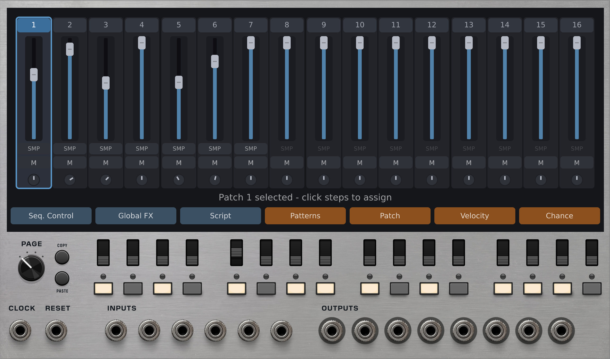

Groovebox Advanced is a self-contained beat-making environment for VCV Rack. It combines a 64-step sequencer, up to 16 tracks of modular synthesis or sample playback, a mixer, an effects chain, and a scripting system into a single module.

Each track contains its own modular patch. You build sounds by connecting internal modules (oscillators, filters, samplers, effects) together on a per-track canvas. The sequencer triggers tracks on assigned steps, and everything is mixed down to 8 audio outputs.

## Quick Start

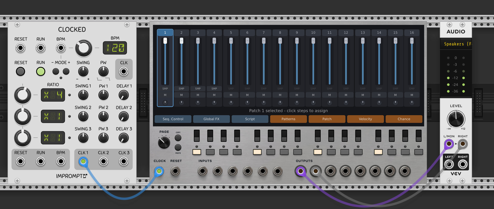

1. Add Groovebox Advanced to your VCV Rack patch
2. Connect a clock source to the **CLOCK** input
3. Connect **Output 1** and **Output 2** to your audio interface

You should hear a basic drum beat immediately. Groovebox Advanced ships with a default beat (kick, snare, hi-hat, clap) that plays as soon as a clock is connected.

## Video Tutorial

Most of this documentation is also covered in this video tutoral:

https://youtu.be/YoOhoPZzr5o


# Chapter 1: Basic Operation

## Tracks View Overview

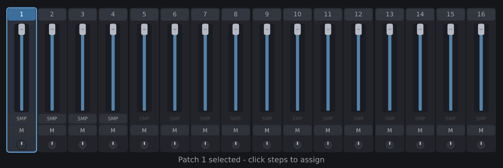

The Tracks view is the default view. It looks like a mixer console with one vertical channel strip per track (up to 16 tracks).

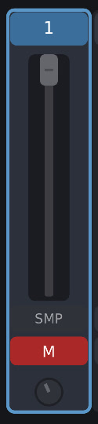

Each channel strip shows:
- Track number at the top
- A sample browser button (for loading samples into TrigSample modules)
- Volume fader
- Pan knob
- Mute button

Click on a track's header area to select it. The selected track is highlighted, and its step assignments appear on the 16 step buttons below the display.

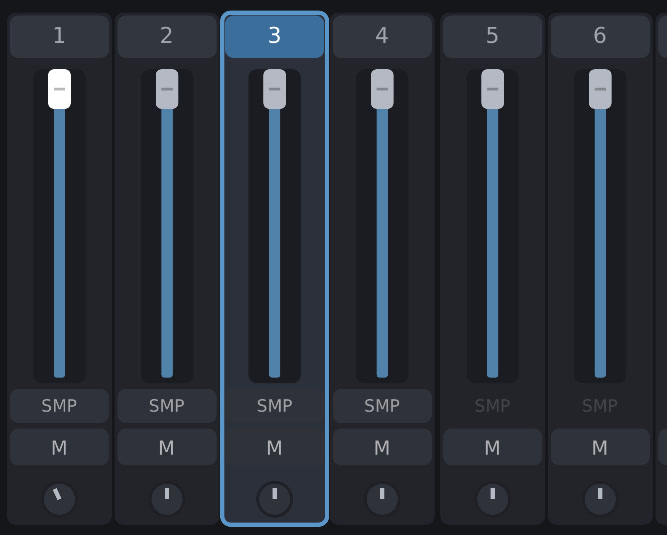

Double-click a track header to open that track's patch for editing (see Chapter 2).

### Sample Selection

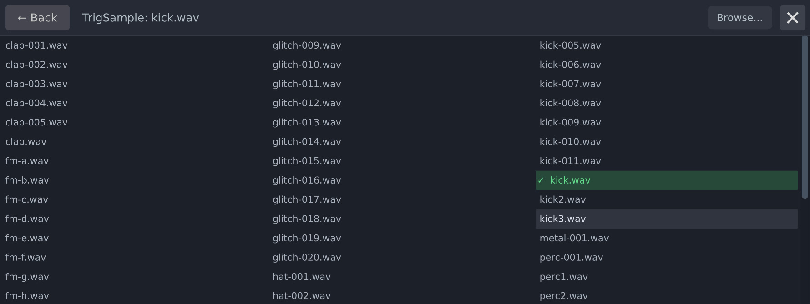

Each track's channel strip has a small sample browser button. Click it to open a file browser where you can load a .wav file into the track's TrigSample module.

This is a convenience shortcut. It works the same as opening the track's patch, selecting the TrigSample module, and changing the sample file from the parameter panel.  

You can also drag-and-drop an audio file from your computer on to a track to automatically load it (assuming that you have a sample playing module in the track).  The drag-and-drop operation only allows for one sample to be dropped on one track at a time.  You cannot drop multiple samples on to the module.

### Volume, Pan, and Mute

- **Volume**: Drag the fader up and down to set the track's level from 0 (silent) to 1 (unity). Volume changes are smoothly interpolated to avoid clicks.
- **Pan**: Drag the pan knob to set the stereo position. Center sends equal signal to outputs 1 and 2. Turning left sends more signal to output 1. Turning right sends more to output 2.
- **Mute**: Click the mute button to mute or unmute the track. Muted tracks fade to silence smoothly rather than cutting abruptly.

## Sequencing

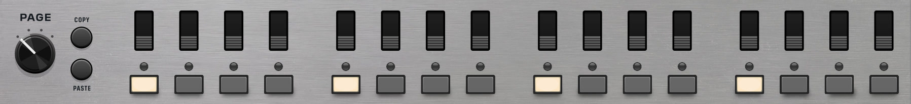

### Trigger Buttons

Below the display, you'll see 16 step buttons. If you've used a drum machine before, this will feel familiar. Select a track, then click the step buttons to choose which steps that track plays on. A lit button means the track will trigger on that step.

Each track has its own independent step pattern. So you might set up the kick on steps 1, 5, 9, and 13, the hi-hat on every step, and the snare on 5 and 13. During playback, the sequencer advances through the steps and triggers whichever tracks are active on each one.

### Ratcheting Switches

Above the step buttons, you've got sixteen, three position switches. These control ratcheting for each step.

- Down position is normal playback, one trigger per step. 

- Center is two triggers per step, evenly spaced within the step's time window. 

- In the up position, you get four triggers per step. The key thing is that ratcheting subdivides the clock period, so the extra triggers fit within the same amount of time as one normal trigger. It doesn't slow anything down.


### Page Selector

The sequencer has 64 steps, displayed 16 at a time across 4 pages (pages 0 through 3). Use the **Page** knob on the panel to switch between pages.

- Page 0: Steps 1-16
- Page 1: Steps 17-32
- Page 2: Steps 33-48
- Page 3: Steps 49-64

The **Copy Page** and **Paste Page** buttons let you copy one page's step assignments to another:

1. Navigate to the page you want to copy
2. Press **Copy Page**
3. Navigate to the destination page
4. Press **Paste Page**

This copies all step assignments, ratchet values, and chance values for that page.

## Track Menus

Below the mixer strips, a row of tiles gives access to additional views for the selected track.

### Patterns

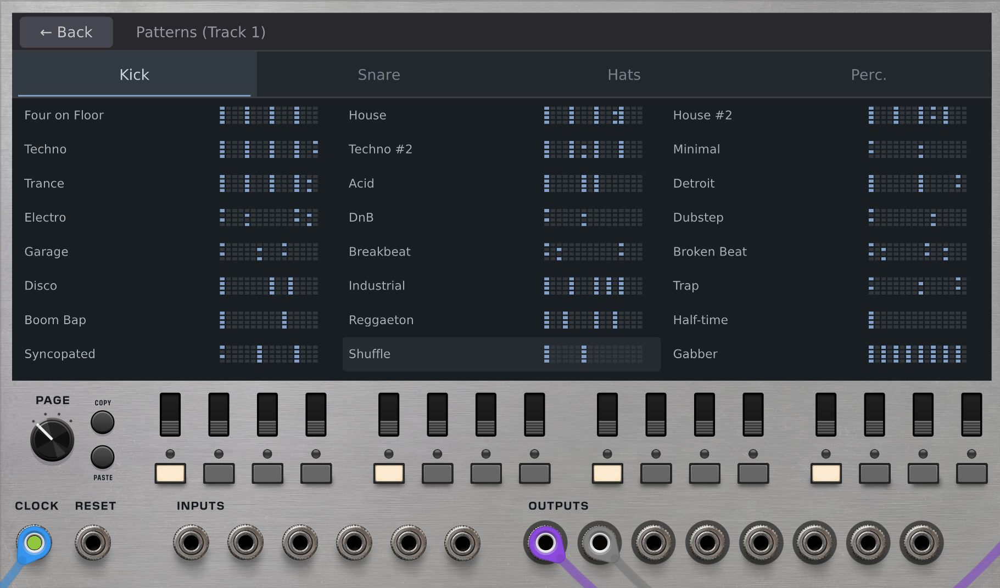

Click the **Patterns** tile to open the drum pattern library.

The pattern library contains pre-made 64-step patterns organized into categories (Kicks, Snares, Hi-Hats, and Percussion). Each category appears as a tab along the top of the view. Patterns are displayed in a 3-column grid, and each cell shows a small preview of the step pattern.

#### Applying patterns to tracks

1. Select a track in the Tracks view first
2. Open the Patterns view
3. Click a pattern to assign it to the selected track

The pattern replaces the track's current step assignments across all 64 steps.

#### Customizing the pattern library

The patterns are loaded from a JSON file at `res/modules/groovebox_advanced/drum_patterns.json`. You can edit this file to add your own patterns or modify existing ones. Each pattern is an array of 64 boolean values (1 = trigger, 0 = rest).

### Patch

Click the **Patch** tile to view which steps the selected track is assigned to. This is the same information shown by the step buttons, but presented visually in the display area.

### Velocity

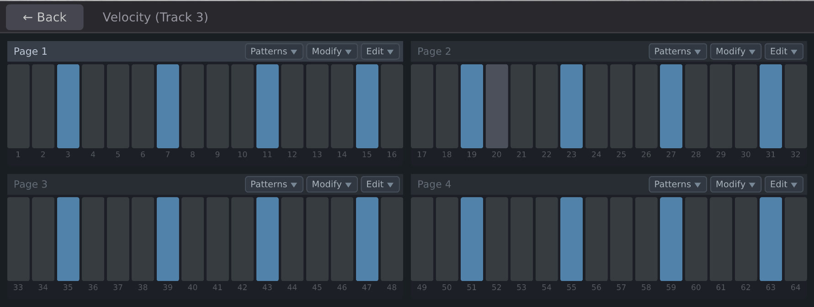

Click the **Velocity** tile to open the velocity editor.

- The display shows a 2x2 grid, one quadrant per page (pages 0 through 3)
- Each quadrant has 16 vertical bars representing velocity for each step
- Click and drag bars to set velocity (taller = louder)
- Each track has its own independent velocity values, so you can shape the dynamics of each sound separately

Each quadrant has a small toolbar:

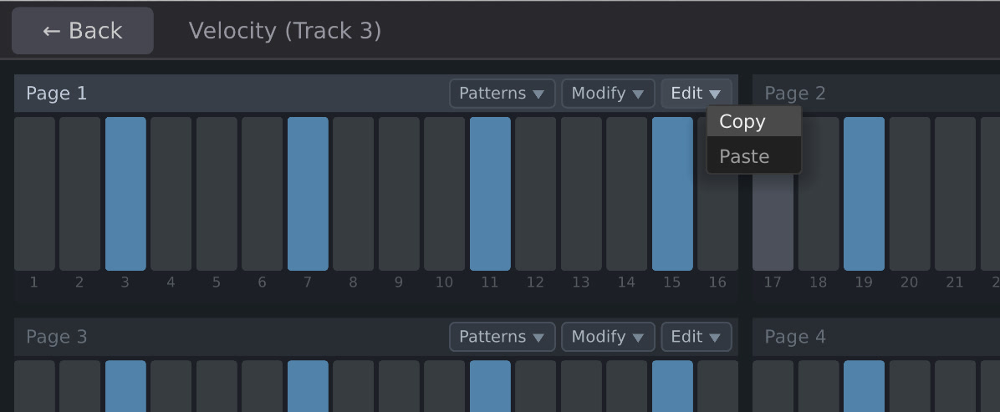

- **Edit**: Enable click-to-paint mode for that quadrant

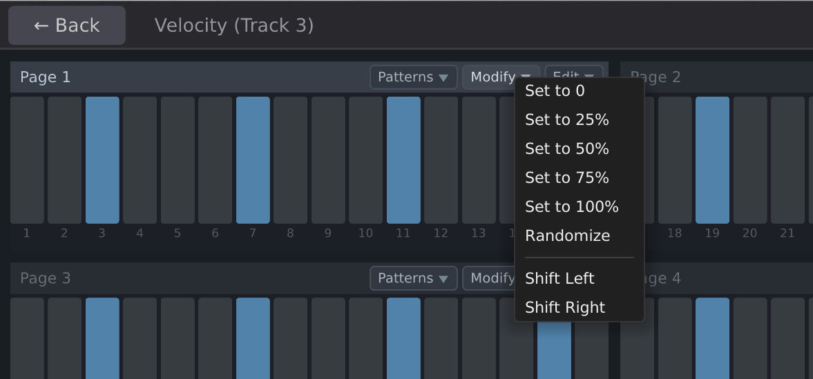

- **Modify**: Apply batch operations

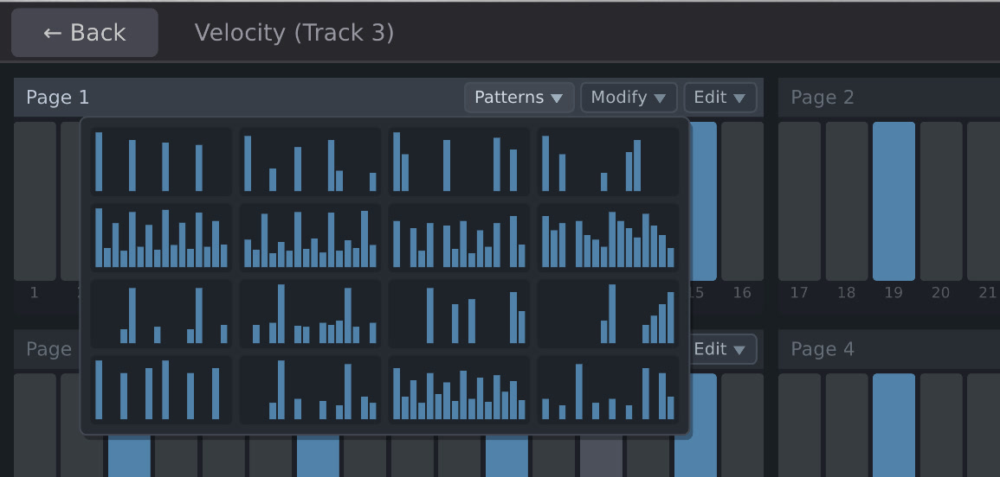

- **Patterns**: Choose from preset velocity patterns (Four on Floor, Boom Bap, Trap 808, Disco, and others)

### Chance

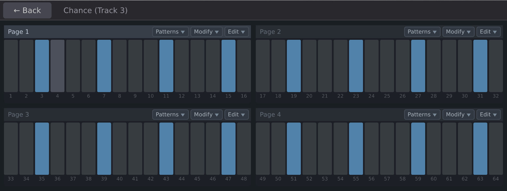

Click the **Chance** tile to open the chance editor.

- Same 2x2 layout as velocity
- Each bar represents the probability that the step will trigger (1.0 = always, 0.5 = half the time, 0.0 = never)
- Click and drag to paint probability values

Preset patterns include Alternating, Syncopated Gates, Phrase Drift, and Swing patterns. These provide a quick way to add controlled randomness to a beat.

## Clock and Reset

**CLOCK** and **RESET** are at the bottom left of the module.

- **CLOCK**: Patch an external clock here to drive the sequencer. Every rising edge advances the sequencer by one step.
- **RESET**: Resets the sequencer to step 1 on a rising edge.

Groovebox Advanced does not have an internal clock. You need to connect an external clock source.

## Inputs

- **CV 1** through **CV 6**: Six general-purpose CV inputs. These are available inside every track's patch via the **Input** module. Use them to bring external modulation, pitch, or control signals into your patches.

## Outputs

- **Output 1** through **Output 8**: Eight audio outputs. The Output module inside each track's patch determines which outputs receive audio. By default, tracks are routed to outputs 1 and 2 (stereo pair).


# Chapter 2: Patches

Each track in Groovebox Advanced contains its own modular patch. Patches are where you build sounds by connecting internal modules together. This is similar to building a VCV Rack patch, but everything lives inside the Groovebox.

## Patch Editor Interface

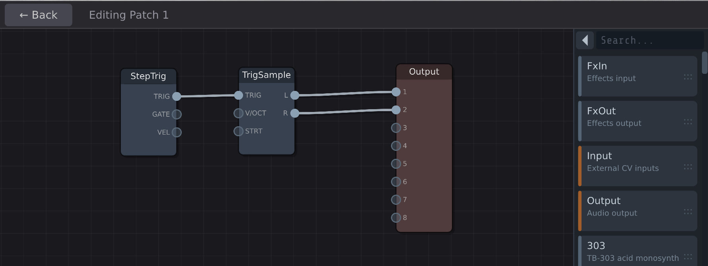

Double-click a track header in the Tracks view to open that track's patch for editing.

The Edit view has two areas:
- **Left side**: The patch canvas, where modules and cables live
- **Right side**: The module browser (for adding new modules) or the parameter panel (for tweaking a selected module)

### Panning and Zooming

- **Click and drag** on an empty area of the canvas to pan around
- **Control + Scroll wheel** to zoom in and out

### Browsing Modules

The module browser appears on the right side of the Edit view. It has two display modes:

- **Sidebar mode** (default): A vertical list showing module name, description, and a drag handle. Drag a module from the list onto the canvas to add it.
- **Expanded mode**: Click the toggle arrow at the top-left of the browser to expand it into a full-pane view organized by category. Click a module name to add it to the canvas and collapse back to the sidebar.

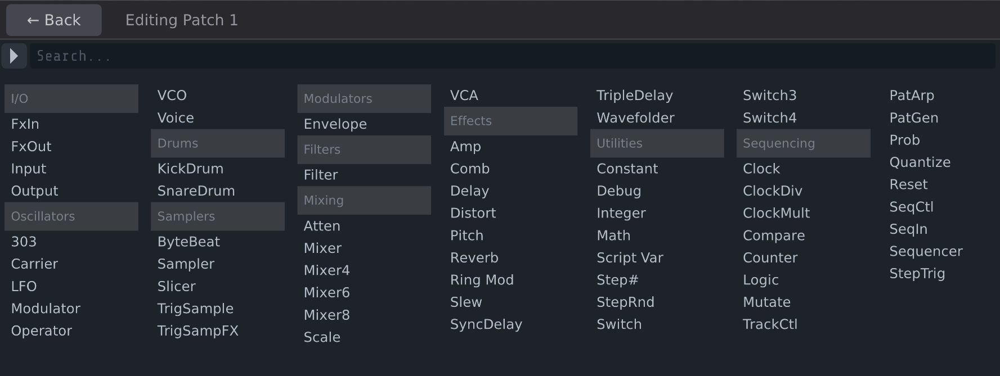

You can type in the search box at the top of the browser to filter modules by name or description.

### Adding and Removing Modules

- **Adding**: Drag from the sidebar browser onto the canvas, or click in the expanded browser view
- **Removing**: Select a module on the canvas and press **Delete** or **Backspace**
- The Output module cannot be deleted (every patch needs one)

### Connecting Modules

- Click and drag from an output port (right side of a module) to an input port (left side of another module) to create a cable
- To disconnect a cable, click on the destination port and drag the cable away
- Cables are color-coded by signal type

### Modules and Parameter Editing

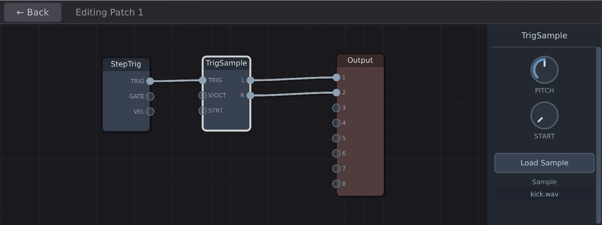

- Click a module on the canvas to select it
- When a module is selected, its parameters appear in the panel on the right side (replacing the module browser)
- Parameters include things like frequency, resonance, waveform selection, attack/decay times, and so on, depending on the module

### Returning to the Tracks View

Press the **Back** button at the top of the display to return to the Tracks view. You can also double-click on an empty area of the canvas.

## Example Patches

### Basic Sample Playback

The default track template:
- **StepTrig** connected to **TrigSample** connected to **Output**

StepTrig fires a trigger pulse when the sequencer reaches any step assigned to this track. TrigSample plays a sample when it receives a trigger. Output sends the audio to the module's outputs.

### Synthesized Kick Drum

- **StepTrig** connected to **KickDrum** connected to **Output**

Replace the TrigSample with a KickDrum module for a synthesized kick. Adjust the KickDrum's pitch, decay, and click parameters to shape the sound.

### Filtered Synth Hit

- **StepTrig** connected to both **Envelope** and **VCO**
- **VCO** output connected to **Filter** input
- **Envelope** output connected to **Filter** cutoff modulation input and **VCA** control input
- **Filter** output connected to **VCA** audio input
- **VCA** output connected to **Output**

This gives you a classic subtractive synth voice. The envelope controls both the filter sweep and the amplitude. Adjust VCO waveform, filter cutoff, and resonance to shape the timbre.

### FM Synthesis

- **StepTrig** connected to **Envelope**
- **Modulator** output connected to **Carrier** modulation input
- **Envelope** output connected to **Carrier** level or **VCA** control input
- **Carrier** output connected to **Output**

Adjust the Modulator's frequency ratio and depth to create metallic, bell-like, or percussive tones.


# Chapter 3: Global Controls

In addition to the per-track patches, Groovebox Advanced has two global patches and a scripting system. These operate at a higher level than individual tracks.

## Sequencer Control

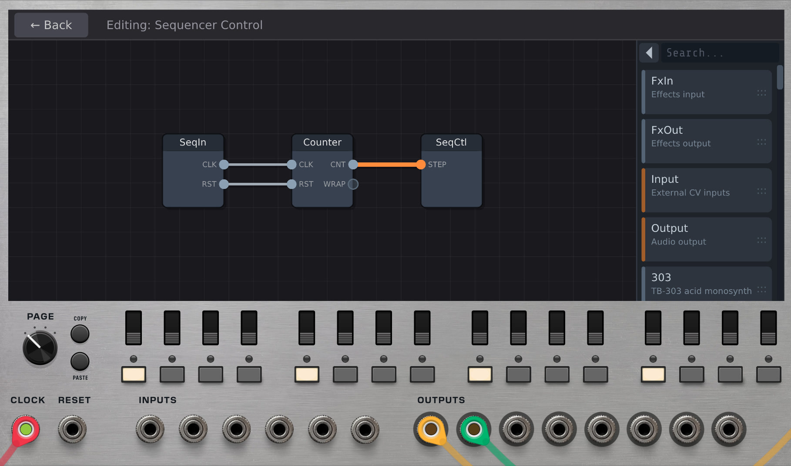

Click the **Seq. Control** button at the top of the display to open the Sequencer Control patch.

This patch runs before everything else each audio cycle. It can control:

- **Step position**: Wire a Counter through SeqCtl to override the sequencer's step position with CV
- **Pattern mutation**: Add a Mutate module to algorithmically alter step patterns during playback
### Default template

The Sequencer Control patch comes pre-loaded with a chain of three modules:

- **SeqIn**: Passes the external clock and reset signals into the patch
- **Counter**: Counts clock pulses and outputs the current count as a voltage
- **SeqCtl**: Receives the count and uses it to set the sequencer's step position

This chain means the Sequencer Control patch drives the step position from the moment you first visit it. The Counter is automatically synchronized to the sequencer's current position, so there is no interruption to playback.

You can remove SeqCtl if you do not want CV-driven step control, or add additional modules like Mutate alongside the existing chain.

## Global Effects

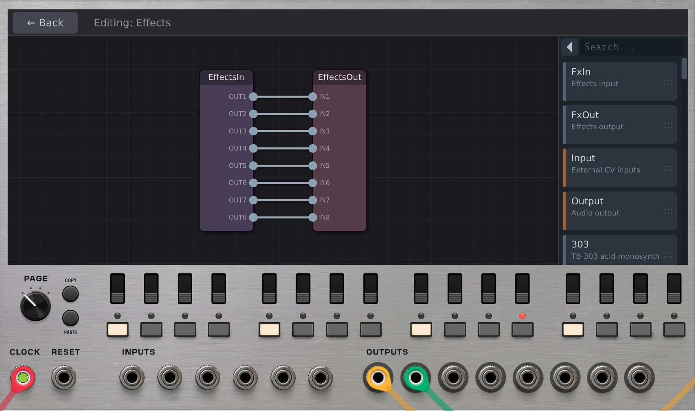

Click the **FX** button at the top of the display to open the Effects patch.

This patch receives the mixed audio from all tracks and processes it before the final output. The default template provides:

- **EffectsIn**: Receives the 8-channel mix from all tracks
- **EffectsOut**: Sends processed audio to the module's outputs

Add any effect modules (Reverb, Delay, Distort, and so on) between EffectsIn and EffectsOut to process the final mix.

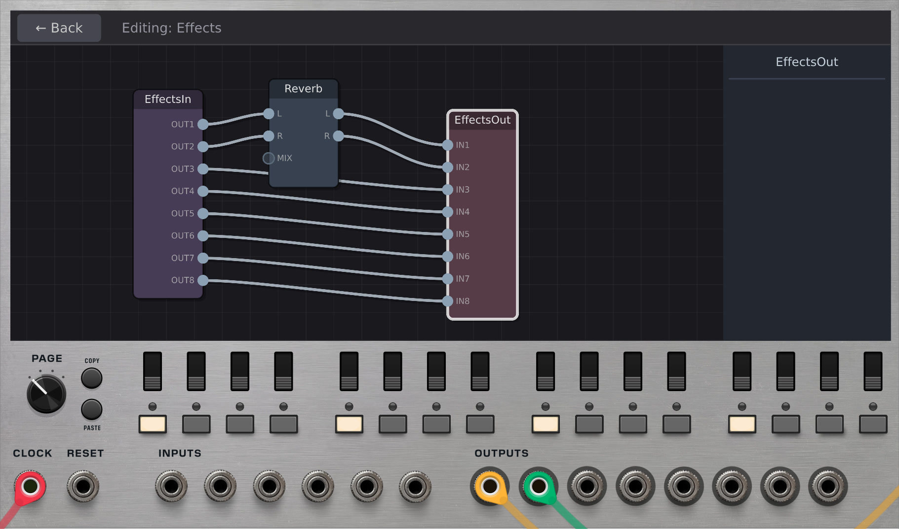

If the Effects patch is empty or has no EffectsIn/EffectsOut connected, audio passes through unprocessed.

### Per-track vs. global effects

- **Per-track effects**: Add effect modules inside an individual track's patch. The effect only processes that track's audio.
- **Global effects**: Add effect modules in the Effects patch. The effect processes the combined output of all tracks.

## Scripting

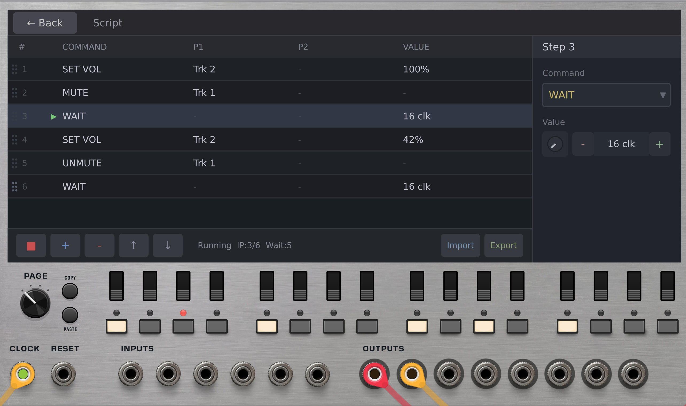

Click the **Script** tile in the Tracks view to open the script editor. Scripts let you automate changes over time, synchronized to the clock.

### How scripts work

A script is a list of instructions that execute sequentially, one at a time. When the script reaches a WAIT instruction, it pauses for the specified number of clock beats before continuing. When it reaches the end, it loops back to the beginning.

### Available instructions

- **WAIT** (beats): Pause for N clock beats before continuing
- **MUTE** (track): Mute a track
- **UNMUTE** (track): Unmute a track
- **SET VOL** (track, value): Set a track's volume (0.0 to 1.0)
- **SET PAN** (track, value): Set a track's pan position (0.0 to 1.0, where 0.5 is center)
- **SET STEP** (track, step, value): Set whether a track is assigned to a step (1 = on, 0 = off)
- **LOAD SCENE** (slot): Load a saved scene snapshot
- **SET VAR** (slot, value): Set a script variable (readable by ScriptVar modules inside patches)

### Using the editor

The script editor has two panes:
- **Left pane**: List of instructions in order. Click to select.
- **Right pane**: Detail panel for editing the selected instruction's parameters.

**Reordering instructions:** Drag and drop rows to reorder them. Each row has grip dots on its left edge -- click and drag to move the row. As you drag, the surrounding rows part to show the insertion point, and a ghost of the row follows your cursor. Release to drop the row into its new position. You can also use the Up/Down toolbar buttons as an alternative.

**Toolbar buttons (left side):**
- Play/Stop: Start or stop script execution
- Add: Insert a new instruction after the current one
- Delete: Remove the selected instruction
- Up/Down: Move the selected instruction up or down

**Toolbar buttons (right side):**
- Export: Save the script to a JSON file
- Import: Load a script from a JSON file

### Script variables and ScriptVar modules

The SET VAR instruction writes a float value to one of 16 variable slots (0 through 15). Inside any track's patch, you can add a ScriptVar module and set it to read a specific slot. The module outputs the current value of that variable as a voltage.

This lets your script communicate with track patches. For example, you could use SET VAR to change a filter cutoff value over time, with a ScriptVar module inside the track reading that value and feeding it to a filter.

### Example script

A script that builds a beat over time:

```
MUTE    track 1
MUTE    track 2
MUTE    track 3
WAIT    16
UNMUTE  track 0       (kick starts playing)
WAIT    16
UNMUTE  track 1       (snare joins)
WAIT    16
UNMUTE  track 2       (hi-hat joins)
WAIT    32
SET VOL track 0, 0.5  (drop kick volume)
WAIT    16
SET VOL track 0, 1.0  (bring kick back up)
```

This script mutes tracks 1-3, waits 16 beats, then brings in the kick. After another 16 beats the snare joins, then the hi-hat. After a longer 32-beat section, the kick volume drops briefly before coming back up. The script then loops.


# Chapter 4: Scene Snapshots

Snapshots capture performance state so you can recall it later.

A scene snapshot saves the state of all tracks at once:
- All track settings (volume, pan, mute)
- All step assignments across all tracks
- All per-step velocity, ratchet, and chance values
- Sequence length and playback mode

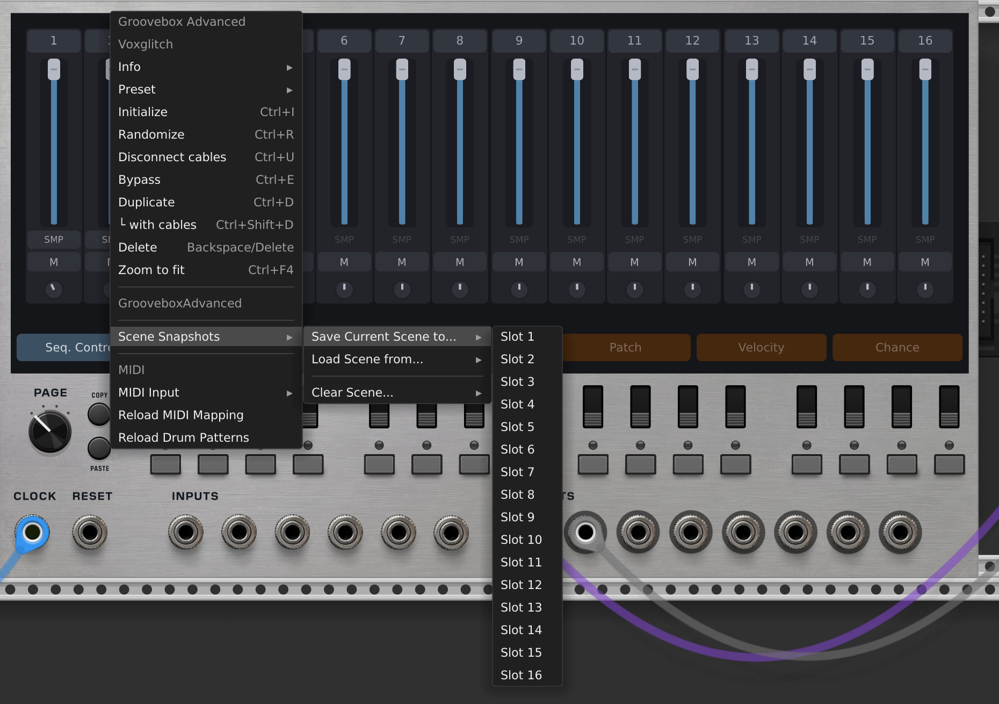

Access scene snapshots through the right-click context menu:
- **Save Current Scene to...**: Save to one of 16 slots
- **Load Scene from...**: Recall a saved scene
- **Clear Scene...**: Delete a saved scene

## Using snapshots for performance

- Set up different variations of your beat in different scene slots
- Switch between them manually with a single click via the context menu
- Use the LOAD SCENE script instruction to switch between scenes automatically as part of an arrangement


# Chapter 5: MIDI Support

Groovebox Advanced accepts MIDI input for controlling the mixer.

## Selecting Devices

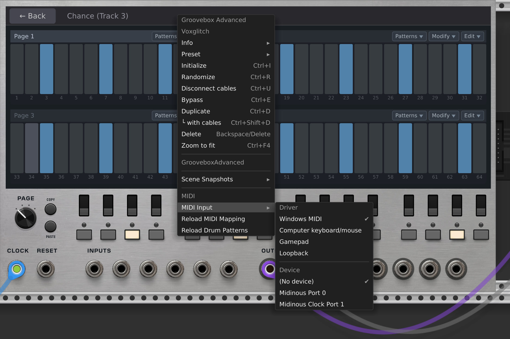

Right-click the module and select your MIDI driver and device from the **MIDI Input** submenu. You will see a list of available MIDI devices connected to your system.

## Default MIDI Mapping

The default mapping is configured for the Novation Launch Control XL (Factory Template 1) and maps to 8 tracks:

| Function | MIDI Messages | Tracks |
|----------|--------------|--------|
| Volume | CC 77 through CC 84 | Tracks 1 through 8 |
| Pan | CC 49 through CC 56 | Tracks 1 through 8 |
| Mute toggle | Notes 41-44, 57-60 | Tracks 1 through 8 |

- Volume CCs: Value 0 = silent, value 127 = unity
- Pan CCs: Value 0 = full left, value 64 = center, value 127 = full right
- Mute notes: Each note-on toggles the track's mute state

Scene snapshot loading is also supported via MIDI notes but is not mapped by default. See the Customizing MIDI Routing section below to set it up.

## Customizing MIDI Routing

The mapping is defined in `res/modules/groovebox_advanced/midi_mapping.json`. You can edit this file to change the CC and note assignments to match your MIDI controller.

The file format is:
- **trackVolumeCCs**: Maps CC numbers (as strings) to track indices (0-based)
- **trackPanCCs**: Maps CC numbers to track indices
- **trackMuteNotes**: Maps MIDI note numbers to track indices
- **sceneSnapshotNotes**: Maps MIDI note numbers to scene snapshot slot indices (0-based, up to 16 slots)

After editing the file, right-click the module and select **Reload MIDI Mapping** to apply changes without restarting VCV Rack.


# Chapter 6: Module Reference

This chapter lists all internal modules available in the patch editor, organized by category.

## I/O

| Module | Description |
|--------|-------------|
| **Input** | Brings external CV from the module's 6 CV inputs into the patch. Each output corresponds to one of the CV 1-6 jacks on the panel. |
| **Output** | Sends audio from the patch to the module's audio outputs. Every patch needs one. You can select which output pair to use. |
| **FxIn** | Receives the mixed audio from all tracks. Used only in the Effects global patch. |
| **FxOut** | Sends processed audio back to the outputs. Used only in the Effects global patch. |

## Oscillators

| Module | Description |
|--------|-------------|
| **VCO** | General-purpose voltage-controlled oscillator with multiple waveforms and 1V/oct pitch tracking. |
| **LFO** | Low-frequency oscillator for modulation. Outputs a slow-moving signal for controlling other parameters. |
| **303** | TB-303 style monosynth with built-in acid filter, accent, and glide behavior. |
| **Carrier** | FM synthesis carrier oscillator. Outputs audio-rate signal. |
| **Modulator** | FM synthesis modulator oscillator. Connect its output to a Carrier's modulation input. |
| **Operator** | Combined FM operator with detune and feedback controls. |
| **Voice** | Pre-built synth voice combining VCO, ADSR envelope, VCA, and filter in one module. |

## Drums

| Module | Description |
|--------|-------------|
| **KickDrum** | Synthesized kick drum with pitch, decay, and click controls. |
| **SnareDrum** | Synthesized snare drum. |

## Samplers

| Module | Description |
|--------|-------------|
| **TrigSample** | Plays a sample when triggered. This is the default module in new tracks. |
| **TrigSampFX** | Triggered sample player with built-in IDM-style effects processing. |
| **Sampler** | Continuous sample playback with pitch and position scrubbing control. |
| **Slicer** | Chops a sample into slices and plays them by index. Useful for breakbeat work. |
| **ByteBeat** | Generates audio from bytebeat formulas. |

## Modulators

| Module | Description |
|--------|-------------|
| **Envelope** | ADSR-style envelope generator. Outputs a control signal that rises and falls when triggered. |

## Filters

| Module | Description |
|--------|-------------|
| **Filter** | Multi-mode resonant filter with low-pass, high-pass, and band-pass outputs. |

## Mixing

| Module | Description |
|--------|-------------|
| **Mixer** | 3-input audio mixer. |
| **Mixer4** | 4-input audio mixer. |
| **Mixer6** | 6-input audio mixer. |
| **Mixer8** | 8-input audio mixer. |
| **VCA** | Voltage-controlled amplifier. Scales an audio signal by a control voltage. |
| **Atten** | Attenuverter. Scales a signal by a factor from -1 to +1. |
| **Scale** | Scales a signal and adds an offset. |

## Effects

| Module | Description |
|--------|-------------|
| **Delay** | Simple delay effect with time and feedback controls. |
| **TripleDelay** | Three delay lines with independent timing and a 3D morph control. |
| **SyncDelay** | Clock-synced delay with musical division settings. |
| **Reverb** | Dattorro plate reverb. |
| **Distort** | Waveshaping distortion and saturation. |
| **Comb** | Comb filter effect. |
| **Pitch** | Pitch shifter. |
| **Ring Mod** | Ring modulator. Multiplies two signals together. |
| **Wavefolder** | Wavefolding distortion for west coast synthesis textures. |
| **Slew** | Slew rate limiter. Smooths signal transitions. Useful for portamento and glide effects. |
| **Amp** | Amplifier with gain, saturation, and clamping options. |

## Utilities

| Module | Description |
|--------|-------------|
| **Constant** | Outputs a fixed voltage value. |
| **Integer** | Outputs an integer value from 0 to 64. |
| **Math** | Basic math operations (add, subtract, multiply, divide) on two input signals. |
| **Switch** | 2-input signal switch. A gate input selects between inputs A and B. |
| **Switch3** | 3-input CV switch. A selector input chooses between A, B, and C. |
| **Switch4** | 4-input CV switch. A selector input chooses between A, B, C, and D. |
| **Step#** | Outputs the current sequencer step number as a voltage. |
| **StepRnd** | Outputs a random value that changes on each trigger (sample-and-hold random). |
| **Script Var** | Reads a variable set by the script engine's SET VAR instruction. Select which slot (0-15) to read. |
| **Debug** | Displays the current value of its input signal. Useful for troubleshooting patches. |

## Sequencing

| Module | Description |
|--------|-------------|
| **StepTrig** | Fires a trigger pulse when the sequencer reaches a step assigned to this track. This is the standard way to trigger sounds. |
| **Clock** | Internal clock source with BPM control. |
| **ClockDiv** | Divides an incoming clock by a selectable ratio. |
| **ClockMult** | Multiplies an incoming clock by a selectable ratio. |
| **Reset** | Passes through the external reset signal from the module's RESET input. |
| **Sequencer** | 8-step internal CV sequencer. Outputs a voltage sequence driven by a clock input. |
| **Sequencer16** | 16-step internal CV sequencer with length control. |
| **Counter** | Counts clock pulses and outputs the count as a voltage. Wraps at a configurable maximum. |
| **Logic** | Logic gates: AND, OR, XOR, NOT. Operates on gate/trigger signals. |
| **Prob** | Probability gate. Passes or blocks triggers based on a probability setting. |
| **Compare** | Compares two voltages and outputs a gate based on the result. |
| **Quantize** | Quantizes a voltage to a selectable musical scale. |
| **PatGen** | Algorithmic pattern generator. Produces CV and gate patterns from 128 preset algorithms. |
| **PatArp** | Pattern-based arpeggiator. Produces melodic patterns from a library of preset arpeggio shapes. |
| **Arp** | Arpeggiator with scale quantization. |
| **Mutate** | Applies mutations to step patterns during playback. Non-destructive: the original pattern is preserved. Used in the Sequencer Control patch. |
| **SeqIn** | Passes the external clock and reset signals into the Sequencer Control patch. |
| **SeqCtl** | Receives a step position value and uses it to override the sequencer's current step. Used in the Sequencer Control patch. |
| **TrackCtl** | Controls per-track volume, pan, and mute via polyphonic CV inputs. Used in the Sequencer Control patch. |
