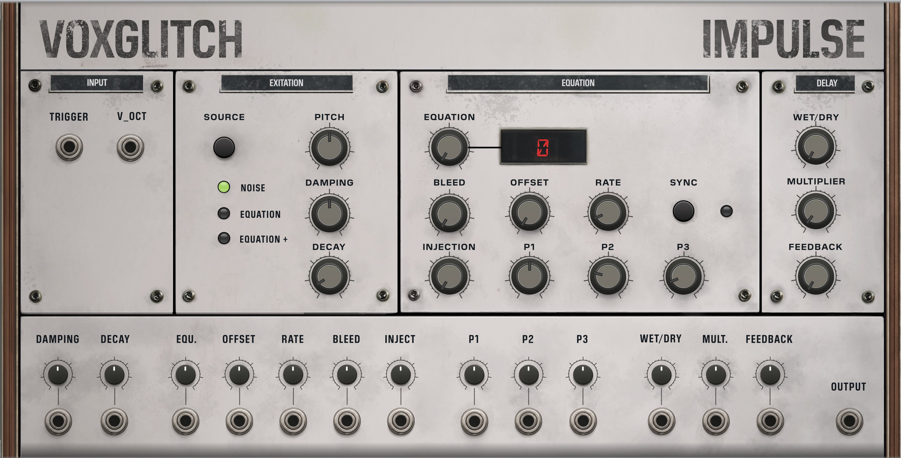
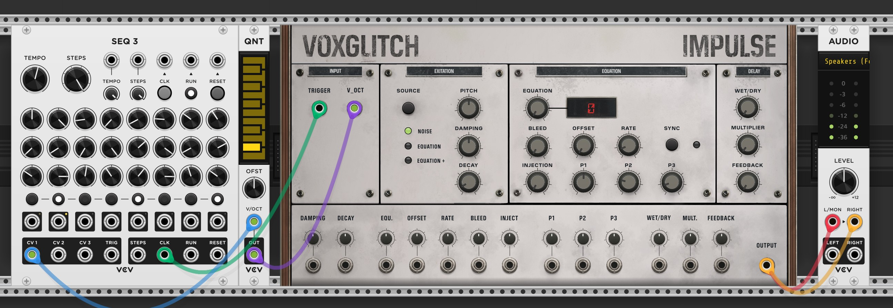
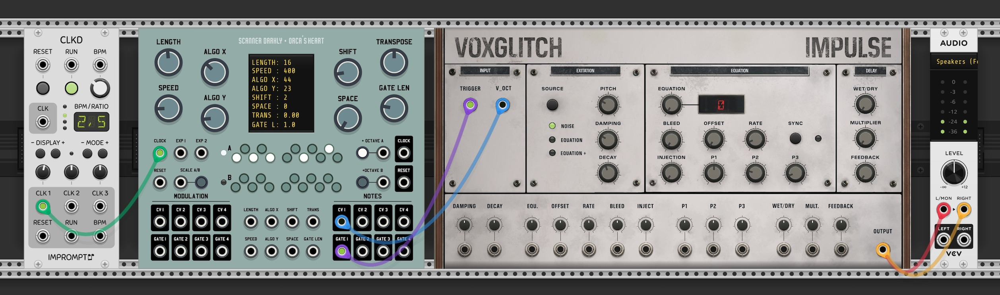
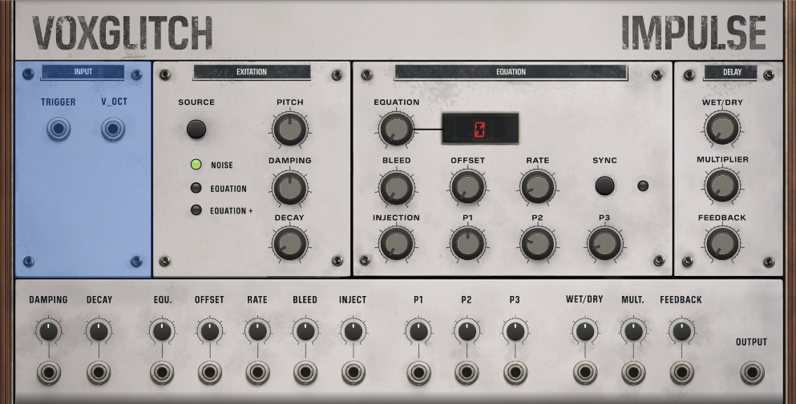
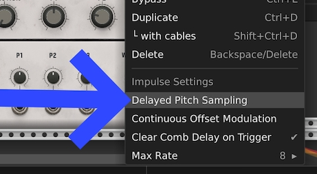
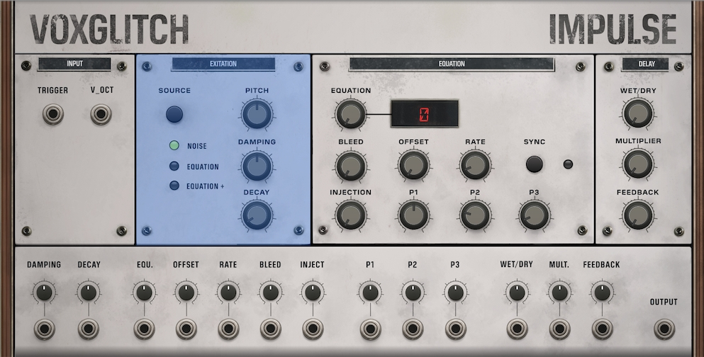
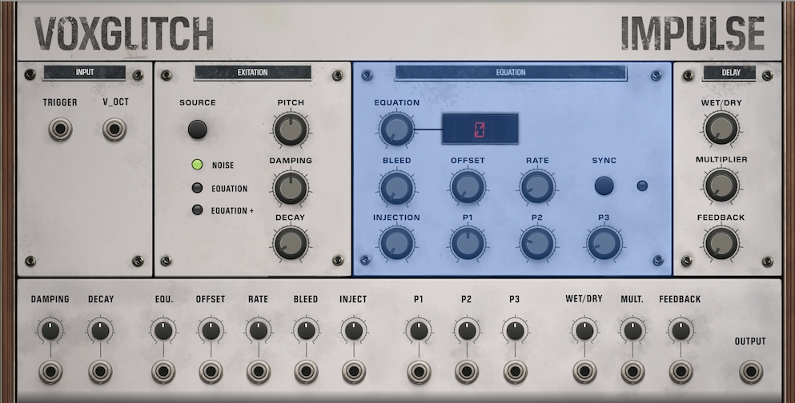
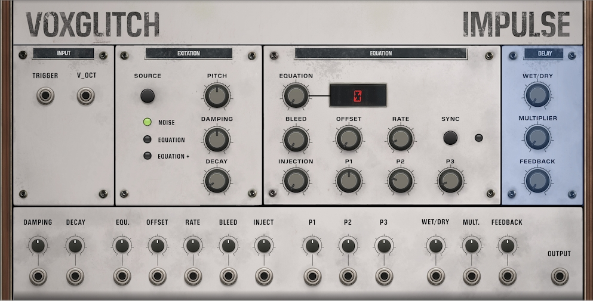
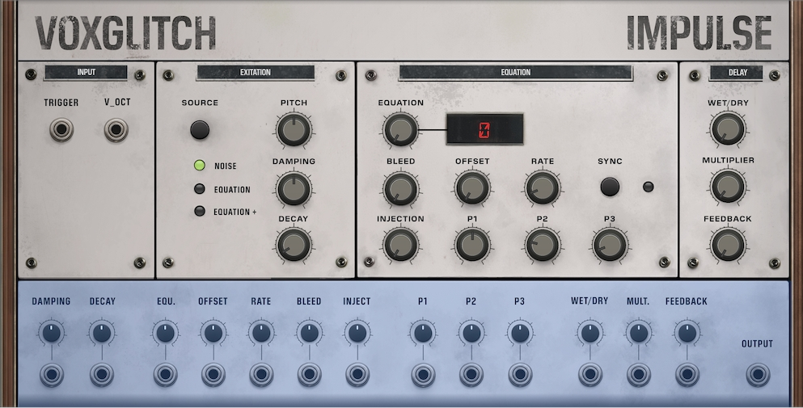

# Impulse - Experimental Physical Modeling Synthesizer User Manual

## Overview

Impulse is an experimental physical modeling synthesizer for VCV Rack based on the Karplus-Strong algorithm. It creates plucking sounds and base sounds either noise or bytebeat equations. The module features a comb delay for harmonic complexity, and three distinct excitation modes for diverse sonic possibilities.

*** CAUTION ***: The comb delay at the final state of this module can cause extemely loud feedback.

## Quick Start Guide

Let's get you up and running with minimum fuss.  To start hearing audio, you'll need to hook up cables to the trigger input, v/oct input, and route the output to an output module.

The patch above should produce audio, but you might notice that the pitch isn't very interesting.  Here's another basic patch which is worth exploring which uses the Scanner Darkly "Orca's Heart" module to suppoy algorithmicly generated notes and rhythms:

## Input, Excitation, Equation, and Delay

These are the four main panels on the Impulse module.  We'll talk through them one by one.

### Input

The two main CV inputs of the Impulse module are trigger input and 1v/Oct input.  These are quite typical for modules, where the trigger input begins note playback, and the 1v/Oct CV input provides the pitch information following the standard 1 volt per octave standard.

This module is sensitive to the timing between the trigger input and the v/oct pitch input.  If the trigger input arrives before a change in the pitch, the new pitch may not be "sampled".  This can happen when sending the pitch through certain quantizers before it reaches the Impulse module.  In order to help you manage this situation, we've added a "Delayed Pitch Sampling" option in the right-click context menu, which will wait for one clock cycle after a trigger impulse arrives before sampling from the pitch input.  

*If you find that you're hearing the wrong note in a sequence, try enabling the "Delayed Pitch Sampling" option in the context menu.*

***

### Excitation

**Understanding the Excitation Stage**

Before we dive into the Excitation stage, let's cover the basics of Karplus-Strong synthesis.

**The Basic Process**

You start with a short delay buffer filled with an excitation signal (random noise or a bytebeat pattern). Then you loop that buffer over and over. Each time through the loop, two things happen:
- The signal passes through a lowpass filter (controlled by the **damping** parameter)
- It's multiplied by a feedback gain (controlled by the **decay** parameter)

That's the core algorithm.

**What This Creates**

As the loop repeats, high frequencies are progressively filtered out while the fundamental frequency rings out. The fundamental frequency is determined by the delay buffer length.

The **damping** parameter controls the lowpass filter's cutoff frequency. Lower damping removes more high frequencies each cycle, making the tone darker.

The **decay** parameter controls the feedback gain, which determines how long the sound takes to fade away.

**The Result**

Despite being straightforward, this process sounds remarkably like a plucked string—guitar, harp, or similar instruments.

To summarize: delay buffer length sets the pitch (shorter = higher), damping controls brightness, and decay controls sustain.

#### Sources

##### Noise

A noise source is what has traditionally been used in Karplus-Strong.  Note: When the Excitation is set to Noise, the Equation section has no effect.

##### Equation

Instead of using a noise source for the excitation signal, the beginning of a bytebeat equation output can be used.  "Bytebeats" are complex waveforms generated by simple math equations.  The provide a different character to the final output.

##### Equation +

This excitation source is very similar to the Equation source, except that the position where the excitation buffer is sampled from within the bytebeat's output is continually changing.  Think of it like a record player.  For the "Equation" source, only the very beginning section of the record is used.  With "Equation +", the record is continually playing, and the source of the excitation is wherever the playback needle is.

#### Pitch

The Pitch knob sets the base octave of the synthesizer, ranging from -5 octaves to +5 octaves relative to C4. The knob is snap-enabled, meaning it snaps to the nearest octave. You'll typically use this in combination with the V/OCT input when playing melodies.

#### Damping

The Damping control sets the cutoff frequency of a low-pass filter applied in the feedback loop. This is a key control for shaping the timbre.  Lower values (0-30%) produce dark, murky tones with deep resonances. Medium values (40-60%) create a balanced tone that reveals the module's unusual overtone character. Higher values (70-100%) produce bright, metallic tones with emphasized high-frequency artifacts. The damping filter operates in the range of 500Hz to 5000Hz.

#### Decay

Decay determines how long the sound rings out after being triggered, ranging from 0.1 to 10 seconds. Short decay times (0.1-0.5s) create quick plucks and strikes. Medium decay (0.5-2s) produces resonant string-like decay. Long decay times (2-10s) create sustained, drone-like tones with evolving character.

***
 
### Equation

The Equation panel is where things get interesting. This is where you control the bytebeat-based excitation source. Note that these controls only have an effect when the module is in "Equation" or "Equation +" mode (indicated by the second or third LED being lit in the Excitation section).

#### Equation Number Display

The red LED display shows the currently selected equation number (0-40). There are 41 total equations, each with unique timbral and rhythmic characteristics.

#### Equation

The Equation knob selects which bytebeat equation to use. The knob is snap-enabled, so it steps through integer values from 0 to 40.

#### Bleed

Bleed controls how much of the raw bytebeat signal bleeds into the output, ranging from 0% to 50%. At 0%, you hear only the pure Karplus-Strong resonator output. Low values (5-15%) add subtle algorithmic coloration. Medium values (20-35%) create a hybrid physical/algorithmic sound. High values (40-50%) make the output dominated by raw bytebeat texture.

#### Offset

Offset sets the starting position in the bytebeat pattern, ranging from 0 to 352,800 samples. Think of this as jumping to different sections of the equation's evolution.

By default, the offset is only sampled at trigger time. However, you can enable "Continuous Offset Modulation" in the context menu (right-click the module), which allows the offset to be modulated continuously during note sustain, creating evolving, shifting timbres.  Think of Continuous Offset Modulation like manually adjusting the playhead on a tape player.

#### Rate

Rate controls the playback speed of the bytebeat equation, ranging from 0.005x to 8x (or limited by the Max Rate setting in the context menu). Values less than 1.0x slow down the pattern, creating lower-frequency textures. Values greater than 1.0x speed up the pattern, creating higher-frequency textures.

#### Sync Button and LED

The Sync button toggles rate synchronization mode. When the LED is off, the rate is controlled independently by the RATE knob. When the LED is lit, the rate is synchronized to the pitch for harmonic tracking. This creates musical, harmonic relationships between the pitch and equation rate. For example, at 2x rate with sync enabled, the equation runs at twice the fundamental frequency.

#### Injection

Injection sets the amount of additional excitation injected after the initial trigger, ranging from 0x to 10x. At 0x, there's no injection - just a single excitation burst. Low values (1-3x) create extended sustain with gradual re-excitation. High values (5-10x) produce continuous re-excitation and drone-like behavior. 

Technically, this parameter multiplies the initial delay line length to determine how many samples of injection to add.  This helps capture more of a bytebeat's sonic character when in equation mode.

#### P1, P2, P3

These three parameters modify the selected bytebeat equation, with each ranging from 0 to 255. The function of these parameters is equation-specific - each equation uses them differently. The default values are P1=128, P2=64, and P3=32. These are deep sound design controls - experiment with them to discover how each equation responds to these parameters.

***

### Delay

The Delay panel contains the comb delay section, which adds an additional resonant filter for harmonic complexity.  

> Developer note: The purpose of having a delay built into the module is that it syncs to the karplus strong excitation delay, which would be difficult to achieve otherwise.  And it sounds cool.

#### Wet/Dry

The Wet/Dry control sets the mix between the direct signal and the comb-filtered signal, ranging from 0% to 100%. At 0%, you hear the pure Karplus-Strong output (comb bypass). At 50%, you get an equal mix of direct and comb-filtered signal. At 100%, you hear the pure comb-filtered output.

#### Multiplier

The Multiplier scales the comb delay length relative to the fundamental delay line, ranging from 0.25x to 32x.

#### Feedback

Feedback sets the feedback amount for the comb delay, ranging from 0% to 100%.

***

## CV Inputs and Attenuverters

Looking at the bottom section of the module, you'll see rows of small knobs and input jacks. Each main parameter (except Pitch and Source) has a dedicated CV input jack and a small attenuverter knob positioned below the main control row.

The attenuverters range from -100% to +100%. At the center position (12 o'clock), there's no CV modulation. Turning clockwise applies positive CV modulation. Turning counter-clockwise applies negative CV modulation, which inverts the CV signal. These allow you to fine-tune the amount and direction of CV control for each parameter.

The CV inputs accept standard 0-10V control voltages, which are normalized to each parameter's range and scaled by the corresponding attenuverter value.

***

## Context Menu Options

Right-click the module to access several advanced settings:

#### Delayed Pitch Sampling

When enabled, the module delays pitch sampling by one sample after receiving a trigger. This is useful when using external quantizers, as it allows the quantizer output voltage to settle before Impulse samples the pitch. If you notice pitch instability or wrong notes when using external quantizers, enable this option.

#### Continuous Offset Modulation

When enabled, the OFFSET parameter continuously modulates the bytebeat playback position during note sustain. By default (when disabled), the offset is only set at trigger time. When enabled, offset CV can modulate the playback position in real-time, creating dynamic, shifting timbres. This is particularly useful for evolving drones, animated textures, and LFO-modulated timbral shifts.

#### Clear Comb Delay on Trigger

When enabled (the default), the comb delay buffer is cleared with each new trigger, ensuring clean note starts with no bleed between notes. When disabled, the comb buffer persists across notes, creating overlapping resonances.

#### Max Rate

This sets the maximum value for the RATE knob, constraining its range. Options include 8, 7, 6, 5, 4, 3, 2, 1, 0.5, 0.25, and 0.1. The default is 8. Use this to limit the range for more precise control in specific contexts. For example, if you only need rates up to 2x, set this to 2 for better knob resolution.

***

## Troubleshooting

**No audio output?** Check that triggers are being sent to the trigger input.  Try Noise mode (click SOURCE until the first LED lights) as the simplest mode for testing.

**Wrong pitch or pitch instability?** If you're using a quantizer, enable "Delayed Pitch Sampling" in the context menu. Verify the V/OCT input voltage is in the expected range. Remember that the pitch knob is snap-enabled and may jump to the nearest semitone.

**No sound in Equation modes?** Verify the correct source LED is lit (second or third). Try different equations - some may be very quiet with certain P1/P2/P3 values. Try increasing bleed to hear the raw bytebeat signal. Very slow or fast rates may also produce inaudible results.

**Distortion or clipping?** Reduce the injection parameter if it's set high. Check the bleed level - very high bleed with certain equations can be loud. Reduce comb feedback if it's above 90%. Also check that downstream modules aren't clipping.

***

## Technical Specifications

- **Algorithm**: Karplus-Strong physical modeling with bytebeat excitation options
- **Pitch Range**: -5 to +5 octaves (approximately 20Hz to 20kHz depending on sample rate)
- **V/OCT Tracking**: 1V/octave standard
- **CV Inputs**: 0-10V standard range
- **Audio Output**: ±5V standard VCV Rack audio level
- **Equations**: 41 unique bytebeat algorithms
