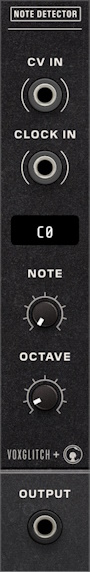

# Table of Contents

1. [Introduction](#1-introduction)
   - [Overview of the Note Detector Module](#overview-of-the-note-detector-module)
   - [Features](#features)
   - [Quick-Start Guide](#quick-start-guide)

2. [Interface and Controls](#2-interface-and-controls)
   - [Front Panel Overview](#front-panel-overview)
   - [Input Ports](#input-ports)
   - [Output Ports](#output-ports)
   - [Controls](#controls)
   - [Display](#display)

3. [Output Modes](#3-output-modes)
   - [Trigger Mode](#trigger-mode)
   - [Gate Mode](#gate-mode)
   - [Clocked Trigger Mode](#clocked-trigger-mode)
   - [Clocked Gate Mode](#clocked-gate-mode)

5. [Customizing Settings](#5-customizing-settings)
   - [Output Mode Selection](#output-mode-selection)
   - [Trigger Length Adjustment](#trigger-length-adjustment)
   - [Tolerance Level Configuration](#tolerance-level-configuration)
   - [Notation Type Selection](#notation-type-selection)

6. [Technical Specifications](#6-technical-specifications)
   - [Input and Output Voltage Ranges](#input-and-output-voltage-ranges)
   - [Frequency Control](#frequency-control)

7. [Support](#7-support)

# 1. Introduction

## Overview of the Note Detector Module

The Note Detector module is an innovative tool designed for the VCV Rack platform, catering to enthusiasts and professionals in the field of modular synthesis. This module primarily serves as a pitch detection device, accurately identifying the note and octave from incoming control voltage (CV) signals.

The Note Detector is a collaboration between Voxglitch and Omri Cohen.

### Features:
- Detection of notes and octaves from CV signals.
- Configurable output for generating either triggers or gates corresponding to pitch detection.
- Fine-grained tolerance settings for pitch detection
- A user-friendly display providing instant visual feedback of the target note.
- Clock input for clocked modes, enabling precise timing and detection of repeated notes within a sequence.
- Four distinct output modes: Trigger, Gate, Clocked Trigger, and Clocked Gate.

### Quick-Start Guide

To quickly integrate the Note Detector into your workflow:

1. Patch a CV source (e.g., a sequencer or keyboard module that outputs CV pitch information) to the CV IN port of the Note Detector.
2. Select the target note using the NOTE and OCTAVE knobs.
3. Choose an output mode from the context menu (right-click):
   - **Trigger** or **Gate**: Operates independently, no clock required
   - **Clocked Trigger** or **Clocked Gate**: Requires a clock signal connected to CLOCK IN
4. Connect the OUTPUT to the desired module (e.g., an envelope generator or drum module)

#### Sample Patch (Clocked Mode):
- Sequencer Note CV Output > CV IN on Note Detector.
- Sequencer Gate Output > CLOCK IN on Note Detector (for clocked modes).
- Note Detector OUTPUT > CV Input to a kick drum module or ADSR

This setup enables the Note Detector to track and output each instance of a note, including repeated notes.

# 2. Interface and Controls

## Front Panel Overview

The front panel of the Note Detector is elegantly laid out to ensure immediate accessibility and ease of use. It consists of input and output jacks, control knobs for precise adjustments, and a digital display for instant note verification.

### Input Ports
- **CV IN**: Plug the output from your CV source—like a sequencer or keyboard—into this jack. The module will scrutinize the incoming voltage to discern the note being played.
- **CLOCK IN**: This jack accepts a gate or trigger signal. Required only when using **Clocked Trigger** or **Clocked Gate** modes. The clock signal determines when note detection occurs, crucial for recognizing consecutive occurrences of the same note.

### Output Ports
- **OUTPUT**: This jack emits a trigger or gate signal in response to the detected notes. The character of this signal, whether a succinct trigger or an elongated gate, is contingent on the module's Output Mode, which is configured through the context menu.

### Controls
- **NOTE Knob**: This control allows you to dial in the specific note that the module will detect. When combined with the OCTAVE knob, it enables you to target the exact pitch for the module to track.
- **OCTAVE Knob**: This control is used to set the octave for the note you're aiming to detect. It can be adjusted to isolate a single octave or configured to the "All" setting, which commands the module to detect the chosen note across all octaves.

### Display
- **Note Readout**: Displays the note and (optionally) octave that you wish to detect.  It can be configured to display notes with sharps or flats through the "Notation" context menu.

# 3. Output Modes

The Note Detector module offers four distinct output modes to suit different musical applications and preferences. These modes determine how the module responds when it detects the specified note.

## Trigger Mode

**Description:**
Trigger Mode outputs a short, percussive pulse when the module detects the chosen note entering tolerance. This mode operates independently and does not require a clock input. The trigger length (default 0.01 seconds) is configurable through the Trigger Length context menu.

**Behavior:**
- Outputs a pulse when the detected note **enters** the tolerance range
- Trigger occurs on note changes or when adjusting the target note/octave knobs
- Cannot detect repeated instances of the same note without pitch change
- No clock input required

**How to Use:**
1. Connect your CV source to the CV IN jack
2. Select the desired note and octave using the NOTE and OCTAVE knobs
3. Select "Trigger" from the Output Mode context menu (right-click)
4. The OUTPUT will emit a brief pulse when the selected note is detected

**Application Example:**
Trigger a drum hit every time a melody changes to a C# note, regardless of octave.

## Gate Mode

**Description:**
Gate Mode outputs a continuous 10V signal for as long as the detected note matches the selected parameters. This mode operates independently without requiring a clock input.

**Behavior:**
- Output stays high (10V) while the note is within tolerance
- Output goes low (0V) when the note leaves tolerance
- Continuous evaluation of the CV input
- No clock input required

**How to Use:**
1. Connect your CV source to the CV IN jack
2. Set the NOTE and OCTAVE knobs to define the target pitch
3. Select "Gate" from the Output Mode context menu
4. The OUTPUT will produce a sustained 10V signal while the specified note is present

**Application Example:**
Sustain a pad sound on a synthesizer module only when an F# in octave 3 is being played, creating selective layering.

## Clocked Trigger Mode

**Description:**
Clocked Trigger Mode outputs a short pulse when the target note is detected **and** a clock rising edge occurs. This mode requires a clock input and is essential for detecting repeated instances of the same note in a sequence.

**Behavior:**
- Outputs a pulse only on clock rising edges when note matches
- Can detect consecutive identical notes in a sequence
- Trigger length is configurable via context menu
- **Requires** clock input connected to CLOCK IN

**How to Use:**
1. Connect your CV source to the CV IN jack
2. Connect a gate/trigger source (typically from your sequencer) to CLOCK IN
3. Select the desired note and octave using the NOTE and OCTAVE knobs
4. Select "Clocked Trigger" from the Output Mode context menu
5. The OUTPUT will emit a pulse on each clock edge when the selected note is present

**Application Example:**
Trigger a kick drum on every instance of C4 in a bassline sequence, including when C4 repeats consecutively.

## Clocked Gate Mode

**Description:**
Clocked Gate Mode outputs a gate signal that follows the clock's high/low state, but only when the target note is detected. This mode acts as a "note-filtered clock passthrough."

**Behavior:**
- Output follows the clock signal's voltage (high/low) while note is within tolerance
- Output stays low when note doesn't match, regardless of clock state
- Maintains the clock's rhythm and duty cycle
- **Requires** clock input connected to CLOCK IN

**How to Use:**
1. Connect your CV source to the CV IN jack
2. Connect a gate/trigger source to CLOCK IN
3. Set the NOTE and OCTAVE knobs to define the target pitch
4. Select "Clocked Gate" from the Output Mode context menu
5. The OUTPUT will mirror the clock signal only when the specified note is present

**Application Example:**
Pass clock pulses to an envelope generator only when a specific note (e.g., A3) is playing, creating rhythmic filtering based on melodic content.

# 5. Customizing Settings

The Note Detector module provides a variety of settings that can be customized to fit your musical needs. These settings allow you to fine-tune how the module detects notes and interacts with the rest of your patch. The following subsections detail how to adjust these settings.

## Output Mode Selection

The Note Detector offers four distinct output modes:

1. Right-click on the module to open the context menu.
2. Locate the Output Mode option.
3. Choose from:
   - **Trigger**: Short pulse on note detection (no clock required)
   - **Gate**: Sustained voltage while note is held (no clock required)
   - **Clocked Trigger**: Short pulse on clock edge when note matches (requires clock)
   - **Clocked Gate**: Clock passthrough while note matches (requires clock)

## Trigger Length Adjustment

When using **Trigger** or **Clocked Trigger** modes, you can adjust the length of the output pulse:

1. Right-click on the module to access the context menu.
2. Select the Trigger Length submenu.
3. Choose from predefined trigger length options (ranging from 0.001s to 0.2s), which determine the duration of the pulse sent from the OUTPUT port.

**Note:** This setting only applies to Trigger and Clocked Trigger modes. It has no effect on Gate or Clocked Gate modes.

## Tolerance Level Configuration

Adjust the tolerance level to control the sensitivity of the note detection:

1. Right-click on the module to bring up the context menu.
2. Navigate to the Tolerance Level submenu.
3. Select a tolerance level that matches your requirements, from exact note matching to more lenient detection that allows for microtonal variations.

## Notation Type Selection

You can choose between sharp and flat notation for the note display:

1. Right-click on the module to open the context menu.
2. Find the Notation option.
3. Select Sharp to display notes using sharp notation (e.g., C#, D#, etc.).
4. Select Flat to display notes using flat notation (e.g., Db, Eb, etc.).

# 6. Technical Specifications

The Note Detector module adheres to standard voltage ranges and behaviors expected in modular synthesis environments like VCV Rack. Here are its technical specifications:

## Input and Output Voltage Ranges
- **CV Input Range**: Typically 0 to 10 V (unipolar CV) or ±5 V (bipolar CV).
- **Output Voltage**: 
  - Triggers and Gates output at 10 V.
  - Default Trigger duration: Standard 1 ms, but customizable

## Frequency Control
- **Voltage Standard**: Follows the 1 V/oct standard.
- **Frequency Relationship**: The frequency \( f \) is defined as \( f = f_0 \times 2^V \), where \( f_0 \) is the baseline frequency. For audio-rate oscillators, \( f_0 \) is typically set to C4 (261.6256 Hz).

These specifications ensure that the Note Detector module performs reliably within the VCV Rack ecosystem, providing consistent and expected results in various synthesis applications.

# 7. Support

For questions, issues, or feature requests, please contact voxglitch@gmail.com, or post to [Voxglitch Community Feedback](https://www.google.com/url?sa=t&rct=j&q=&esrc=s&source=web&cd=&cad=rja&uact=8&ved=2ahUKEwjT48a2192CAxVdIUQIHSFOCg0QFnoECBkQAQ&url=https%3A%2F%2Fcommunity.vcvrack.com%2Ft%2Fvoxglitch-community-feedback%2F14290%3Fpage%3D44&usg=AOvVaw1j87Wokz8sJct5AudvwU_7&opi=89978449)

The Note Detector is open source: https://github.com/clone45/voxglitch/tree/master/src/NoteDetector