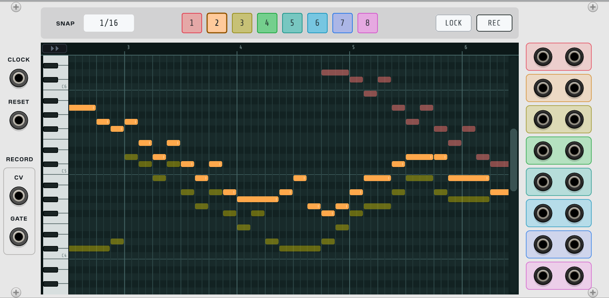

## Piano Roll

Piano Roll is an eight-track note sequencer with a full piano-roll editor. Draw notes on a pitch × time grid, or record them live from any pitch and gate source, and play them back through eight polyphonic V/OCT + GATE pairs. Each track sizes its own polyphony automatically from what you have written, so a monophonic bass line uses one channel while a six-note pad uses six. Notes are events rather than steps, which means a pattern is as long as you want it to be and a note can be anything from a single sixteenth to many bars.

### Quick Start

1. Clock it
   - Patch a clock into the **CLK** input. One pulse advances one sixteenth-note step.
   - Optionally patch a reset into **RST**.

2. Draw some notes
   - Click an empty cell in the grid to paint a note.
   - Click and drag right while painting to set the note's length, or drag up and down to change its pitch before you let go.
   - Drag a note's body to move it; drag either end to resize it.

3. Hear it
   - Patch **V/O 1** and **GT 1** into an oscillator and an envelope.
   - The green playhead sweeps the grid as the clock runs.

4. Add a second part
   - Click track square **2** in the bar above the grid.
   - New notes now land on track 2 and take its colour. Track 1 stays visible, dimmed.
   - Patch **V/O 2** and **GT 2** into a second voice.

### Inputs

- **CLK** - Clock input. One pulse = one sixteenth-note step. There is no clock division, so feed it sixteenths (a x16 clock ratio at four beats to the bar).
- **RST** - Rewinds to the start of the pattern and silences all voices.
- **REC V/O** - Pitch input for recording. Polyphonic.
- **REC GT** - Gate input for recording. Polyphonic.
- **REC VEL** - Velocity input for recording, 0-10V. Polyphonic. Sampled once at each gate's rising edge. Leave it unpatched and recorded notes get the default velocity, exactly as before.

### Outputs

- **V/O 1-8** - Pitch output for each track, C4 = 0V. Polyphonic.
- **GT 1-8** - Gate output for each track, 10V while a note sounds. Polyphonic.
- **VEL 1-8** - Velocity output for each track, 0-10V, matching Rack's MIDI-CV convention. Polyphonic, channel-for-channel with the pitch and gate. The level holds after the gate falls, so an envelope in its release stage still reads the velocity of the note that is releasing.

Each track's channel count is derived from your pattern: it equals the largest number of notes sounding at once anywhere on that track. Downstream modules therefore see an honest channel count rather than a fixed sixteen. Back-to-back notes get a brief gate dip between them so an envelope re-triggers instead of hearing one long note.

### The Control Bar

- **Snap** - The editing grid: `1/16`, `1/8`, `1/4`, `1/2` or `Bar`. Governs painting, moving, resizing and pasting.
- **Scale** - Locks editing to a key. Pick a root and a scale and any note you paint or drag lands on the nearest pitch in that scale - the gesture always succeeds, it just cannot produce a wrong note. Out-of-scale rows darken in the grid while the lock is on. Notes already in the pattern are never moved by it, and recording, pasting and MIDI import are deliberately exempt: the lock governs what the mouse creates. The quantize menu remains the tool for conforming existing material. `OFF` by default.
- **Track 1-8** - The active track. Whatever you draw or record lands here, and only the active track can be edited. The other seven stay on screen dimmed so you can line parts up. Switching tracks clears the current selection.
- **LOCK** - Freezes editing so a finished pattern cannot be disturbed. The grid takes on a red tint. You can still navigate, audition and select; you cannot paint, move, resize, delete, paste, import or record.
- **REC** - Arms recording.

### Editing Notes

The editor has a single implicit tool. What a click does depends on what is under it.

- **Paint** - Click empty grid. The new note reuses the length of the last note you drew.
- **Move** - Drag a note's body. Moving shifts a note by whole snap units, preserving its offset from the grid rather than quantizing it.
- **Resize** - Drag either end of a note. The left end needs a note wider than about ten pixels; zoom in if you cannot grab it.
- **Select** - Click a note to select just that one. Shift-click adds or removes notes one at a time. Shift-drag across empty grid sweeps a selection box; any note the box touches is caught.
- **Move a group** - With two or more notes selected, a box appears around them. Drag anywhere inside it to move the whole selection. Click a single note inside the box to drop back down to just that note. Click empty grid away from the box to dismiss the selection - that first click only deselects, so click again if you want to paint there.

Keyboard commands work while the pointer is over the grid:

- `Delete` / `Backspace` - Delete the selection, or the note under the pointer when nothing is selected.
- `Ctrl+C` / `Ctrl+V` - Copy and paste. Pasted notes land after the last note on the active track, so repeated pastes append. The clipboard is shared between Piano Roll modules and carries no track, which makes copy - switch track - paste the way to move material between tracks.
- `Esc` - Deselect.
- `Ctrl+Z` - Undo. Every gesture is one undo step, and undoing a delete restores the selection too.

### Getting Around

- **Mouse wheel over the grid** - Zoom in and out, anchored on the cursor.
- **Mouse wheel over the keys or the scrollbar** - Scroll through the pitch range.
- **Mouse wheel over the ruler** - Scroll through time.
- **Drag the ruler** - Pan sideways.
- **Drag the scrollbar** on the right - Move through the pitch range. Clicking its trough jumps.
- **The chase button** in the top left corner keeps the playhead in view while the sequence runs. It is on by default. Panning, zooming or scrolling the ruler switches it off; editing notes does not. Click it again to snap back to the playhead.

When the rack itself is zoomed out, the module releases the mouse wheel so it zooms the rack instead. The same applies whenever the editor is locked.

### The Keys Column

Click a key on the left to hear that pitch on the active track, through that track's own outputs. Drag up and down and the note slides with you, holding one gate the whole way rather than re-triggering. The key lights in the track's colour while you hold it. Auditioning changes nothing in the pattern and leaves nothing to undo.

### The Loop

The amber marker in the ruler sets where the pattern wraps. Drag it to change the loop length, which always lands on a whole bar. Everything past it is dimmed.

A note that starts before the marker but runs past it keeps sounding across the wrap, and its tail is drawn at the start of the pattern so you can see what you are hearing. A note that starts *after* the marker never plays at all, and is drawn as an outline to show that it is present but silent.

### The Velocity Lane

The thin strip along the bottom edge of the editor shows each note's velocity as a miniature bar. Click it to expand the lane; click the arrow at its left edge to collapse it again. The lane overlays the lowest rows of the grid rather than resizing it, so nothing jumps when it opens, and whether it is open is saved with the patch.

With the lane open, each note on the active track gets a bar at its start position - drag a bar up or down to set that note's velocity, and the change is audible while you drag. Dragging a bar that belongs to a multi-note selection scales the whole selection proportionally, preserving its dynamics.

When notes are selected, the lane shows only their bars at full strength and the rest ghosted - so to edit one note of a chord, select it in the grid, where the chord's notes are stacked vertically and easy to tell apart, and the lane follows.

Velocity travels with notes through copy, paste, undo, patch save and MIDI - imported files keep each note's recorded velocity, and exports write it back.

### Recording

Patch a pitch source into **REC V/O** and its gate into **REC GT**, arm **REC**, and start the clock. What you play is written to the active track as you play it, over the top of whatever is already there, so you can build a part in passes.

Everything is quantized to the sixteenth-note grid. A note's start snaps to the nearest step - play slightly early or slightly late and it still lands where you meant - and its length is how long you held the note, rounded to whole steps. The note in progress is drawn in red, growing to the playhead, so you can see what you are about to commit.

If a velocity source is patched into **REC VEL**, each note's velocity is captured at the moment its gate opens - velocity is a property of the attack, so a moving CV cannot rewrite a note that is already sounding. All the recording inputs are polyphonic, so a chord from a polyphonic keyboard or MIDI-CV interface records as a chord. A mono pitch source paired with a polyphonic gate source works too. If a source never drops its gate between notes - an arpeggiator at full gate length, or a slid line - a change of pitch splits the recording into separate notes rather than one long smear.

Recording needs a running clock: nothing is captured until the module has seen enough clock pulses to know how long a step is, and stopping mid-note discards that note rather than guessing its length.

### Right-Click on the Grid

- **Quantize** - Snaps note *pitches* to the nearest note of a key and scale. Timing is left alone. Twelve roots and twelve scales, from the modes through to pentatonics and blues - the same list the Scale lock uses.
- **Select all on track** - Selects every note on the active track.
- **Delete all on track** - Clears the active track. Other tracks are untouched, and one press of undo brings everything back.
- **Shift Left / Shift Right** - Rotates notes in time by a musical amount, wrapping around the loop, so a note pushed past the end reappears at the start.
- **Import MIDI...** - Loads a standard MIDI file, replacing the pattern. Notes are quantized to the sixteenth grid, tracks are assigned by MIDI channel where the file uses more than one, and the loop grows to fit. One press of undo puts your pattern back.
- **Export MIDI...** - Writes the pattern as a standard multi-track MIDI file that opens in any DAW.

Both Quantize and Shift act on the selection if you have one, and on the whole active track if you do not. The menu header tells you which.

### Right-Click on the Panel

- **Lock Editor** and **Record armed** - The same switches as the LOCK and REC buttons.
- **Snap** and **Loop length** - The same settings as the control bar and the loop marker.

### Tips

- Patch `V/OCT` to an oscillator and `GATE` to an envelope for the usual voice. The gate dip between consecutive notes keeps repeated notes articulate.
- Because polyphony is derived from your notes, a track only ever uses as many voices as it needs. Write a chord and the channel count follows.
- Notes can be painted past the loop marker as a scratch area, then brought into play by extending the loop.
- Lock the editor once a part is finished. It protects the pattern and hands the mouse wheel back to the rack.
