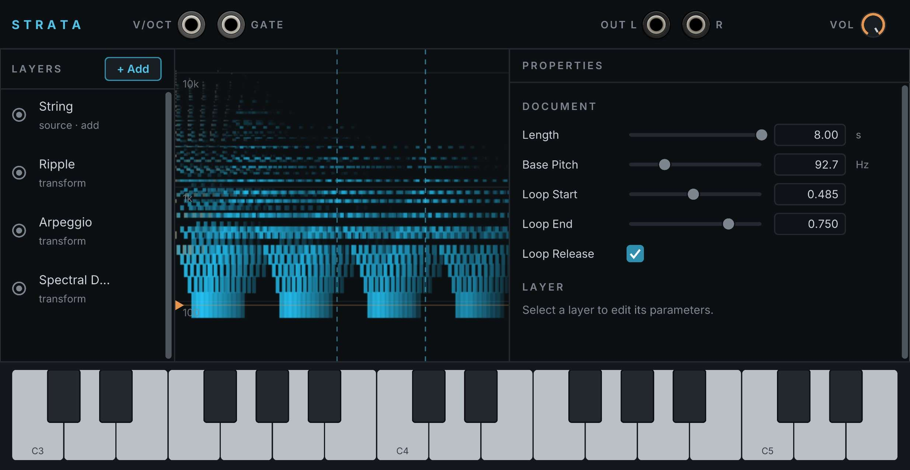

# Strata - Layer-Based Spectral Synthesizer User Manual

## Overview

Strata is a synthesizer voice. You design one sound inside the module, and Strata plays that sound at whatever pitch you send it.

The sound is not a recording. Strata stores a description of which frequencies are present, how loud each one is, and how it all changes over a few seconds. It rebuilds the sound from that description every time you play a note. The description is saved inside your patch, so a saved patch needs no additional files.

You build the sound from a stack of layers. There are 11 layer types that add sound and 16 that change the sound already there. The display in the middle of the panel shows the result while you work.

Strata has eight internal voices, so a note you release keeps fading while you play the next one. It also has a keyboard along the bottom of the panel so you can hear your edits without patching anything.

## Quick Start Guide

A new Strata is empty and makes no sound until you add a layer or load a preset.

**To load a preset:** right-click the panel, choose **Preset**, and pick one of the factory sounds. Click a key on the keyboard along the bottom of the panel to hear it.

**To build a sound:**

1. Click **+ Add** at the top of the LAYERS column and choose **Waveform**. Click a key on the keyboard. You will hear a sawtooth tone.
2. Click the **Waveform** row to select it. Its controls appear in the PROPERTIES column on the right.
3. Set **Shape** to `1` for a triangle wave or `3` for a square wave.
4. Click **+ Add** and choose **Tilt / Peak EQ**. Lower its **Tilt** control to reduce the high frequencies.
5. Click **+ Add** and choose **Transient**. Leave its **Time** control at `0`. The note now begins with a short click.

**To play Strata from your rack:** patch a pitch source into **V/OCT**, a gate into **GATE**, and connect **OUT L** and **OUT R** to your audio output. A gate is a voltage that rises to start a note and falls to stop it. MIDI-CV modules and most sequencers provide both signals.

***

## How Strata makes sound

Strata describes a sound as a grid of time and frequency. At each point on the grid it stores three values:

- **Level**: how loud that frequency is at that moment.
- **Tuning**: the exact frequency of the tonal part.
- **Noisiness**: how much of the sound at that point is noise rather than a steady tone.

When you play a note, Strata moves the tonal part to match your pitch and leaves the noisy part at its original frequencies. Breath and air stay where they were designed while the pitch moves.

Short attack sounds, such as the click of a pick or the knock of a mallet, are stored separately from the grid. Strata calls these transients. It plays them at the same speed at every pitch, so the attack of a low note is as sharp as the attack of a high one. The grid alone cannot produce a sharp attack, because each point on it covers about five milliseconds.

***

## The panel

### The display

The display in the centre of the panel shows the sound you have built.

- Time runs left to right across the length of the sound.
- Frequency runs bottom to top, from `30 Hz` to `16 kHz`, with gridlines at `100 Hz`, `1 kHz`, and `10 kHz`.
- Brightness shows level.
- Colour shows character. Cyan is a steady tone and orange is noise.
- Two dashed vertical lines mark the loop region.
- The orange arrow on the left edge marks the design pitch.
- White marks along the bottom edge show transients.

The display redraws each time you change a control. On a long sound with many layers it can trail your control by a moment. The audio continues without interruption while it redraws.

### The keyboard

Use the keyboard along the bottom of the panel to play the sound while you edit, without patching anything.

- Click a key to play it. Drag across the keys and the pitch follows the mouse.
- Hold the middle mouse button and drag left or right to move to a different part of the keyboard, or point at the keyboard and scroll. The keyboard covers `C0` to `C8` and opens at `C3`.

Playing the keyboard does not stop a note you are holding from the **GATE** input.

### Inputs, outputs, and volume

These controls are along the top of the panel.

- **V/OCT**: pitch, 1 volt per octave. `0 V` plays middle C. Reads one channel. Patching a polyphonic cable here plays only its first channel.
- **GATE**: starts a note when the voltage rises above `1 V` and releases it when the voltage falls below `0.1 V`. Reads one channel, the same as **V/OCT**.
- **OUT L** and **OUT R**: audio output. Strata produces a mono signal and sends the same signal to both jacks.
- **VOL**: output level, `0` to `100%`.

***

## Playing

Patch a pitch source into **V/OCT** and a gate into **GATE**. Strata takes one pitch and one gate at a time.

Strata has eight voices, and each note you play takes one of them. A voice stays busy until its release has finished, which is what lets a note you let go keep fading while you play the next one instead of being cut off. A long **Release** holds voices for longer, so playing quickly can put several voices in use at once.

These eight voices are not Rack's polyphony. Strata reads the first channel of **V/OCT** and **GATE** and ignores the rest, so a polyphonic cable from a MIDI-CV module plays one note, not eight. To play chords, use one Strata per note and feed each one a single channel, splitting the polyphonic cable with a module such as Core **Split**.

While you hold a key, Strata plays from the start of the sound into the loop region, then repeats the loop region. When you release the key the sound fades out. See "How a note ends" below.

Strata reads the pitch when the gate rises. Changing the **V/OCT** voltage during a held note does not change its pitch. Send a new gate to play a new pitch.

Playing the design pitch reproduces the sound as you designed it. Other pitches move it up or down.

***

## Building a sound

The left column lists the layers in your sound. The centre shows the display. The right column shows the controls for the selected layer.

Each layer is either a source or a transform. A source adds sound: a set of partials, a band of noise, a vowel shape. A partial is a single frequency component of a sound. A transform changes the sound that reaches it: an EQ, a blur, a delay.

The list runs top to bottom in the order Strata builds the sound. The first source is at the top and the finished sound leaves at the bottom, so a transform changes every layer above it.

### The layer list

- Click **+ Add** and choose a layer type. Sources are listed first, then transforms. The new layer is added at the end of the list and selected.
- Click a row to select it and show its controls.
- Click the dot at the left of a row to bypass that layer. A bypassed layer stays in the list and makes no sound. Its name dims.
- Move the mouse over a row to show two buttons at its right: duplicate and delete.
- Drag a row up or down to change its position in the list. A line shows where the row will land.
- Scroll with the wheel or drag the scrollbar at the right edge when the list is longer than the column.

You can select one layer at a time.

### The properties column

The **Document** section is always at the top of the column. The controls for the selected layer appear below it, along with a description of that layer.

To change a value, do one of the following:

- Drag the slider. The sound updates while you drag.
- Click the number box, type a value, and press `Enter`. Press `Escape` to cancel.
- Click the checkbox on controls that are either on or off.

### Blend

Each source has a **Blend** setting that controls how Strata combines that layer with the layers below it. Click the Blend row to choose one of eight settings.

| Setting | What Strata does |
|---|---|
| `add` | Adds the two together. This is the default. |
| `multiply` | Keeps sound only where both layers have energy at the same frequency. |
| `max` | Takes the louder of the two at each point. |
| `subtract` | Removes this layer from the layers below it. |
| `min` | Keeps sound only where both layers have energy, at the quieter of the two levels. |
| `screen` | Adds the two together with less build-up in level than `add`. |
| `gate` | Plays this layer only where the layers below it have energy. The layer you hear is this one. The layers below it control when it sounds. |
| `difference` | Keeps sound where the two layers differ in level. |

A **Transient** layer adds no frequency content, only a short attack sound. Setting a Transient layer to `multiply`, `min`, or `gate` therefore silences the whole sound. Use `add` with Transient layers.

### Masks

Every layer has a **Mask** section, closed by default. Click the Mask heading to open it, then click the checkbox to turn the mask on.

A mask limits a layer to a range of frequencies and a period of time. On a source, it limits where that layer adds sound. On a transform, it limits where that transform takes effect.

- **Band Center**, **Band Width**, and **Band Soft** set the frequency range, measured in octaves.
- **Time Start**, **Time Length**, and **Time Fade** set the period of time, measured as a fraction of the whole sound.

Use a mask to apply a transform to only part of a sound, or to make a layer sound only while the note is being released.

### Transpose

Every source has a **Transpose** control that moves that layer up or down in semitones. The box beside it names the interval as you drag, so you can stop at `P5` or `8ve` without counting semitones.

Strata places the layer's partials at their new frequencies rather than shifting a finished sound, so the interval stays in tune at any distance. To play a sound in fifths, add two **Partials** layers with the same settings and set one to `P5`.

### The document settings

The **Document** section sets the properties of the whole sound.

- **Length**: how long the sound is, from `0.25` to `8` seconds.
- **Base Pitch**: the pitch you designed the sound at, from `30` to `2000 Hz`. Strata reproduces the sound exactly at this pitch and transposes it for other pitches.
- **Loop Start** and **Loop End**: the part of the sound that repeats while you hold a key, measured as a fraction of the length.
- **Loop Release**: how a note ends. See below.

***

## How a note ends

The loop region divides the sound into two parts. The part between **Loop Start** and **Loop End** repeats while you hold a key. The part after **Loop End** is the release, which you hear only after you let go. Releasing a key jumps directly to it.

This is why each source has its own **Release** control below its Decay control, rather than one release control for the whole sound. Each layer fades through the release at its own rate. A ringing layer can continue while a breath layer stops immediately. Combine this with a layer's time mask to make a layer sound only during the release.

The release can last no longer than the audio remaining after the loop, which is `Length × (1 - Loop End)`. A two second sound with Loop End at `0.90` leaves 200 milliseconds, so a four second Release setting on a layer is cut short. To lengthen it, raise **Length** or lower **Loop End**.

**Loop Release** in the Document section offers another solution. Leave it off and releasing a key jumps to the part after the loop. Turn it on and Strata continues to repeat the loop region while the sound fades, so the release lasts as long as you set it. Use it when the loop region is near the end of the sound.

***

## Working with layers

**To hear what one layer contributes,** hold a note and click that layer's dot to bypass it, then click it again.

**Layer order changes the result.** A Blur placed before an EQ produces a different sound than a Blur placed after it. Drag rows to compare.

**Resonate needs input that covers a range of frequencies.** It concentrates energy that is already present and cannot add frequencies that are not there. Use it after noise, grains, or inharmonic material. A plain harmonic source changes very little.

**Arpeggio works on tonal material.** Shifting noise blurs it and the steps become indistinct. Use the layer's mask to limit Arpeggio to the tonal part of the sound.

**Set Transient to `Time 0`** unless you want a separate attack sound later in the note. At `0` it sharpens the start of the note. Any other value places the sound later, at `Time × Length` seconds after the note begins.

***

## Presets

Strata includes factory presets. Right-click the panel and choose **Preset** to load one, or to save the current sound as your own preset.

A preset stores every layer and every setting, so loading one replaces the whole sound.

***

## Context Menu Options

#### Clear all layers

Removes every layer and returns Strata to its empty state. Strata does not ask for confirmation, and Rack's undo does not reverse it.

***

## Layer Reference

### Sources

A source adds sound to the layers below it.

| Layer | What it does | Controls |
|---|---|---|
| **Partials** | Adds a series of partials above the design pitch. Stretch spaces them wider or narrower than a harmonic series. Decay Tilt makes higher partials fade faster than lower ones. | Partials, Stretch, Tilt, Odd/Even, Attack, Decay, Decay Tilt, Level |
| **Noise Band** | Adds a band of noise centred on the frequency you set. Breath Rate and Breath Depth add a slow rise and fall in level. | Center, Width, Tilt, Attack, Decay, Breath Rate, Breath Depth, Level |
| **Formant** | Adds vowel-like peaks. The Vowel control moves through `a`, `e`, `i`, `o`, and `u`. The peaks sit on the design pitch, so the sound stays vocal when you transpose it. | Vowel, Width, Bright, Attack, Decay, Breathiness, Level |
| **Transient** | Adds a short attack sound. Color sets its character, from a low thump at `0` to a high click at `1`. Strata plays it at the same speed at every pitch. | Amount, Color, Time |
| **Modal** | Adds the frequencies of a struck object. Material moves between bell, bar, and glass. These frequencies are not a harmonic series, which is what makes the sound metallic. | Material, Modes, Spread, Bright, Strike, Decay, Decay Tilt, Level |
| **Grain Cloud** | Scatters short grains of sound across time and frequency. The Seed control sets the pattern, and the same seed always produces the same pattern. Change Seed to try a different one. | Density, Center, Spread, Grain Len, Tone, Seed, Level |
| **Sweep** | Adds a single resonant peak that moves from the Start frequency to the End frequency across the length of the sound. | Start, End, Curve, Width, Tone, Level |
| **String** | Adds a plucked string. Pluck Pos sets which harmonics sound, Stiffness raises the higher partials in pitch as on a piano, and the attack begins noisy and settles into a tone over the Settle time. | Partials, Pluck Pos, Stiffness, Damping, Bite, Settle, Decay, Level |
| **Chord** | Adds several notes at once on the design pitch. Quality selects octave, fifth, major, minor, minor 7th, or major 9th. Detune spreads copies of each note slightly apart in pitch. | Quality, Spread, Detune, Richness, Tilt, Attack, Decay, Level |
| **Shepard** | Adds octave-spaced tones that rise or fall continuously. Set the loop region over one cycle and hold a key to sustain the effect. | Rate, Bands, Center, Focus, Tone, Level |
| **Waveform** | Adds a standard oscillator waveform: `0` sine, `1` triangle, `2` sawtooth, `3` square. Partials sets how many harmonics it uses. | Shape, Partials, Tilt, Attack, Decay, Level |

### Transforms

A transform changes the sound that reaches it from the layers above.

| Layer | What it does | Controls |
|---|---|---|
| **Gain** | Raises or lowers the level. Settings well above `0 dB` drive Strata's output into saturation. | Gain |
| **Tilt / Peak EQ** | Tilts the level across the frequency range and adds two adjustable peaks of up to `36 dB` each. A high Q setting with a large boost produces a narrow ringing band. | Tilt, Peak 1, Gain 1, Q 1, Peak 2, Gain 2, Q 2 |
| **Blur** | Spreads the sound across frequency, across time, or both. Frequency blur sounds like detuning. Time blur sounds like reverberation. Both raise noisiness. | Freq Blur, Time Blur |
| **Freeze** | Holds the sound as it was at the Position you set. Amount mixes between the moving sound and the held one. | Position, Amount |
| **Shift** | Moves frequencies by a fixed number of hertz, by a musical interval, or both. A fixed shift makes the sound inharmonic. | Freq Shift, Pitch Shift |
| **Spectral Delay** | Delays each frequency band by a different amount. Tilt sets whether high frequencies arrive after low ones or before them. | Delay, Tilt, Feedback, Amount |
| **Bin Crush** | Reduces the detail of the sound. Freq Crush merges neighbouring frequencies and Level Steps rounds levels to a coarse scale. | Freq Crush, Level Steps, Amount |
| **Tonalize** | Moves the tuning of each frequency to the nearest harmonic of the design pitch. Grip sets how far out of tune a frequency can be and still be moved. Clean fades out whatever is left. | Strength, Grip, Clean |
| **Ripple** | Varies the level in a repeating pattern, over time, across frequency, or both. Below about `10 Hz` the time ripple sounds like tremolo. Above that it adds a rough tone. | Time Rate, Time Depth, Freq Rate, Freq Depth, Phase |
| **Arpeggio** | Moves the sound through a chord, one note per step. The pattern is part of the sound, so every note you play uses the same pattern at that pitch. It does not respond to which keys you hold. Turn on Sync to Loop to fit a whole number of steps into the loop region. | Chord, Dir, Range, Rate, Sync to Loop, Gate, Seed |
| **Contour** | Applies a new attack and decay to everything above it. Place it at the end of the list to reshape the finished sound. | Attack, Decay, Curve, Amount |
| **Chop** | Switches the sound on and off in a repeating pattern. Duty sets how much of each cycle is open and Smooth rounds the edges. | Rate, Duty, Depth, Smooth, Phase |
| **Comb** | Passes frequencies near multiples of the Freq setting and reduces the frequencies between them. Set Freq to the design pitch to bring noise into tune with the sound. | Freq, Shift, Width, Depth |
| **Resonate** | Moves nearby frequencies onto the notes of a chord, raises their level, and reduces what falls between them. Chord selects one of 32 chord shapes and Root moves the chord in semitones. The chord follows the pitch you play. | Root, Chord, Width, Resonance |
| **Octaves** | Adds a copy of the sound one octave below and one octave above. | Sub, Up, Amount |
| **Dynamics** | Changes the level of quiet frequencies relative to the loudest one in each moment. A positive Amount raises them. A negative Amount lowers them. | Amount, Threshold, Tilt |

***

## Troubleshooting

**No sound at all.** A new Strata is empty. Add a source layer with **+ Add** or load a preset. If you have layers already, check that their dots are lit. A bypassed layer makes no sound.

**A layer went silent after changing Blend.** A Transient layer set to `multiply`, `min`, or `gate` silences the whole sound, because a Transient layer contains no frequency content. Set it to `add`.

**The release is shorter than the Release control.** The release can last no longer than `Length × (1 - Loop End)`. Raise **Length**, lower **Loop End**, or turn on **Loop Release**.

**Strata is out of tune with the rest of the patch.** Check **Base Pitch**. Strata reproduces the sound exactly at that pitch and transposes it for every other pitch.

**A polyphonic cable plays only one note.** Strata reads the first channel of **V/OCT** and **GATE**. Its eight voices are internal, and they let released notes finish fading rather than accepting eight channels of input. Use one Strata per note to play chords.

**Changing V/OCT during a held note does nothing.** Strata reads the pitch when the gate rises. Send a new gate to play the new pitch.

**Editing feels slow.** Strata rebuilds the whole sound after each change. Longer **Length** settings and more layers take longer. The audio is not interrupted, but the display trails your control.

**Undo does not reverse a layer edit.** Rack's undo does not cover changes made inside the layer editor. Your work is saved with the patch, but deleting a layer or using **Clear all layers** cannot be undone.

***

## Technical Specifications

- **Synthesis**: spectral resynthesis using a bank of sine oscillators and filtered noise, driven by a grid of level, frequency, and noisiness values, with separate time-domain transients
- **Voices**: 8 internal voices, so released notes can finish fading under new ones; the oldest note is replaced when all eight are in use
- **Cable channels**: **V/OCT** and **GATE** read one channel each; Rack's polyphonic cables are not supported
- **Analysis grid**: 1024-point FFT, 256 sample hop, 513 frequency bands, 187.5 frames per second
- **Frequencies per frame**: up to 64 per voice
- **Layer types**: 27 (11 sources, 16 transforms)
- **Blend settings**: 8
- **Sound length**: `0.25` to `8` seconds
- **Design pitch**: `30` to `2000 Hz`
- **V/OCT tracking**: 1 volt per octave, `0 V` = middle C
- **Gate thresholds**: on above `1 V`, off below `0.1 V`
- **Audio output**: ±5 V, mono, sent to both jacks
- **Panel width**: 49 HP
- **Rendering**: Strata rebuilds the sound on a background thread, so editing does not interrupt audio
