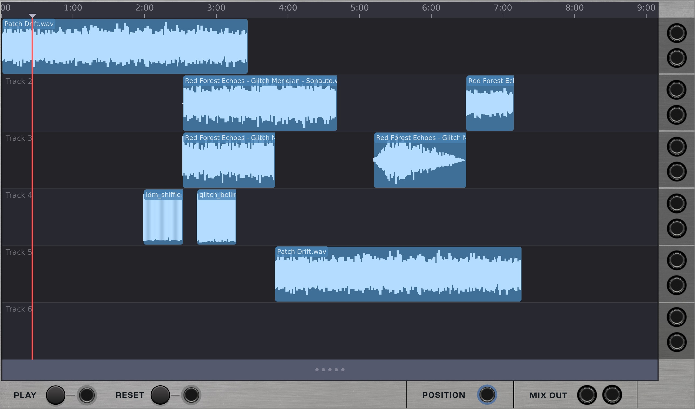
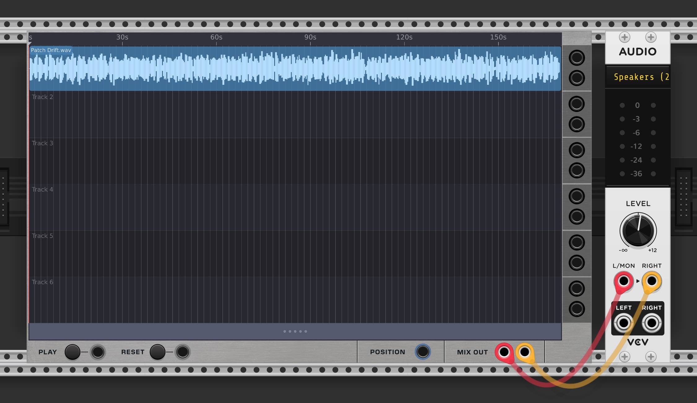
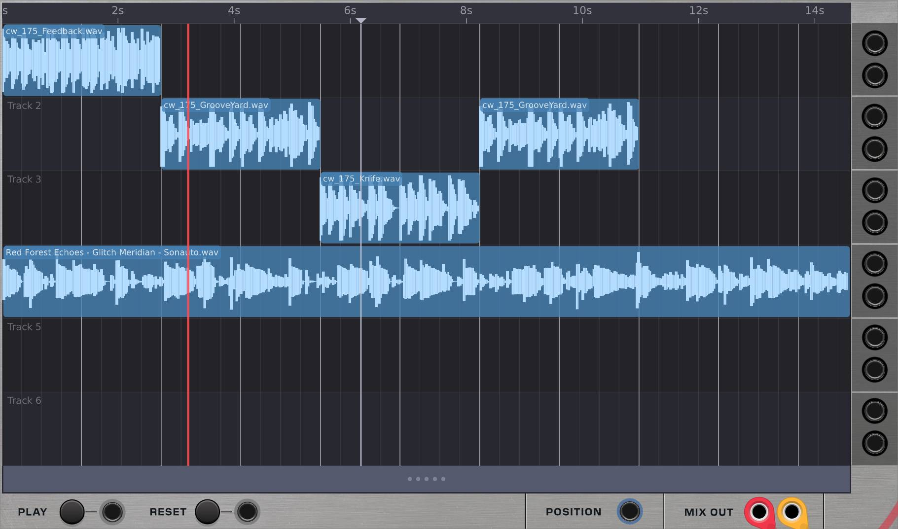
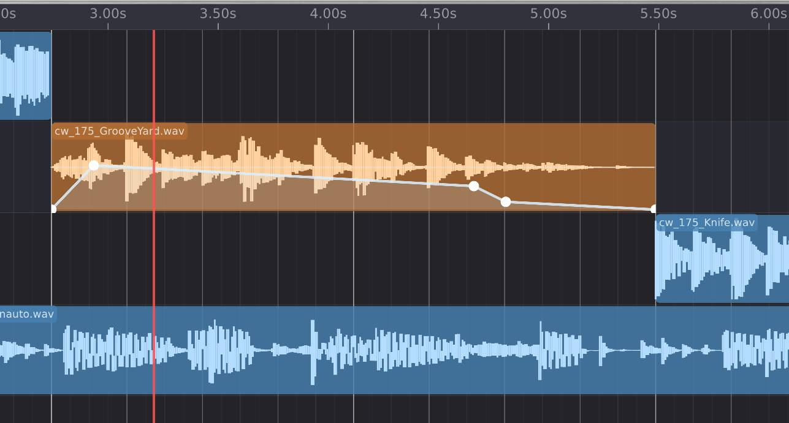
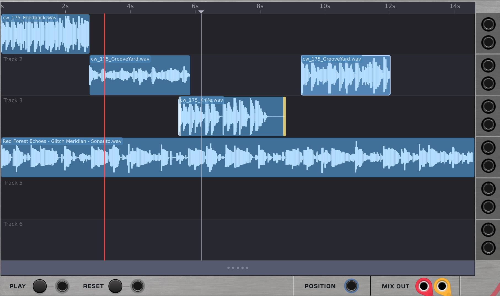
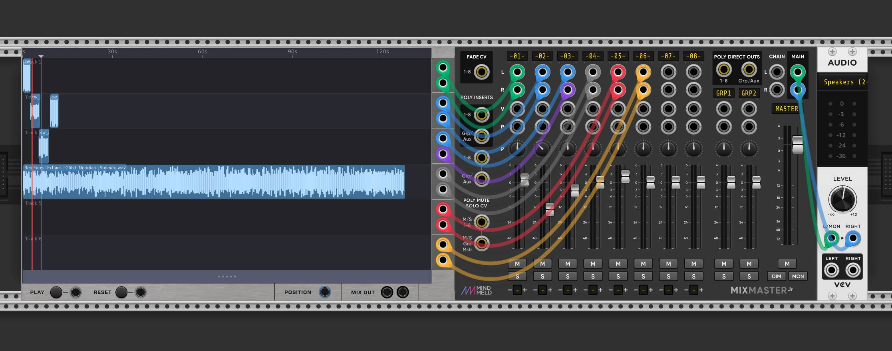
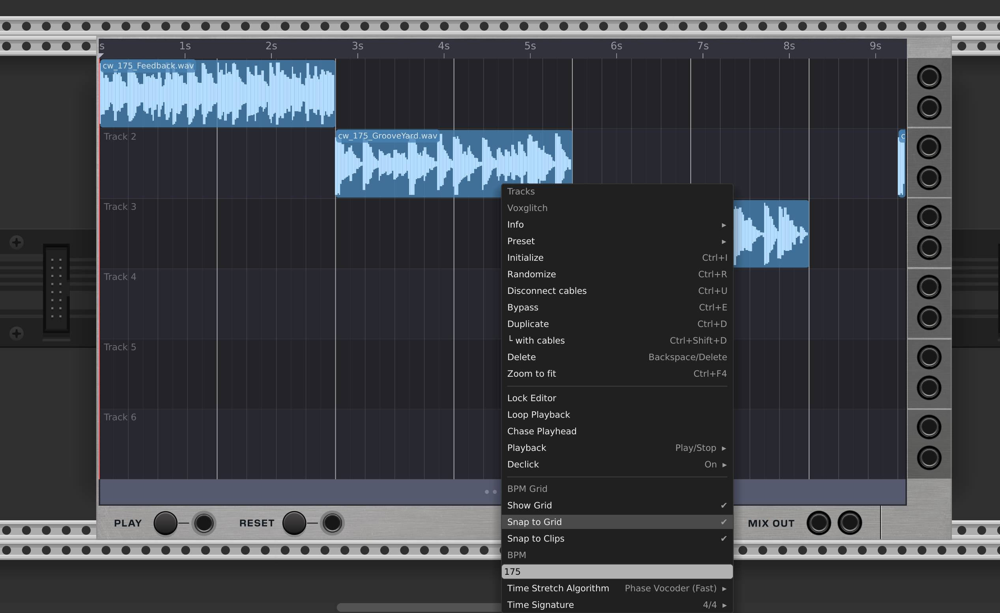

# Tracks - User Manual

## Overview

Tracks is a multi-track audio arranger for VCV Rack. It works like a simplified DAW timeline inside a single module — drag and drop audio files onto tracks, arrange clips on a timeline, and play them back with per-track volume, pan, and mute controls.

Tracks supports up to 6 audio tracks with stereo output per track, plus a stereo master output. It includes time-stretching, warp markers, clip envelopes, reverse playback, undo/redo, and a BPM-synced grid.

## Quick Start

1. Add Tracks to your VCV Rack patch
2. Drag an audio file (WAV, AIFF, MP3) from your computer onto the module's display.  Or, right click on a track and select "Add Sample".
3. Press the **Play** button or hit **Spacebar**
4. Connect **Left** and **Right** master outputs to your audio interface

Audio plays back immediately. Drag additional files onto different tracks to build an arrangement.

### Essential Controls

- Click and drag on the bar under the tracks to pan around the timeline.
- Alternatively, hold control and click on an empty area of the timeline to pan it.
- Use the scroll wheel to zoom in and out

These are also covered later in this manual.

# Chapter 1: The Timeline

## Canvas and Navigation

The main display is a horizontal timeline with up to 6 tracks stacked vertically. Each track is a horizontal lane where audio clips live.

- **Click and drag** on an empty area to pan the timeline left/right
- **Scroll wheel** to zoom in and out horizontally
- **Ctrl + click and drag** to pan freely

Below the last track is a **pan strip** — a narrow bar with grip dots. Click and drag the pan strip to scroll the timeline horizontally. This is an alternative to click-dragging on empty canvas space.

On the left side of the pan strip is a **rewind button** (|◀). Click it to jump the cursor and scroll position back to the beginning of the timeline.

**Double-click** the pan strip to zoom-to-fit. If no clips are selected, the view zooms to fit all clips on the timeline. If any clips are selected, the view zooms to fit just the selected clips.

### The Playhead

The playhead is a red vertical line that shows the current playback position. During playback, audio is read from whatever clips the playhead crosses.

### The Cursor

Click on the timeline ruler (the bar at the top) to position the cursor. The cursor determines where playback starts when you press Play. It appears as a distinct marker on the ruler.  It's also used to determine when to split a clip when using the clip feature available in the clip's context menu.

**Double-click** the ruler to move the playhead to the cursor position. This is useful for repositioning the playhead without stopping and restarting playback.

## Adding Clips

### Drag and Drop

Drag an audio file from your computer onto the timeline. The clip will be placed on the track you drop it on, at the horizontal position where you release the mouse. Supported formats: WAV, AIFF, MP3.

### Right-Click Add Sample

Right-click on an empty area of a track and select **Add Sample** to open a file browser. The selected audio file will be added as a new clip at the position where you right-clicked.

### Clip Display

Each clip shows its waveform. The clip's horizontal width represents its duration on the timeline. Selected clips are highlighted with a distinct border.

## Selecting Clips

- **Click** a clip to select it (deselects all others)
- **Shift + click** to add a clip to the selection
- **Marquee select**: Click and drag on an empty area to draw a selection rectangle. All clips within the rectangle are selected.

## Moving Clips

Click and drag a selected clip to move it along the timeline. You can move clips between tracks by dragging vertically. If multiple clips are selected, they all move together, preserving their relative positions.

## Clip Operations

Right-click a clip for the context menu, or use keyboard shortcuts:

### Copy and Paste

- **Ctrl + C**: Copy selected clips
- **Ctrl + V**: Paste clips at the cursor position

Copy and Paste are also available from the right-click clip context menu.

### Delete

- **Delete** or **Backspace**: Remove selected clips

Also available from the right-click clip context menu.

### Reverse

Right-click a clip and select **Reverse** to toggle reverse playback. A checkmark appears next to the menu item when the clip is reversed.

### Split

Position the cursor within a clip, then press **S** or right-click the clip and select **Split at Cursor**. The clip is divided into two independent clips at the cursor position. The Split option is grayed out if the cursor is not within the clip.

### Join

Select two or more clips on the same track, then right-click and choose **Join Selected Clips** to merge them into a single clip. Gaps between clips become silence segments within the joined clip. The option is grayed out if fewer than 2 clips are selected.

### Duplicate

Right-click a clip and select **Duplicate**. A copy is placed immediately after the original clip.

### Quantize to Grid

Right-click a clip and select **Quantize to Grid** to snap the clip's start position to the nearest beat and time-stretch the clip to fit the grid. This option is only available when the BPM grid is enabled.  This feature is somewhat experimental.  The time-stretch algorithm selected in Track's context menu is used for this operation.

### Restore Original Length

If a clip has been time-stretched, right-click it and select **Restore Original Length** to remove the stretch and return the clip to its original duration.

## Undo and Redo

- **Ctrl + Z**: Undo the last operation
- **Ctrl + Shift + Z**: Redo

# Chapter 2: Clip Envelopes

Each clip has an amplitude envelope that controls its volume over time. This is useful for creating fades, ducking, and shaping dynamics within a clip.

### Entering Envelope Mode

1. Right-click a clip
2. Open the **Edit Mode** submenu
3. Select **Envelope**

The clip enters envelope editing mode, displaying an orange overlay where you can shape the volume curve.

### Editing Points

In envelope mode:

- **Click** on the clip to add a new envelope point
- **Click and drag** a point to move it
- **Delete** or **Backspace** while dragging a point to remove it
- Points are interpolated linearly between each other

### Clearing the Envelope

Right-click a clip that has envelope points and select **Clear Envelope** to remove all points and restore uniform volume.

### Exiting Envelope Mode

Right-click the clip, open the **Edit Mode** submenu, and select **Default** to return to normal clip editing.

# Chapter 3: Warp Markers

Warp markers let you rearrange the internal timing of a clip without changing its overall duration. Each marker anchors a point in the source audio to a position on the timeline. By dragging markers, you can speed up or slow down specific sections — for example, pushing a snare hit earlier or stretching out a vocal phrase — while the clip stays the same length. Audio between markers is pitch-preserving time-stretched using the selected stretch algorithm.

### Entering Warp Mode

1. Right-click a clip
2. Open the **Edit Mode** submenu
3. Select **Warp**

The clip enters warp editing mode with a teal/cyan overlay.

### Adding Markers

Click inside the clip to place a warp marker. A vertical line with a diamond handle appears at the click position. The marker records both where it sits on the timeline (its destination position) and which point in the original audio it corresponds to (its source position).

### Dragging Markers

Click and drag a marker's diamond handle to move it along the timeline. This changes the destination position while the source position stays fixed, which rearranges the timing:

- Dragging a marker **left** compresses the audio before it and stretches the audio after it
- Dragging a marker **right** stretches the audio before it and compresses the audio after it

When you release the mouse, the clip is re-stretched in the background using the currently selected time-stretch algorithm (see Chapter 4).

### Removing Markers

Right-click near a marker to remove it.

### Clearing All Markers

Right-click a clip with warp markers and select **Clear Warp Markers** to remove all markers and restore the clip to its original timing.

### Exiting Warp Mode

Right-click the clip, open the **Edit Mode** submenu, and select **Default** to return to normal clip editing. The warp markers and their timing adjustments are preserved.

### Tips

- Warp markers respect grid snapping — if **Snap to Grid** is enabled, marker positions snap to beat lines
- You can combine warp markers with envelope editing: warp the timing first, then switch to envelope mode to shape the volume
- The stretch algorithm selected in the module's context menu (Granular, Phase Vocoder, etc.) determines the quality of the warp — use Phase Vocoder for tonal material and Granular for percussive content

# Chapter 4: Time Stretching

Clips can be time-stretched to change their duration without changing pitch. This is useful for fitting samples to a specific tempo or creating textural effects.

### Stretching a Clip

Hover over the left or right edge of a clip until the cursor changes to a stretch handle. Click and drag to stretch or compress the clip.

The stretch ratio is displayed while dragging. A ratio of 2.0 means the clip plays at half speed (twice as long). A ratio of 0.5 means double speed (half as long).

### Stretch Algorithms

Right-click the module and open the **Time Stretch Algorithm** submenu to choose from:

| Algorithm | Best For |
|-----------|----------|
| **Granular (OLA)** | Percussive material, drums, transients |
| **Phase Vocoder** | Tonal and melodic content, reference quality |
| **Phase Vocoder (Fast)** | Same as Phase Vocoder but SIMD optimized for lower CPU |
| **WSOLA** | Good all-rounder, waveform similarity overlap-add |

The selected algorithm applies to all new stretch operations. Existing stretched clips retain the algorithm they were stretched with.

# Chapter 5: Outputs and Mixing

### Master Output

The **Left** and **Right** jacks at the bottom of the module output the summed stereo mix of all tracks.

### Per-Track Outputs

Each of the 6 tracks has its own dedicated stereo output pair (Left/Right) on the right side of the module. Use these to route individual tracks to an external mixer such as MindMeld MixMaster for volume, panning, effects sends, and other mixing tasks.

### Mute

Right-click an empty area of a track and toggle **Mute** from the context menu to silence that track. Muted tracks appear with a tinted background on the timeline.

Each track displays a label ("Track 1", "Track 2", etc.) in the upper-left corner of its lane.

# Chapter 6: Transport and Playback

## Play and Stop

- **Play button** on the panel or **Spacebar**: Start/stop playback
- **Reset button** on the panel: Return to the beginning

### Playback Modes

Right-click the module and open the **Playback** submenu to configure how the spacebar and play button behave:

**Spacebar Mode:**

| Mode | Behavior |
|------|----------|
| Pause / Resume | Spacebar pauses at the playhead and resumes from the same spot |
| Play / Stop | Spacebar plays from the cursor position, stops in place |
| Play / Stop (Return) | Spacebar plays from cursor, stops and returns to the cursor |

**Play Button Behavior:**

- **Play from Cursor**: Playback starts at the cursor position
- **Play from Playhead**: Playback resumes from the current playhead position

**Return to Cursor on Stop**: When enabled, the playhead snaps back to the cursor when playback stops.

### Chase Playhead

When enabled, the timeline view automatically scrolls to keep the playhead visible during playback.

### Loop Playback

When enabled, playback loops back to the beginning when it reaches the end of the arrangement.

## CV Control

- **Play input**: A gate or trigger signal to start/stop playback
- **Reset input**: A trigger signal to reset the playhead to the beginning

### Location Output

The **Location** output is a polyphonic output with 12 channels carrying various playback signals:

| Channel | Signal | Description |
|---------|--------|-------------|
| 1 | Phasor | 0-10V ramp representing playhead position across the full timeline |
| 2 | Seconds | Playhead position in seconds |
| 3 | 1/8 Clock | Trigger pulse on every 8th note |
| 4 | 1/16 Clock | Trigger pulse on every 16th note |
| 5 | 1/32 Clock | Trigger pulse on every 32nd note |
| 6 | EOS | End-of-sequence trigger (fires when playback reaches the end) |
| 7-12 | Track Envelopes | Per-track envelope output (0-10V) for tracks 1-6 |

The clock outputs (channels 3-5) are derived from the BPM setting. The track envelope outputs reflect the current amplitude envelope value at the playhead position for each track, making them useful for sidechain-style ducking or envelope following.

# Chapter 7: BPM Grid

### Understanding the BPM Grid

The BPM grid is an arrangement tool — it draws visual gridlines on the timeline and provides snap points for placing clips. It does **not** control playback speed. The playhead always moves at real-time speed regardless of the BPM setting.

This is different from a traditional DAW where BPM drives the transport. In Tracks, audio clips contain real audio at their original sample rate, and the playhead simply reads through them in real time. The BPM grid is a visual overlay that helps you align clips to a musical tempo.

For example, if your clips were recorded at 120 BPM, set the grid to 120 BPM and the gridlines will align with the beats in your audio. If you then change the grid to 140 BPM, the gridlines move but your audio plays back at the same speed — the clips themselves haven't changed. To actually change the tempo of a clip, use time-stretching (see Chapter 3).

The **Quantize to Grid** clip operation (right-click a clip) combines both: it snaps the clip's position to the nearest beat and time-stretches the clip so its length matches the grid. This is how you conform clips to a new tempo.

### Setting the BPM

Right-click the module and enter a BPM value in the **BPM** text field (accepts values from 20 to 999). The grid lines will update to match.

### What the Grid Shows

The grid displays up to three levels of detail, depending on your zoom level:

- **Bar lines**: The strongest lines, marking the start of each bar
- **Beat lines**: Medium lines subdividing each bar into beats
- **Subdivision lines**: Faint lines showing half-beat and quarter-beat subdivisions

As you zoom in, finer subdivisions become visible. As you zoom out, only bar lines remain. The grid adapts automatically.

### Grid Options

- **Show Grid**: Toggle grid line visibility
- **Snap to Grid**: When enabled, clips snap to the nearest visible grid line when moved or placed
- **Snap to Clips**: When enabled, clips also snap to the start and end edges of other clips on any track.  If snap to clip is disabled, it's possible to overlap clips.  

### Time Signature

Right-click and open the **Time Signature** submenu to choose from 2/4, 3/4, 4/4, 5/4, 6/4, 7/4, or 8/4. This determines how many beats make up a bar, which affects where the strong bar lines appear.

# Chapter 8: Additional Features

## Lock Editor

Right-click and enable **Lock Editor** to prevent accidental edits. When locked, clips cannot be moved, added, deleted, or modified. Playback still works normally. This is useful during performance.

## Declick

Right-click and open the **Declick** submenu to configure automatic fade-in/fade-out at clip boundaries. This prevents clicks and pops when clips start or stop abruptly.  This is enabled by default.

- **Enabled**: Toggle declicking on or off
- **Fade Length**: Choose from Minimal (~0.7ms), Short (~1.5ms), Medium (~3ms), or Long (~6ms)
- **Curve**: Choose Linear, Equal Power, or S-Curve fade shapes

## Global vs. Per-Module Settings

Some settings in Tracks are stored **per-module** (saved with your patch), while others are stored **globally** in the Voxglitch configuration file (shared across all Tracks instances and persisted across sessions).

This means that if you change a global setting on one Tracks module, it takes effect on every other Tracks module in every patch. It also means that when you add a new Tracks module to a patch, it inherits whatever global settings are currently active.

### Per-Module Settings (saved with the patch)

These are stored inside the VCV Rack patch file and are independent for each Tracks module:

- BPM
- Time Signature
- Show Grid / Snap to Grid
- Loop Playback
- Lock Editor
- All clip data, track names, volume, pan, and mute states

### Global Settings (shared across all instances)

These are stored in the Voxglitch configuration file and apply to every Tracks module:

- Spacebar Mode (Pause/Resume, Play/Stop, Play/Stop Return)
- Play Button Behavior (Play from Cursor vs. Play from Playhead)
- Return to Cursor on Stop
- Chase Playhead
- Snap to Clips
- Time Stretch Algorithm
- Declick settings (Enabled, Fade Length, Curve)

The configuration file is located at:

- **Windows**: `%LOCALAPPDATA%/Rack2/Voxglitch/settings.json`
- **macOS**: `~/Library/Application Support/Rack2/Voxglitch/settings.json`
- **Linux**: `~/.local/share/Rack2/Voxglitch/settings.json`

You generally don't need to edit this file directly — all global settings are accessible through the right-click context menu.

## Dark Theme

Tracks supports VCV Rack's dark panel theme. The panel automatically switches when you toggle dark panels in VCV Rack's View menu.

## Keyboard Shortcuts Reference

| Shortcut | Action |
|----------|--------|
| Spacebar | Play / Stop (configurable) |
| Ctrl + Z | Undo |
| Ctrl + Shift + Z | Redo |
| Ctrl + C | Copy selected clips |
| Ctrl + V | Paste at cursor |
| S | Split selected clips at cursor |
| Delete / Backspace | Delete selected clips (or delete envelope point while dragging) |
