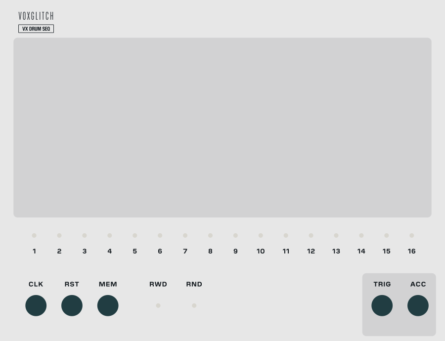

## VX Drum Sequencer

VX Drum Sequencer is a 16-step drum pattern sequencer built to sit under VX Drums: six voice lanes plus an accent lane, ratchets on any hit, a length per pattern, lane mutes, sixteen pattern memories with CV selection, and a clock input with reset so it runs from whatever clock the rest of your patch runs from. It talks to the kit through two cables - a polyphonic TRIG carrying the six voices and a separate ACC carrying the accent - and because both are ordinary 10 V triggers it will drive any other drum module just as well.

### Quick Start

1. Stack the panels
   - Place VX Drums directly above VX Drum Sequencer; both are 30 HP.
   - Patch **TRIG** to the kit's **TRIG** (one polyphonic cable, six voices) and **ACC** to the kit's **ACC**.

2. Clock it
   - Patch a clock into **CLK**: one pulse per step, so feed it sixteenths. There is no internal clock, so nothing plays until a clock arrives.
   - Patch your clock module's reset output into **RST**. A reset makes the next clock play step 1, and a clock pulse on the same sample as the reset plays it immediately.

3. Edit the beat
   - Memory 1 arrives with a starter beat: kick on the beats, closed hats on the eighths, a clap on 2 and 4, open hats pushing into 3 and 1, accents on 1 and 3.
   - Click a pad to place or remove a hit; click and drag to paint. You hear the change while you drag.
   - The white outline chases the playing step and the lane labels flash as their lane fires.

4. Make a variation
   - Press memory button **2**. The grid is empty: draw a second pattern and switch between the two with the buttons. Or right-click button 1, choose **Copy**, then right-click button 2 and **Paste**, and start from the first one instead.

### Inputs

- **CLK** - Clock input, the only source of timing. One pulse = one step, a sixteenth at four beats to the bar. There is no clock division, so feed it sixteenths (a x16 ratio on a module like Clocked). A rising edge that reaches 2 V advances the pattern, and the line must fall back to 0.1 V before the next edge counts. Nothing plays until a pulse arrives, and unplugging the clock stops the pattern where it is.
- **RST** - Reset. A rising edge cancels any hits still waiting to fire, rewinds the pattern and makes the *next* clock play step 1. See "Reset and the First Step" below for exactly what happens in each situation. The **RWD** button does the same thing.
- **MEM** - Memory select CV, 0-10 V across the sixteen memories: 0 V is memory 1, every further 0.625 V moves up one, and 10 V is memory 16. While a cable is connected the CV owns the selection: the buttons lock, presses are ignored, and the lit button follows the CV. Unpatch it and the button you last pressed takes over again. A change of memory takes effect at the next step; hits already in flight finish, and if the new memory is shorter than the step you are on, the next step is step 1.

### Outputs

- **TRIG** - Polyphonic trigger output, six channels in the kit's order: 1 bass drum, 2 snare, 3 clap, 4 percussion, 5 closed hat, 6 open hat. Every hit is a 10 V pulse, 1 ms long by default (see "Right-Click on the Panel"). Each hit is guaranteed its own rising edge: a hit that lands while the channel is still high drops it to 0 V for one sample first, so ratchets and fast clocks never merge into one long pulse. A muted lane's channel stays silent.
- **ACC** - Accent output, mono. A 10 V pulse of the same length. It rises on every accented step - on the same sample as the hits on that step, so the kit reads it at the trigger instant - and again with each ratchet repeat of those hits. An accented step with no hits still pulses ACC (it makes no sound through the kit, but the pulse is there for anything else you patch it to). Patch it to the kit's ACC input. It stays silent while the accent lane is muted.

### Controls

- **1-16** - The memory buttons. Press one to choose the memory that plays and that the grid edits. The lit button is the memory playing right now; under MEM CV it follows the CV and presses are ignored. Right-click any button for Copy, Paste and Clear (see "Memories").
- **RWD** - Rewind. Identical to a pulse at RST.
- **RND** - Random. Writes a new beat into the memory that is playing right now, with a sensible role per lane: the kick on the downbeats (and always on step 1), snare and clap on the backbeat, the percussion lane only off the beat, closed hats busy on the eighths with sixteenth fills, open hats on the offbeat eighths, accents on 1 and 3 with the occasional push. It sprinkles in a few ratchets and keeps the memory's length. One undo step. By default it rewrites all seven lanes; **Randomize settings** in the right-click menu narrows that to the ones you tick, so you can re-roll just the hats and keep the kick you like.

### The Grid

The dark display is the pattern in the memory that is playing. Across the top is the lamp row with the memory's length; down the left are the lane labels; the six voice lanes come first, and the accent lane **AC** sits apart underneath. The columns are shaded in groups of four so the beats read at a glance.

- **Place a hit** - Click an empty pad. Click a lit pad to remove it.
- **Paint** - Click and drag. Whatever the first pad became, on or off, is painted across every pad you cross, and you hear the result while you drag. One drag is one undo step. The edit goes to the memory that was playing when you pressed, so a MEM CV change during the drag cannot redirect it.
- **Accent** - A hit in the AC lane makes every voice on that step hit harder (and, through the kit, brighter). It makes no sound of its own, though the ACC jack still pulses on that step.
- **Length** - Click a lamp in the top row to set this memory's length: click lamp 12 and the pattern is twelve steps long. Pads past the length draw dimmed but keep their hits, so shortening a pattern loses nothing. The `LEN` readout shows the current length. Each memory has its own length.
- **Mute** - Click a lane label to mute that lane; click again to unmute. A muted lane dims red and neither sounds nor pulses at TRIG. Muting AC removes the accent boost and the accent lamp. Mutes are global rather than part of a memory - they survive a memory change - and are saved with the patch.
- **Ratchets** - Shift-click a lit voice pad to step it through `x2`, `x3`, `x4` and back to `Single`, or right-click it and pick one from the menu. The step subdivides into that many evenly spaced hits, each at the same strength as the step (accent included), and the pad splits into slivers so you can read the roll at a glance. A closed-hat ratchet re-chokes the open hat on every repeat. The accent lane has no ratchets. The sequencer measures the incoming clock's period to place the repeats, so the first pulse after connecting plays single hits and everything after subdivides correctly.
- **Chance** - Right-click a lit pad and open **Chance** to give it a probability: 100 % (the default), 75, 50, 25, 10 or 0. Each time the step comes round the pad rolls once; a hit that fails its roll does not play, does not ratchet and does not flash its lane. A pad below 100 % draws dimmer the less likely it is, so a hit that only sometimes plays reads that way at a glance. The accent lane has chance too, for an accent that only sometimes lands. Chance is part of the memory, so it copies, pastes, exports and saves with the pattern; RND resets every pad it writes to 100 %. Like a ratchet, a pad's chance stays with the pad when you paint it off, so relighting it brings the same odds back. For finer control than the presets, turn on **Chance mode** (see "Right-Click on the Panel").
- **Playhead** - A white outline surrounds the playing column, the red lamp above it chases, and a lane label flashes when its lane fires (AC flashes red). Before the first clock, and after a reset, no step is playing yet.

### Memories

Sixteen patterns live behind the numbered buttons. A memory is its grid - the seven lanes of hits, each hit's ratchet and chance, and the length. The kit knobs and the lane mutes are not part of a memory: sound design lives on VX Drums and stays put across all sixteen.

- **Select** - Press a button. Under MEM CV the buttons lock and the CV chooses (see Inputs).
- **Copy / Paste / Clear** - Right-click a button. The menu is headed with the memory's number. **Copy** puts the memory on your system clipboard as text. **Paste** writes the clipboard into that memory, and is greyed out unless the clipboard holds a copied memory. **Clear** empties it and sets its length back to 16. Because it is the system clipboard, a copied memory pastes into any VX Drum Sequencer - another instance in the same patch, a different patch, a later session - and can be kept in a text file. Paste and Clear are undoable.
- **Initialize** (the module's context menu) restores the starter beat in memory 1, clears the other fifteen, unmutes every lane, selects memory 1 and sets the trigger length back to 1 ms.
- **Randomize** (the module's context menu) randomizes the playing memory the same way the RND button does. The sequencer has no knobs or switches, so nothing else changes.

### Reset and the First Step

The sequencer keeps no position until something plays: after loading a patch, a reset or a rewind it is "before step 1", and the first thing that fires is step 1. In plain words:

- **A reset makes the next clock play step 1.** Nothing fires at the instant of the reset itself; whatever was waiting to fire - the rest of a ratchet - is cancelled, and the voices ring out.
- **A clock pulse arriving on the same sample as the reset plays step 1 immediately.** The clock is checked after the reset, so a master that raises its reset and its clock together - a Clocked-style master, or Timeline's loop wrap with RST patched - lands step 1 exactly on the downbeat, never one pulse late.
- **A reset while the clock line is still high does not fire.** The line has to fall and rise again, and that rise plays step 1.
- **A mid-bar reset from a clock master:** if you press reset on your clock module part-way through a bar and only its clock is patched here, VX Drum Sequencer waits for the master's next pulse and plays step 1 on it. So for resets to land where you press them, patch the master's reset output into **RST** as well as its clock into **CLK**. A master that restarts its own clock on reset then delivers the two together, and step 1 plays at once.
- Ratchets keep using the clock period measured before the reset, so a ratchet on step 1 still subdivides sensibly; the period is measured afresh on the pulse after that.

There is no window after a reset during which clock pulses are ignored, and there is no need for one: a clock pulse only ever counts on its rising edge, so a line that is still high cannot fire a phantom step.

### Chaining Sequencers

Place two or more VX Drum Sequencers side by side, touching, and they play one after another as a single longer pattern. No cables are needed between them.

- **The leftmost sequencer is the head.** Its **CLK** and **RST** drive the whole chain; the others' CLK and RST are inert while they are members, so patch the clock and reset into the head only.
- **Every member's TRIG and ACC carry the whole chain's hits**, identical on each. Patch the kit from whichever sequencer sits nearest it, usually the rightmost, so a row reads left to right into VX Drums. Use one, not several: the members' copies run one sample behind the head's, so mixing the two would double every hit.
- **Each member plays its own memory from step 1 to its length**, then hands off to the sequencer on its right. The last one hands back to the head. Two sequencers at length 16 give a 32-step pattern; three give 48; members can have different lengths.
- **Every member still chooses what it contributes.** Its memory buttons, its **MEM** CV input and its lane mutes all work as before, so a MEM CV into a member changes which of its sixteen memories plays in its slot of the chain. The trigger length is the head's.
- **The grid shows the playhead only while that member is playing**, and its lanes flash only for its own hits, so a chain reads left to right as the pattern moves through it.
- **Reset and RWD on the head return the chain to the head's step 1.** A member's own RWD button does nothing while it is a member.
- **The hand-off is seamless.** The clock that would have wrapped the member instead plays the next member's step 1, and ratchets on a member's last step finish while the next member starts.
- Adding a sequencer to the right of a running chain adds it at the end; removing one restarts the chain from the head. Moving a sequencer away from the chain makes it a lone sequencer again, ready to be patched on its own. The right-click menu shows the sequencer's place in a chain.

Because the chain is by placement, drop a member out of the row to audition it alone, then push it back into place.

### Right-Click on the Panel

- **Chain: head of N / member M of N** - Shown only while the sequencer is part of a chain (see "Chaining Sequencers"). Information only.
- **Randomize settings** - Which lanes the **RND** button rewrites. All seven are ticked by default; untick one and it keeps every hit it has, chance and ratchets included, while the others are re-rolled. **All** and **None** at the bottom set them in one go. Unticking a lane does not change what the ticked ones draw: re-rolling only the hats gives the same hats a full randomize would have given. The setting is saved with the patch, and it applies to **Randomize** in the module's own menu too.
- **Chance mode** - Off by default. When it is on, every lit pad draws as a bar whose height is its chance, with a faint ghost of the full pad behind it so a low bar still reads as a hit. Drag up or down on a lit pad and the bar follows the pointer - the top of the pad is 100 %, the bottom 0 % - with the number showing in the pad while you drag; a click without a drag still toggles the pad on or off, so you never have to leave the mode to edit the beat. Painting across pads is off in Chance mode. Shift-click and the right-click menu work as always. Length, mutes and everything else are unchanged. One undo step per drag. The setting is saved with the patch.
- **Export pattern… / Import pattern…** - Save the memory that is playing right now to a JSON file, or replace it with one from a file. The file is the same format the memory buttons put on the clipboard, so a pattern copied in one patch can be saved for another. Import is one undo step.
- **Clear pattern** - Empties the memory that is playing right now and sets its length back to 16, the same as **Clear** on its memory button. One undo step.
- **Trigger length** - The length of the pulses at TRIG and ACC: 1, 2, 5, 10, 20, 50, 100 or 200 ms. The default 1 ms is the standard for triggers and is all VX Drums needs; pick a longer one for a downstream module that wants a wider pulse. Whatever the length, every hit still gets its own rising edge. The setting is saved with the patch.

### Tips

- Start with **RND**, then edit - deleting the wrong hits from a real beat is faster than placing the right ones on silence. It seasons lightly with ratchets too.
- A `x2` on the last closed hat of the bar is the cheapest fill there is; a `x3` snare on step 15 announces the next section.
- For shuffle, swing the clock: a clock module with a swing control (or a swung gate sequence into **CLK**) moves the offbeat sixteenths, and the pattern follows it.
- An accent every 3 steps against a 4-step kick (accents on 1, 4, 7, 10, 13, 16) is the cheapest polyrhythm in the book.
- Memories are patterns, not kits - sound design lives on VX Drums and stays put across all sixteen, so a CV sequence into **MEM** plays an arrangement, not presets. Sequencing MEM is one way to chain patterns into a song; placing sequencers side by side is the other (see "Chaining Sequencers"), and the two combine: a MEM CV into a chain member picks which of its memories takes that slot each time round.
- Feed CLK and RST from the same master and every reset lands on the downbeat.
- TRIG is an ordinary six-channel trigger bus: a Split module hands its channels to any other drum voices, and the ACC pulse is a free "hit harder" gate for whatever else you patch it to.
