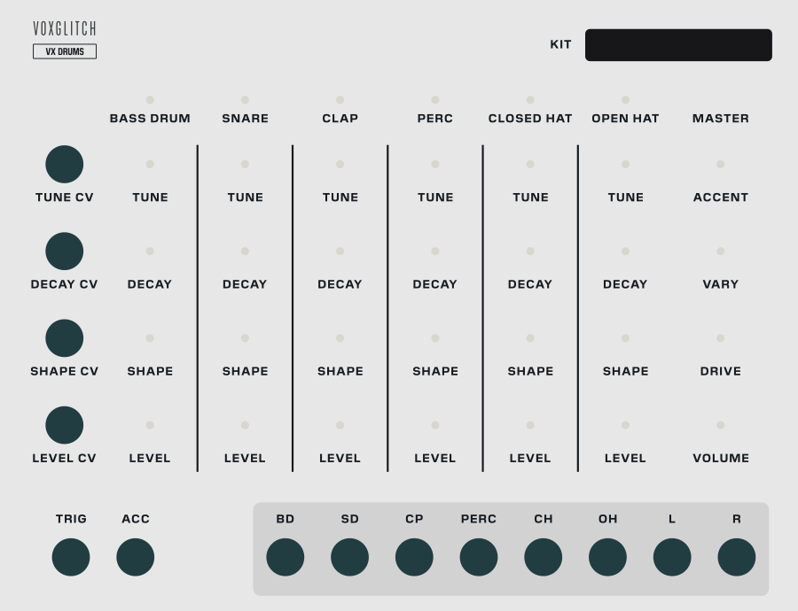

## VX Drums

VX Drums is a six-voice drum kit - kick, snare, clap, a percussion voice and a pair of hi-hats - with a polyphonic trigger input, an accent input, four polyphonic CV inputs that reach every knob, a stereo mix and an individual out per voice. Every sound is synthesized, analog-style circuits rather than samples, so the knobs reshape the drums themselves and not a recording of them. Seven **kits** swap the circuits behind the six columns - an 808 snare in place of the 909, an FM kick, a 909 or a gated clap in the clap column, a tom or a ringing snare in the percussion slot - and every knob keeps working the same way whichever kit is loaded. It is the kit half of a two-panel drum machine: stack it above VX Drum Sequencer and join them with two cables, or fire it from any trigger source in your patch.

### Quick Start

1. Stack the panels
   - Place VX Drum Sequencer directly below VX Drums. Both are 33 HP, so the two panels line up as one machine.
   - Patch the sequencer's **TRIG** output into the kit's **TRIG** input. That is one polyphonic cable carrying all six voices.
   - Patch the sequencer's **ACC** output into the kit's **ACC** input.
   - Patch **L** and **R** to your mixer.

2. Clock it
   - Patch a clock into the sequencer's **CLK** input, one pulse per sixteenth, and its reset into **RST**. The sequencer has no clock of its own.
   - The sequencer's memory 1 arrives with a starter beat, so you should hear kick, hats and claps straight away.

3. Shape the kit
   - Each of the six voice columns is one drum, with the same four knobs top to bottom: `TUNE`, `DECAY`, `SHAPE`, `LEVEL`. The bottom row is that voice's level, so read it as a mixer.
   - The light above a column flashes each time that voice is struck.
   - Click the **KIT** display at the top right to pick a kit. House is the one you start with.

4. Or leave the sequencer out
   - Anything that makes an edge fires a voice: a Euclidean sequencer, a gate lane, a clock divider, a Piano Roll gate, a comparator watching an envelope. Use a Merge module to build the polyphonic trigger cable, or plug a mono cable straight into **TRIG** to play the bass drum.

### Inputs

- **TRIG** - Polyphonic trigger input, one channel per voice: channel 1 bass drum, 2 snare, 3 clap, 4 percussion, 5 closed hat, 6 open hat. A rising edge that reaches 2 V strikes the voice, and the channel has to fall back to 0.1 V before it can strike again. A mono cable fires only the bass drum, and any channel the cable does not carry stays silent. Striking a voice while it is still ringing restarts it, which is how a drum machine flams.
- **ACC** - Accent gate. A voice struck while ACC is at 2 V or above hits harder *and* brighter, because the accent drives each voice's own circuit harder rather than just turning it up; the **ACCENT** knob sets how much harder. The gate is read at the instant of the trigger, so it only has to overlap the edge, and a stale gate cannot accent a later hit. A mono cable accents every voice; a polyphonic cable accents per voice, channel for channel with TRIG.
- **TUNE / DECAY / SHAPE / LEVEL CV** - Four polyphonic CV inputs in the column left of the knobs, one per knob row. Each channel of a cable modulates one knob on that row: channel 1 the bass drum's, 2 the snare's, 3 the clap's, 4 the percussion voice's, 5 the closed hat's, 6 the open hat's. Channel 7 reaches the master strip: on the TUNE row it modulates `ACCENT`, on the SHAPE row `DRIVE`, on the LEVEL row `VOLUME`; the DECAY row has no master knob, so its channel 7 does nothing. A mono cable is copied to every knob on the row, so one LFO into TUNE CV sweeps all six drums at once and a polyphonic cable addresses them one by one; channels the cable does not carry leave their knobs alone. The CV is added to the knob position: 10 V is the knob's full travel, so +5 V pushes a knob up by half its range and -5 V pulls it down by half, and the result is clamped to the ends of the knob. The knobs themselves do not move, and their tooltips keep showing the knob position. The CV is read every 16 samples, fast enough for any LFO or envelope and cheap enough that a fast sweep on TUNE costs nothing.

### Outputs

- **BD / SD / CP / PERC / CH / OH** - Individual outs, one per voice, dry: level and accent applied, drive and volume not. Taking a voice out does not remove it from the mix, so turn its level down there if you want it fully separate.
- **L / R** - The stereo mix. The voices sit at subtle fixed pans - bass drum and snare centred, clap a little left, percussion a little right, the two hats split slightly either side - and pass through the master **DRIVE** and **VOLUME**.

### Controls

Seven columns of knobs: one per voice, then the master strip. The knobs are global - with the sequencer, patterns change with the memory buttons while the kit stays put, exactly like the hardware this is modelled on.

Every voice column carries the same four knobs, top to bottom:

- **TUNE** - The pitch of the drum, or the tone centre for the noise-based voices. Each model has its own range - 30-100 Hz for the 808 kick, 100-400 Hz for the layered snare, 600-2500 Hz for the clap - and the tooltip shows the value in the model's own units.
- **DECAY** - How long the voice rings, in seconds. Again the range belongs to the model: a rimshot runs 20-150 ms, an open hat up to 1.2 s, the 808 kick up to 1.5 s.
- **SHAPE** - The one knob that means something different for every model: punch on a kick, snap on a snare, the burst spacing on a clap, the crunch on a lo-fi clap, drive on a rimshot, the ring ratio on a ringing snare, metal on a hat. Hover for the tooltip - it is labelled with the column and the model's own word for the knob, `BD Punch`, `SD Snappy`, `PERC Ratio` - and see "Models" below for what SHAPE does in each one.
- **LEVEL** - 0-120 %. It scales the voice into both the mix and its individual out.
- **MASTER** - `ACCENT` is how much harder an accented hit lands, the boost applied to a voice struck while ACC is high; `VARY` is how much every hit is allowed to differ from the last; `DRIVE` is one knob of saturation on the stereo mix; `VOLUME` is the output level.
- **VARY** - At 0 the kit plays exactly as the knobs are set. Turn it up and every strike draws its own random offsets for that voice's `TUNE`, `DECAY`, `SHAPE` and `LEVEL`, held for the whole hit, so a pattern stops sounding like the same sample repeated. The offsets are scaled per row: at full VARY a hit can move `DECAY` and `LEVEL` by up to a quarter of the knob's range and `SHAPE` by up to 30 %, but `TUNE` by only 8 %, so drums drift like a player rather than turning into a melody. The knobs themselves do not move; the spread is added on top of the knob and any CV, and clamped to the knob's range.

The knobs are physical: their positions stay where they are when you change kit or model, and only the meaning of each position changes with the new range. A knob at the middle of its travel is the middle of whatever range the new model has. Double-clicking a `TUNE`, `DECAY` or `SHAPE` knob resets it to the current model's default, and "Reset knobs to model defaults" in the right-click menu does that for every voice at once.

The column labelled **PERC** is the percussion slot. In the House, TR-808 and TR-909 kits it is a rimshot; Layered and Industrial put a tom there, Hardcore a ringing snare, Eighties a sweep snare, and you can put any model in it yourself (see "Right-Click on the Panel").

The closed hat chokes the open hat, the classic trick for playing a hi-hat line on one pair of circuits: a closed-hat trigger cuts an open-hat tail exactly as it does on the hardware. The choke belongs to the columns, not to the sounds - a strike in the closed-hat column always chokes whatever is in the open-hat column. Hat models fade out when choked; any other model placed in the open-hat column ignores the choke.

The kit has no timing controls of its own. Tempo, swing and the pattern all belong to whatever is sending the triggers.

### Kits

A kit is a named set of six models, one per column. The **KIT** display at the top right shows the kit that is loaded; click it and pick another from the list. The change is immediate, the knobs stay where they are, and it is one undo step.

| Kit | Bass drum | Snare | Clap | Perc | Closed hat | Open hat |
|---|---|---|---|---|---|---|
| **House** (default) | Kick 808 | Snare 909 | Clap 808 | Rimshot | Closed Hat | Open Hat |
| **TR-808** | Kick 808 | Snare 808 | Clap 808 | Rimshot | Closed Hat | Open Hat |
| **TR-909** | Kick Sine | Snare 909 | Clap 909 | Rimshot | Closed Hat | Open Hat |
| **Layered** | Kick Sine | Snare Layered | Clap 808 | Tom | Closed Hat | Open Hat |
| **Industrial** | Kick Distort | Snare Ring | Clap 808 | Tom | Closed Hat | Open Hat |
| **Hardcore** | Kick FM | Snare 909 | Clap 808 | Snare Ring | Closed Hat | Open Hat |
| **Eighties** | Kick Sine | Snare Gate | Clap Gate | Snare Sweep | Closed Hat | Open Hat |

House is the kit's original sound. A fresh module starts on it, and Initialize returns to it. When any column has been overridden with a model of your own choosing (see below), the display adds a `*` after the kit name.

### Models

A model is one drum circuit reduced to three knobs. Each has its own natural range for `TUNE` and `DECAY`, and its own job for `SHAPE`:

| Model | TUNE | DECAY | SHAPE |
|---|---|---|---|
| **Kick 808** | 30-100 Hz | 0.05-1.5 s | Punch - the pitch-sweep attack. The 808 mechanism: a struck resonator, no oscillator. |
| **Kick Sine** | 20-200 Hz | 0.05-1 s | Punch - the pitch-sweep attack on a clean sine kick. |
| **Kick FM** | 30-120 Hz | 0.1-1 s | FM - the depth of the frequency modulation. |
| **Kick Distort** | 30-120 Hz | 0.1-1 s | Drive - saturation on the kick; past about 60 % it starts to wavefold as well. |
| **Snare 909** | 120-280 Hz | 0.05-0.5 s | Snap - the noise-to-shell balance. Two shell modes plus a noise tail. |
| **Snare 808** | 100-300 Hz | 0.03-0.5 s | Snappy - the amount of snare rattle over the shell. |
| **Snare Layered** | 100-400 Hz | 0.05-0.5 s | Snap - the noise-to-shell balance of a layered body-plus-noise snare. |
| **Snare Ring** | 100-400 Hz | 0.05-0.5 s | Ratio 1-4 - the frequency ratio of the ring modulation against the shell. |
| **Snare 606** | 120-400 Hz | 0.03-0.4 s | Snappy - the paper snap against a thin, fixed two-ping body. `DECAY` is the snap's length; the body is always short. |
| **Snare Sweep** | 80-300 Hz | 0.1-1 s | Sweep - the depth and length of the pitch drop on an 80s electronic snare: at 0 the body is a plain decaying tone, at 100 % it starts four times higher and falls over 180 ms. |
| **Snare Gate** | 120-300 Hz | 0.1-0.8 s | Hold - how flat the reverb tail stays before the gate cuts it. `DECAY` is the gate length: the tail is chopped off there, whatever `HOLD` says. |
| **Clap 808** | Tone 600-2500 Hz | 0.05-0.5 s | Spread 6-16 ms - the spacing of the three quick bursts that make a clap read as hands. |
| **Clap 909** | 600-2500 Hz | 0.05-0.5 s | Density - the burst train, from three bursts 8 ms apart to five 14 ms apart. Digital noise, as the 909's: a shift-register sequence that is never reset, so no two hits are the same. `DECAY` is the softer tail under the bursts. |
| **Clap Trap** | 800-3000 Hz | 0.05-0.6 s | Humanize - how much the six clicks drift: at 0 they are evenly 9 ms apart at equal level, at 100 % each gap and each level is re-drawn on every hit. A sharply resonant band, in the manner of the Simmons Claptrap, with a noise-snare "reverb" whose length is `DECAY`. |
| **Clap Lo-Fi** | 700-2500 Hz | 0.05-0.4 s | Crunch - a sample-rate and bit-depth reduction on the output, from nearly clean (28 kHz, 12 bits) to 11 kHz and 6 bits, aliasing included. The tight, sampled-clap character of a Linn or TR-707. |
| **Clap Gate** | 600-2500 Hz | 0.1-0.8 s | Hold - how flat the reverb tail stays before the gate cuts it. `DECAY` is the gate length: the big 80s clap, an 808 burst train over a room that is chopped off at `DECAY` whatever `HOLD` says. |
| **Rimshot** | 300-1200 Hz | 0.02-0.15 s | Drive - adds bark. `TUNE` runs it from woody rimshot up to clave; the decay is very short by design. |
| **Tom** | 60-300 Hz | 0.05-0.8 s | Punch - the pitch-sweep attack, on the same circuit as Kick Sine with a lighter click. |
| **Closed Hat** | Tone 0-100 % | 0.02-0.2 s | Metal - from pure metallic ring to pure sizzle; `TUNE` is the hat's tone and brightens it. |
| **Open Hat** | Tone 0-100 % | 0.05-1.2 s | Metal - from pure metallic ring to pure sizzle; `TUNE` is the hat's tone and brightens it. |

Every model sits at roughly the same loudness at the same `LEVEL`, so swapping kits does not need a remix. Any model can go in any column: a second Snare Ring in the percussion slot, a Tom in the snare column, a Kick Sine under an 808 kick.

### Right-Click on the Panel

- **Kit** - The same list as the KIT display.
- **Bass drum model / Snare model / Clap model / Percussion model / Closed hat model / Open hat model** - One submenu per column. The first entry, "Kit default", names the model the current kit puts there; below it is every model. Choosing one overrides that column; pick "Kit default" to hand the column back to the kit. Changing kit clears every override, so a new kit always starts as designed (undo brings the overrides back). The KIT display shows a `*` while any override is set. One undo step each.
- **Reset knobs to model defaults** - Sets every column's `TUNE`, `DECAY` and `SHAPE` to the defaults of the model that column is currently playing. `LEVEL` and the master strip are left alone. One undo step.

The kit and the overrides are saved with the patch.

### Tips

- One trigger into two channels of **TRIG** gives you a layered hit; kick plus the percussion voice is an instant hard techno thump.
- Patch a slow LFO through a comparator into **ACC** and the groove breathes without you programming a single accent.
- Send the closed hat a busy trigger and the open hat a sparse one; the choke does the rest.
- Short `OH DECAY` with `METAL` high reads as a ride; long and noisy reads as a crash wash.
- Individual outs into separate reverbs is the cheapest way to make a synthesized kit sound like it is in a room rather than in a box.
- Kits are a starting point, not a rule: load Industrial, then put the Rimshot back in the percussion column and a Snare 808 in the snare column by overriding those two columns.
- Because the knobs keep their positions, you can audition kits against one another with the same settings; use "Reset knobs to model defaults" when you want to hear a kit as designed.
- A polyphonic cable into **ACC** gives each voice its own accent gate: merge six gates and only the voices you choose hit harder.
- A sample-and-hold or a random voltage into **TUNE CV** retunes the whole kit on every hit; a slow LFO into **DECAY CV** makes the hats open and close over a bar. Use a Merge module to send a different modulator to each column, and keep channel 7 for the master knob if you want it too.
- Patch a trigger-synchronized envelope into **LEVEL CV** channel 7 for a sidechain-style duck on the master `VOLUME`, or into a single column to make one voice swell.
