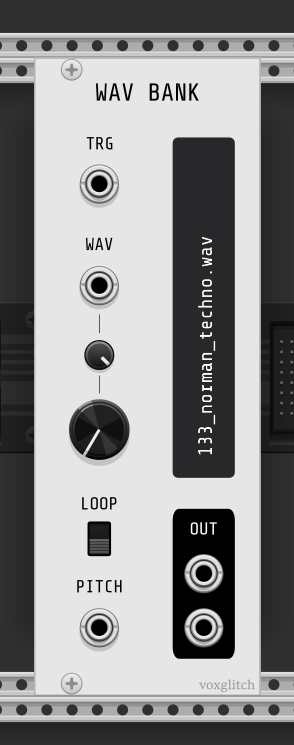
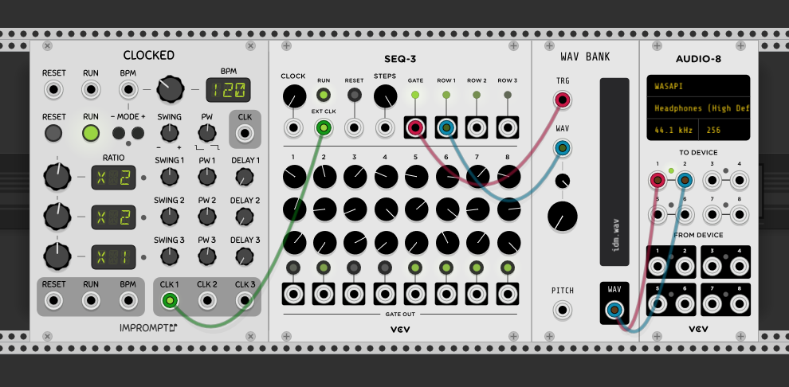

## Wav Bank

The Wav Bank module is a sample player.  It loads all .wav files from a folder and can switch between them on the fly.  All .wav files from the selected folder will be preloaded, so please keep file sizes reasonable.

### Inputs

* TRG - triggers sample playback.  By default this input expects a trigger signal, not a gate signal.  However, this behavior can be changed by using setting the Trigger Mode to "Gate" in the context options menu. 
* WAV - selects sample for playback
* Pitch - controls sample playback speed
* Loop Button - When ON, samples will continually loop after being triggered.

### Outputs

* WAV - sample playback output

### Example Usage

1. Reproduce the patch example shown in the image above.
2. Right click on the module to select a folder containing one or more .wav files.

### Options

By default, once a .wav file is triggered, it plays until it reaches the end of the sample.  If the loop switch is ON, then the sample restarts once playback has reached the end.

There are times where responding to *gate* inputs might be more convinient.  That's possible by setting the Trigger Mode to "Gate" in the context menu options.  When set to Gate, the sample will playback only while the trigger input is set to HIGH.  Once it goes low, sample playback will stop.