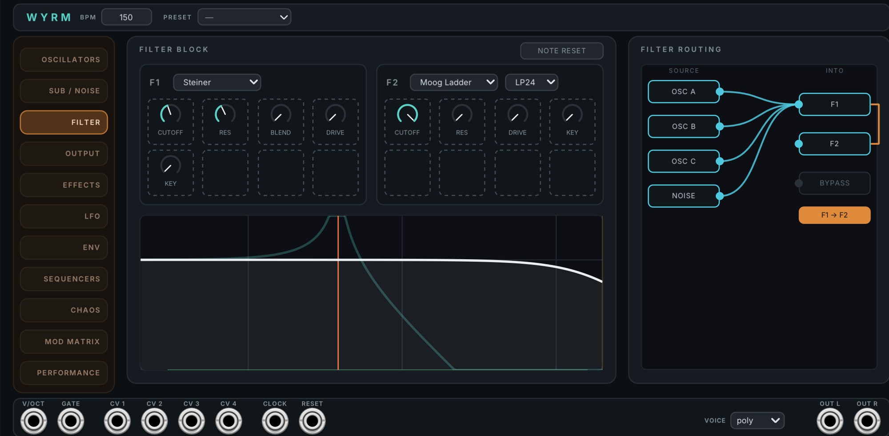

# Wyrm - Dubstep Bass Workstation User Manual

## Overview

Wyrm is a synthesizer voice built for bass. It holds three wavetable oscillators, a separate sub oscillator, two filters, a patchable effects rack, and a 32-slot modulation matrix.

The interface is divided into eleven tabs. Use the tab rail on the left side of the panel to switch between them. The command strip at the top and the jack row at the bottom remain visible on every tab, giving you access to the tempo, preset, and patch connections at all times.

Wyrm uses wavetables to generate its oscillator waveforms. The plugin includes a 22 MB bank of 55 tables. Each wavetable contains a set of single-cycle waveforms, and the **Pos** control selects the position within the table.

The instrument has eight internal voices. A note you release keeps fading while you play the next one.

## Quick Start Guide

Wyrm produces sound as soon as you play a note. Osc A starts at level `0.8` with a saw wave.

**To play Wyrm from your rack:** patch a pitch source into **V/OCT**, a gate into **GATE**, and connect **OUT L** and **OUT R** to your audio output. A gate is a voltage that rises to start a note and falls to stop it. MIDI-CV modules and most sequencers provide both signals.

**To load a preset:** click the **PRESET** field in the command strip and pick one of the 26 factory sounds.

**To build a bass sound:**

1. Open the **Oscillators** tab. Set Osc A's **Wave** to `reese`.
2. Raise Osc A's **Unison** to `4` and its **Detune** to about `0.3`.
3. Open the **Sub / Noise** tab. The sub is already on at level `0.6`. Raise **Sub** to taste.
4. Open the **Filter** tab. Lower F1's **Cutoff** until the tone closes up.
5. Open the **Mod Matrix** tab. Click **+ Add**. The new route runs LFO 1 into F1 Cutoff.
6. Drag the route's depth field up or down to set how far the filter moves.

***

## How Wyrm makes sound

The main signal follows a fixed processing order:

1. **The three oscillators** read the wavetable bank. Each one can warp its waveform twice, and can modulate the other two.
2. **The filter block** takes the oscillators and the noise source. You choose which source goes into which filter.
3. **The drive stage** saturates the result.
4. **The crossover** removes the low end from this band, so the sub owns the bass.
5. **The effects rack** processes the band through whatever chain you patch.
6. **The Lo-Fi stage** crushes the band.
7. **The master stage** adds the sub back in, applies the master level, and holds the peak with the limiter.

The **sub oscillator does not take this path.** It is a direct out. It skips the filters, the drive, the crossover, the effects rack, and the Lo-Fi stage. It reaches the master stage clean. The sub therefore remains unaffected by processing applied to the main band.

***

## The panel

Wyrm is 52 HP wide.

### The command strip

The strip runs along the top of the panel. It shows the same three things on every tab.

- **WYRM**: the module name.
- **BPM**: the tempo. Drag the field up or down to change it, over a range of `20` to `300`. Every sync division in the instrument divides this number. See "Tempo and sync" below.
- **PRESET**: the factory bank. Click the field to open the list.

### The tab rail

The rail down the left side lists the eleven tabs. Click one to show it.

| Tab | What is on it |
|---|---|
| **Oscillators** | Osc A, Osc B, Osc C, and the cross-modulation matrix |
| **Sub / Noise** | The sub oscillator and the noise source |
| **Filter** | The two filter slots, their response curve, and the routing diagram |
| **Output** | The drive stage and the master stage |
| **Effects** | The patchable effects rack, the pump, and the Lo-Fi stage |
| **LFO** | Four LFOs |
| **ENV** | Two envelopes |
| **Sequencers** | Two 16-step sequencers |
| **Chaos** | Two random generators |
| **Mod Matrix** | The 32 modulation routes |
| **Performance** | The voice mode and the glide settings |

Which tab is showing is not saved with the patch. Wyrm opens on the Oscillators tab.

### The jack row

The jacks run along the bottom of the panel. They never hide.

- **V/OCT**: pitch, 1 volt per octave. `0 V` plays middle C. Reads one channel.
- **GATE**: starts a note when the voltage rises above `1 V`. Releases it when the voltage falls below `0.1 V`. Reads one channel.
- **CV 1** to **CV 4**: four modulation inputs. They do nothing until you route them in the Mod Matrix.
- **CLOCK**: a tempo input. One pulse is one quarter note.
- **RESET**: re-aligns every modulator.
- **OUT L** and **OUT R**: audio output, ±5 V.
- **VOICE**: the voice mode. This is the same control as the one on the Performance tab.

### Using the controls

- **Knobs**: drag up or down. 180 pixels is one full sweep. Double-click a knob to return it to its default.
- **Selects**: click to open the list. Scroll the open list with the wheel.
- **Toggles and checkboxes**: click to switch.
- **Number fields**: drag up or down. One step is 10 pixels. Double-click for the default.

The scroll wheel does not change the control under the pointer. It only scrolls an open list. This prevents accidental changes while moving through a long list such as the 55-entry wavetable menu.

Right-click anywhere on the panel to reach Rack's context menu.

**Only three controls are Rack parameters:** Master, Pan, and BPM. Those three can be MIDI-mapped, typed into, and undone with Rack's undo. Every other control on the panel writes to Wyrm's own patch store. Rack's undo does not reverse those edits. Your work is still saved with the patch.

***

## Playing

Patch a pitch source into **V/OCT** and a gate into **GATE**.

Wyrm reads the first channel of both jacks. A polyphonic cable from a MIDI-CV module plays one note, not six. The eight internal voices are not Rack's polyphony. They exist so a released note can finish fading under the next one.

### Voice modes

Set the mode with the **VOICE** select in the jack row, or on the Performance tab.

| Mode | What it does |
|---|---|
| `poly` | Up to six notes sound at once. One gate jack can only start one at a time, so in Rack this mostly lengthens the overlap between notes. |
| `mono` | One note at a time. Each gate re-articulates the envelopes. |
| `legato` | One note at a time. A new note under a held gate does not re-articulate. |

Changing the mode stops every sounding note.

### Glide

Hold the gate and move the **V/OCT** voltage. Wyrm slides to the new pitch instead of starting a new note. This is how MIDI-CV modules encode a tied phrase.

Set the glide times on the **Performance** tab. **Rising Time** covers a slide up and **Falling Time** covers a slide down. Each direction has its own curve, set with the three shape buttons under it.

***

## Tempo and sync

Many controls in Wyrm can sync to the tempo. A synced control shows a **Div** list instead of a **Rate** knob. The divisions run from `16 bars` down to `1/32`, and include dotted and triplet values.

**The cable determines which tempo source is used.** With nothing in the **CLOCK** jack, the BPM field is the tempo. With a cable in the CLOCK jack and pulses arriving, the measured tempo takes over and the field reads `EXT`.

Wyrm measures the tempo from the interval between pulses, so it needs two pulses before it has a figure. The BPM knob covers that gap. Pull the cable and the measurement is forgotten, so the knob takes over cleanly.

The measured tempo is not displayed. It is calculated from an integer number of samples, so the value can vary slightly even with a steady clock. A value alternating between 127 and 128 is normal.

A trigger into the **RESET** jack sets every LFO, sequencer, chaos generator and the pump back to the start of its cycle. Free-running modulators reset too, which is the whole reason the jack exists.

***

## The Oscillators tab

The tab contains three oscillator cards and a cross-modulation card.

Each oscillator has the same controls.

| Control | What it does |
|---|---|
| **Wave** | The wavetable, from 55 tables. |
| **Warp** and **Warp 2** | Two waveshapers, each with its own **Amt** knob. There are 10 settings including `none`. |
| **Pos** | The position in the wavetable. The frame display above shows the waveform. |
| **Level** | The oscillator's contribution. Osc B and Osc C open at `0`. |
| **Pan** | Position in the stereo field. |
| **Phase** | Where the waveform starts on each note. |
| **Oct**, **Semi**, **Fine** | Tuning, in octaves, semitones and cents. |
| **Unison** | How many copies of the oscillator sound, up to 16. |
| **Detune** | How far apart the unison copies are tuned. |
| **Width** | How far apart the unison copies are panned. |

The warp settings are `bend+`, `bend-`, `syncSelf`, `syncWindow`, `pwm`, `asym`, `flip`, `mirror` and `quantize`.

### Cross-Mod

The Cross-Mod card connects the oscillators to each other.

- Six **FM** knobs: every direction between A, B and C.
- Six **AM** knobs: the same six directions.
- **FM Noise**: the noise source modulates the oscillator frequencies.
- **Ring** and **Ring Mix**: ring modulation between the oscillators.

***

## The Sub / Noise tab

### Sub (Direct Out)

The sub oscillator is a separate voice. It reaches the output clean, as described in "How Wyrm makes sound" above.

| Control | What it does |
|---|---|
| **On** | Switches the sub on or off. |
| **Wave** | The sub's wavetable, from 45 tables. |
| **Env** | Which envelope shapes the sub: `env1` follows Env 1, `ad` uses its own attack-decay shape. |
| **Sub** | The sub level. |
| **Oct** | The sub's octave, relative to the note. Opens at `-1`. |
| **Pos** | The position in the sub's wavetable. |
| **Tone** | A low-pass on the sub. |

### Noise

**Noise** sets the level and **Color** moves it from dark to bright. The noise source is routed in the filter routing diagram, like an oscillator.

***

## The Filter tab

### The filter block

Wyrm has two filter slots, F1 and F2. Each slot can be any of ten filter models.

| Model | Character |
|---|---|
| **Moog Ladder** | The classic four-pole ladder. Modes LP24, LP18, LP12, LP6, BP, HP, Morph. |
| **State Variable** | Clean and fast. Modes LP12, BP, HP, Notch, Morph. |
| **Polivoks** | Aggressive Soviet-style resonance. Modes LP12, BP. |
| **Diode Ladder** | The TB-303 lineage. Modes LP24, LP12. |
| **Formant Bank** | Vowel shapes. Has **Vowel** and **Shift** instead of a cutoff. |
| **Comb** | A tuned delay. Has **Fb**, **Damp** and **Spread**. |
| **Allpass** | Phase shifts without a level change. Has a stage count of 2 to 16. |
| **SK-35** | Sallen-Key. Modes LP12, HP12. |
| **Steiner** | Blends its modes with a single **Blend** knob. |
| **Modal** | A bank of resonators. Has **Struct**, **Bright** and **Decay**. |

**The controls change with the model.** Only the knobs that belong to the chosen model are shown. Empty knob positions are drawn as dashed outlines, so the space reads as room rather than damage.

**Note Reset** re-zeroes the filter state on every new note.

The display under the two slots draws the filter response. The spectrum of the sound sits behind it. The spectrum tap is placed after the filters and before the drive, so the picture explains what the filters did. You can switch the spectrum off in the context menu.

### Filter routing

The panel on the right shows four sources and three destinations.

Sources are **OSC A**, **OSC B**, **OSC C** and **NOISE**. Destinations are **F1**, **F2** and **BYPASS**.

- **Click a source** to step it to the next destination. The cycle includes `both`, which feeds F1 and F2 together.
- **Drag from a source to a destination** to set it directly. Let go over empty space and nothing changes.
- **F1 → F2** at the bottom puts the two filters in series instead of side by side.

***

## The Output tab

### Drive

| Control | What it does |
|---|---|
| **On** | Switches the drive stage on or off. |
| **Type** | `soft` or `hard` clipping. |
| **OS** | Oversampling, `2x` or `4x`. Higher costs more CPU and reduces aliasing. |
| **Pre** | Gain into the clipper. |
| **Post** | Gain out of the clipper. |
| **Mix** | Blends the driven signal with the clean one. |
| **Pre Filt** | A high-pass before the clipper. Opens at `40 Hz`. |
| **Post Filt** | A low-pass after the clipper. Opens at `12 kHz`. |

### Master

| Control | What it does |
|---|---|
| **Crossover** | A high-pass on the main band. Everything below it belongs to the sub. Opens at `100 Hz`. |
| **Master** | The output level. This is a Rack parameter. |
| **Limiter** | Holds the output to the ±5 V bus ceiling. While the signal is under the ceiling the limiter is bit-identical to no limiter at all. |
| **Pan** | A balance across the stereo output. This is a Rack parameter. |

**Pan is a balance, not a true pan.** The signal reaching it is already stereo, so folding it to one side would collapse the image the instrument just built. Turning left attenuates right and leaves left alone. Centre is unity.

***

## The Effects tab

The effects rack is a patchbay. Nine effects sit between an input rail on the left and an output rail on the right.

| Effect | What it does |
|---|---|
| **Multiband** | Three-band compression with adjustable split points. |
| **OTT** | The upward-and-downward multiband compression the name is known for. |
| **Chorus** | Rate, depth and mix. |
| **Delay** | Syncable, with feedback, tone and a ping-pong toggle. |
| **EQ** | Three bands, each with frequency and gain. The mid band has a Q. |
| **Reverb** | Size, decay, damping and predelay. |
| **Diode** | Diode saturation. |
| **Shift** | A frequency shifter, with feedback and spread. |
| **Ring** | A ring modulator with its own oscillator. |

Diode, Shift and Ring ship unpatched.

### Patching the rack

Each effect has one input jack and one output jack. Every port holds at most one cable, so the chain can only be a simple path. There is no branching and no summing.

- **Drag from a jack** to pull a cable out of it.
- **Grab an existing cable near one of its ends** to move that end. The cables run across the whole bay, and the effects' knobs sit under them, so a cable is only grabbed at the plug.
- **Drop on an occupied port** and the cable that was there is displaced. Dropping a cable on an occupied port replaces the existing connection.
- **Drop on nothing** and the cable is removed.

**An effect is active only when it is on the path from Effects Input to Effects Output.** Anything off that path fades out and is bypassed. If you patch a loop, the signal never reaches the output, so the whole rack falls back to dry.

### Cable colours

Six colour swatches sit to the right of the Lo-Fi knobs. Click one to arm it. The next new cable you pull is painted with it.

A cable you merely repatch carries its own colour to the new socket. Moving a cable is not making one. A bay can hold six differently coloured runs at once.

### The rack strip

Three small modules run under the bay.

- **Pump**: a tempo-synced ducking of the master gain. It has **Div**, **Depth** and **Shape**. At depth `0` it does nothing.
- **Lo-Fi**: bit and rate reduction on the main band. It has **Rate**, **Bits** and **Mix**. It never crushes the sub.
- **Dry/Wet**: the whole rack's blend.

***

## The LFO tab

Wyrm has four LFOs. They work in two different ways.

### LFO 1 and LFO 2 - drawable

The large display on each card is an editor. You draw the shape the LFO plays.

- **Drag a node** to move it. The first and last nodes are pinned in time.
- **Drag a segment** between two nodes to bend it. The curve passes through your cursor.
- **Double-click empty space** to add a node.
- **Double-click a node** to delete it. Two nodes always remain.

Six stamps under the editor load a preset shape: **SIN**, **TRI**, **SAW**, **SQU**, **ACC** and **DEC**.

| Control | What it does |
|---|---|
| **Sync** | Switches between a free **Rate** and a tempo **Div**. |
| **Run** | `trig` restarts on each note, `free` ignores notes, `env` plays once and holds. |
| **Smooth** | Rounds the shape. |
| **Phase** | Offsets the start point. |

### LFO 3 and LFO 4 - parametric

These two build their shape from four knobs. Their display is read-only, and is drawn by the same code the engine plays, so the picture cannot disagree with the sound.

| Control | What it does |
|---|---|
| Shape | `steady`, `chirp`, `bounce` or `ratchet`. |
| **Count** | How many events fill the cycle. |
| **Sweep** | How the event spacing changes across the cycle. |
| **Decay** | How the event level falls across the cycle. |
| **Skew** | Leans each event forward or back. |
| Waveform | `sin`, `tri`, `saw` or `squ`. |
| **Dir** | `fwd` or `rev`. |

***

## The ENV tab

Wyrm has two envelopes. **Env 1** is wired to the amplifier. **Env 2** is free, and does nothing until you route it in the Mod Matrix.

Both have **Attack**, **Decay**, **Sustain**, **Release** and **Vel**. Vel sets how far velocity scales the envelope.

The curve display shows a playhead that follows the sounding note. It rides the attack ramp, the decay ramp, parks at the sustain, and travels down the release from wherever the release began.

***

## The Sequencers tab

Two 16-step sequencers each fill a strip.

**Drag a contour across the grid to play it in.** The drag continues across columns as you move, allowing you to draw several steps in one motion.

| Control | What it does |
|---|---|
| **Sync** | Switches between a free **Rate** and a tempo **Div**. |
| **Length** | How many of the 16 steps play. |
| **Mode** | `trig` restarts on each note, `free` ignores notes, `env` plays once and holds. |
| **Slew** | Smooths the step-to-step movement. |
| **Scale** | Quantizes the output to one of 32 scales, or `off`. |
| **Range** | How many semitones the full step height covers. |

**Changing the scale does not modify the stored step values.** The step value stored is the raw one you drew. Quantizing happens after that, so switching scales and switching back returns exactly what you drew.

***

## The Chaos tab

Two random generators, each with the same controls.

| Control | What it does |
|---|---|
| **Style** | `sh` is sample-and-hold, `drift` wanders slowly, `smooth` interpolates, `walk` is a random walk. |
| **Sync** and **Div** | Ties the generator to the tempo. |
| **Rate** | The free-running speed. |
| **Depth** | How far the value swings. |
| **Smooth** | Rounds the movement. |
| **Seed** | Sets the pattern. The same seed always produces the same pattern. |

The plot shows recent output history, which lets you inspect the source before routing it.

***

## The Mod Matrix tab

The matrix holds up to 32 routes. A route sends one source to one destination, with a depth.

- **Click + Add** to make a route. Wyrm picks a destination that nothing drives yet, preferring a filter cutoff, because a filter sweep is the conventional first modulation.
- **Click the source field** to choose from the 19 sources.
- **Click the destination field** to open the destination picker.
- **Drag the depth field** up or down. 150 pixels spans the full `-1.00` to `+1.00`.
- **Click the ×** to remove the route.

The coloured square at the left of each row identifies its source.

**One route per source-and-destination pair.** Two routes between the same pair would sum, and would be indistinguishable from one route of twice the depth. If you re-point a route onto a pair that already exists, the change is refused. The dropdown simply does not move.

### The destination picker

Almost every control in Wyrm is a legal destination. There are 218 of them, so the picker has two panes.

The left pane lists every group as a chip, in a grid that always fits. The right pane lists that group's parameters. Click a chip to switch groups, then click a parameter to pick it.

**The picker lists what is visible on the panel.** The FILTER group offers the parameters of the models F1 and F2 are actually set to, not all of them across all ten models. An LFO offers Rate or Div, whichever its sync toggle is showing.

### The modulation sources

| Source | What it is |
|---|---|
| **LFO 1** to **LFO 4** | The four LFOs. |
| **Chaos 1**, **Chaos 2** | The two random generators. |
| **Sequencer 1**, **Sequencer 2** | The two step sequencers. |
| **Env 1**, **Env 2** | The two envelopes. Env 1 also drives the amplifier. |
| **CV 1** to **CV 4** | The four CV jacks. |
| **Velocity** | Always full in Rack. A gate jack carries no velocity. |
| **Key** | The note pitch, bipolar about middle C. |
| **Mod Wheel** | Always zero in Rack. There is no input for it. |
| **Pitch Bend** | Always zero in Rack. There is no input for it. |
| **Follower** | Tracks the level of the sounding voice. |

### The CV jacks

The four CV jacks divide their voltage by 5.

- A bipolar `±5 V` source arrives as `-1` to `+1`, the same range an internal LFO gives.
- A unipolar `0` to `10 V` source arrives as `0` to `2`.

The limit is the bus, not the source. Voltages are clamped at `±10 V`. A source that runs past a destination's range cannot push it past its end; it only gets there sooner. The route's **depth** controls the amount of modulation.

***

## The Performance tab

**Voice** sets the voice mode. It is the same control as the VOICE select in the jack row.

**Rising Time** and **Falling Time** set the glide, as described under "Playing" above. Each has a curve display and three shape buttons.

***

## Presets and patch files

Wyrm ships 26 factory presets. Open them from the **PRESET** field in the command strip, or from Rack's own preset menu. They are the same `.vcvm` files.

The preset field loads through Rack's own preset path, so loading one is a single undo step.

**A patch does not remember which preset it came from.** The field shows `—` for a sound that is not one of the factory presets, whether you loaded it, imported it, or dialled it by hand.

### Moving a patch between Rack and the web version

Wyrm shares its patch format with the vxsynth web version. Two context menu items move a patch between them.

- **Export patch (web format)…** writes a `.wyrm.json` file.
- **Import patch (web format)…** reads one back.

The importer checks the schema version before it loads anything. Only the current version is accepted. An older file must be opened in the web app, saved there, and then imported here.

To move a patch between two Rack users, use Rack's own preset save and load instead.

***

## Context Menu Options

#### Export patch (web format)…

Writes the current sound as a `.wyrm.json` file, for the web version of Wyrm.

#### Import patch (web format)…

Reads a `.wyrm.json` file. A file whose schema version does not match this build is refused, and nothing changes.

#### Spectrum in filter display

Draws the sound's spectrum behind the filter response curve. This is saved with the patch. The analyser is a 32-band filter bank running on every audio sample, so switching it off also saves the CPU it costs.

***

## Troubleshooting

**No sound at all.** Check that the gate is reaching **GATE** and rising above `1 V`. Check **Master** on the Output tab. Osc B and Osc C open at level `0`, so only Osc A sounds in a new patch.

**The bass is there but nothing else is.** Check the oscillator levels. The sub reaches the output on its own path, so it still sounds when the main band is silent.

**An effect does nothing.** An effect only runs when it sits on the path from **Effects Input** to **Effects Output**. Anything off that path is drawn faded. Patch it into the chain.

**The whole effects rack sounds dry.** The chain has a loop, or an end that does not arrive at Effects Output. The engine's walk never reaches the output, so it falls back to dry. Follow the cables from the input rail.

**The filter does not affect the sub.** It never does. The sub is a direct out. Use its own **Tone** control instead.

**The BPM field says EXT.** A cable is in the **CLOCK** jack and pulses are arriving, so the measured tempo is in charge. The BPM value remains stored while external sync is active, and you can still edit it by dragging the field. Remove the cable to return to the internal BPM.

**Rack's undo does not reverse my edit.** Only **Master**, **Pan** and **BPM** are Rack parameters. Every other control writes to Wyrm's own patch store, which Rack's undo does not cover. The values are still saved with your patch.

**A control will not respond to the scroll wheel.** That is deliberate. Only an open dropdown list scrolls.

**A polyphonic cable plays only one note.** Wyrm reads the first channel of **V/OCT** and **GATE**. Use one Wyrm per note to play chords.

**Mod Wheel and Pitch Bend do nothing.** They are held at zero in the Rack build, because there is no input for them. Their positions in the source list are kept so that patches from the web version still point at the right sources. Use a **CV** jack instead.

**Velocity does nothing.** A gate jack carries no velocity, so velocity is always full. Route a **CV** jack to the same destination instead.

**An imported patch was refused.** The file's schema version does not match this build. Open it in the Wyrm web app, save it there, then import it again.

**Changing the filter model hid my knobs.** Each model has its own controls. The dashed outlines are knob positions that this model does not use. Your other model's settings are kept, and come back when you switch back.

***

## Technical Specifications

- **Synthesis**: three wavetable oscillators with dual waveshaping and up to 16-voice unison each, plus a separate direct-out sub oscillator and a noise source
- **Wavetable bank**: 55 tables, shipped as a 22 MB resource loaded once per Rack process
- **Voices**: 8 internal, with a 6-note polyphony cap; released notes finish fading under new ones
- **Voice modes**: `poly`, `mono`, `legato`
- **Cable channels**: **V/OCT** and **GATE** read one channel each; Rack's polyphonic cables are not supported
- **Filters**: 2 slots, 10 models each, in parallel or in series
- **Filter sources**: Osc A, Osc B, Osc C and Noise, each into F1, F2, both, or bypass
- **Effects**: 9, freely patchable as a simple path; each port holds one cable
- **Modulation sources**: 19
- **Modulation destinations**: 218
- **Modulation routes**: 32, one per source-and-destination pair
- **LFOs**: 4; two drawable with up to 16 nodes, two parametric
- **Envelopes**: 2 ADSR, with velocity scaling
- **Sequencers**: 2 × 16 steps, with 32 quantizing scales
- **Chaos generators**: 2, with 4 styles
- **Sync divisions**: 18 on the LFOs, sequencers, chaos generators and pump, from `16 bars` to `1/32`, including dotted and triplet values; 11 on the delay, from `1 bar` down
- **Tempo**: `20` to `300 BPM`, from the knob or measured from the **CLOCK** jack at one pulse per quarter note
- **V/OCT tracking**: 1 volt per octave, `0 V` = middle C, clamped to `±10 V`
- **Gate thresholds**: on above `1 V`, off below `0.1 V`
- **CV inputs**: 4, scaled by 1/5, clamped to the `±10 V` bus
- **Audio output**: ±5 V, stereo
- **Limiter**: a peak ceiling at the bus level; bit-identical to no limiter while under it
- **Control rate**: modulators and parameters update every 32 samples
- **Spectrum analyser**: 32 bands, tapped after the filters and before the drive
- **Factory presets**: 26
- **Panel width**: 52 HP
