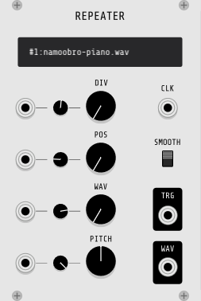

## Repeater

Repeater is a stuttering sample player.  It sounds like a skipping CD player.  

### Inputs

* CLK - clock input (very fast clock)
* DIV - clock division. Controls repeat (stutter) length
* POS - sample playback position
* WAV - selects between 5 samples that can be loaded via the context menu
* PITCH - yep, pitch. Can be used to play samples backwards

### Outputs

* WAV - sample playback output
* TRG - trigger output.  Fires whenever the sample "stutters"

### Switches and Options

* Smooth - Smooths out pops that would normally occur when setting the sample playback position via the POS input or when switching between .wav files via the WAV input.
* Retrigger (context menu item) - Causes a sample to restart after reaching the end of playback.

### Minimal Usage

1. Reproduce the patch example shown in the image above.  On the CLOCKED module, notice that the clock ratio for `CLK 1` is set to X16.
2. Right click on the module to load a .wav sample. I suggest that the sample be around 2 to 5 seconds long.
3. Tweak the `POS` and `DIV` knobs!

### Using with a Sequencer

