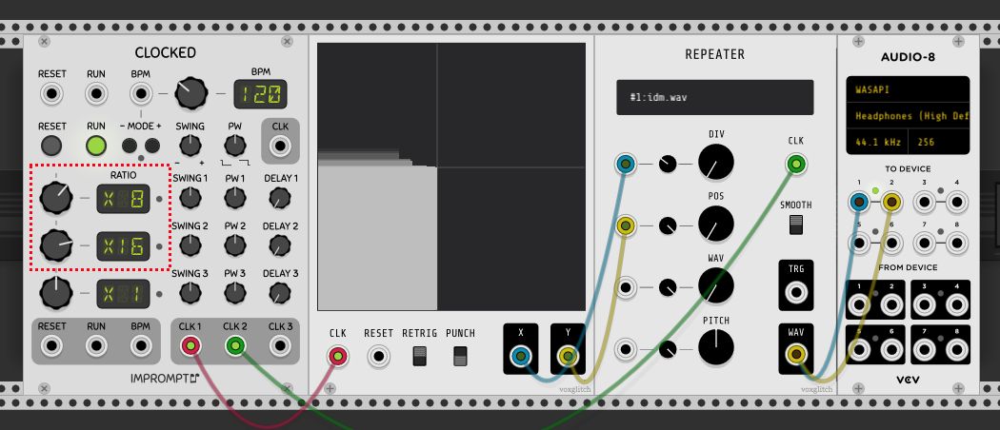

## XY Controller

XY is a CV output generator with built in gesture recording.  Visuals are based on a Reaktor patch whose name eludes me.

### Inputs

* CLK - gesture recording happens at each incoming CLK signal.  Once recording is complete, incoming CLK signals step through the recorded gestures.  Conserve memory and patch size by clocking with as slow a frequency as necessary.
* RESET - Resets playback to the beginning.
* RETRIG - When ON, playback restarts after completing.
* PUNCH - When ON, dragging within the recording area during playback replaces the section of previously recorded gestures with your new gestures.  Great for modifying an existing recording.

### Outputs

* X - Output voltage based on x-axis, ranging from 0 to 10
* Y - Output voltage based on y-axis, ranging from 0 to 10

### Example Usage

